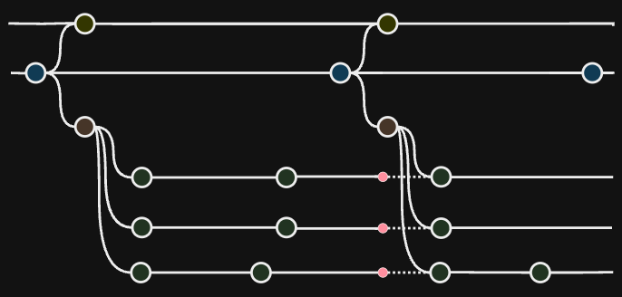
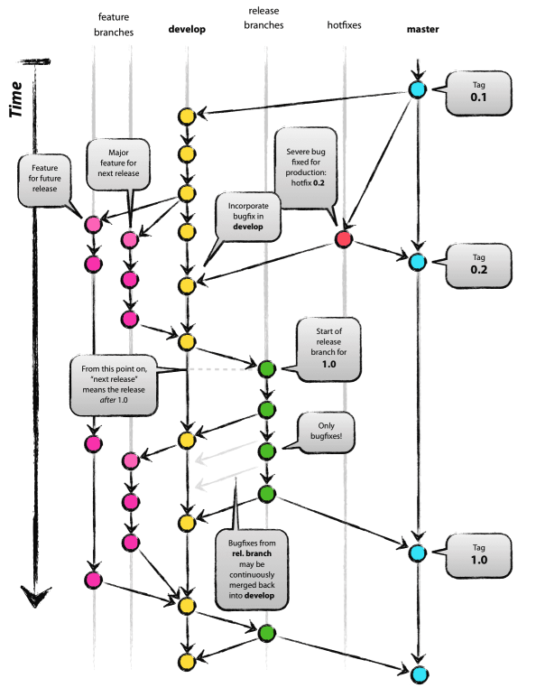
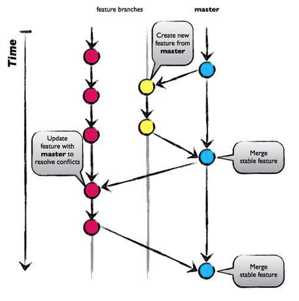
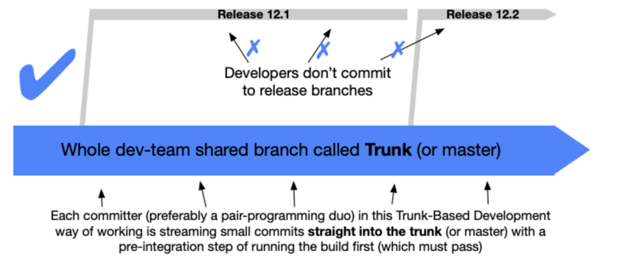
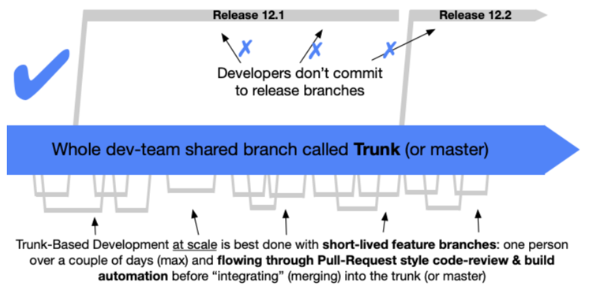

SVN, GIT 등 VCS (version control system)은 다수의 프로그래머의 협업, 코드 버전 관리등 소스 코드를 관리하기 위해 사용하는 도구입니다.  
VCS는 코드 변경사항을 추적하여 관리하고, 각자 작업한 코드를 통합하는 방법을 제공함으로써 협업을 가능하게 합니다.

하지만, 프로젝트 규모와 팀의 확장에 따라 통합은 점점 더 복잡하고 어려운일이 됩니다.  
여러 개발자가 동시에 공통 코드베이스에서 작업할 때, 각자 다른 작업 일정과 영향도를 고려하여 변경사항을 통합하는 것은 
충돌이 발생하고 코드 통합 안정성에 대한 불안감도 키우게 합니다.

이러한 어려움을 줄이기 위해 다양한 브랜치를 관리하는 전략이 존재하고, 효과적인 브랜치 관리는 빠른 개발과 안정적인 통합을 위해 고려되어야 합니다.

효과적인 브랜치 관리를 위해 대표적으로 많이 사용되는 브랜치 전략 git flow, github flow, trunk based development(TBD) 등에 대해 살펴보겠습니다.



## git flow
- 2010년 vincent Driessen는 Git을 기반으로한 브랜치 관리 전략 제시
- 개발, 배포 준비등 각 단계에서 필요한 브랜치를 정의하여 안정적인 배포 준비를 위한 전략을 제시  

- 배포와 관련없이 항상 유지되는 Main Branch(main, develop)과 일정 기간 동안만 유지되는 Supporting Branch(feature, release, hotfix)가 존재  
- develop branch에 주기적으로 다음 배포 항목들을 머지하고, 각 feature branch에서는 develop branch를 주기적으로 merge하여 배포전 conflict를 최소화
### Main Branch
- main : 제품으로 출시될 수 있는 브랜치
    - 현재 production 의 상태와 일치하는 branch
    - production의 상태와 일치하기 때문에 stable 상태
- develop : 다음 출시 버전을 개발하는 브랜치
    - 현재 개발이 완료된 상태와 일치하는 branch
    - production에 반영되지 않은 개발건들이 포함되어있으므로 unstable 상태
### Supporting Branch
- feature : 새로운 기능을 개발하는 브랜치  
  - check out from : develop
  - merge back into : develop
- release : 이번 배포 버전을 준비하는 브랜치
  - 특정 시점에 develop branch가 배포 준비가 되었으면, develop branch로 부터 checkout
  - QA, 사소한 버그등 출시를 준비하는 과정에 발생한 버그들을 수정 (기능 추가 X)
  - check out from : develop
  - merge back into : develop, main
- hotfix : 출시 버전에서 발생한 버그를 수정 하는 브랜치
  - 즉시 버그를 수정해야하는 경우 main branch로부터 checkout하여 개발
  - check out from : develop
  - merge back into : develop, main

### 흐름
1. 새로운 기능 개발  
    `git checkout -b feature-xxx develop`
2. 새로운 기능 개발 완료  
    `git checkout develop`  
    `git merge --no-ff feature-xxx`
3. 배포 준비  
   `git checkout -b release-1.2 develop`
3. 배포 준비 완료  
   `git checkout main`// develop, feature, ...  
   `git merge --no-ff release-1.2`  
   `git tag -a 1.2`

### 특징
  - 배포 주기/흐름에 맞춰 브랜치를 생성/삭제하여 관리
  - 기능 개발시 feature branch에서는 develop branch에 주기적으로 merge하여 conflict를 최소화
  - git-flow는 고객사에 설치된 소프트웨어, public api, app와 같이 프로덕션 환경에서 여러 버전이 출시되는 종류의 프로젝트에 적합
### 한계
  - 다양한 브랜치 구조는 필요 브랜치 이상으로 복잡해지고 있어 관리가 어려워진다.  
    ```text
    1. hotfix branch 생성 (hotfix-xxx)
    2. hotfix 수정 커밋을 develop, main, release branch에 merge
    3. develop에 merge된 hotfix commit건을 feature branch에 merge
    ```
  - 긴 배포 주기를 가진 프로젝트, 팀에 적합한 브랜치 전략
  - 웹 어플리케이션처럼 다양한 버전으로 관리할 필요가 없는 프로젝트의 경우 주기적인 배포에 더 어려움이 있음

- 브랜치가 너무 복잡하거나, `지속적 배포`가 필요한 경우 간단한 github-flow 제시  
  https://nvie.com/posts/a-successful-git-branching-model/  
  ```
  If your team is doing continuous delivery of software, 
  팀이 지속적인 배포를 하는 경우,
  I would suggest to adopt a much simpler workflow (like GitHub flow) instead of trying to shoehorn git-flow into your team.
  팀에 git-flow를 강요하는 대신, 훨씬 더 간단한 워크플로우인 github flow와 같은것을 채택하는것이 좋다.
  
  To conclude, always remember that panaceas don't exist. 
  결론적으로, 만병통치약은 없다는 점을 항상 기억해라.
  Consider your own context. Don't be hating. Decide for yourself.
  자신의 상황을 고려하고, 스스로 결정해야 한다.
  ```

## Github Flow
- git flow의 한계점으로 이야기되는 브랜치 구조의 불필요한 복잡성으로 인해 생긴 대안
- git flow에서 hotfix, release, develop 브랜치를 제거한 구조  
- production에 언제든 배포가 가능한 main branch가 상시로 있고, 기능개발시 필요에 따라 feature branch를 생성  
  
- 로컬에서 각자 개발이 완료되고 배포 가능 상태가 되면, feature branch를 main branch로 merge
- Github Flow는 상시 배포 모델로 main에 대해 빈번한 통합을 통해 충돌을 최소화하고 브랜치를 단순화하여 관리
### Branch
- main : 제품으로 출시될 수 있는 브랜치
    - 즉시 배포가 가능한 상태를 유지하고 있는 브랜치
    - production의 상태와 일치하기 때문에 stable 상태
- feature : 새로운 기능을 개발하는 브랜치
    - check out from : main
    - merge back into : main
### 특징
- release를 위한 절차가 굉장히 줄어들기 때문에 잦은 기능 수정과 배포를 수행하는 팀에 적합한 브랜치 전략
- feature의 경우 main branch에 최소 몇일 ~ 몇주 단위로 통합
- Github Flow는 main branch는 main branch로, 배포 브랜치와 작업을 시작하는 브랜치가 같으므로 main branch는 언제 배포를 해도 무방한 stable 상태를 유지해야한다.
  - 배포에 포함되면 안되는 항목이 존재하거나, 문제가 있는 코드가 합쳐져 있으면 의도치 않은 장애로 이어질 수 있다.
### 한계
- 배포 주기가 길어지고, 다수의 브랜치를 합쳐서 배포를 해야하는 경우 결국 별도의 관리 브랜치가 필요하다.
- 정기 배포와 hotfix 배포를 분리할 수 없다.

## trunk based development (TBD)
- 단일 브랜치 trunk branch (main) 를 하나 두고, 공동 작업하는 브랜치 모델
- 수명이 긴 브랜치를 생성하지 않고, 며칠안으로 main branch에 통합 
  
  https://trunkbaseddevelopment.com/#one-line-summary
- CI/CD를 가능하게 하는 핵심 요소로, 짧은 주기마다 지속적으로 통합
  ```text
  I mostly hear “trunk-driven development” as a synonym for continuous integration. 
  나는, "트렁크 중심 개발"을 지속적 통합(CI)의 동의어로 듣는다.
  
  - https://martinfowler.com/articles/branching-patterns.html#Trunk-basedDevelopment
  ```
- 공동 브랜치에 커밋 주기가 짧아 팀 피드백이 빠르다.
- 팀의 규모가 큰 경우는 단기로 사용할 feature branch를 생성하여 사용할 수 있다. (며칠동안 사용후 삭제)
  
  https://trunkbaseddevelopment.com/#one-line-summary

### Github flow vs TBD
- main branch만 관리하는 브랜치 규칙
- TBD는 팀의 규모가 큰 경우 단기로 사용할 feature branch를 생성하여 사용
- feature 브랜치 생명 주기
  - Github Flow : 배포 주기
  - TBD : 며칠

### TBD를 수행하기 위한 조건
1. 기능 개발은 며칠안에 배포가 가능한 단위로 나눠서 관리
2. 배포 신뢰도를 높이기 위한 테스트 코드가 필요
3. 잦은 배포에 대한 부담을 줄이기 위한 빠른 빌드 보장 필요 
4. 완료되지 않은 기능/수정들에 대해서는 새로운 기능으로 구현하거나, feature toggle로 격리하는등의 정책이 필요하다.  
    ```javascript
    function readList() {
      if (featureIsEnabled("use-new-read-function")) {
        return read();
      } else {
        return readLegacy();
      }
    }
    ```

## 마치며
코드 통합의 피로와 불안정성은 실제로 많은 프로젝트에서 부딪히는 문제 중 하나입니다.  
위에 설명드린것 처럼 브랜치 전략은 통합의 어려움을 해소하고자 하는 노력이지만, 브랜치 전략 모델로서 모든 상황에 적합한 해결책은 아닙니다.  
단순하게 git flow / github-flow를 사용하겠다 선택하는것 아닌, 팀의 필요도와 상황을 고려하여 결정이 필요합니다.

제가 위에서 설명드린 세가지 브랜치 전략 이외에도 브랜치 관리를 위한 방법론에 대해 설명된 글을 같이 소개드리며 마무리 하겠습니다!  
https://martinfowler.com/articles/branching-patterns.html

### 참조
- git flow
  - https://nvie.com/posts/a-successful-git-branching-model/
- Github flow
  - https://blog.hwahae.co.kr/all/tech/tech-tech/9507
- trunk based development
  - https://trunkbaseddevelopment.com/
  - https://tech.mfort.co.kr/blog/2022-08-05-trunk-based-development/