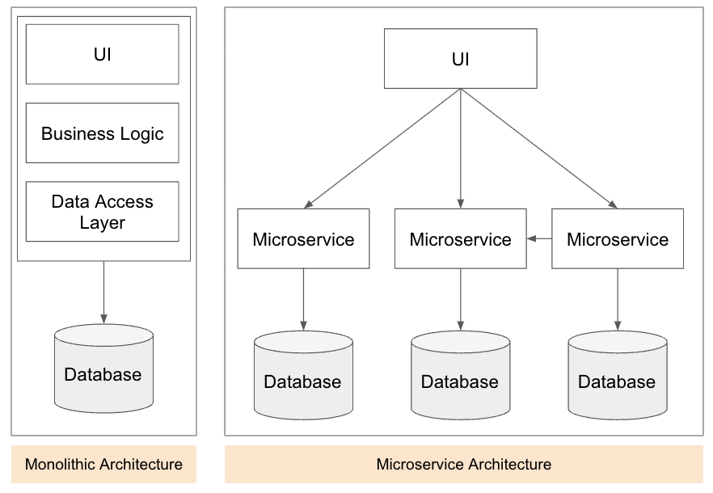

캐싱은 데이터 처리 비용을 줄이기 위해 사용되는 기법으로 비용이 많이 드는 데이터 조회 작업에서 자주 사용됩니다. 

이번 아티클에서는 캐시를 구현하기에 앞서 사전에 알아두면 좋을 만한 캐시에 대한 개요와 캐싱을 효과적으로 제어할 수 있는 전략에 대해서 알아보려고 합니다.

캐싱에 대한 개념에 대해 알아보고 Spring Boot + Redis로 구현하는 캐싱에 대한 간단한 예제를 같이 설명하겠습니다.

## 캐시 개요
캐싱이란 이전에 처리 (검색/계산) 되었던 데이터를 효과적으로 재사용하는 기법을 의미합니다.
일반적으로는 기본 데이터 처리 방법보다 속도가 빠른 고속 데이터 계층을 두고, 동일한 요청에 대해서는 해당 계층을 통해 빠른 속도를 보장하는 기법입니다.

캐싱에 대해 자세히 알아보기 전에 앞서서 캐싱 흐름의 이해를 돕는 간단한 비유를 들어 설명하겠습니다.

```text
> 기존 절차
병원에서 부서별 진료, 예약 내역을 각각 수기로 관리하고 있다고 가정해 보겠습니다.
병원에 사람이 방문했을 때 접수처에서는 부서별 진료, 예약 내역을 기반으로 접수해야 하기 때문에 각 부서에 연락하여 정보를 확인하거나 때에 따라서는 담당자가 직접 부서에 방문해 정보를 확인하고 있습니다.
이렇게 타 부서에 연락하거나, 방문하는 시간으로 인해 대기시간은 더 길어지게 되고 간혹 여러 접수처에서 동일한 부서에 연락을 취하거나 담당자가 부재중인 경우 대기 시간이 무한정 길어지는 경우가 발생하게 됩니다.

접수 절차에 오랜 대기를 가진 고객들의 항의로 접수 절차를 바꾸게 되었습니다.

> 절차를 변경한 이후
접수처에서는 접수 절차에 필요한 정보를 각 부서로부터 전달받는 방식으로 변경하였습니다.
접수처에서 각 부서의 모든 정보를 들고 있기에는 양이 많고 내용이 어렵기 때문에 접수 절차에 꼭 필요한 정보만 선정하여 관리합니다.

진료, 예약 내역에 변동이 생기는 경우 각 부서에서 접수처로 내역을 전달합니다.
접수처에서 모든 부서의 정보를 계속 보관할 수 있는 공간이 부족하기 떄문에, 보관 기간을 가지고 오래된 정보는 폐기를 합니다.

예약 내역의 경우는 접수처에서 간혹 자리를 비우거나 연락이 되지 않아도 고객이 내원하기 전까지만 내용이 전달되면 됩니다.
간혹 접수처에 전달되는 내용이 누락되더라도 이런 경우는 많지 않기 때문에 부서에 연락하여 정보를 확인하고 누락된 원인을 찾아서 보완하면 됩니다.

절차 개선을 통해 접수처에서 모든 고객이 긴 시간 대기하지 않고 더 빨리 고객들을 접수할 수 있게 되었습니다.
```
위의 병원의 예시를 들어 캐싱을 사용하기 이전, 이후의 상황에 대해 설명하였습니다.



모놀리틱에서 MSA의 전환, 클라우드 환경의 전환으로 모든 단위별 기능과 데이터들이 서비스 내부에서 관리되고 제공됩니다.  
서비스별 통신 방법은 협의된 방법을 통해 내/외부 통신을 하게 됩니다.

하지만 네트워크로 통신을 주고 받는 과정은 비용이 드는 문제이며, 가끔은 지연이 발생하거나 유실이 발생할 수 있습니다.  
내부 스토어에 접근하더라도, 원본 데이터의 양이 증가와 구조의 복잡함에 따라 속도 저하 등의 문제가 발생할 수 있습니다.

이런 경우 네트워크나 내부 스토리지를 통해 자주 가져오는 데이터를 미리 조회하여, 스토리지나 네트워크를 통해 가져오는 것보다 빠른 계층에 데이터를 임시 저장하여 데이터의 변경이 있을 때까지 그 데이터만을 사용하는 기법이라고 보시면 됩니다.

- 이렇게 임시 저장하여 사용하는 데이터를 통해 스토리지나 네트워크 통신 시 발생할 수 있는 지연, 유실을 줄이고 데이터 처리에 필요한 속도 저하를 낮출 수 있게 됩니다.
- 또한 여러 데이터를 조합해서 결과를 제공하는 경우, 미리 결과를 조합하여 캐싱 처리를 해둔다면 불필요한 엑세스를 위한 대기 시간을 줄이고 응답을 처리할 수 있게 됩니다.
- 자주 액세스하는 데이터를 캐싱함으로써 애플리케이션은 느린 응답에 액세스해야 하는 횟수를 줄여 성능을 향상할 수 있습니다.   
캐싱을 통해 느린 스토리지/서버 등의 액세스를 줄이므로 결국 시스템의 전반적인 성능을 향상할 수 있습니다.

캐시를 적절하게 활용하면, 매번 반복해서 처리해야 하는 작업을 효율적으로 처리할 수 있으며 이는 시스템 성능과 안정성 향상과 연결됩니다.

### 캐시 사용 사례
- CPU
  - CPU에서도 자주 사용되는 정보들에 대해 Multi Level Cache를 지원
- HTTP
  - 동일한 API 요청에 대해 반복적으로 요청하지 않도록 클라이언트에서 요청별 키를 관리하여 캐싱
- CDN Resource Caching
  - 정적 리소스 캐싱을 위해 CDN에 리소스를 배치
  - 리소스는 CDN 지역 전체에 복제되어, 사용자는 가까운 지역의 리소스에 빠르게 접근하여 사용

### 하드웨어

위의 개요에서는 캐시 조회는 내부 스토리지를 통해 가져오는것보다 빠른 계층에서 데이터를 조회하여 처리하는 것으로 설명해 드렸습니다.  
캐시 설계에 앞서 하드웨어의 캐시를 예시로 간략하게 설명하겠습니다.


저장장치는 다음과 같은 특징을 가지고 있습니다.   
Disk는 Memory보다 많은 정보를 저장할 수 있지만, 상대적으로 속도가 느린 편입니다.  
SRAM(Static RAM), DRAM(Dynamic RAM)은 RAM의 구조적 특징에 따라 나눠지게 되는데 같은 RAM이지만 가격/속도/용량의 차이가 있습니다.  
SRAM은 가장 빠르고 많은 양을 기록하기 부적절하기 때문에 Cache Memory로써 자주 사용됩니다.

요약하자면, 속도가 빠를수록 저장장치의 가격은 비싸지기 때문에 캐시를 설계할 때의 중요한 지표가 될 수 있습니다.

CPU에서도 메모리로 사용할 수 있도록 제공하는 하드웨어 캐시 Cache Memory가 존재합니다.  
이 부분은 SRAM으로 구성되어 있으며, 가장 자주 접근하는 위치의 데이터를 가지고 있는 메모리입니다.  
하지만 CPU 캐시는 SRAM으로 구성되어 있어 속도는 빠르지만, 용량이 크지 않아 제한적인 데이터만을 저장하게 됩니다.  

위의 경우를 요약하여 우리가 캐시를 설계할 때 고민이 필요한 부분은 다음과 같습니다.
1. 메인 스토리지를 통해 가져오는 속도보다 빠르게 접근할 수 있는 캐시 저장소 구축
2. 메인 스토리지보다 크지 않은 용량을 고려하여 자주 접근하거나, 접근/처리 비용이 큰 데이터의 우선순위 설정

## 캐시 적중률
위에서 언급 한것처럼 데이터를 디스크와 같이 비교적 속도가 느린 저장 장치에 저장하고 이를 메모리에 캐싱하는 이유가 주로 비용, 안정성 문제입니다.  
이런 문제를 고려해 보자면, 결국 우리는 메인 스토리지에 있는 모든 데이터를 캐시에 저장할 수 없다는 것을 알수 있습니다.

캐시의 취지와 상황을 고려해 보았을 때, 모든 데이터를 캐싱 처리할 수 없기 때문에 서비스 영역에서 캐싱을 위한 기준에 대한 정의가 필요합니다.   
그중 몇 가지 예시를 들어보면 다음과 같습니다.
1. 데이터 조회 요청을 위한 비용이 큰 경우
2. 동일한 데이터 요청이 많은 경우

여기서 동일한 요청이 많은 경우는 캐시 요청 기준에서의 동일한 요청을 의미합니다.

어플리케이션은 데이터 접근을 위해 캐시에 데이터 요청을 하고 캐시에 data가 있으면 hit, 없으면 miss라고 합니다.
```text
1. 어플리케이션 - 캐시 요청
2. 캐싱에 데이터가 존재하지 않음
3. 어플리케이션 - 원본 스토리지/서버 요청
4. 원본 데이터 캐싱 처리
>> 1 Miss

1. 어플리케이션 - 캐시 요청
2. 캐싱에 데이터가 존재
3. 캐싱 데이터로 로직 처리
>> 1 Hit
```

Hit가 많은 경우 캐싱 처리로 인한 성능 향상을 기대할 수 있지만, Miss가 많은 경우는 캐시와 원본 스토리지 모두 호출되므로 오히려 원본 스토리지만 호출할 때보다 불필요한 호출이 발생할 수 있습니다.

일반적으로 정적 콘텐츠로 구성된 웹사이트의 경우 95~99%의 Hit Ratio(캐시 적중률)를 가져가는 것이 이상적이라는 가이드가 있으며, Hit Ratio가 높아질수록 캐시 효율이 높다고 할 수 있습니다.

- Cache Hit (캐시 적중) : 캐시에 데이터가 이미 존재하여 캐시를 통해 데이터 제공을 수행한 경우
- Cache Miss (캐시 누락) : 접근하려는 데이터에 캐싱 되어 있지 않은 상태. 이런 경우 원본 서버/스토리지를 통해 데이터를 조회가 이뤄진다.
- Cache Hit Rate(캐시 적중률) : 데이터를 캐시로 제공을 수행한 비율
  - Cache Hit Ratio = Cache Hits Count / (Cache Hits Count + Cache Misses Count)

Hit Ratio를 높이기 위해 어떤 Data를 Caching 할 것이며, 적절한 Hit가 될 수 있는 Key Key를 정하는 것이 매우 중요합니다.

때에 따라서는 배치 등을 통해 특정 데이터들을 미리 캐싱 처리하고, 서비스에서는 캐싱 된 데이터만 조회하는 방법도 존재합니다.

요약해 보자면, 속도가 빠를수록 저장장치의 가격은 비싸지기 때문에 비용이 비싼 요청이거나 자주 사용하는 데이터들 우선으로 캐싱의 대상으로 판단하여 사용해야 합니다.

## Cache Expire
캐시를 사용하더라도 관리, 비용 측면에서 데이터를 무기한 저장하지 않습니다.
예를 들어 회원 정보를 캐싱하는 API를 통해 특정 회원 정보가 캐싱 되어있을 때, 해당 회원이 장기간 사용하지 않는다고 가정하면 해당 고객의 캐싱 정보를 무기한 남겨두는 것에 대한 고민이 필요합니다.

미사용 고객이 많거나, 기타 사용되지 않는 데이터들에 대한 캐싱 정보가 삭제되지 않고 쌓여있다면 Cache Data의 용량은 점점 커질 것이고 그에 따른 관리가 필요하기 때문입니다.
그래서 Key 별로 만료 일자를 지정하여 특정 기간 내에만 데이터를 저장하며 기간이 지나면 삭제되어 다시 캐싱을 처리하는 방법을 사용해야 합니다.

Redis의 경우 이런 만료 시간을 처리하기 위해 Key별 TTL(Time-To-Live)을 설정할 수 있습니다.

```shell
> set username::1 'daehoon' EX 60 #1
> TTL username::1 #2
(integer) 55

> set username::2 'dahun' #3
> TTL username::2 #4
(integer) 55
```
1. set 명령어로 string 형태의 데이터 저장하고 만료 시간을 60초 후로 설정
2. TTL 명령어로 특정 키의 만료 시간 조회 (55초)
3. set 명령어로 string 형태의 데이터 저장하고 만료 시간 미지정 (무기한)
4. TTL 명령어로 특정 키의 만료 시간 조회 (-1 / 만료 없음)

* https://redis.io/commands/expire/ 레디스의 expire key 처리 방식

사용하는 캐시 구조와 Key가 사용되는 서비스를 고려하여 적절한 TTL을 설정하고 관리하는 것이 중요합니다. 

## 캐싱 관리
캐시 및 서비스 상황에 따라 다르겠지만 캐시 사용을 위해 기본적으로 관리되어야 하는 항목중 몇 가지만 설명하겠습니다.
- KEY
  - 요청에 대한 식별자로, KEY를 통해 조회/저장/삭제 처리를 할 수 있다.
- VALUE
  - 캐싱 처리할 데이터
  - 캐싱되어 사용하는 데이터 값의 변경이 있을때 변경에 대한 갱신 관리 필요 
  - 캐싱 처리 이후 필드의 기준이 변경되거나 신규 필드가 추가됬을때의 갱신 관리 필요
- EXPIRE
  - KEY별로 적절한 TTL을 사용하여 불필요 데이터 삭제 필요

### 추가 고려 항목
#### 원본 스토리지, 캐시 데이터 불일치 케이스
- 다른 서비스에서 캐싱 되어 사용하는 데이터 중 변경 사항이 있는 경우, 이를 캐싱하여 사용하고 있는 부분에서 동기화 될 방법에 대해 단계부터 같이 고민되어야합니다.
#### 데이터 용량
- 미사용되는 데이터에 대해 처리
- 캐싱 처리했을 때의 이점이 있는 데이터인지에 대한 고려 필요
- 데이터 관리를 위해 적재될 데이터의 사이즈 고려 필요
  - Redis에서는 MEMORY USAGE {key} 해당 키를 기반으로 하나의 키에 대한 메모리 사용 byte를 확인할 수 있다.
```shell
>MEMORY USAGE username::2
(integer) 72
```
## 캐싱 구현
Spring Boot 2.6.7 + Redis를 통해 캐싱에 대해 간단히 구현해보도록 하겠습니다.
```groovy
dependencies {
  implementation 'org.springframework.boot:spring-boot-starter-web'
  implementation 'org.springframework.boot:spring-boot-starter-data-jpa'
  implementation 'org.springframework.boot:spring-boot-starter-data-redis'
}
```
Redis Dependency 추가

```java
@Configuration
@EnableCaching
@EnableRedisRepositories
@RequiredArgsConstructor
public class RedisConfiguration {
    
    private final ObjectMapper objectMapper;
    private final RedisProperties redisProperties;
    private final SentinelProperties redisSentinelProperties; // 1

    @Bean
    public RedisConnectionFactory redisConnectionFactory(RedisSentinelConfiguration redisSentinelConfiguration, LettuceClientConfiguration lettuceClientConfiguration) {
        return new LettuceConnectionFactory(redisSentinelConfiguration, lettuceClientConfiguration);
    }

    @Bean
    public RedisSentinelConfiguration redisSentinelConfiguration() {
        return new RedisSentinelConfiguration(redisSentinelProperties.getMaster(), redisSentinelProperties.getNodes());
    }

    @Bean
    public LettuceClientConfiguration lettuceClientConfiguration() {
        return LettuceClientConfiguration.builder()
                .readFrom(ReadFrom.REPLICA_PREFERRED) // 2
                .commandTimeout(Duration.ofSeconds(redisProperties.getTimeout()))
                .build();
    }

    @Bean
    public CacheManager cacheManager(RedisConnectionFactory cf) {

        RedisCacheConfiguration productConfig = RedisCacheConfiguration.defaultCacheConfig()
                .prefixCacheNameWith(RedisProperties.ENVIRONMENT + "_") // prefix
                .serializeKeysWith(RedisSerializationContext.SerializationPair.fromSerializer(new StringRedisSerializer()))
                .serializeValuesWith(RedisSerializationContext.SerializationPair.fromSerializer(new Jackson2JsonRedisSerializer<>(Product.class)));

        RedisCacheConfiguration userConfig = RedisCacheConfiguration.defaultCacheConfig()
                .prefixCacheNameWith(RedisProperties.ENVIRONMENT + "_") // prefix
                .serializeKeysWith(RedisSerializationContext.SerializationPair.fromSerializer(new StringRedisSerializer()))
                .serializeValuesWith(RedisSerializationContext.SerializationPair.fromSerializer(new Jackson2JsonRedisSerializer<>(User.class)));

        return RedisCacheManager.RedisCacheManagerBuilder
                .fromConnectionFactory(cf)
                .withCacheConfiguration("Product", productConfig) // 3
                .withCacheConfiguration("User", userConfig)
                .build();
    }

    @Bean
    public RedisTemplate<?, ?> redisTemplate(RedisConnectionFactory redisConnectionFactory) {
        RedisTemplate<String, Object> redisTemplate = new RedisTemplate<>();
        redisTemplate.setConnectionFactory(redisConnectionFactory);
        redisTemplate.setKeySerializer(new StringRedisSerializer());
        redisTemplate.setValueSerializer(new GenericJackson2JsonRedisSerializer(objectMapper));
        return redisTemplate; // 4
    }
}
```
1. 레디스 구조에 맞는 서버 정보 추가
2. 데이터 조회시 데이터를 어떤 노드에서 조회할지 설정 (REPLICA_PREFERRED : REPLICA 우선, 조회 불가능시 MASTER에서 조회)
3. Redis Key별 Serialize 생성
4. Data Repository, RedisTemplate 사용을 위한 Bean 추가

#### RedisTemplate
- RedisTemplate은 Redis 자료구조별 적절한 메소드를 통한 상세 제어 가능
```java

@Service
@RequiredArgsConstructor
public class ExampleService {

  private final RedisTemplate<String, String> redisTemplate;

  public void example() {

    redisTemplate.opsForValue().set("key1", "Data", 10, TimeUnit.DAYS); // String 자료구조에 'key1'을 key로하는 데이터 set
    redisTemplate.opsForValue().get("key1"); 

    redisTemplate.opsForHash().get("key1", "hashKey2"); // Hash 자료구조 데이터 조회
  }
}

```
- 이외에도 opsForList(), opsForSet(), opsForZSet()등의 Redis의 자료구조별 접근 기능 제공

#### Repository
- JPA Data Repository 형태로 Redis CRUD 기능 지원
```java
@Getter
@RedisHash // 1
public class ProductCache { 

    @Id // 2
    Long productId;

    @TimeToLive // 3
    Long ttl;

    UserProduct product;
}

```
```java
import org.springframework.data.repository.CrudRepository;

public interface ProductRepository extends CrudRepository<ProductCache, Long> { // 4
}
```
```java
@Service
@RequiredArgsConstructor
public class ExampleService {

  private final ProductRepository productRepository;

  public void example() { // 5
    productRepository.save(product);

    productRepository.findAll();
    productRepository.findById(productId);

    productRepository.delete(product);
  }
}
```
1. 해당 값을 통해 Redis Hash 형태로 캐시가 저장
2. 저장, 조회시 사용할 key 지정
3. TTL 지정
4. CrudRepository를 상속받는 Interface구현
5. 해당 Repository를 주입받아 CRUD 처리
#### Cacheable
```java
@Cacheable(value ="User", key="#userId", unless = "#result == null", cacheManager= "cacheManager") // 1
public Optional<User> findByUserId(long userId) {
    return userRepository.findById(userId);
}

@Transactional
@CacheEvict(value="User", key="#result.userId", cacheManager= "cacheManager") // 2
public void updateUser(UserVo userVo) {
    
    User user = ....;
    user.update(userVo);
}

@Transactional
@CachePut(value="User", key="#result.userId", cacheManager= "cacheManager") // 3
public User updateUser(UserVo userVo) {

    User user = ....;
    user.update(userVo);
    return user;
}
```
- @Cacheable annotation이 포함된 메소드의 호출 결과를 캐시
- Redis의 string 타입으로 저장
1. cachaManager bean을 통해 key, serialize정보등을 참조 (상단 RedisConfiguration 참고)
   1. 해당 메소드 호출 이전에 캐시 레이어에서 데이터를 조회하고, 조회한 결과가 없으면 메소드 로직 수행
   2. 캐시 레이어에서 조회한 데이터가 있으면 메소드 로직을 수행하지 않고 반환 
   3. User::userId와 같은 구조로 저장 
   4. unless == null 설정으로 메소드 반환값이 null, Optional.empty()가 아닌 경우만 캐싱을 진행
2. @CacheEvict을 통해 캐시 정보 삭제
3. @CachePut을 통해 캐시 정보 추가
- https://docs.spring.io/spring-boot/docs/2.1.6.RELEASE/reference/html/boot-features-caching.html

## 마치며
이번 글에서는 캐싱에 대한 개요와 간단한 구현에 대해서 알아보았습니다.

개발을 하며 가볍게 사용해왔던 부분에 대해서 정리할수 있는 기회가 됬던것 같습니다.

다음 아티클에서는 캐싱 처리를 위한 다양한 전략들에 대해 상세하게 다뤄보도록 하겠습니다.