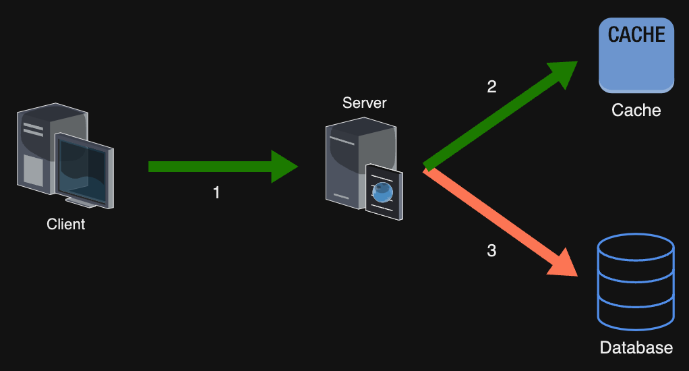
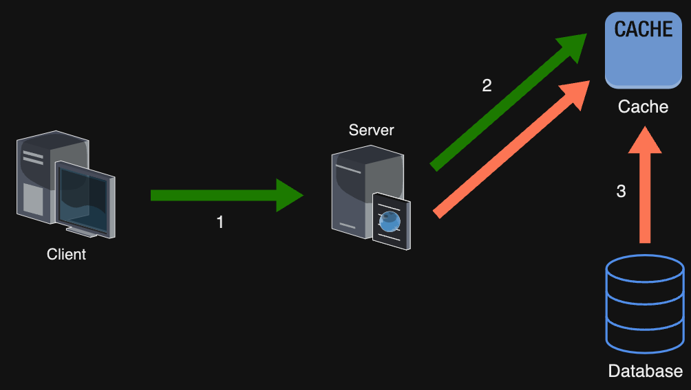
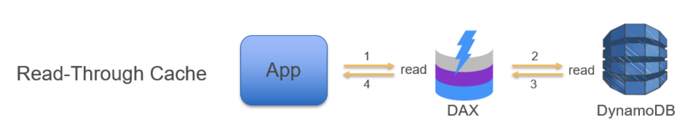
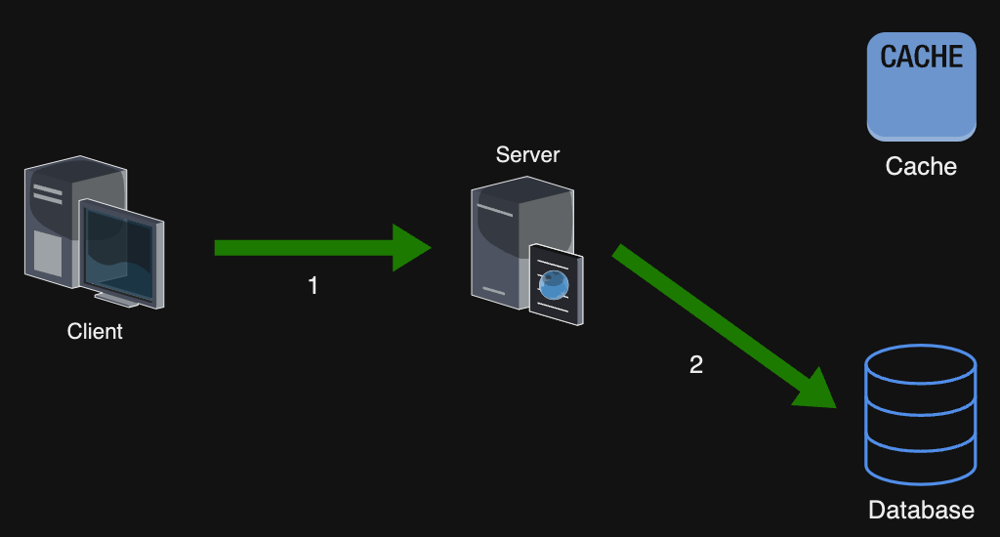
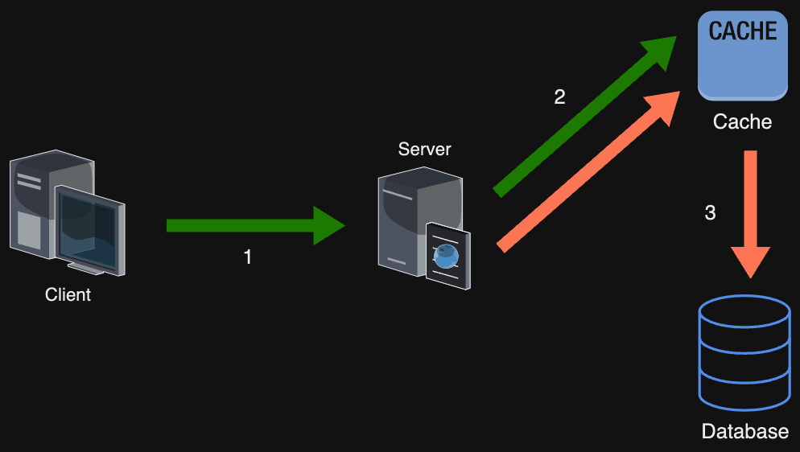
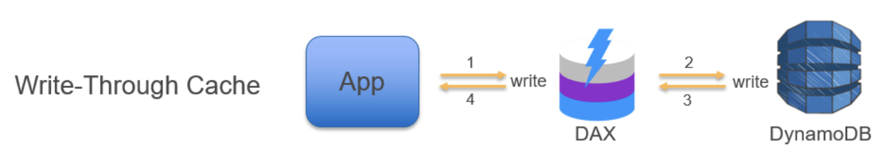
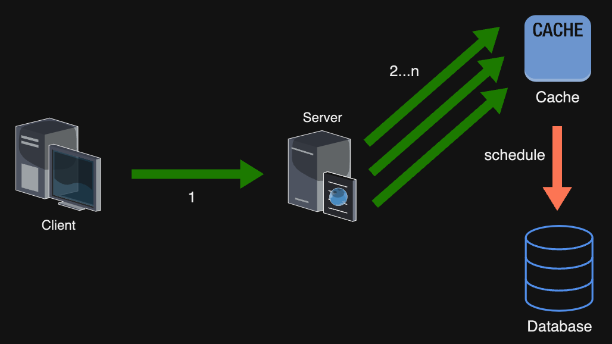
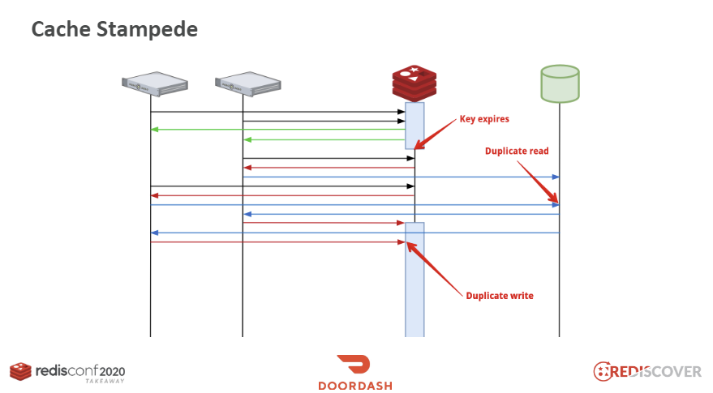

# 캐시 사용하기 #2 전략

캐시를 효율적으로 사용하여 시스템 성능 향상을 원한다면, 서비스에 적절한 캐싱 전략을 선택해야한다.

캐싱 전략은 서비스 성능과 데이터 정합성에도 영향을 미치게 된다. 데이터 유형이나 패턴 접근 방법등에 맞게 전략을 사용해야 합니다.

캐시 기본편에 이어 캐싱을 사용하기 위한 다양한 전략들을 알아보도록 하겠습니다.

[https://medium.com/monday-9-pm/캐시-사용하기-1-기본편-a387799a1634](https://medium.com/monday-9-pm/%EC%BA%90%EC%8B%9C-%EC%82%AC%EC%9A%A9%ED%95%98%EA%B8%B0-1-%EA%B8%B0%EB%B3%B8%ED%8E%B8-a387799a1634)

## 읽기 전략

### Look-Aside(Cache-ASide) 전략

- 데이터 조회시 캐시에 저장된 데이터가 있는지 우선적으로 확인하는 전략
- 원하는 데이터만 별도로 구성하여 캐시에 저장하고, 필요할 때만 데이터를 캐시에서 로드하는 전략
- Cache가 다운되더라도 장애로 이어지지 않고 DB에서 데이터를 가져올 수 있다.



1. 서버는 데이터를 조회시, 캐시를 첫번째로 조회
2. 캐시 miss시 앱은 DB에 접근해서 데이터를 가져온다.
    1. DB 조회 결과를 Cache에 저장 (Write-Around 전략)
3. 동일 데이터에 대한 후속 결과는 cache hit가 된다.
- 단건 호출 빈도가 많은 경우보다, 반복적인 읽기 요청이 많은 경우 적합하다.
- ‘CUD’ 연산은 DB와 Cache와의 정합성 문제가 발생할 수 있다.
- 캐시에 데이터가 로딩되지 않은 상황에서 트래픽이 급증하게 되면 DB의 부하가 급증할 수 있다. Cache Warming을 통해 미리 DB의 데이터를 Cache에 저장할 수 있다.
    - ex. 특정 이벤트나 행사로 조회가 몰릴것으로 대비해 캐시로 미리 데이터를 적재

### Read-Through 전략

- 캐시에서만 데이터를 읽어오는 전략 (inline cache)
- 어플리케이션은 DB 대신 캐시 위주로 통신을 한다.



1. 서버는 데이터를 조회시, 캐시를 첫번째로 조회
2. 캐시 miss시 캐시는 DB에 접근해서 데이터를 가져온다.
3. 동일 데이터에 대한 후속 결과는 cache hit가 된다.
- Cache Aside 방식은 애플리케이션이 캐시에 데이터를 로드하는 역할이지만, Read-Through 전략은 데이터 동기화를 라이브러리나 캐시 제공자가 지원하는 방식으로 로드한다.
- Cache가 다운되면 서비스 전반적으로 문제가 발생할 수 있다.
- Cache와 Database가 강결합된다.
- AWS DynamoDB Read-Through

  

    - [https://aws.amazon.com/ko/blogs/database/amazon-dynamodb-accelerator-dax-a-read-throughwrite-through-cache-for-dynamodb/](https://aws.amazon.com/ko/blogs/database/amazon-dynamodb-accelerator-dax-a-read-throughwrite-through-cache-for-dynamodb/)

## 쓰기 전략

### Write-Around 전략



- Data를 DB에 저장하고, 캐시는 write할때 저장하지 않는다.
- Cache miss (조회시) DB의 데이터를 읽어 캐시에 데이터를 저장 (Cache ASide + Write Around)
- 자주 호출되는 데이터만 캐시에 선택적으로 로드한다.
- 캐시의 데이터와 DB의 데이터의 불일치가 발생할수 있다.
    - 데이터의 수정, 삭제, 만료에 대한 관리가 필요하다.
- 저장시 캐시에는 접근하지 않으므로, 다른 전략들에 비해 상대적으로 속도가 빠르다.

### Write-Through 전략

- 캐시와 DB 모두에 데이터를 저장하는 방식



- 캐시에 데이터를 저장하고, DB에도 저장하는 방식
- DB 동기화 작업을 캐시에게 위임
- 캐시가 항상 데이터를 저장하기 때문에 DB도 항상 최신 데이터를 가지고 있어, 데이터의 불일치가 발생할수 있다.
- 해당 전략을 선택할때는 데이터 호출 빈도에 대한 고려가 필요하다. 항상 캐시에 데이터가 저장되므로, 자주 읽지도 않는 데이터가 캐시가 적재되므로 캐시 데이터 적재되므로 캐시 낭비가 발생하게 된다.
- 저장할때마다 캐시, DB 둘다 저장하므로 Write Around에 비해 상대적으로 느리다.
- AWS DynamoDB Read-Through (inline)

  


### Write-Back (Write Behind) 전략

- 캐시와 DB 모두에 데이터를 저장하는 방식
- Write-Through 방식과 다른점은 캐시가 저장하는 시점이 아니라, 캐시에 데이터를 모아뒀다가 DB에 옮겨서 저장하는 방식



- 별도의 batch, 스케쥴러등을 통해 cache에 모여있던 요청을 저장 처리
- 캐시 내용을 주기로 몰아서 database에 저장하여, 쓰기 비용을 절감할 수 있다.
- 쓰기 비용을 절감 할 수있지만 캐시 장애, 에러로 인한 데이터 유실에 따른 문제가 발생할 수 있다.
- 대량의 쓰기 요청이 있는 경우에 적합하다. (아주 짧은 시간 동안 순식간에 처리해야하는 단기 이벤트의 경우 유용하게 사용이 가능하다.)

## 삭제 (만료) 전략

- 캐시는 영구 저장소로 사용하지 않으며, 메인 스토지리의 복사본으로써 빨리 접근할수 있게끔 제공하게 됩니다.
- 캐시 저장소는 사이즈 관리 / 갱신을 위해 삭제/만료 처리가 필요합니다.
- 캐시 만료 주기가 너무 짧으면 메인 스토지리에 접근 빈도가 높아지게 되어 캐시의 이점이 줄어들게 된다.

### Cache Stampede

- TTL 값이 짧아서 메인 저장소에서 데이터가 자주 갱신되어야하는 경우 문제가 발생할수 있다.
- 캐시 저장소에 동일 key로 동시에 요청하게 되면, 캐시에 갱신되지 않은 상태에서 여러 요청이 메인 저장소에 동시에 read 요청을 수행 (duplicate read)
- duplicate read 이후 메인 저장소에서 읽은 값을 동시에 write 수행하게 된다 (duplicate write)



- 동시에 일어나는 read와 write는 불필요한 요청이 늘어나는것을 의미합니다.
- 다량의 캐시 키가 동시에 만료, 삭제되면 다시 캐시로 조회 요청이 들어왔을때 DB 조회, 캐시 저장으로 인한 부하가 발생할수 있다.
```
Redis keyspace notification과 같은 pub/sub 모델을 사용중이라면, 대량의 키가 동시에 만료되었을때 서버쪽으로 다량의 이벤트가 발생할수 있음.
```
https://redis.io/docs/manual/keyspace-notifications/

#### 해결방안
PER(Probablistic Early Recomputation) / Jittering

- TTL이 동일한 캐시 데이터를 로딩시 발생하는 부하를 분산시키기 위한 방안
- TTL이 동일한 캐시 데이터를 일정한 간격으로 조금씩 차이를 두어 로딩하는 알고리즘
- 예를 들어, TTL이 60초인 데이터가 있다면, 60초 내에 모든 데이터가 만료되지 않도록, 55초부터 65초 사이에 각각 무작위 시간(예를 들면 55초, 59초 등)을 두어 데이터를 로딩할 수 있습니다.
  이렇게 하면, TTL이 동일한 데이터가 일정한 간격으로 만료되므로, 모든 데이터가 동시에 만료되는 문제를 방지할 수 있습니다.
- 참고 : [https://meetup.nhncloud.com/posts/251](https://meetup.nhncloud.com/posts/251)

TTL 전략
- 
```
jitter : 디지털 신호에서 발생하는 신호의 차이, 불안정성을 의미
```
http://highscalability.com/blog/2012/4/17/youtube-strategy-adding-jitter-isnt-a-bug.html

## Redis 관리 전략

레디스의 데이터 저장 방식 및 Eviction 전략입니다.

- 데이터 백업 방식
    - RDB
        - 특정 시점에 Redis 내부의 스냅샷으로 백업
        - 저장 당시의 데이터들만 저장
    - AOF (Append Only File)
        - 모든 커맨드 명령에 대한 로그를 남기게된다.
        - 모든 명령에 대해 기록되어 파일 사이즈가 커진다.

- Eviction 전략
    - noeviction: maxmemory에 도달하면 기존 캐시 데이터를 추가하지 않으며 에러 발생
    - allkeys-lru(Least Recently Used): 최근에 사용하지 않은 키를 제거합니다.
    - volatile-lru: TTL이 설정된 키들 중 최근에 사용하지 않은 키를 제거합니다.
    - allkeys-lfu(Least Frequently Used): 참조된 횟수를 기준으로 사용 빈도 수가 가장 적은 키를 제거합니다.
    - volatile-lfu: TTL이 설정된 키들 중 사용빈도 수가 적은 키를 제거합니다.
    - allkeys-random: 무작위로 키를 제거합니다.
    - volatile-random: TTL이 설정된 키들 중 무작위로 키를 제거합니다.
    - volatile-ttl: TTL이 짧은 키를 제거합니다.
      [https://redis.io/docs/reference/eviction/](https://redis.io/docs/reference/eviction/)

## 참조

- [https://inpa.tistory.com/entry/REDIS-📚-캐시Cache-설계-전략-지침-총정리](https://inpa.tistory.com/entry/REDIS-%F0%9F%93%9A-%EC%BA%90%EC%8B%9CCache-%EC%84%A4%EA%B3%84-%EC%A0%84%EB%9E%B5-%EC%A7%80%EC%B9%A8-%EC%B4%9D%EC%A0%95%EB%A6%AC)
- https://meetup.nhncloud.com/posts/251
- https://www.prisma.io/dataguide/managing-databases/introduction-database-caching
- https://www.linkedin.com/pulse/application-caching-strategies-konstantinos-kalafatis-1f?trk=pulse-article_more-articles_related-content-card