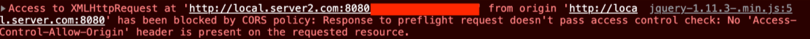
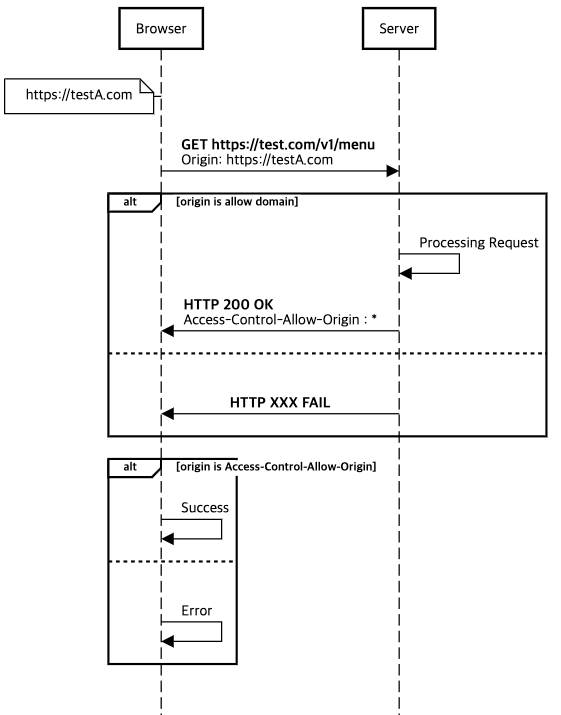
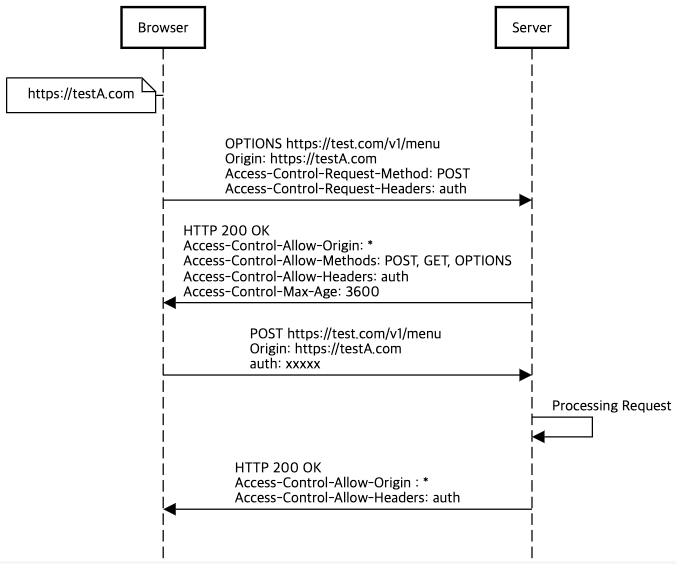
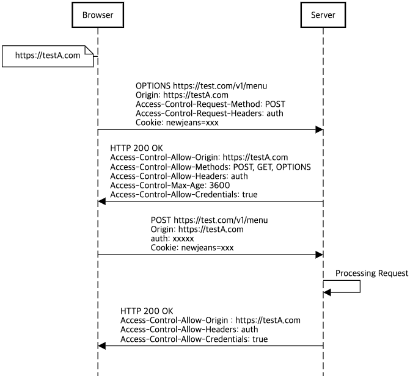

## CORS : 브라우저와 서버 사이

이번 아티클에서는 웹과 서버 개발에서 흔히 마주할수 있는 CORS에 대해 정리하였습니다.

CORS는 클라이언트(브라우저)에서 다른 도메인으로의 리소스 요청시 발생하는 보안 이슈를 해결하기 위해 나온 개념입니다.

CORS에 대한 개념과 이해, 왜 CORS가 필요한지, 그리고 CORS를 해결하기 위한 조치 방법과 동작 방식에 대한 내용을 다루었습니다.

CORS의 개념, 동작, 조치 방법등 전반적인 내용을 토대로 브라우저와 서버간의 통신간 발생할수 있는 상황들에 대해 자세히 알아보고자 합니다.

### CORS?

- CORS(Cross-Origin Resource Sharing)는 교차 출처 리소스 공유라는 뜻으로, Client(Browser)에서 Server에 요청시 교차 출처로부터의 요청을 허용하는 방법을 의미합니다.
- 
- 기본적으로 CORS에 대한 별도 설정이 없으면, 다른 도메인으로의 요청이 발생할 경우 서버나 브라우저에서 에러가 발생합니다.
- 클라이언트(브라우저)에서 서버에 요청할 때 다른 출처(도메인)로부터의 요청을 허용하기 위한 별도의 설정이 필요합니다.
- "Cross"라는 단어로 인해 교차 출처라는 의미로 많이 번역되어 사용되는데, 실제로는 다른 출처(도메인)에서의 리소스 요청을 허용하는 방법을 의미합니다.
- "Origin"이란 용어는 어떤 출처(도메인)에서 요청이 발생했는지를 나타내며, 이를 기반으로 다른 도메인으로의 리소스 요청이 차단되는 정책이 적용됩니다.
- CORS 동작과 정책을 하나하나 살펴보며, CORS를 이용하여 다른 도메인에서의 요청을 처리하는 방법에 대해 알아보도록 하겠습니다.

#### ORIGIN
- ORIGIN은 Web Resource의 고유한 식별자, 어떤 출처(도메인)에서 요청이 발생했는지를 나타낸다.
- Scheme (Protocol), Domain (Host), Port 까지의 정보를 의미
    - Port는 생략 가능
- 이 세 가지 요소가 동일하면 두 Origin이 동일한것으로 판단한다
```text
http://test.com == http://test.com:80
http://test.com != https://test.com
http://subdomain.test.com != https://test.com
```
- 다른 도메인으로의 요청시, 해당 요청이 어디에서 왔는지를 알려주기 위하여 ORIGIN 헤더 전달
    - referer에서 Path를 나타내지 않는 정보
        - referer : https://test.com/134134
        - origin : https://test.com
    - 필요한 경우 브라우저에서 현재 도메인 정보 기반으로 Header에 포함하여 전송

#### SOP (Same-Origin Policy)
- 웹 브라우저에서 실행되는 스크립트의 보안을 강화하기 위해 도입된 정책
    - https://www.rfc-editor.org/rfc/rfc6454#page-5
- 스크립트가 다른 출처(origin)의 리소스에 접근하는 것을 기본적으로 제한하고 동일 출처(Origin)에는 리소스 접근을 허용
- 제한 범위
```text
If the two origins are scheme/host/port triples, the two origins are the same if, and only if, they have identical schemes, hosts, and ports.
```
- SOP가 필요한 이유?
    - 웹 애플리케이션에서 사용되는 JavaScript 코드는 브라우저의 개발자 도구를 통해 쉽게 접근하고 분석할 수 있어, 웹 애플리케이션의 구조와 동작 방식을 파악하는 것이 용이합니다.
    - 이런 특성으로 인해 악의적인 공격자들이 취약점을 찾아 공격을 시도할 수 있으며, 따라서 웹 개발자는 보안에 대한 철저한 고려와 적절한 대비책을 마련해야 합니다.
        - Cross-Site Scripting (XSS) 공격: 악성 스크립트가 취약한 웹 사이트에 삽입되어, 사용자의 브라우저에서 실행되는 공격입니다. 스크립트가 취약한 사이트에 삽입되어, 다른 도메인에 요청을 보낼수 있게 됩니다.
        - Cross-Site Request Forgery (CSRF) 공격: CSRF의 경우 공격자가 사용자의 웹 브라우저를 이용해 무단으로 트랜잭션을 수행하는 공격
            - CSRF를 SNS 서비스를 예시로 들어 설명하겠습니다.
          ```text
            1. 사용자는 SNS에 이미 로그인되어있는 상태
            2. 사용자는 다른 탭에서 공격자의 악성 페이지 진입
            3. 공격자는 SNS에 광고 글을 게시하는 스크립트를 만들어 사용자의 인증정보와 함께 SNS에 요청
            4. 사용자가 모르는 사이에 결제 요청
          ```
    - WARNING
  ```text
    - CSRF나 XSS 공격들에 대해 SOP의 목적과 관련하여 일부 케이스만 작성하였고, SOP로 모든 공격을 완전히 차단할수는 없으며 직접적인 방어 수단으로는 부족하다고 생각이 됩니다. 
    - 보완을 강화하기 위해 추가적으로 인증, 요청 검증 등 고려가 필요합니다.
  ```
    - SOP는 브라우저에서 실행되는 스크립트의 보안을 강화하기 위한 추가 정책이라고 생각이 됩니다.
    - CORS는 SOP의 예외 항목으로 SOP의 제한을 완화하면서 보안을 유지하기 위한 방법으로 소개 하고 있습니다.
      ```text
      3.4.2.  Network Access
      
         Access to network resources varies depending on whether the resources
         are in the same origin as the content attempting to access them.
      
         Generally, reading information from another origin is forbidden.
         However, an origin is permitted to use some kinds of resources
         retrieved from other origins.  For example, an origin is permitted to
         execute script, render images, and apply style sheets from any
         origin.  Likewise, an origin can display content from another origin,
         such as an HTML document in an HTML frame.  Network resources can
         also opt into letting other origins read their information, for
         example, using Cross-Origin Resource Sharing [CORS].  In these cases,
         access is typically granted on a per-origin basis.
      
         Sending information to another origin is permitted.  However, sending
         information over the network in arbitrary formats is dangerous.  For
         this reason, user agents restrict documents to sending information
         using particular protocols, such as in an HTTP request without custom
         headers.  Expanding the set of allowed protocols, for example, by
         adding support for WebSockets, must be done carefully to avoid
         introducing vulnerabilities [RFC6455].
      ```

- CORS (Cross-Origin Resource Sharing)는 브라우저에서 다른 도메인으로의 호출을 허용할 수 있는 방법을 제시하며, 기본적으로 브라우저의 SOP (Same-Origin Policy)를 완화시켜 주는 역할을 합니다.

### 동작 방식
- 요청 방식에 따라 3가지로 구별할수 있습니다.
    - Simple Request
    - Preflight Request
    - Credentials Request

- Preflight Request 란?
    - Preflight Request는 실제 요청 이전에 요청이 가능한지를 판단하는 단계로, 브라우저에서 해당 정보를 사전 검증합니다.
    - 
    - 실제 요청 이전에 HTTP OPTIONS method가 호출되어 서버와 통신하는 단계가 추가됩니다.
    - 서버는 Preflight Request이 들어와도 실제 요청에 대한 리소스 접근이 이루어지는것은 아니며 검증만을 수행하게 됩니다.
    - 브라우저는 Preflight Request의 응답 정보를 확인하여, 실제 요청을 보내도 되는지를 판단합니다.
    - 모든 경우에 Preflight Request를 수행되는 것이 아니며, 사용자가 전달하는 Header, Cookie 정보 등에 따라 필요한 경우에만 수행됩니다.

#### CORS Headers
- CORS에서는 서버와 브라우저간의 허용할 도메인, 헤더등에 대한 정보를 Header를 통해 주고받아 검증하게 됩니다.
- 요청에서 사용되는 HTTP Header들에 대해 Client, Server 기준으로 정리하였습니다.

- Client Request
  클라이언트에서 서버에 요청시 필요한 헤더 목록입니다.
1. Origin
    - 요청이 발생된 출처(도메인)을 나타냅니다.
    - 브라우저가 요청시 헤더에 해당 값을 자동으로 포함시키게 됩니다.
2. Access-Control-Request-Headers
    - 실제 요청에서 사용될 HTTP Header를 전달합니다.
    - 기본으로 허용하지 않은 Header이외에 사용할 사용자 Header를 명시 (ex. Auth 등)
3. Access-Control-Request-Method
    - 실제 요청에서 사용될 HTTP Method를 전달합니다. 서버에서는 Header, Method값을 확인하여 허용이 가능한 요청인지를 검증합니다. (ex. DELETE 등)
- Server Response
  서버에서 클라이언트 응답으로 전달되는 헤더 목록입니다.
1. Access-Control-Allow-Origin
    - 해당 도메인으로부터의 요청을 허용할 것인지를 나타내는 헤더
    - 서버와 브라우저는 헤더의 Origin의 값과 해당 정보를 비교하여 검증합니다.
    - ex.
        - "*" : 모든 헤더
        - "https://testA.com" : https://testA.com 허용
2. Access-Control-Allow-Headers
    - 서버에서 허용하는 사용자 헤더의 목록
    - 클라이언트에서 서버의 응답에는 포함된 추가 헤더를 사용할수 있습니다.
    - ex. Auth Header 추가
        - Access-Control-Allow-Headers : Auth, ...
3. Access-Control-Allow-Methods
    - 서버에서 허용하는 HTTP Method 목록
    - 클라이언트에서는 이 헤더에서 설정한 메서드만 사용할수 있습니다.
4. Access-Control-Max-Age
    - Preflight Requeset 결과를 캐시할 시간(초)
    - 캐싱 처리 이후에는 실제 요청 이전에 매번 Preflight Request를 호출하지 않습니다.
    - 매 요청마다 Preflight Request를 호출하지 않고 재사용하면, 네트워크 요청으로 인한 비용을 줄일수 있습니다.
5. Access-Control-Allow-Credentials
    - 쿠키를 사용할수 있는지에 대한 여부 입니다.
    - true로 설정하면, 브라우저는 쿠키를 서버에 전달할수 있습니다.

#### Simple Request
- Preflight Request이 필요하지 않은 Request입니다.
- 서버의 Access-Control-Allow-Origin에서 현재 도메인을 허용하는지에 대한 여부만을 체크합니다.

- 시나리오


1. 클라이언트가 다른 도메인의 리소스에 접근하는 요청을 생성합니다.
2. 요청 헤더에 Origin 필드를 포함시켜 보냅니다. 이 필드에는 해당 요청이 발생한 도메인이 포함됩니다.
3. 서버는 Origin 필드에 포함된 도메인과 허용된 도메인(Access-Control-Allow-Origin)이 일치하는지 확인합니다.
4. 일치한다면, 서버는 요청에 대한 응답을 생성하고, Access-Control-Allow-Origin 헤더를 응답 헤더에 포함시킵니다. Access-Control-Allow-Origin에는 해당 요청이 허용된 도메인이 포함됩니다.
5. 서버의 응답 정보에서 Access-Control-Allow-Origin 헤더를 확인해 해당 도메인으로 부터의 접근이 가능한지 브라우저에서는 정책을 검증하게 됩니다.

  ```text
      특정 도메인 허용 > Access-Control-Allow-Origin : https://test.com, http://test.com
      
      전체 도메인 허용 > Access-Control-Allow-Origin : *
  ```

6. 브라우저는 응답을 받아와서 클라이언트에게 반환합니다.

- 특징 : Preflight Request을 하지 않으므로 요청이 좀 더 빨리 수행될수 있습니다.

#### Preflight Request이 필요한 경우
Preflight Request 동작을 보기에 앞서, 해당 요청이 필요한 경우를 상세하게 확인해보겠습니다.

- DOMAIN
    - **같은 도메인, 포트가 아닌 경우**
    - **서브 도메인이 다르고, 헤더 정책에 포함되는 경우**
- Http Header (name, value)
    - 공통 조건
        - Header value length가 128 byte를 넘는 경우
        - **해당 header 이외에 기타 사용자 header를 포함한 요청인 경우**
            - **허용 : accept, accept-language, content-language, content-type, range**
            - **설정 필요 : authorization**
        - header 타입별 조건
            - accept
                - CORS-unsafe request-header byte
            - content-language
                - a-z / A-Z / 0-9 / 공백(SPACE) / 별표(*) / 쉼표(,) / 하이픈(-) / 마침표(.) / 세미콜론(;) 이외의 문자가 포함된 경우
            - content-type
                - CORS-unsafe request-header byte
                - 유효하지 않은 mimeType
                - **mimeType이 application/x-www-from-urlencoded, multipart/form-data, text/plain이 아닌 경우**
- HTTP METHOD
    - **GET, HEAD, POST 이외의 HTTP METHOD (PUT,DELETE 등)**


- CORS-unsafe request-header byte
    - byte가 0x09 수평 탭(HT)이 아니면서 0x20보다 작은 값
    - byte가 0x22 쌍따옴표(", 0x28 왼쪽 괄호, 0x29 오른쪽 괄호, 0x3A 콜론(:), 0x3C 작은 부등호(<), 0x3E 큰 부등호(>), 0x3F 물음표(?), 0x40 골뱅이(@), 0x5B 왼쪽 대괄호([), 0x5C 백슬래시(\), 0x5D 오른쪽 대괄호(]), 0x7B 왼쪽 중괄호({), 0x7D 오른쪽 중괄호(}) 또는 0x7F DEL(아스키 코드의 삭제 문자) 중 하나

- CORS에서는 이러한 허용되지 않는 문자가 포함된 HTTP 헤더가 포함된 요청 혹은 규격에 맞지 않은 요청에 대해서는 "preflight"라고 하는 추가적인 요청을 보내서, 서버 측에서 허용할수 있는 안전한 요청인지를 검증하는 과정을 거칩니다.
- 여러번 CORS와 같은 상황은 겪어봤지만, 대게의 경우 정의되지 않은 header 사용하는 경우만 해당되었습니다.

#### Preflight Request
- Preflight Request 설명에 앞서, 용어를 나누겠습니다.
    - Preflight Request : 실제 요청이 수행되지 않고 검증을 위해 호출하는 OPTIONS 요청
    - Actual Request : Preflight 요청 이후에 실제로 수행될 사용자의 요청
- 브라우저는 Actual Request를 전송해도 될지를 판단하기 위해 Preflight Request를 사용하여 검증을 진행합니다.
- Preflight Request가 필요한 조건은 위에서 설명드린 DOMAIN, HEADER, HTTP METHOD 등으로 구별하게 됩니다.

- 시나리오



1. 클라이언트가 다른 도메인의 리소스에 접근하는 요청을 생성합니다.
2. 브라우저는 Actual Request을 전송하기 전, Preflight Request가 필요한지 확인합니다.
3. 브라우저는 Preflight Request에 사전 검증에 필요한 정보를 헤더에 포함하여 전달합니다.
    - Access-Control-Request-Headers, Access-Control-Request-Method, Origin
4. 서버는 Preflight Request에 대한 검증 수행
    1. Access-Control-Allow-Origin : 헤더에 전달된 origin으로 유효한 도메인 검증
    2. Access-Control-Allow-Headers : 사용자 헤더(auth) 포함 여부 검증
5. 서버는 preflight request 요청에 대한 응답을 생성
    - Access-Control-Allow-Origin, Access-Control-Allow-Headers
6. 브라우저 Preflight Request에 대한 검증을 수행합니다. 검증 내용은 다음과 같습니다.
    1. Access-Control-Allow-Origin : 도메인 유효성 검증
    2. Access-Control-Allow-Headers : 사용자 헤더(auth) 포함 여부 검증
    3. Access-Control-Allow-Methods : Actual Request에서 사용가능한 HTTP 메서드 검증
7. 브라우저는 preflight request에 대한 검증이 완료되면, Actual Request을 전송합니다.
8. 서버는 Actual Request에 대한 처리를 수행하고, 해당 요청에 대한 응답을 생성합니다.

#### Credentials Request
- 다른 출처간의 통신에서 쿠키 정보나 인증과 관련된 헤더를 추가로 담기 위해 credentials 옵션을 사용하게 됩니다.
- Preflight Request 보다 강화된 정책입니다.
- Preflight Request는 동일하게 수행하며, 세부적인 옵션이 다른 정책입니다.

1. Client Side Option 추가 필요 (credentials)
   쿠키 정보를 포함하여 요청하기 위해서는 option을 포함하여 요청해야합니다. 설정되지 않으면 쿠키가 있어도, 요청에 포함되지 않습니다.
```javascript
// fetch API
fetch(URL, {
    credentials: 'include',  // 추가 필요
});

// ajax
$.ajax({
    url: URL,
    type: 'POST',
    data: { /* 요청 데이터 */ },
    xhrFields: { withCredentials: true }, // 추가 필요
    success: function(response) {},
    error: function(xhr, status, error) {}
});

// XMLHttpRequest
var xhr = new XMLHttpRequest();
xhr.open('POST', URL, true);
xhr.withCredentials = true;
xhr.setRequestHeader('Content-Type', 'application/json;charset=UTF-8');
xhr.send(JSON.stringify({ /* 요청 데이터 */ }));
```
2. Server Response Header
    1. Access-Control-Allow-Credentials: true 추가
    2. Access-Control-Allow-Origin는 "*"로 처리될수 없으며, 요청지의 도메인으로 설정
```text
GET /v1/user HTTP/1.1
Host: https://test.com
...
Origin: https://testA.com

HTTP/1.1 200 OK
..
Access-Control-Allow-Origin: https://testA.com
Access-Control-Allow-Credentials: true
..
```

- 시나리오



1. 클라이언트가 다른 도메인의 리소스에 접근하는 요청을 생성합니다.
2. 브라우저는 Actual Request을 전송하기 전, 사전 요청(preflight request)이 필요한지 확인합니다.
    - withCredentials : true
3. 브라우저는 Preflight Request에 사전 검증에 필요한 정보를 포함하여 전달합니다.
    - Access-Control-Request-Headers, Access-Control-Request-Method, Origin, Cookie
4. 서버는 Preflight Request에 대한 검증 수행
    1. Access-Control-Allow-Origin : 헤더에 전달된 origin으로 유효한 도메인 검증
    2. Access-Control-Allow-Headers : 사용자 헤더(auth) 포함 여부 검증
5. 서버는 preflight request 요청에 대한 응답을 생성
    - Access-Control-Allow-Origin, Access-Control-Allow-Headers, Access-Control-Allow-Credentials
6. 브라우저 Preflight Request에 대한 검증을 수행합니다. 검증 내용은 다음과 같습니다.
    1. Access-Control-Allow-Origin : 도메인 유효성 검증 / "*" 은 포함될수 없고, 일치되는 도메인이 전달되어야함
    2. Access-Control-Allow-Headers : 사용자 헤더(auth) 포함 여부 검증
    3. Access-Control-Allow-Methods : Actual Request에서 사용가능한 HTTP 메서드 검증
    4. Access-Control-Allow-Credentials : true
7. 브라우저는 preflight request에 대한 검증이 완료되면, Actual Request을 전송합니다.
8. 서버는 Actual Request에 대한 처리를 수행하고, 해당 요청에 대한 응답을 생성합니다.


- 정리하자면 브라우저의 요청 정보에 따라 사전 검증 단계가 추가되며, 해당 단계를 통해 도메인 허용 여부/헤더 포함 여부등을 서버와 브라우저에서 각각 검증하게 됩니다.

#### 서버 동작 예제

- 다음 예제는 Spring에서 제공하는 CORS 관련 필터(CorsFilter)를 사용하여 서버에서 어떻게 CORS(Cross-Origin Resource Sharing) 요청 처리를 구현하는지 보여주는 예제입니다.
- 다음 예제로 통해 실제로 요청이 어떻게 이루어지는지 볼 수 있습니다.

- Spring Cors Example
```java

package org.springframework.web.filter;

public class CorsFilter extends OncePerRequestFilter {
    // ...
    @Override
    protected void doFilterInternal(HttpServletRequest request, HttpServletResponse response,
            FilterChain filterChain) throws ServletException, IOException {

        CorsConfiguration corsConfiguration = this.configSource.getCorsConfiguration(request);
        boolean isValid = this.processor.processRequest(corsConfiguration, request, response); // (1) 
        if (!isValid || CorsUtils.isPreFlightRequest(request)) { // (3)
            return;
        }
        filterChain.doFilter(request, response); // (4)
    }
}

public abstract class CorsUtils {
    
    public static boolean isPreFlightRequest(HttpServletRequest request) {
        return (HttpMethod.OPTIONS.matches(request.getMethod()) && // (2)
                request.getHeader(HttpHeaders.ORIGIN) != null &&
                request.getHeader(HttpHeaders.ACCESS_CONTROL_REQUEST_METHOD) != null);
    }
}
```
1. origin, http method, header, domain 등을 확인하여 이 request가 허용 가능한지 여부를 확인
2. OPTIONS Method, Header에 Origin 포함, 다음 요청 Method 정보가 포함되어있으면 Preflight로 판단
3. (1)번 조회 결과 유효하지 않은 request이거나, (2)번 조회 결과 Preflight Request인 경우는 실제 요청을 처리하지 않고 바로 반환합니다.
4. 허용이 가능한 Actual Request인 경우 Controller로 요청을 전달합니다.

#### Why Options Method?

- Preflight Request에서 HTTP OPTIONS Method를 사용하는 이유?
```text
- OPTIONS는 Safe Method 중 하나이며, 서버의 리소스에 영향을 주지 않는 읽기 전용 작업으로 사용됩니다. 
- OPTIONS Method의 기본 목적은 서버에서 사용 가능한 특정 리소스에 대한 설정을 확인하는 것입니다. 
- 이 때문에 Preflight 요청으로 적합하며, 클라이언트는 이를 통해 실제 요청이 전송되기 전에 서버의 허용 범위를 사전에 확인할 수 있습니다.
```
Safe Method : https://developer.mozilla.org/en-US/docs/Glossary/Safe/HTTP

- API 호출시 OPTIONS 요청으로 인해 API의 실제 요청이 수행되지는 않아, 검증 이전에 서버의 리소스에 접근할수 없습니다.

### CORS 허용 방법
Servlet 기준으로 허용 방법을 소개드리겠습니다.

credential request가 필요한 경우로 가정하고 설명드리도록 하겠습니다.
```java
import javax.servlet.Filter;

public class CustomCorsFilter implements Filter { // (1)

    @Override
    public void doFilter(ServletRequest req, ServletResponse res, FilterChain chain) throws IOException, ServletException {

        HttpServletResponse response = (HttpServletResponse) res;
        
        response.setHeader("Access-Control-Allow-Origin", CorsUtil.getOrigin(request)); // (2)
        response.setHeader("Access-Control-Allow-Credentials", "true"); // (3)
        response.setHeader("Access-Control-Allow-Methods", "POST, GET, OPTIONS"); // (4)
        response.setHeader("Access-Control-Allow-Headers", "custom-header, custom-header2"); // (5)
        chain.doFilter(req, res);
    }
    // ..
}
```
1. Servlet의 Filter를 구현
2. request 정보를 기반으로 허용 도메인 설정
3. Credential Request 허용을 위한 응답 헤더 설정
4. 허용 HTTP Method 설정
5. 허용 HTTP Header 설정

- 이론적인 내용들에 비해 수정 자체는 크게 어렵지 않게 적용할수 있었습니다.
- 앞단에서 nginx나 별도의 서버를 두고 있으면, 해당 서버들에서 별도의 설정을 통해서도 CORS 처리가 가능합니다.

### 글을 마치며
이번 글에서는 웹 개발 시 자주 마주치는 보안 문제 중 하나인 CORS에 대해 다뤘습니다.

CORS는 서로 다른 출처 간 자원을 공유할 때 발생하는 문제를 해결하기 위한 방법 중 하나로, 규칙에 맞는 header를 추가해 다른 출처간 데이터를 주고 받을 수 있습니다.

이번 글에서 설명한 브라우저와 서버간 요청중 다른 도메인 간의 요청이 어떻게 처리되는지를 이해하고 규칙에 맞추어 설정한다면, CORS를 다루는 것은 크게 어렵지 않을 것으로 생각됩니다.

### 참고 자료
- https://fetch.spec.whatwg.org/
- https://developer.mozilla.org/en-US/docs/Web/HTTP/CORS