# CO2 Alert System 만들기

요근래 코로나로 인해 집에 머무는 시간이 늘어나면서, 공기 질에 대한 관심이 높아졌습니다.

환기는 언제해야하고, 왜 해야 하는지가 궁금하기도 했습니다. 그러던중 우연히 이산화탄소 CO2 농도가 높으면 문제가 생긴다는 기사를 보게 되었고, 좀 더 쾌적한 실내환경을 위해서 CO2 Alert 시스템을 개발하게 되었습니다.

> 이산화탄소는 농도가 700~1000ppm이면 불쾌감이 느껴지고, 1000~2000ppm 사이일 경우에는 피로와 졸림 현상이 나타나는 등 컨디션 변화가 일어나고, 2000ppm 이상이면 두통과 어깨 결림을 느끼며, 3000ppm을 초과할 경우 현기증을 일으키는 등 건강을 해치게 된다. 
> - ****이산화탄소로 꽉 찬 실내 공기, 아이들 건강 위협, 중앙일보, 2018.03.30****

필요한 하드웨어와 소프트웨어는 아래와 같습니다.

### 하드웨어

- NodeMCU, MHZ-19B, 128 x 32 I2C OLED 등

### 소프트웨어

- Arduino IDE, Node.js and Express, Prometheus, Graphana 등

# NodeMCU

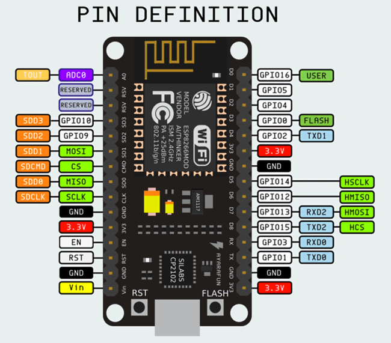

NodeMCU는 IoT 의 각 Node를 구현하는데 적합하도록 만들어진 와이파이쉴드와 안테나가 탑재된 보드입니다. ESP8266 와이파이 모듈을 개발한 ESPRESSIF사의 ESP8266-12 모듈을 사용합니다. 

NodeMCU V1.0은 ESP-12E를 사용하며, USB 신호를 UART 신호로 변경하기 위해서 CP2012 칩셋을 사용하고 있습니다. 마이크로USB의 앞쪽에 CP2012 칩이 있습니다. 그림 윗쪽의 구불구불한 금색 안테나와 알루미늄 쉴드가 ESP8266-12E SOC입니다. 중앙의 검정색 칩이 LM1117로 5V 전압을 3.3V로 변환합니다.

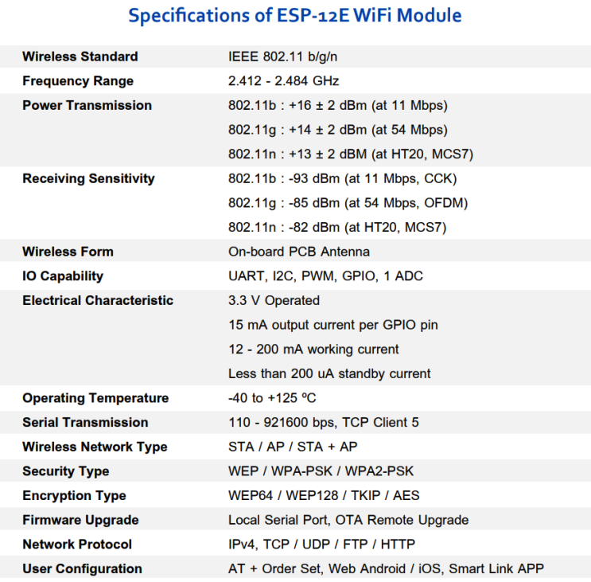

### 전원 관련

GND는 Ground를 의미하는 말로 접지라고도 표현하고 쉽게는 - 전원으로 이해하면 됩니다. 건전지에 +(전원핀)의 연결만으로는 사용할 수 없듯이 +와 -를 연결해 주어야 완전한 회로도가 됩니다. 모든 부품에는 전류가 흐르기 때문에 모든 부품에는 1개 이상의 GND 연결이 필수이며, GND케이블은 일반적으로 검정색으로 표시합니다.

**VCC와 GND**

모든 회로는 (+)극에서 시작하여 (-)극으로 끝납니다. 전자 회로에서는 (+)극을 VCC라 부르고 (-)극을 GND라 부릅니다.

VCC는 항상 전압 크기를 같이 표기하는데, 예를 들어 VCC(5V) 등으로 표기합니다. VCC를 생략하고 5V로만 표기하는 경우도 있는데 모두 (+)극을 의미합니다.

GND는 Ground라고 발음하며 전압의 크기와 상관 없이 모두 공통으로 사용합니다.

이 말은 회로 상에서 GND1, GND2등의 구별 없이 1개의 GND로만 불리기에 GND라 표기되어있는 것은 모두 연결해야 합니다. 이것을 공통 그라운드(Common Ground)라 말합니다.

## VCP Driver 설치 (Mac)

우선 NODE MCU를 MacOS에서 이용하기 위해 아래의 VCP 드라이버를 설치합니다.

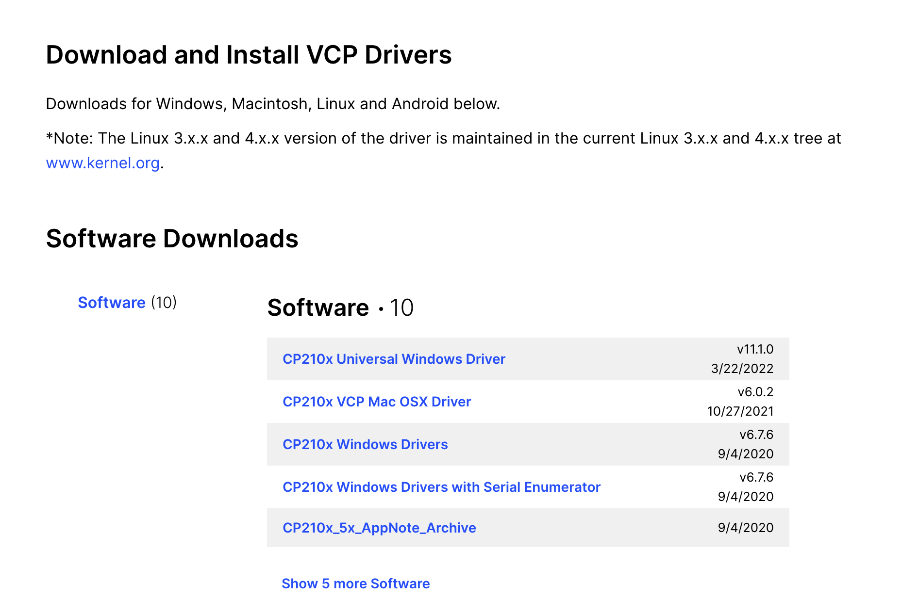

- [https://www.silabs.com/developers/usb-to-uart-bridge-vcp-drivers](https://www.silabs.com/developers/usb-to-uart-bridge-vcp-drivers)

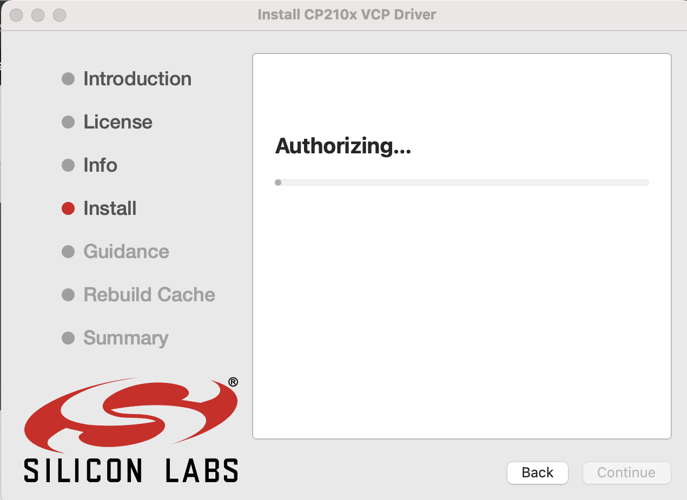

설치중에 Allow apps downloaded from 쪽에서 CP210x를 허용 할 것인지를 묻습니다. 해제합니다.

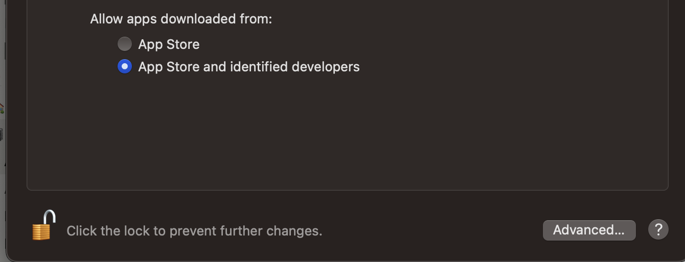

연결시, 아래와 같은 결과 확인

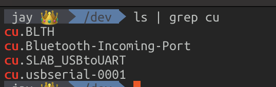

---

# Arduino IDE 설치 (mac)

코딩 및 디버깅 등을 하기 위한 IDE를 설치합니다.

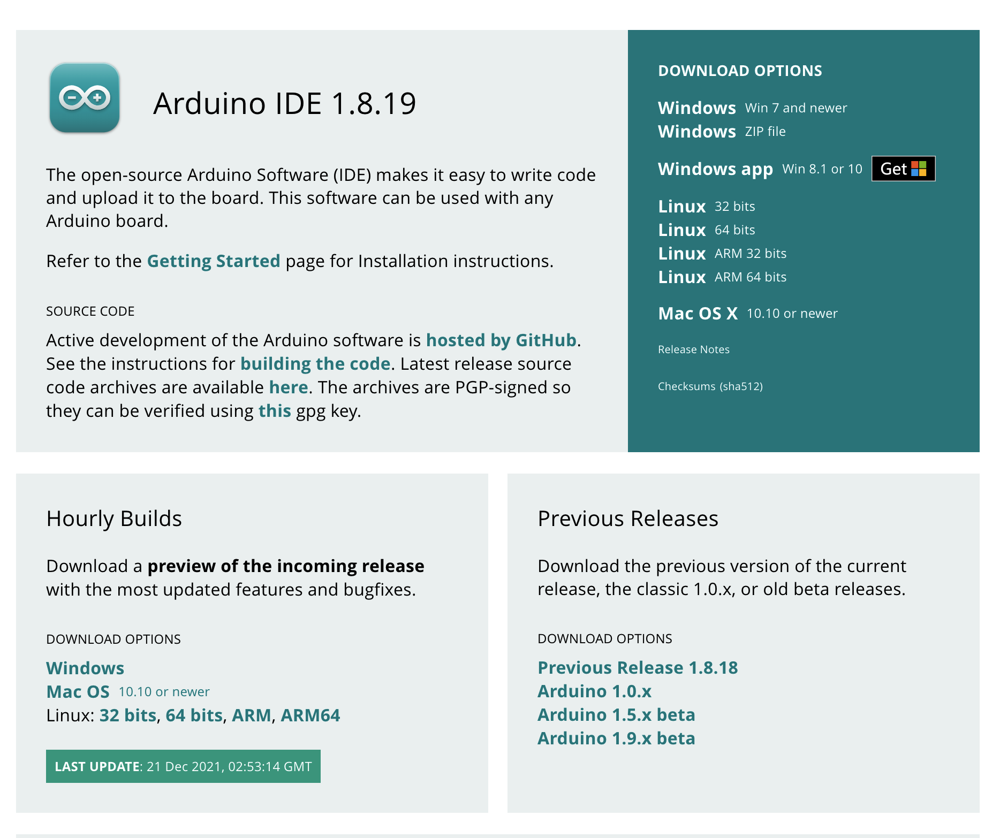

[https://www.arduino.cc/en/software](https://www.arduino.cc/en/software)

설치 후에는 아래와 같이 아두이노 툴이 실행가능하다.

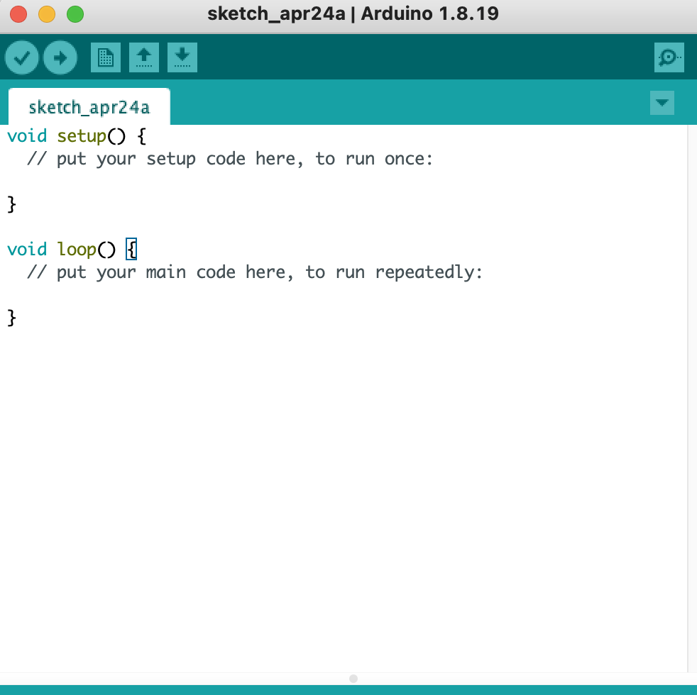

---

## ESP 8266 구성

이번 시스템 구성에서 사용하는 보드는 NodeMCU로 ESP 8266 입니다. 이를 위한 설정을 추가로 진행 해야 합니다.

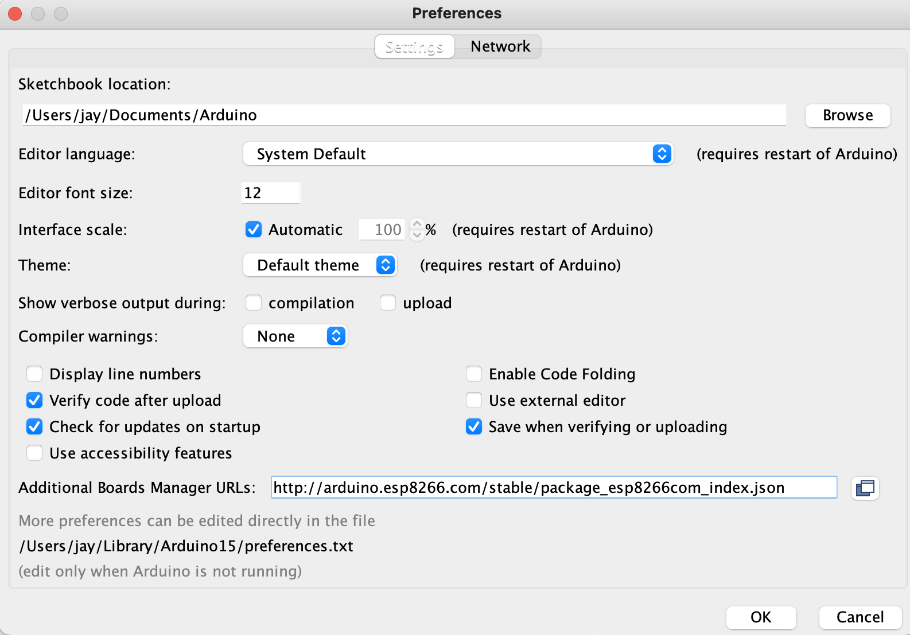

- [http://arduino.esp8266.com/stable/package_esp8266com_index.json](http://arduino.esp8266.com/stable/package_esp8266com_index.json)

Arduino IDE > Tools > Boards: > Boards Managers  

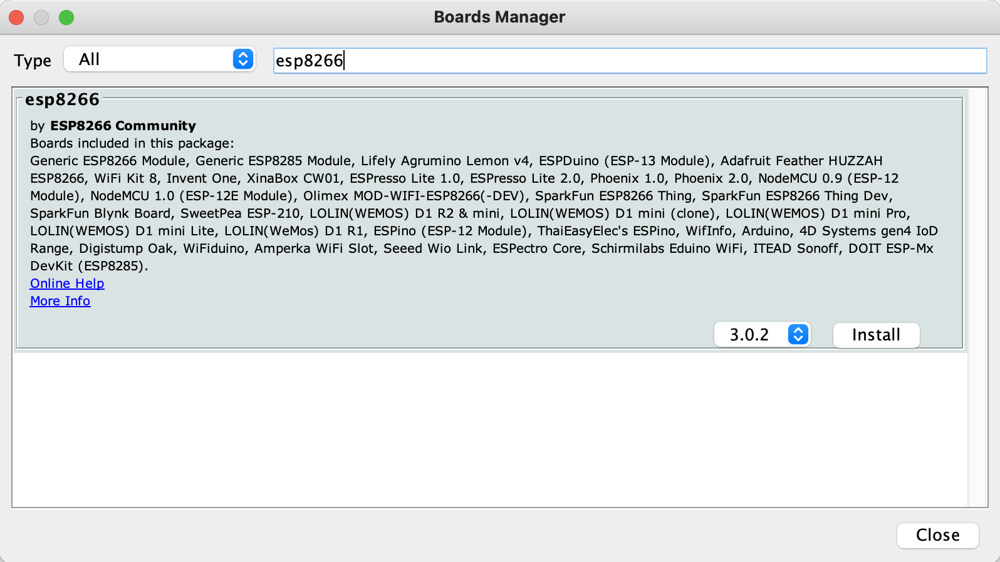

설정을 하게 되면, 다음과 같이 Tools에서 ESP8266기반의 보드를 선택 할 수 있습니다.

여기서 NodeMCU 1.0을 선택했습니다.

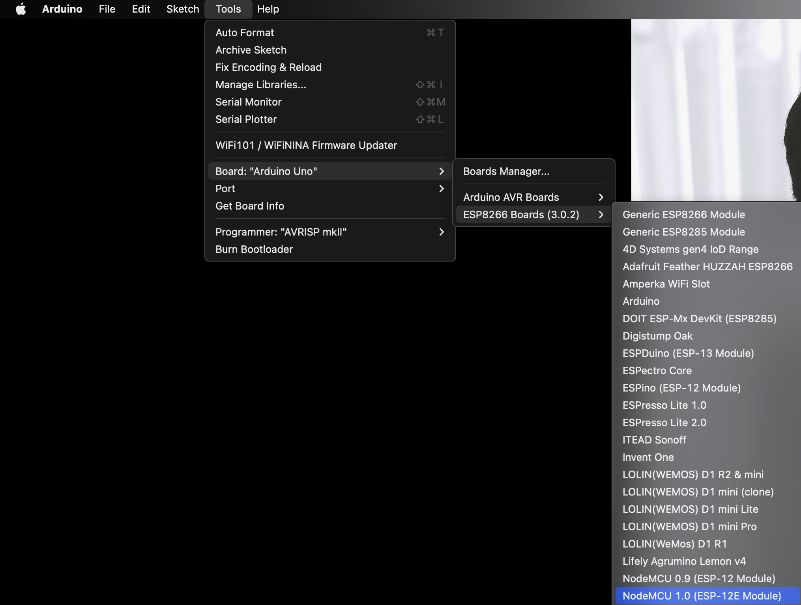

## LED Test

연동이 잘 되었는지와 가장 기초적인 실행을 위해서 LED 하나를 반복해서 켜고 끄는 일을 해보겠습니다.

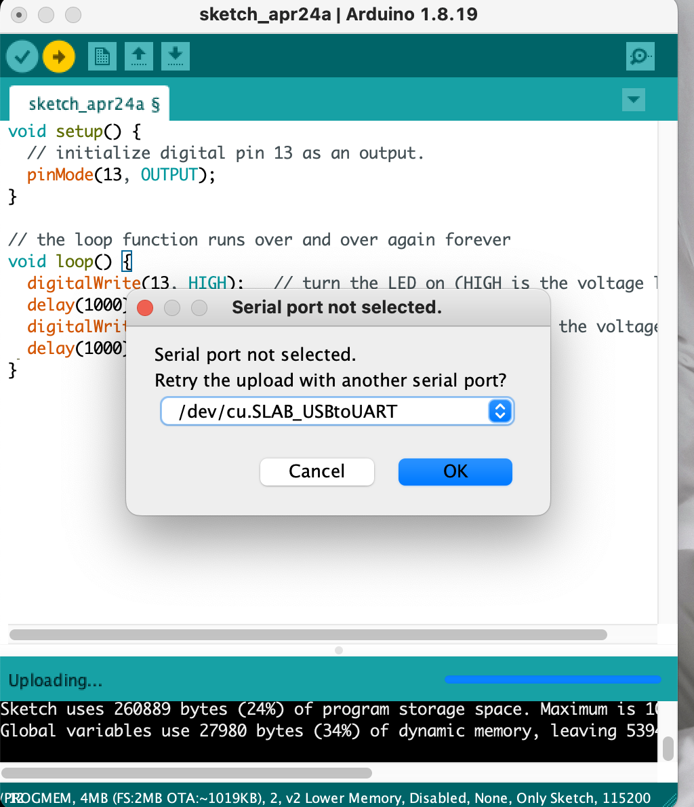

가장 기본적으로 아두이노의 보드는 C++ 문법으로 구성되어있으며, 크게 `setup()` 과 `loop()`  함수로 동작을 합니다. 

- setup : 초기화에 사용되는 함수
- loop: 반복적으로 수행 할 논리가 포함되는 함수

`D3` 포트를 통해서 LED 점등을 할 것이고, 9600 baud 를 통해서 시리얼 모니터링을 진행 할 것입니다. 시리얼 모니터링은 `Print` 되는 문자열 출력을 아두이노 IDE를 통해서 확인 할 수 있습니다. 

```cpp
void setup() {
  // initialize digital pin D3 as an output.
  pinMode(D3, OUTPUT);
  Serial.begin(9600);
}

// the loop function runs over and over again forever
void loop() {
  Serial.println("Hello LED request...");
  digitalWrite(D3, HIGH);   // turn the LED on (HIGH is the voltage level)
  delay(1000);              // wait for a second
  digitalWrite(D3, LOW);    // turn the LED off by making the voltage LOW
  delay(1000);              // wait for a second
}
```

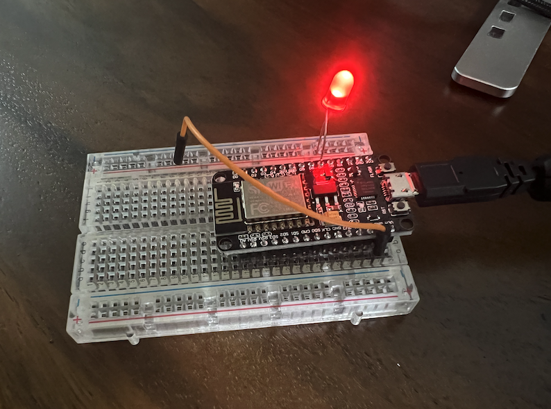

Tool의 시리얼 모니터

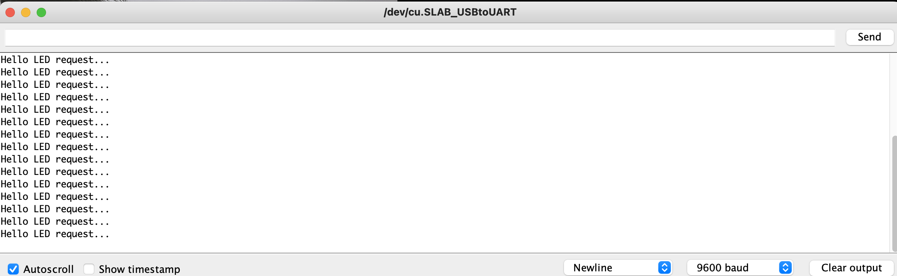

---

# I2C LCD 연동

불빛으로 숫자값을 표현 할 수는 있지만, 2진수로 표현을 할 수 밖에 없습니다. 불빛이 켜지면 1, 아니면 0. 

표현 할 정보의 범위도 제한되고, 사람이 읽기도 만만치 않습니다. 보드에서 데이터를 서버로 전송해서 어플리케이션 화면으로 출력하는 방법도 있습니다. 다만 데이터 파이프라인의 각 노드 중 하나의 구간이라고 고장이나면 무엇이 문제인지, 현재 데이터는 어떤지 알 수 없습니다.

따라서, OLED 기반의 작은 화면을 통해서 수집된 CO2 농도를 바로 볼 수 있도록 구성을 했습니다. 

SSD1306Wire 라이브러리를 사용해서 화면구성을 했습니다. 그 과정은 아래와 같습니다.

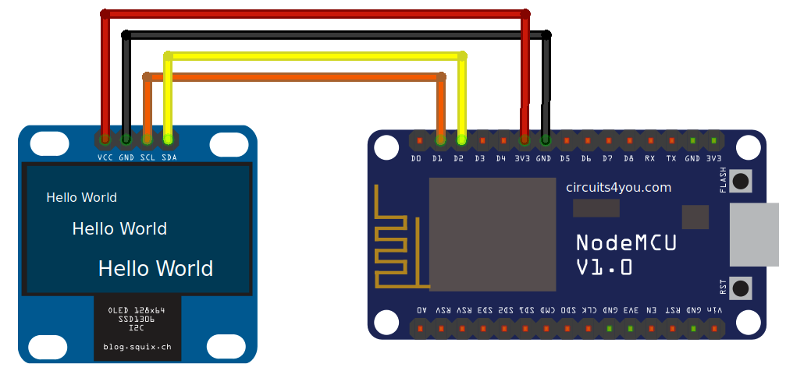

- SSD 1306 IC 사용
- [https://circuits4you.com/2019/01/09/nodemcu-esp8266-oled-display-code-example/](https://circuits4you.com/2019/01/09/nodemcu-esp8266-oled-display-code-example/)

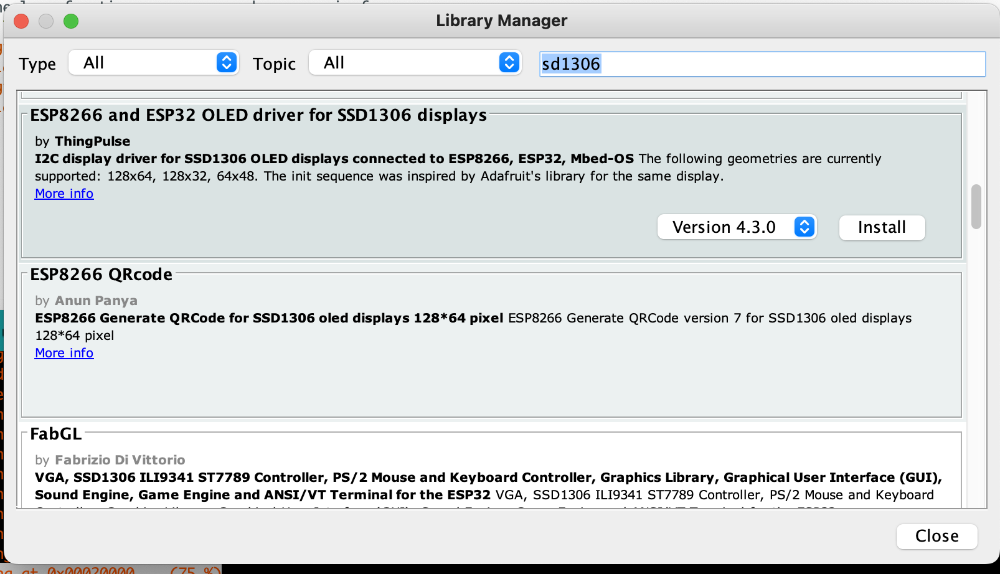

```cpp
/*
 * ESP8266 NodeMCU Oled Display Code Example * 
 */

#include <ESP8266WiFi.h>
#include <Wire.h>  // Only needed for Arduino 1.6.5 and earlier
#include "SSD1306Wire.h" // legacy include: `#include "SSD1306.h"`

// Initialize the OLED display using Wire library
SSD1306Wire  display(0x3c, D2, D1);  //D2=SDK  D1=SCK  As per labeling on NodeMCU

//=======================================================================
//                    Power on setup
//=======================================================================

void setup() {
  delay(1000);
  Serial.begin(115200);  
  Serial.println("");
  
  Serial.println("Initializing OLED Display");
  display.init();

  display.flipScreenVertically();
  display.setFont(ArialMT_Plain_10);
}

//=======================================================================
//                    Main Program Loop
//=======================================================================
void loop() {
  drawFontFaceDemo();
  delay(1000);
}
//=========================================================================

void drawFontFaceDemo() {
  // clear the display
  display.clear();
    // Font Demo1
    // create more fonts at http://oleddisplay.squix.ch/
    display.setTextAlignment(TEXT_ALIGN_LEFT);
    display.setFont(ArialMT_Plain_10);
    display.drawString(0, 0, "Monday 9pm");
    display.setFont(ArialMT_Plain_16);
    display.drawString(0, 10, "Monday 9pm");
    display.setFont(ArialMT_Plain_24);
    display.drawString(0, 26, "Monday 9pm");
  // write the buffer to the display
  display.display();
}

  // write the buffer to the display
  display.display();
}
```

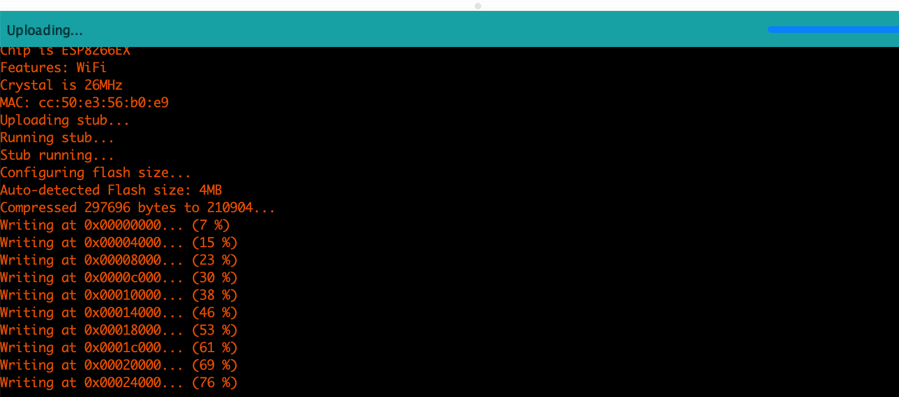

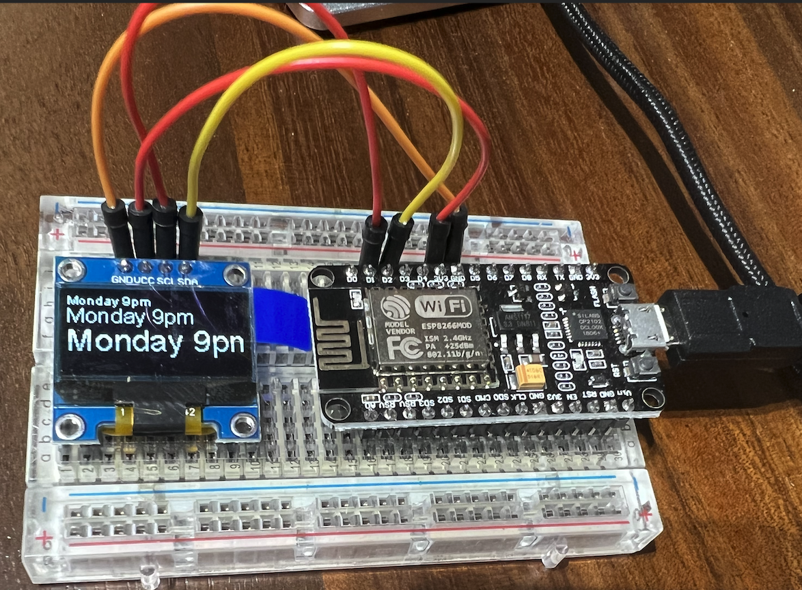

---

# MH-Z19B CO2

CO2 측정 센서의 추가는 연결부터 만만치 않았습니다. 아래와 같이 인터페이스는 구성이 되어있고, 이를 연결하면 되는 구조입니다.

- [https://robertwisbey.com/carbon-dioxide-levels-using-the-mh-z19b-sensor/](https://robertwisbey.com/carbon-dioxide-levels-using-the-mh-z19b-sensor/)

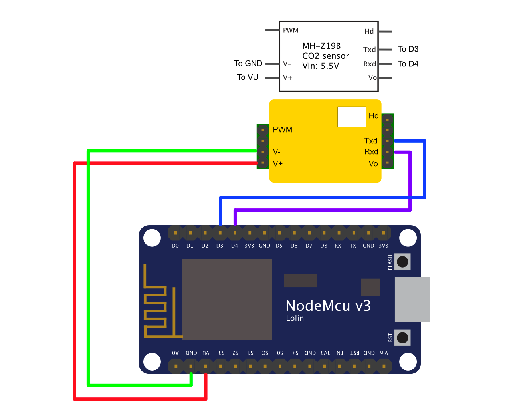

다만, 각 센서의 포트에 맞춰서 납땜이 필요한 구조 였습니다. (어쩌지.. 납땜 못하는데..)

하지만, 저는 납땜을 해본적이 초등학교때 이후로 없습니다. 그래서 고민중.. 제가 산 모듈이 커넥터타입이었다는 것을 알게 됩니다. 다행이 중국센서라도 시방서(?).. 사양서가 있었고, 핀구조는 아래와 같았습니다.

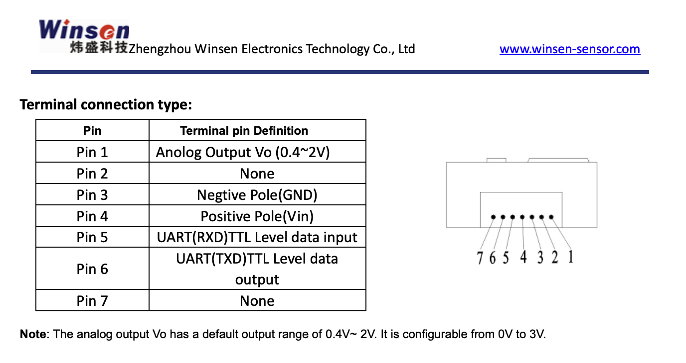

- [https://www.winsen-sensor.com/d/files/MH-Z19B.pdf](https://www.winsen-sensor.com/d/files/MH-Z19B.pdf)

그런데, 저는 브레드보드에 점퍼케이블을 연결해야하는데 커넥터타입의 구멍이 너무 작습니다.

그래서 만들기로 합니다.

우선은 실험이니, 손으로 뚝딱 만듭니다. 이렇게 동봉된 커넥터 케이블을 잘라서.

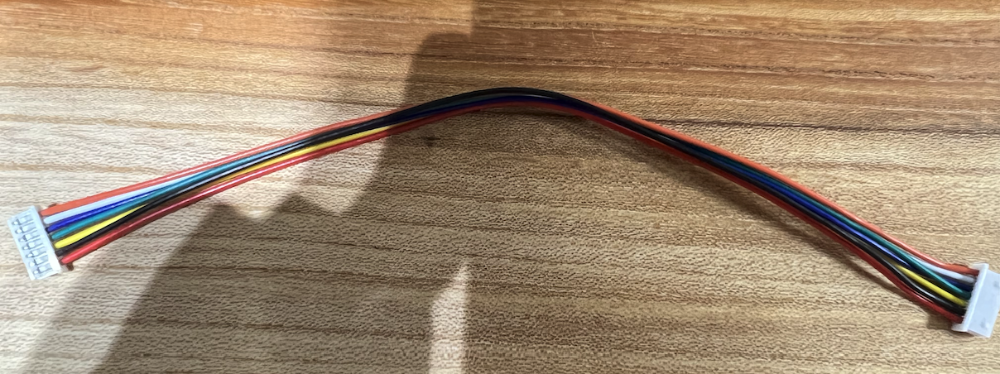

자르고, 점퍼케이블과 연결합니다.

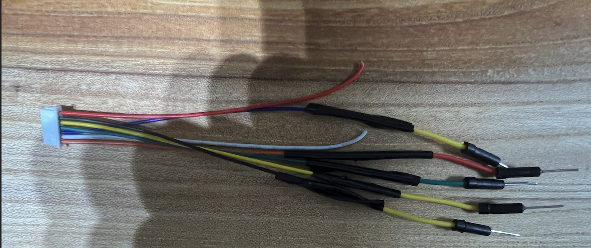

그리고 아래와 같이, 코딩해준다. 시리얼은 19200 baud를 사용하도록 합니다.

데이터는 D5에는 TXD가, D6에는 RXD가 연결되게 했습니다.

각 시리얼로 들어오는 데이터 채널과 각 바이트는 아래의 spec에 따라서 구현합니다.

Sending command의 Byte 값에 따라서, 5가지 기능을 사용 할 수 있습니다. 이중에서 우리는 0x86 Read CO2 concentration을 사용 할 것이다.

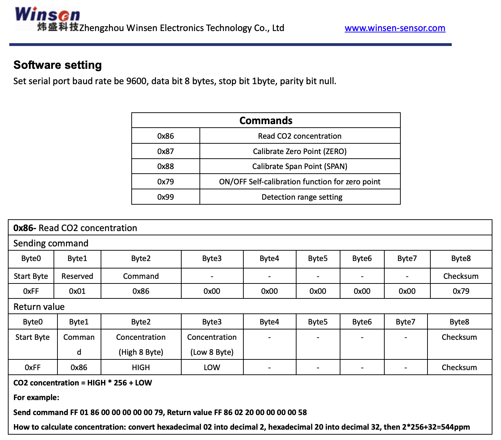

필요한 baud rate는 9600 이어야 하고, 데이터 bit는 8byte로 들어온다고 합니다.

CO2 값은 결과 값 HIGH * 256 + LOW 값으로 계산하면 된다고 합니다.

```cpp
#include <ESP8266WiFi.h>
#include <SoftwareSerial.h>
SoftwareSerial co2Serial(D6, D5); // define MH-Z19 RX -> D6 (GPIO2), TX D5-> (GPIO0) 
unsigned long startTime = millis();

void setup() {
  Serial.begin(19200);
  co2Serial.begin(9600);
  Serial.println("---------Monday 9pm Groups----------");

}

void loop() {
  Serial.println("------------------------------");
  Serial.print("Time from start: ");
  Serial.print((millis() - startTime) / 1000);
  Serial.println(" s");
  int ppm_uart = readCO2UART();  
  delay(10000);
}

int readCO2UART() {
  byte cmd[9] = {0xFF, 0x01, 0x86, 0x00, 0x00, 0x00, 0x00, 0x00, 0x79};
  char response[9];
  Serial.println("Sending CO2 request...");
  co2Serial.write(cmd, 9); //request PPM CO2
  
  // clear the buffer
  memset(response, 0, 9);
  int i = 0;
  while (co2Serial.available() == 0) {
    Serial.print("Waiting for response ");
    Serial.print(i);
    Serial.println(" s");
    delay(1000);
    i++;
  }
  if (co2Serial.available() > 0) {
    co2Serial.readBytes(response, 9);
  
  }
  // print out the response in hexa
  for (int i = 0; i < 9; i++) {
    Serial.print(String(response[i], HEX));
    Serial.print("   ");
  }
  Serial.println("");
  // checksum
  byte check = getCheckSum(response);
  if (response[8] != check) {
    Serial.println("Checksum not OK!");
    Serial.print("Received: ");
    Serial.println(response[8]);
    Serial.print("Should be: ");
    Serial.println(check);
  }
  // ppm
  int ppm_uart = 256 * (int)response[2] + response[3];
  Serial.print("UART CO2 PPM: ");
  Serial.println(ppm_uart);
  // temp
  byte temp = response[4] - 40;
  Serial.print("Sensor Temperature: ");
  Serial.println(temp);
  // status
  byte status = response[5];
  Serial.print("Status: ");
  Serial.println(status);
  if (status == 0x40) {
    Serial.println("Status OK");
  }
  
  return ppm_uart;
}
byte getCheckSum(char *packet) {
  byte i;
  unsigned char checksum = 0;
  for (i = 1; i < 8; i++) {
    checksum += packet[i];
  }
  checksum = 0xff - checksum;
  checksum += 1;
  return checksum;
}
```

- 장착후 사진

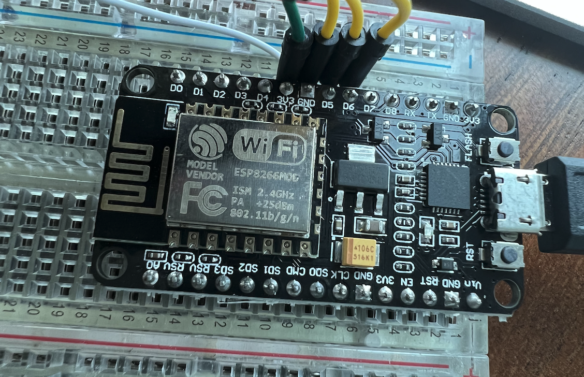

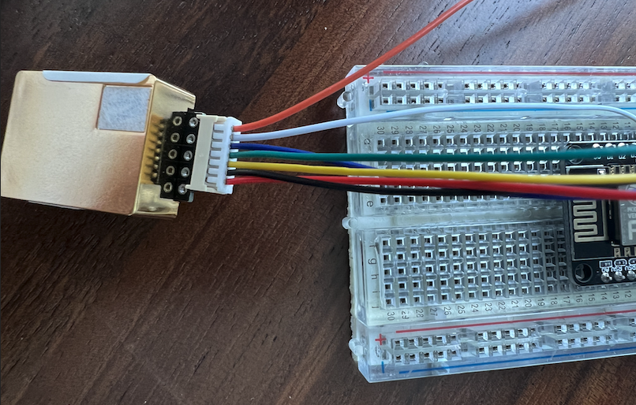

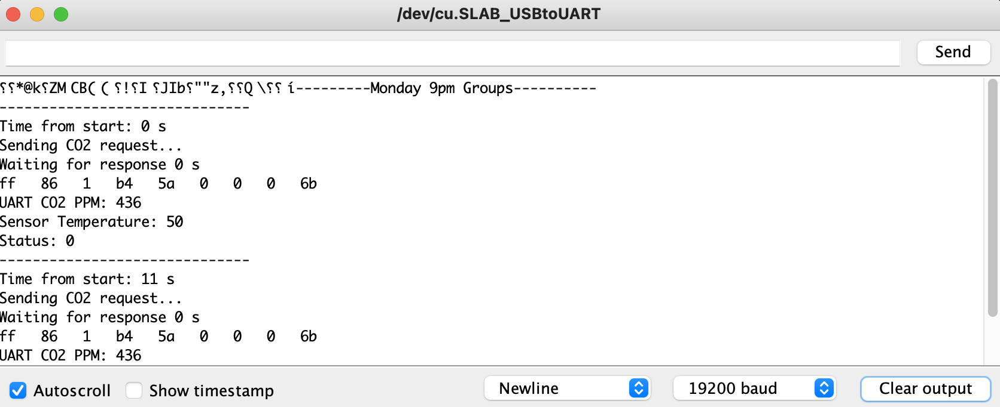

얼추 비슷하다.

- [http://www.climate.go.kr/home/09_monitoring/ghg/co2_global_trend](http://www.climate.go.kr/home/09_monitoring/ghg/co2_global_trend)

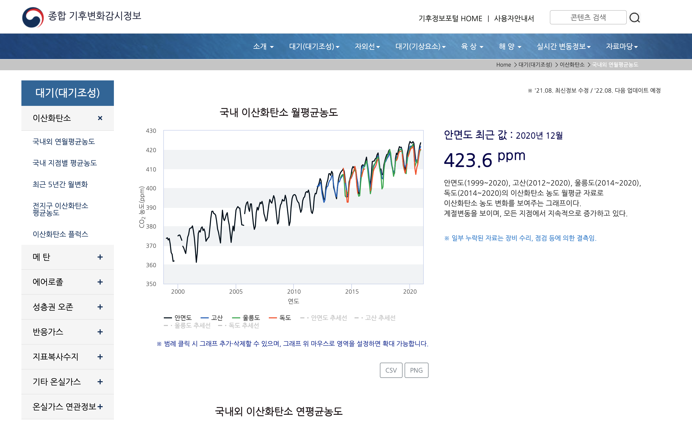

구입 한 센서의 범위는 아래와 같다

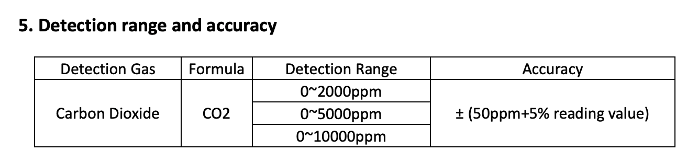

실패 시

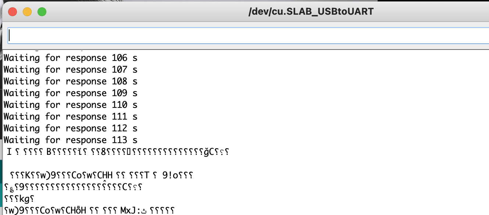

전압에 문제가 생기면 데이터가 튀기도 한다.

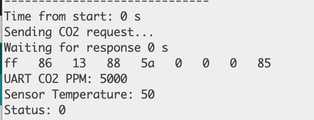

---

# Data Display

OLED를 통해서 측정된 데이터를 표기하려고 합니다. 위 과정에서 진행한 것을 적절히 섞어주면 됩니다.

`void drawOled(int* requests)` 함수를 통해서 요청된 데이터 배열을 처리합니다. 너무 오랜만에 포인터를 만나서 반갑네요. ㅎㅎ

```cpp
#include <ESP8266WiFi.h>
#include <SoftwareSerial.h>
#include "SSD1306Wire.h" // legacy include: `#include "SSD1306.h"`

SoftwareSerial co2Serial(D6, D5); // define MH-Z19 RX -> D6 (GPIO2), TX D5-> (GPIO0) 
unsigned long startTime = millis();

SSD1306Wire  display(0x3c, D2, D1);  //D2=SDK  D1=SCK  As per labeling on NodeMCU

void setup() {
  delay(1000);
  Serial.begin(19200);
  co2Serial.begin(9600);
  
  Serial.println("Initializing OLED Display");
  display.init();
  display.flipScreenVertically();
  display.setFont(ArialMT_Plain_10);
  
  Serial.println("-------------Monday 9pm Groups----------");

}

void loop() {
  int requests[2];
  requests[0] = (millis() - startTime) / 1000;
  
  Serial.println("------------------------------");
  Serial.print("Time from start: ");
  Serial.print(requests[0]);
  Serial.println(" s");
  
  requests[1] = readCO2UART();
  drawOled(requests);  
  delay(5000);
}

int readCO2UART() {
  byte cmd[9] = {0xFF, 0x01, 0x86, 0x00, 0x00, 0x00, 0x00, 0x00, 0x79};
  char response[9];
  Serial.println("Sending CO2 request...");
  co2Serial.write(cmd, 9); //request PPM CO2
  
  // clear the buffer
  memset(response, 0, 9);
  int i = 0;
  while (co2Serial.available() == 0) {
  
       Serial.print("Waiting for response ");
       Serial.print(i);
       Serial.println(" s");
    delay(1000);
    i++;
  }
  if (co2Serial.available() > 0) {
    co2Serial.readBytes(response, 9);
  
  }
  // print out the response in hexa
  for (int i = 0; i < 9; i++) {
    Serial.print(String(response[i], HEX));
    Serial.print("   ");
  }
  Serial.println("");
  // checksum
  byte check = getCheckSum(response);
  if (response[8] != check) {
    Serial.println("Checksum not OK!");
    Serial.print("Received: ");
    Serial.println(response[8]);
    Serial.print("Should be: ");
    Serial.println(check);
  }
  // ppm
  int ppm_uart = 256 * (int)response[2] + response[3];
  Serial.print("UART CO2 PPM: ");
  Serial.println(ppm_uart);
  // temp
  byte temp = response[4] - 40;
  Serial.print("Sensor Temperature: ");
  Serial.println(temp);
  // status
  byte status = response[5];
  Serial.print("Status: ");
  Serial.println(status);
  if (status == 0x40) {
    Serial.println("Status OK");
  }
  
  return ppm_uart;
}

byte getCheckSum(char *packet) {
  byte i;
  unsigned char checksum = 0;
  for (i = 1; i < 8; i++) {
    checksum += packet[i];
  }
  checksum = 0xff - checksum;
  checksum += 1;
  return checksum;
}

void drawOled(int* requests) {
  display.clear();
  display.setTextAlignment(TEXT_ALIGN_LEFT);
  display.setFont(ArialMT_Plain_10);
  display.drawString(0, 0, "Air Checker");
  display.setFont(ArialMT_Plain_16);
  display.drawString(0, 10, "Time: " + String(requests[0]) + "s");
  display.setFont(ArialMT_Plain_16);
  display.drawString(0, 26, "CO2: " + String(requests[1]) + "PPM");
  display.display();
}
```


---

# Prometheus & Grafana 로 시각화 환경 구축

- https://github.com/vegasbrianc/prometheus

Docker-Compose로 기존에 구축된 프로젝트를 통해서 너무나도 쉽게 설치 가능합니다.

사실 이번 프로젝트에서 필요한 컨테이너는 grafana, prometheus가 전부입니다. 나머지는 컨테이너의 환경정보 운영을 위한 기본 셋 구성입니다. 본 글에서는 Docker-compose 구성을 직접하기 귀찮아서, 사용을 한 것이라 추후 직접 운영시 상황에 맞춰서 제거합니다.

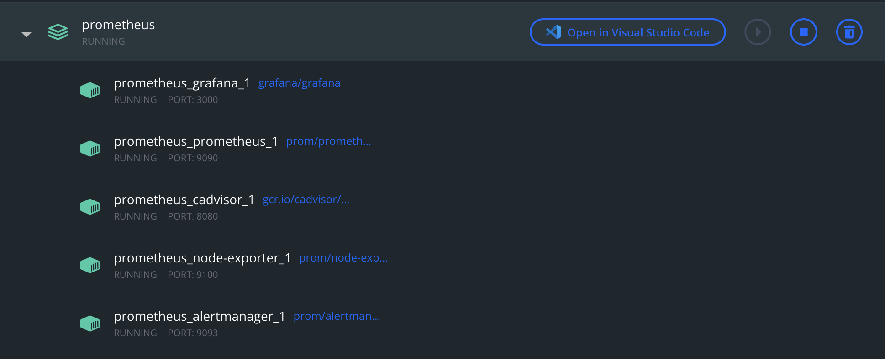

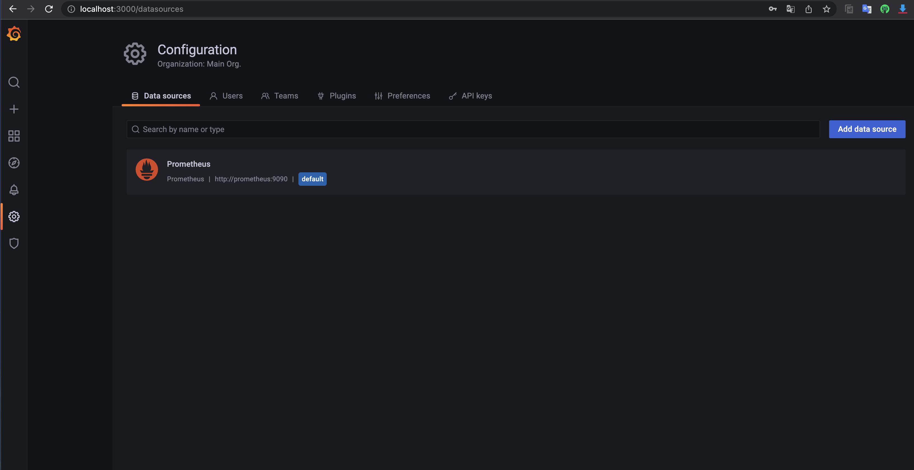

프로메테우스가 호출 할 중계서버 구축이 필요하다.

---

# 중계서버 구축

구축서버는 만들었던 NodeMCU 서버가 데이터를 설정한 속도에 맞춰서 업데이트 하고, 정보를 Prometheus가 일정 주기로 수집해 가는 구조입니다.

Node.js를 이용해서 간단한 구축서버를 만들어보았습니다. 다른 언어의 프레임워크로 만들어도 됩니다. 저는 NodeMCU라서 이름이 비슷한 Node.js를 쓰고 싶었어요.

Prom-Client를 이용할 겁니다.

- https://github.com/siimon/prom-client

```cpp
{
  "name": "iot-relay",
  "version": "0.0.0",
  "private": true,
  "scripts": {
    "start": "node ./bin/www"
  },
  "dependencies": {
    "cookie-parser": "~1.4.4",
    "debug": "~2.6.9",
    "express": "~4.16.1",
    "morgan": "~1.9.1",
    "prom-client": "^14.0.1"
  }
}
```

```cpp
const app = express();
const client = require('prom-client');
const collectDefaultMetrics = client.collectDefaultMetrics;

collectDefaultMetrics();

app.use(logger('dev'));
app.use(express.json());
app.use(express.urlencoded({ extended: false }));
app.use(cookieParser());
app.use(express.static(path.join(__dirname, 'public')));

app.use('/', indexRouter);
```

```cpp
const express = require('express');
const router = express.Router();
const { collectDefaultMetrics, register } = require('prom-client');

/* GET home page. */
router.get('/', function(req, res, next) {
  res.render('index', { title: 'Express' });
});

router.get('/metrics', async (req, res, next) => {
  const result = await register.metrics();
  res.send(result);
});
```

Node.js의 메트릭 데이터가 잘 나오네요.

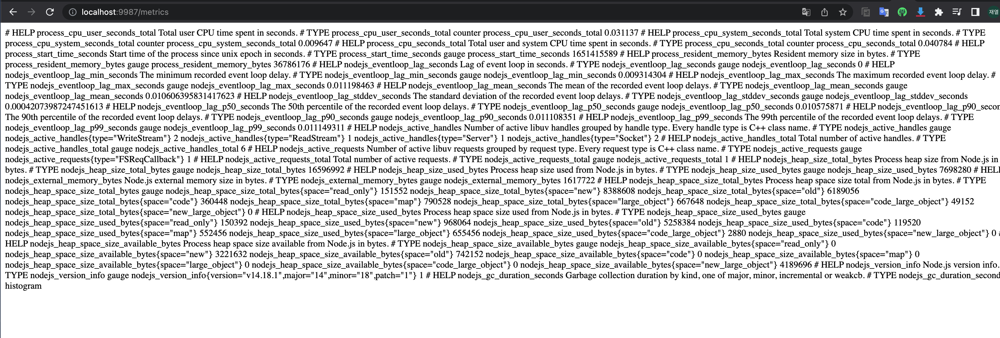

```cpp
const express = require('express');
const router = express.Router();

const {Gauge, register} = require('prom-client');
const gauge = new Gauge({ name: 'CO2', help: 'CO2 metrics' });
let beforeCo2 = 0; // TODO : Use the Queue

router.get('/co2s/uploads', (req, res, next) => {
  const ppm = parseInt(req.query?.ppm ?? beforeCo2);

  if(beforeCo2 < ppm){
    gauge.inc(ppm);
  } else {
    gauge.dec(ppm);
  }
  console.log('ppm :' + ppm + " " + new Date());
  res.send('upload is done');
});

router.get('/co2s/metrics', async (req, res, next) => {
  const result = await register.getSingleMetricAsString('CO2'); // TODO: Use the Queue
  res.send(result);
});

module.exports = router;
```

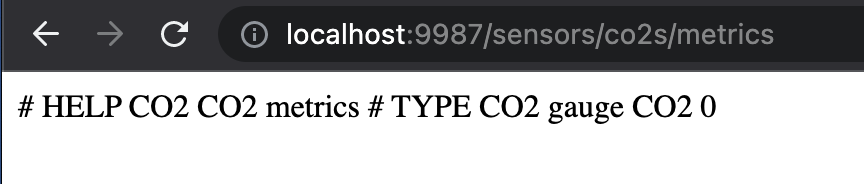

- [http://localhost:9987/sensors/co2s/uploads?ppm=2000](http://localhost:9987/sensors/co2s/uploads?ppm=1000)

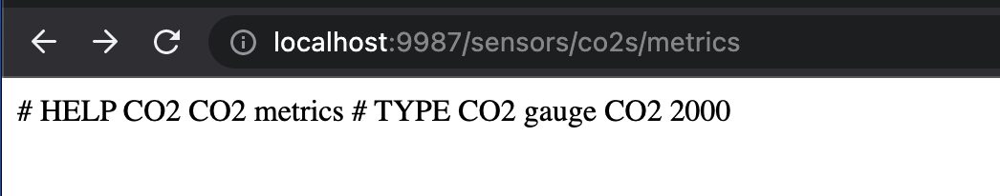

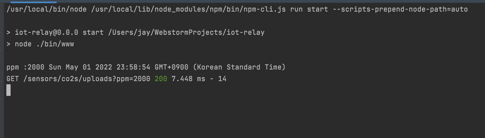

---

# 도커라이징 및 연동

- [https://nodejs.org/ko/docs/guides/nodejs-docker-webapp/](https://nodejs.org/ko/docs/guides/nodejs-docker-webapp/)

```cpp
FROM node:14.16.0-slim

WORKDIR /app
COPY package*.json ./
RUN npm install --silent
COPY . .

EXPOSE 9987

CMD ["npm", "start"]
```

- docker build . -t jay/iots

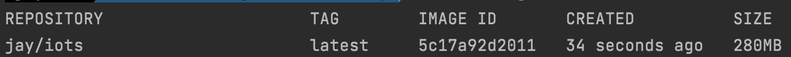

### Prometheus.yml 추가

5초 주기로 CO2 데이터를 수집합니다. 

- `host.docker.internal:9987` 로 연결하여 컨테이너로 중계서버를 만들지 않아도 괜찮습니다.

```cpp
scrape_configs:
  # The job name is added as a label `job=<job_name>` to any timeseries scraped from this config.
  - job_name: "iot-nodejs-app"
    metrics_path: 'metrics'
    scrape_interval: 5s
    static_configs:
      - targets: ['iots:9987']
```

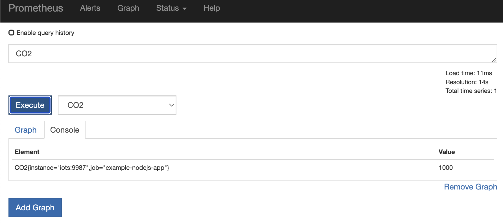

완성된 DockerCompose를 위한 설정은 아래와 같아요.

```yaml
version: '3.7'

volumes:
    prometheus_data: {}
    grafana_data: {}

networks:
  front-tier:
  back-tier:

services:

  prometheus:
    image: prom/prometheus:v2.1.0
    volumes:
      - ./prometheus/:/etc/prometheus/
      - prometheus_data:/prometheus
    command:
      - '--config.file=/etc/prometheus/prometheus.yml'
      - '--storage.tsdb.path=/prometheus'
      - '--web.console.libraries=/usr/share/prometheus/console_libraries'
      - '--web.console.templates=/usr/share/prometheus/consoles'
    ports:
      - 9090:9090
    links:
      - iots

    networks:
      - back-tier
    restart: always
#    deploy:
#      placement:
#        constraints:
#          - node.hostname == ${HOSTNAME}

grafana:
    image: grafana/grafana:8.5.1
    user: "472"
    depends_on:
      - prometheus
    ports:
      - 3000:3000
    volumes:
      - grafana_data:/var/lib/grafana
      - ./grafana/provisioning/:/etc/grafana/provisioning/
    env_file:
      - ./grafana/config.monitoring
    networks:
      - back-tier
      - front-tier
    restart: always

  iots:
    image: jay/iots
    restart: always
    networks:
      - back-tier
      - front-tier
    ports:
      - 9987:9987
```

## 데이터 확인 및 시각화

프로메테우스도 Graph를 지원한다.

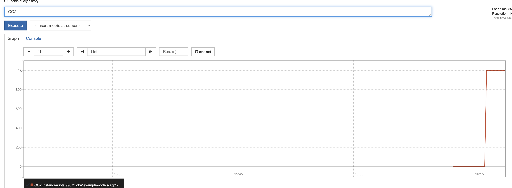

Graphana를 통한 시각화

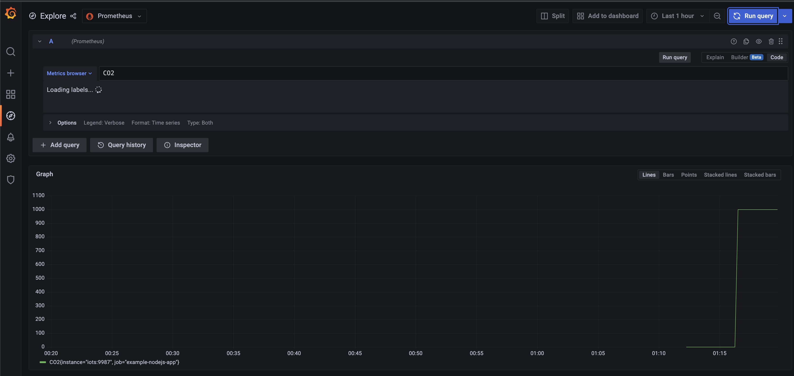

---

# Iot 센서와 Graphana 연동

이제 시각화를 위한 중계서버와 모니터링 서버의 구성이 완료되었습니다.

기존에 작업했던 CO2측정 서버에 Wifi와 HTTP 관련 라이브러리를 추가해주고, API 전송을 위한 함수를 만들어봅니다.

```cpp
#include <ESP8266WiFi.h>
#include <ESP8266HTTPClient.h>
#include <WiFiClient.h>
#include <SoftwareSerial.h>
#include "SSD1306Wire.h" // legacy include: `#include "SSD1306.h"`

SoftwareSerial co2Serial(D6, D5); // define MH-Z19 RX -> D6 (GPIO2), TX D5-> (GPIO0) 
unsigned long startTime = millis();

SSD1306Wire  display(0x3c, D2, D1);  //D2=SDK  D1=SCK  As per labeling on NodeMCU

const char* ssid     = "yours";         // The SSID (name) of the Wi-Fi network you want to connect to
const char* password = "yours";     // The password of the Wi-Fi network

String serverName = "http://yours id or domain:9987"; //Your Domain name with URL path or IP address with path

void setup() {
  delay(1000);
  Serial.begin(19200);
  co2Serial.begin(9600);
  WiFi.begin(ssid, password);             // Connect to the network
  
  while(WiFi.status() != WL_CONNECTED) {
    delay(1000);
    Serial.print(".");
  }
  
  Serial.println('\n');
  Serial.println("Connection established!");  
  Serial.print("IP address:\t");
  Serial.println(WiFi.localIP());         // Send the IP address of the ESP8266 to the computer
  
  Serial.println("Initializing OLED Display");
  display.init();
  display.flipScreenVertically();
  display.setFont(ArialMT_Plain_10);
  
  Serial.println("-------------Monday 9pm Groups----------");

}

void loop() {
  int requests[2];
  requests[0] = (millis() - startTime) / 1000;
  
  Serial.println("------------------------------");
  Serial.print("Time from start: ");
  Serial.print(requests[0]);
  Serial.println(" s");
  
  requests[1] = readCO2UART();
  drawOled(requests);
  updateMetric(requests);  
  delay(5000);
}

int readCO2UART() {
  byte cmd[9] = {0xFF, 0x01, 0x86, 0x00, 0x00, 0x00, 0x00, 0x00, 0x79};
  char response[9];
  Serial.println("Sending CO2 request...");
  co2Serial.write(cmd, 9); //request PPM CO2
  
  // clear the buffer
  memset(response, 0, 9);
  int i = 0;
  while (co2Serial.available() == 0) {
  
       Serial.print("Waiting for response ");
       Serial.print(i);
       Serial.println(" s");
    delay(1000);
    i++;
  }
  if (co2Serial.available() > 0) {
    co2Serial.readBytes(response, 9);
  
  }
  // print out the response in hexa
  for (int i = 0; i < 9; i++) {
    Serial.print(String(response[i], HEX));
    Serial.print("   ");
  }
  Serial.println("");
  // checksum
  byte check = getCheckSum(response);
  if (response[8] != check) {
    Serial.println("Checksum not OK!");
    Serial.print("Received: ");
    Serial.println(response[8]);
    Serial.print("Should be: ");
    Serial.println(check);
  }
  // ppm
  int ppm_uart = 256 * (int)response[2] + response[3];
  Serial.print("UART CO2 PPM: ");
  Serial.println(ppm_uart);
  // temp
  byte temp = response[4] - 40;
  Serial.print("Sensor Temperature: ");
  Serial.println(temp);
  // status
  byte status = response[5];
  Serial.print("Status: ");
  Serial.println(status);
  if (status == 0x40) {
    Serial.println("Status OK");
  }
  
  return ppm_uart;
}

byte getCheckSum(char *packet) {
  byte i;
  unsigned char checksum = 0;
  for (i = 1; i < 8; i++) {
    checksum += packet[i];
  }
  checksum = 0xff - checksum;
  checksum += 1;
  return checksum;
}

void drawOled(int* requests) {
  display.clear();
  display.setTextAlignment(TEXT_ALIGN_LEFT);
  display.setFont(ArialMT_Plain_10);
  display.drawString(0, 0, "Air Checker");
  display.setFont(ArialMT_Plain_16);
  display.drawString(0, 10, "Time: " + String(requests[0]) + "s");
  display.setFont(ArialMT_Plain_16);
  display.drawString(0, 26, "CO2: " + String(requests[1]) + "PPM");
  display.display();
}

void updateMetric(int* requests) {
  if(WiFi.status()== WL_CONNECTED){
    WiFiClient client;
    HTTPClient http;
    
    String serverPath = serverName + "/sensors/co2s/uploads?ppm="+ String(requests[1]);
    Serial.println("serverPath : " + serverPath); 
      // Your Domain name with URL path or IP address with path
      http.begin(client, serverPath.c_str());
      
      // Send HTTP GET request
      int httpResponseCode = http.GET();
      
      if (httpResponseCode>0) {
        Serial.print("HTTP Response code: ");
        Serial.println(httpResponseCode);
        String payload = http.getString();
        Serial.println(payload);
      }
      else {
        Serial.print("Error code: ");
        Serial.println(httpResponseCode);
      }
      // Free resources
      http.end();
    }
}
```

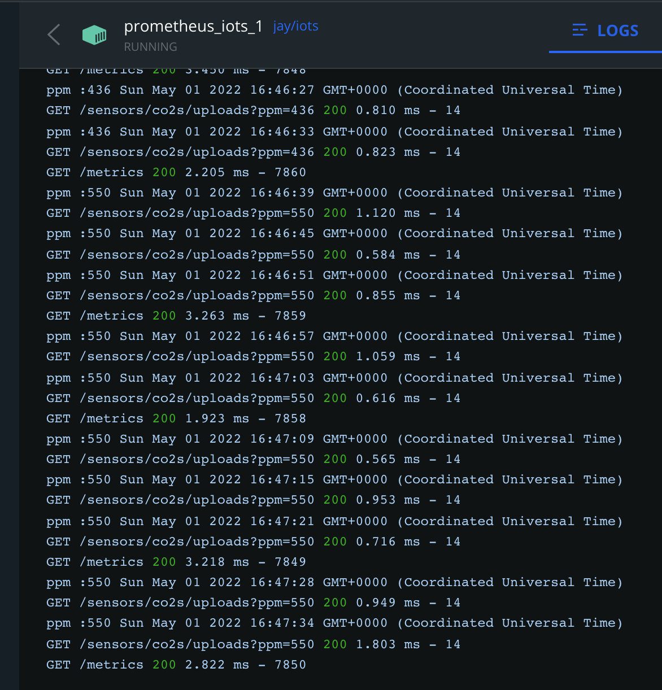

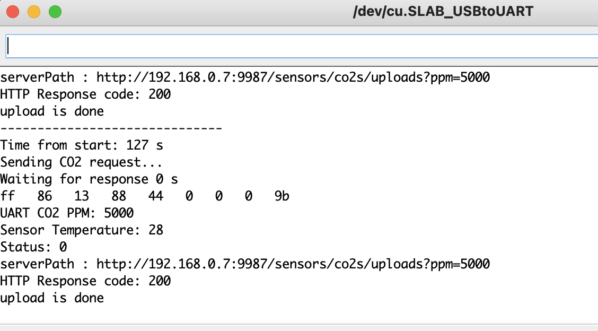

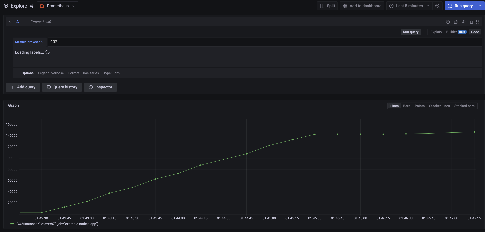

이후, 적절한 값에 맞춰서 Graphna의 Alert Channel 을 이용하면 됩니다.

- [https://grafana.com/docs/grafana/latest/alerting](https://grafana.com/docs/grafana/latest/alerting/)

Slack 채널을 등록하고, 원하는 기준치를 설정해서 알림을 받으면 되죠.

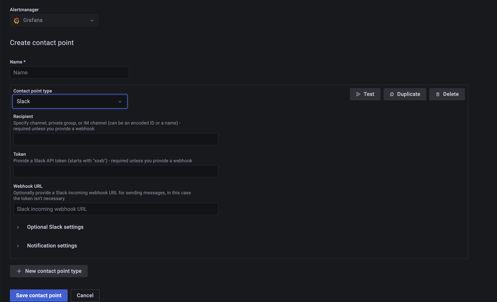

---

# 기타

시각화와 중계서버의 구축이 귀찮으면, ThingSpeak와 같은 클라우드 서비스를 이용하는 방법도 있습니다.

- [https://thingspeak.com/](https://thingspeak.com/)

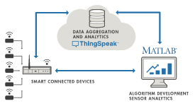

---

- https://github.com/adafruit/Adafruit_SSD1306
- [https://blog.daum.net/rockjjy99/2605](https://blog.daum.net/rockjjy99/2605)
- [http://www.ohmye.co.kr/product/detail.html?product_no=25091&cate_no=843&display_group=1](http://www.ohmye.co.kr/product/detail.html?product_no=25091&cate_no=843&display_group=1)
- [https://www.instructables.com/I2C-LCD-on-NodeMCU-V2-With-Arduino-IDE/](https://www.instructables.com/I2C-LCD-on-NodeMCU-V2-With-Arduino-IDE/)
- [https://forum.arduino.cc/t/problem-with-co2-sensor-mh-z19b-cannot-read-values/504873/6#msg3587557](https://forum.arduino.cc/t/problem-with-co2-sensor-mh-z19b-cannot-read-values/504873/6#msg3587557)