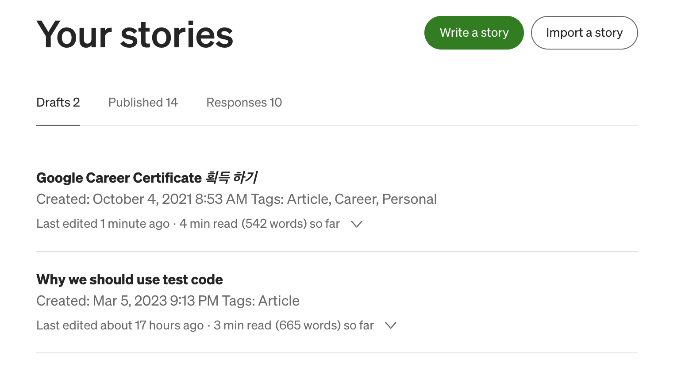

# 커뮤니티 아티클 관리 플랫폼 설계 및 구축

Created: March 5, 2023 11:14 PM
Tags: Article

커뮤니티에서 아티클은 매우 중요한 역할을 합니다. 아티클은 커뮤니티 구성원의 자신의 경험, 지식, 정보 등을 공유할 수 있는 가장 기본적인 방법 중 하나입니다. 아티클을 통해 구성원들은 자신의 생각을 자유롭게 표현하고, 다른 동료들과 의견을 교환할 수 있습니다.

](assets/Untitled.png)

[https://www.thebalancemoney.com/communication-skills-list-2063779](https://www.thebalancemoney.com/communication-skills-list-2063779)

아티클은 또한 커뮤니티 참여를 촉진하는 역할을 합니다. 아티클을 작성하면서 자신의 생각을 정리하고, 다른 구성원들과 의견을 교환하면서 더욱 높은 참여를 이끌어냅니다.

따라서, 커뮤니티에서 아티클은 매우 중요한 역할을 하며, 커뮤니티의 지식 공유와 활성화를 위해서는 사용자들이 적극적으로 아티클을 작성하고, 공유하는 것이 필요합니다.

# Monday9pm 에서의 아티클 작성의 어려움

Monday9pm에서는 미디엄(Medium)을 이용합니다. 미디엄은 글쓰기 플랫폼으로, 사용자들이 자신의 글을 작성하고 공유할 수 있는 공간입니다. 하지만, 미디엄에서의 글쓰기는 쉽지 않습니다. 여러 이유들이 있겠지만, 그 중에서도 가장 큰 어려움은 아래와 같습니다.

1. 글쓰기 도구가 한국어 편집에 어렵습니다.

미디엄에서는 글쓰기를 위한 도구가 제한적이며, 특히 한국어 편집을 위한 기능이 부족합니다. 한국어의 경우, 띄어쓰기나 초성/중성/종성 분리 등의 문제가 있어, 글쓰기 도구를 사용할 때 어려움을 겪었습니다.

1. 마크다운(Markdown)으로 작성하는 것보다 어렵습니다.

마크다운은 간단한 문법으로 글을 작성할 수 있는 포맷입니다. 하지만, 미디엄에서는 글쓰기 도구가 제한적이기 때문에, 마크다운으로 작성하는 것보다 글을 작성하고 편집하는 것이 더 어려운 경험을 했습니다.

1. 동료간의 사전 피드백을 받기 어렵습니다.

미디엄에서는 글쓰기에 대한 동료간의 사전 피드백을 받기 어려울 수 있습니다. Draft 상태인 경우 동료의 의견을 남기는 기능을 지원하지 않아서 별도의 의견을 주고받는 일을 하기 어려웠습니다.

이러한 어려움 때문에, 미디엄에서 글쓰기는 쉽지 않습니다. 하지만, 커뮤니티 구성원들은 미디엄의 장점을 살리면서도, 자신의 글을 공유하기 위해 노력했습니다. 예를 들어, 한국어 편집을 보완하기 위해 노션등의 외부 툴을 사용하고, 다른 사용자들과 교류하며 사전 피드백을 받기 위해 슬랙 등의 별도 채널을 통해서 의사소통하는 노력을 했었지요.

# Hermes Poster : 커뮤니티 아티클 관리 플랫폼

> [https://github.com/monday9pm/Hermes-Poster](https://github.com/monday9pm/Hermes-Poster)
> 

헤르메스 - 그리스 신화에서 전령의 역할을 하는 신

저는 커뮤니티를 더 활성화시키기 위해, 우리가 현재 겪고 있는 문제를 해결하고자 했습니다. 그래서 Hermes Poster 프로젝트를 짧은 기간 내에 계획하고 실행했습니다. 이 프로젝트는 지식 공유와 활성화를 위한 것이었고, 이를 오픈소스 프로젝트로 진행하면서 지속적인 발전을 위한 기반을 마련하고자 했습니다.

Hermes Poster는 그리스 신화에서 영감을 받은 프로젝트로, 지식 공유와 활성화를 위한 플랫폼입니다. 이름은 헤르메스(Hermes)에서 따왔으며, 헤르메스가 신들과 인간들 사이에 정보와 메시지를 전달하는 역할을 담당했다는 이야기를 바탕으로 지식의 전달과 공유를 상징합니다. Hermes Poster는 오픈소스 프로젝트로, 지속적인 발전을 위한 기반을 마련하고 있습니다.

## 기술스택

- Node.js, NPM, Git, GitHub, GitHub Action 등

Hermes Poster는 Node.js를 기반으로 제작되었습니다. 프로젝트의 소스 코드는 패키지로 묶어서 NPM으로 배포됩니다.

Hermes Poster를 사용하는 프로젝트에서는 Node.js와 NPM을 설치한 후, NPM을 이용해 Hermes Poster 패키지를 내려받아서 구동하면 됩니다. 또한, CVS, CI/CD와 같은 기능을 위해 별도의 환경이 필요합니다. Monday9pm은 Articles 프로젝트에서 Git, GitHub, GitHub Action 등을 이용하여 이러한 기능들을 운영하고 있습니다.

> [https://github.com/monday9pm/Articles](https://github.com/monday9pm/Articles)
> 

Monday9pm - 커뮤니티 아티클 관리 플랫폼 설계 (Hermes-Poster & Articles)

## Managers of Hermes Poster

### Delivery Manager

Delivery Manager는 API를 이용하여, 리뷰가 완료된 게시글을 미디엄 등의 다른 플랫폼으로 전송 요청을 하는 목적의 컴포넌트입니다. 이러한 기능을 수행하기 위해 Medium Manager 등 다양한 컴포넌트들과 조합하여, 게시글을 발송 요청하는 Facade 역할을 수행합니다.

- [https://refactoring.guru/ko/design-patterns/facade](https://refactoring.guru/ko/design-patterns/facade)

### Medium Manager

Medium Manager는 API를 이용하여, 리뷰가 완료된 게시글을 미디엄으로 전송 요청을 하는 목적의 컴포넌트입니다. 이를 위해 미디엄으로의 전송을 위한 준비를 미리 하는 프로비저닝(Provisioning) 과 전송을 담당하는 책임이 있습니다

하지만 미디엄 API는 더 이상 지원하지 않는다고 밝혔습니다. 조만간 떠나야 할지도 모릅니다.

- [https://github.com/Medium/medium-api-docs](https://github.com/Medium/medium-api-docs)

Hermes Poster에서는 코드 품질을 유지하고, 효율적인 개발 및 유지보수를 위해 다양한 도구들을 사용하고 있습니다. 이 중에서도, lint와 jest를 Husky와 함께 사용하여 코드 품질을 유지하고, 유닛 테스트를 편리하게 수행할 수 있도록 돕고 있습니다. 또한, Husky를 이용하여 규약을 정하여 협업의 효율성을 높일 수 있습니다. 이를 통해, Hermes Poster의 개발 및 유지보수가 더욱 효율적으로 이루어질 수 있습니다.

Hermes Poster에서 lint와 jest를 Husky와 함께 사용하는 이유는 다음과 같습니다.

1. lint를 사용하면 코드 품질을 유지할 수 있습니다. lint는 코드 스타일 및 오류를 검사하여, 일관된 코드 품질을 유지할 수 있도록 돕는 도구입니다. 이를 통해, Hermes Poster 개발에 있어서 코드 품질을 유지하고, 유지보수의 효율성을 높일 수 있습니다.
2. jest를 사용하면 유닛 테스트 작성 및 실행이 편리해집니다. jest는 Javascript를 위한 테스트 프레임워크로, 개발자들이 자신의 코드를 테스트할 수 있도록 돕는 도구입니다. 이를 통해, Hermes Poster 개발에 있어서도 코드 품질을 향상시키고, 버그를 미리 찾아내는 등의 장점을 얻을 수 있습니다.
3. Husky를 사용하면 코드 품질과 유지보수성을 높일 수 있습니다. Husky는 Git Hooks를 사용하여 코드의 커밋과 푸시를 제어할 수 있도록 도와주는 도구입니다. 이를 통해, Hermes Poster 개발에 있어서도 코드 품질을 유지하고, 버그를 미리 찾아내는 등의 장점을 얻을 수 있습니다. 또한, Husky를 이용하여 커밋 메시지의 형식을 통일시키는 등의 규약을 정하여 협업의 효율성을 높일 수도 있습니다.

# Hermes Poster 사용을 위한 준비

Hermes Poster 사용을 위해서는 Node.js와 NPM이 설치되어 있어야 합니다. 이 외에도, Hermes Poster를 이용하는 프로젝트에서는 CVS, CI/CD와 같은 기능을 위해 별도의 환경이 필요합니다. Hermes Poster는 오픈소스 프로젝트로, Github에서 제공되는 소스 코드를 내려받아 설치할 수 있습니다. 이를 위해, Github 저장소에서 소스 코드를 내려받은 후, **`npm install`** 명령어를 이용하여 필요한 패키지를 설치해야 합니다. 이후, **`npm start`**명령어를 이용하여 Hermes Poster를 실행시킬 수 있습니다. 

## 환경변수 등록

Hermes Poster에서는 사용자의 토큰 등의 중요한 정보를 안전하게 관리하기 위해 GitHub Encrypted secrets를 사용합니다. 이를 사용하기 위해서는 사전에 사용자의 토큰 등의 정보를 Encrypted secrets에 등록해야 합니다. 이를 위해, 다음과 같은 절차를 따르시면 됩니다.

1. GitHub 저장소에 접속하여, "Settings" 탭으로 이동합니다.
2. "Secrets" 탭을 클릭하여, Encrypted secrets를 등록할 수 있는 화면으로 이동합니다.
3. "New repository secret" 버튼을 클릭하여, 새로운 Encrypted secret을 등록합니다.
4. Secret의 이름과 값 등을 입력한 후, "Add secret" 버튼을 클릭하여 등록을 완료합니다.

이렇게 등록된 Encrypted secrets는 Hermes Poster에서 안전하게 사용될 수 있으며, 사용자의 중요한 정보가 유출되는 것을 방지할 수 있습니다. 이후, Node.js Action에서 해당 Encrypted secret의 이름을 매핑하여 사용할 수 있습니다. 해당 값은 Base64로 사전에 예약된 Schema 형태로 인코딩하여 기입해야하며, 이후 패키지에서 디코딩 하여 사용합니다.

Node.js Action에서는 다음과 같은 코드를 사용하여 해당 secret을 참조

미디엄의 통합용 토큰

## 아티클 CI/CD

CI/CD(Continuous Integration/Continuous Deployment)는 소프트웨어 개발 프로세스에서 매우 중요한 역할을 합니다. 이를 통해, 개발자들은 지속적으로 코드를 통합하고, 테스트하며, 배포할 수 있습니다. Hermes Poster에서도 GitHub Action을 이용한 CI/CD를 구축하여, 더욱 효율적인 개발 및 배포를 할 수 있습니다.

GitHub Action은 GitHub에서 제공하는 CI/CD 도구로, 라이브러리 Action을 이용하여 다양한 작업을 자동화할 수 있습니다. Hermes Poster에서는 Git의 diff 기능을 이용한 라이브러리 Action을 사용하여, 새로 써진 아티클 목록을 추출합니다. 이를 통해, 새로운 아티클이 작성되면 자동으로 배포될 수 있습니다.

Node.js Action은 JavaScript를 사용하여 동작하는 GitHub Action으로, Hermes Poster와 같은 Node.js 기반의 프로젝트에서 사용할 수 있습니다. 이를 이용하여, Hermes Poster에서 작성된 새로운 아티클 목록을 자동으로 배포할 수 있습니다.

- [https://docs.github.com/en/actions/automating-builds-and-tests/building-and-testing-nodejs](https://docs.github.com/en/actions/automating-builds-and-tests/building-and-testing-nodejs)

CD 예시

# Articles : Monday9pm 아티클 관리

사용자들이 아티클을 업로드하고 관리할 수 있는 프로젝트입니다. 이 프로젝트는 다음과 같은 기능 제공을 목표로 합니다.

1. 아티클 업로드: 사용자들은 새로운 아티클을 업로드하고 관리자의 승인을 받아 커뮤니티에 게시할 수 있습니다.
2. 아티클 편집: 사용자들은 자신이 작성한 아티클을 언제든지 편집할 수 있으며, 수정 내역은 관리자가 승인하고 게시합니다.
3. 아티클 검색: 사용자들은 키워드나 작성자 등의 검색 조건을 이용하여 아티클을 검색할 수 있습니다.
4. 아티클 분류: 아티클은 카테고리별로 분류됩니다. 사용자들은 카테고리별로 아티클을 검색할 수 있으며, 관리자는 새로운 카테고리를 추가할 수 있습니다.
5. 의견 추가: 사용자들은 아티클에 의견을 달 수 있으며, 관리자는 의견을 관리할 수 있습니다.
6. 권한 관리: 사용자들은 회원가입 후 권한을 부여받아 아티클을 업로드하거나 수정할 수 있습니다. 관리자는 권한을 부여하거나 회수할 수 있습니다.
7. 추천: 사용자들은 아티클에 추천을 할 수 있으며, 추천 수에 따라 인기 아티클이 선정됩니다.

이러한 기능들을 갖춘 아티클 관리 프로젝트는 커뮤니티의 활성화와 지식 공유를 촉진할 수 있습니다.

## 아티클 편집

Notion과 같은 도구를 이용하면, 아티클을 보다 효율적으로 편집할 수 있습니다. Notion은 웹 기반의 협업 도구로, 간단하게 워드 프로세서를 사용하듯이 문서를 작성할 수 있는 기능을 제공합니다.

Notion에서는, 마크다운(Markdown) 문법을 사용하여 문서를 작성할 수 있습니다. 이를 통해, 보다 간결하고 정돈된 문서를 작성할 수 있습니다. 또한, Notion은 이미지나 동영상 등의 다양한 멀티미디어 자료를 쉽게 추가할 수 있습니다.

또한, Notion은 다양한 편집 기능을 제공합니다. 예를 들어, 블록(Block) 기능을 이용하면, 각각의 문서 요소를 블록 단위로 관리할 수 있으며, 문서를 보다 체계적으로 관리할 수 있습니다. 또한, 편집 기록을 확인할 수 있는 버전 관리 기능도 제공하므로, 여러 명이 함께 작업할 때 편집 충돌 등의 문제를 방지할 수 있습니다.

이처럼, Notion 등의 도구를 이용하면, 아티클을 보다 체계적으로 관리하고, 보다 효율적으로 편집할 수 있습니다. 이는 아티클 작성에 있어서 생산성을 높이고, 협업에 있어서도 효율적인 업무 수행을 가능하게 합니다.

Notion으로 작성한 내용은 마크다운 문법으로 추출할 수 있습니다. 

Notion을 통한 글작성 후 내려받기

추출된 마크다운 파일은, 통합 개발 환경(IDE) 등 다양한 도구를 활용하여 편리하게 편집할 수 있습니다. 이렇게 작성된 마크다운 파일은 Articles 프로젝트에 공유 할 수 있습니다.

### 아티클 업로드

PR(Pull Request)를 통해 Main에 병합이 되면, Hermes Poster를 이용해서 각 매니저가 자동으로 본인의 채널에 게시글을 draft 상태로 전달합니다. 이를 통해, 작성한 아티클이 적절한 채널에 자동으로 전달되어, 보다 효율적으로 게시될 수 있습니다.

글쓴이는 PR 단계에서 미디엄이나 다른 플랫폼에 게시될 게시글의 draft 상태를 미리 확인할 수 있습니다. 이를 통해, 게시글의 오탈자나 오류를 발견하여 보완할 수 있습니다. 또한, 리뷰를 통해서 draft 상태의 게시글을 수정하고, 최종적으로 게시하는 작업을 수행할 수 있습니다.

이렇게 Hermes Poster를 이용하면, 아티클의 게시와 관련된 작업을 보다 자동화하고, 간편하게 수행할 수 있습니다.

main 브랜치에 병합시에 아래와 같이 미디엄으로 자동전송 됩니다.

Hermes Poster에서는, 그림 파일을 미디엄에서 사용할 수 있도록 permalink로 변환해주는 기능을 제공합니다. 이를 통해, 작성한 아티클에서 사용한 그림 파일들이 미디엄에서도 정확하게 노출될 수 있습니다. 따라서, 작성한 아티클의 완성도와 가독성을 높이는 데에 도움이 됩니다.

### 의견 추가

아티클을 작성하는 과정에서는, 작성한 내용을 동료들에게 리뷰를 받는 것이 매우 중요합니다. 이를 통해, 작성한 아티클이 보다 정확하고, 명확하게 표현되도록 보완할 수 있습니다.

예시나 코드를 사용하는 경우, 코드의 정확성을 검증하고 개선할 수 있습니다. 또한, 동료들의 아티클 리뷰를 통해, 작성한 내용에 대한 보완점이나 개선점을 찾을 수 있습니다.

따라서, 아티클을 작성하면서, 동료들의 아티클 리뷰를 받는 것이 매우 중요합니다. 이를 통해, 작성한 아티클의 정확성과 명확성을 높이고, 보다 효율적으로 지식을 공유할 수 있습니다.

### 권한관리

아티클 관리에서 권한 관리는, GitHub의 기능을 이용합니다. GitHub에서는, 조직의 멤버들에 대한 권한을 세밀하게 조정할 수 있습니다. 이를 통해, 작성한 아티클에 대한 접근 권한을 조정하고, 관리할 수 있습니다.

예를 들어, 아티클 관리를 담당하는 리더나 관리자는, 작성한 아티클에 대한 접근 권한을 부여하거나, 제한할 수 있습니다. 이를 통해, 작성한 아티클에 대한 관리와 보안을 보다 강화할 수 있습니다.

GitHub에서 제공하는 권한 관리 기능에는 다양한 옵션이 있습니다. 예를 들어, 팀원들에게 읽기 권한만 부여할 수도 있고, 수정 권한을 부여해 편집에 참여하도록 할 수도 있습니다. 또한, 이를 통해 팀원들의 역할을 구분하여, 작성한 아티클을 보다 체계적으로 관리하고, 효율적으로 운영할 수 있습니다.

### 아티클 검색

IDE 등의 도구를 이용하여 텍스트 검색을 하는 등 다양한 방법으로 작성된 아티클을 활용할 수 있습니다. 이를 통해, 더욱 체계적이고 효율적인 아티클 관리가 가능합니다. 예를 들어, 아티클 내에 특정 키워드를 검색하여, 필요한 정보를 빠르게 찾아낼 수 있습니다.

IDE를 통해서 검색 할 수 있다.

### 추천

Hermes Poster 프로젝트는 현재 추천 기능을 제공하고 있지 않습니다. 하지만, 추가 확장을 고려하고 있으며, 기회가 된다면 추후 추가할 예정입니다. 추천 기능은 사용자에게 관심 있는 아티클을 추천해주는 등의 기능을 포함하며, 사용자 친화적인 서비스를 제공하는 데 큰 도움이 될 것입니다. 추가적인 기능을 고려하고 있으며, 사용자 요구에 부합하는 기능을 추가할 예정입니다.

## 마무리하며

커뮤니티에서 지식 공유와 활성화를 위한 Hermes Poster 프로젝트를 시작합니다. 이 프로젝트는 오픈소스 프로젝트로, 지식의 전달과 공유를 촉진하며, 누구나 참여할 수 있습니다. Hermes Poster는 지식 공유를 위한 다양한 기능을 제공하며, 사용자들이 자신의 지식과 경험을 공유하고, 다른 사용자들로부터 피드백을 받을 수 있도록 돕습니다. 이 프로젝트의 목적은 커뮤니티 내에서 지식 공유와 활성화를 촉진하는 것입니다. Hermes Poster 프로젝트에 대한 자세한 내용은 **[https://github.com/hermesposter](https://github.com/hermesposter)** 에서 확인할 수 있습니다.