# 초보개발자 데이터지향설계(Data Oriented Design) 알아보기

## 들어가며

객체지향 프로그래밍(Object-Oriented Programming, OOP)은 클래스(Class)를 통해 데이터와 행위를 묶어 관리하는 프로그래밍 패러다임입니다.

그렇지만 OOP의 사용에 대한 모호함에 대한 논의는 여전히 진행되고 있으며, 최근에는 함수형 프로그래밍(Functional Programming, FP)을 통한 활용도 많은 관심을 받고 있습니다. 그럼에도 불구하고, 객체지향 프로그래밍 기반의 언어인 자바(Java)에서 함수형 프로그래밍을 적용하는 방식은 아직 확실하게 정립되지 않았습니다. 개발자들은 자신의 주관과 경험에 기반하여 사용하고 있습니다.

이러한 배경 속에서, 예호나난 샤르빗(Yehonathan Sharvit)이 데이터 지향 프로그래밍(Data Oriented Programming)이라는 새로운 개념을 제안하였습니다. 예호나난 샤르빗은 데이터지향 프로그래밍을 통해 데이터와 함수를 분리하는 아이디어를 제시하였고, 이를 자바에서 다시 한 번 검토하는 움직임을 이끌어 내고 있습니다.

그래서 데이터지향 설계와 데이터지향 프로그래밍에 대해 간략히 알아보는 시간을 갖고자 합니다.

이번 아티클은 그 첫번째 데이터지향 설계와 관련된 얘기입니다.

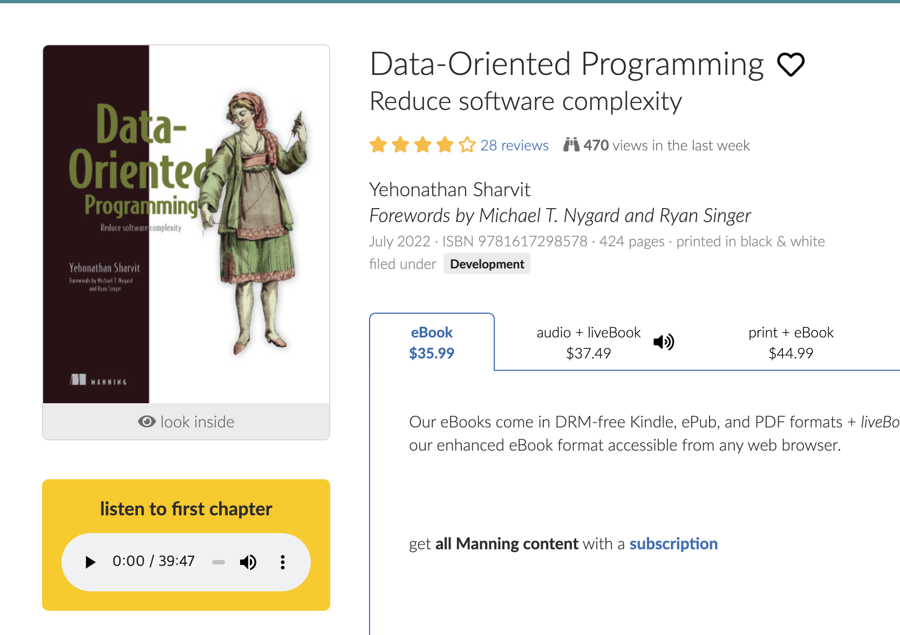

- [https://www.manning.com/books/data-oriented-programming](https://www.manning.com/books/data-oriented-programming)

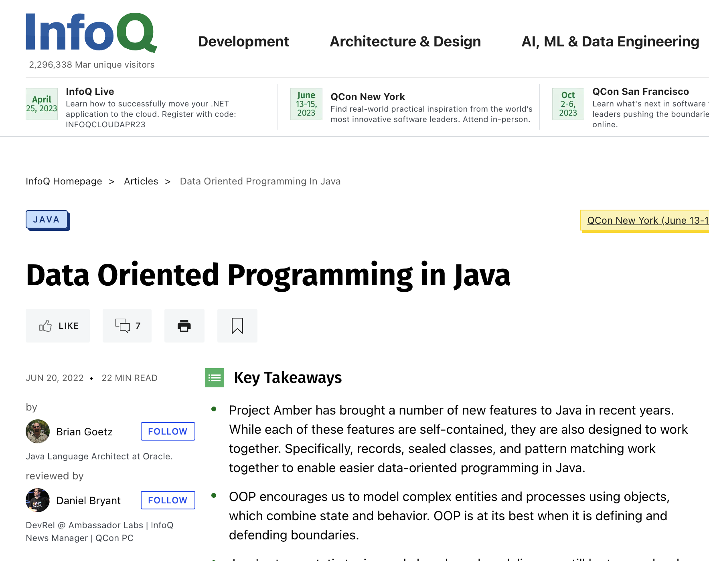

- [https://www.infoq.com/articles/data-oriented-programming-java/](https://www.infoq.com/articles/data-oriented-programming-java/)

---

## 데이터지향설계는 왜 필요한가?

객체지향 디자인에는 클래스와 객체, 정보 은닉(캡슐화), 상속, 인터페이스, 다형성 등이 포함됩니다. 객체지향 프로그래밍은 객체지향 디자인원칙을 따르고 있죠.

그렇다면, 데이터지향 프로그래밍도 데이터지향 디자인을 따를까요?  예시를 통해 데이터지향디자인이 무엇인지 알아보겠습니다.

먼저, 아래와 같은 두 가지 코드 예시가 있습니다. 잠깐 멈춰서 코드를 읽어주세요.

```java
static void test1() {

        int oneMillion = 1000000;

        var data = new int[oneMillion];

        var result = 0;
        var round = 0;

        for (int i = 0; i < oneMillion; i++) {
            round += 1;
            result += data[i];
        }

        System.out.println(result + " " + round);
    }
```

```java
static void test2() {

        int twentyMillion = 16000000;

        var data = new int[twentyMillion];

        var result = 0;
        var round = 0;

        for (int i = 0; i < twentyMillion; i += 16) {
            round += 1;
            result += data[i];
        }
        System.out.println(result + " " + round);
    }
```

 

test1()의 경우에는 1부터 시작하여 1씩 증가하며 100만번 조회를 수행합니다. test2()의 경우에는 1600만 개의 배열 중에서 인덱스를 16개씩 건너뛰어 100만번 조회를 수행합니다. 두 코드 모두 조회를 100만번 실행하는 것이 공통점입니다. 초기데이터는 모두 0으로 숫자 크기는 같습니다. 성능에 차이가 있을까요?

```java
// 수행결과
0 1000000
test1() 수행시간: 23622856 ns
------
0 1000000
test2() 수행시간: 44273032 ns
```

두 코드 모두 조회를 100만번 실행하는 것은 동일 한데, 대략 두배정도 차이가 납니다. 이상하죠?

### 왜 그럴까?

이 문제의 주요 원인은 CPU의 L2와 L3 캐시와 연관되어 있다고 합니다.

구글은 2015년도에 이와 관련된 아티클을 발표한 적이 있습니다. 

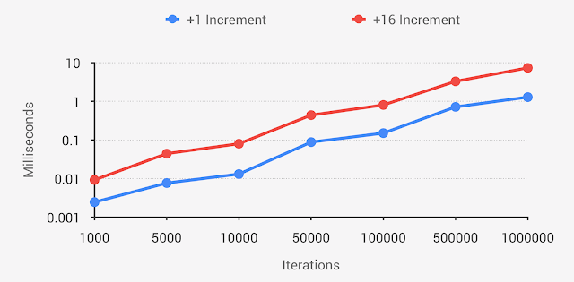

[https://android-developers.googleblog.com/2015/07/game-performance-data-oriented.html](https://android-developers.googleblog.com/2015/07/game-performance-data-oriented.html)

또, 오라클에서도 비슷한 내용의 아티클을 2021년도에 게시한 적이 있습니다.

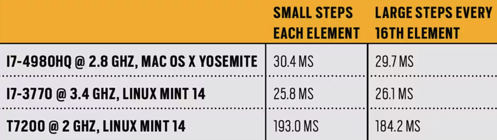

[https://blogs.oracle.com/javamagazine/post/java-and-the-modern-cpu-part-1-memory-and-the-cache-hierarchy](https://blogs.oracle.com/javamagazine/post/java-and-the-modern-cpu-part-1-memory-and-the-cache-hierarchy)

캐시(Cache)는 CPU와 메인 메모리 간의 속도 차이를 완화하기 위한 고속의 임시 저장소입니다. CPU는 캐시를 사용하여 반복적으로 접근하는 데이터나 명령어를 빠르게 읽어올 수 있습니다. 캐시는 일반적으로 L1, L2, L3 세 가지 계층으로 구성되어 있습니다.

1. L1 캐시(Level 1 Cache): CPU에 가장 가까운 캐시로, 속도가 가장 빠릅니다. 하지만 용량이 작아, 자주 사용되는 데이터와 명령어만 저장할 수 있습니다. L1 캐시는 데이터 캐시와 명령어 캐시로 나뉘어져 있을 수 있습니다.
2. L2 캐시(Level 2 Cache): L1 캐시보다 용량이 크고 속도는 다소 느린 캐시입니다. L2 캐시는 L1 캐시에서 찾지 못한 데이터와 명령어를 저장하며, CPU와 메인 메모리 사이의 성능 차이를 줄입니다. L2 캐시는 CPU 내부에 있거나 외부에 위치할 수 있습니다.
3. L3 캐시(Level 3 Cache): L2 캐시보다 용량이 더 크고 속도는 더 느린 캐시입니다. L3 캐시는 여러 CPU 코어가 공유할 수 있으며, L2 캐시에서 찾지 못한 데이터와 명령어를 저장합니다. 이 캐시 계층은 시스템 성능 향상에 기여합니다.

이렇게 계층적으로 구성된 캐시는 데이터를 더 빠르게 접근할 수 있도록 돕습니다. 캐시 사용으로 인해 CPU는 더 높은 처리 속도와 성능을 발휘할 수 있습니다.

### L2, L3 캐시

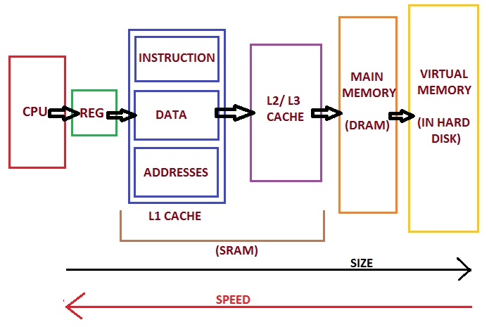

예제에서 일어나는 일은 CPU가 데이터에 액세스하는 방법을 이해하면 쉽게 설명할 수 있습니다. 

CPU는 RAM의 데이터에 직접 액세스할 수 없고, 데이터는 CPU 칩 근처에 있는 빠르고 작은 메모리인 캐시로 복사되어야 합니다. 프로그램이 시작되면, CPU는 배열의 일부에서 명령을 실행하도록 설정되지만 해당 데이터는 아직 캐시에 없어서 캐시 미스가 발생하고, CPU는 캐시로 데이터를 복사할 때까지 기다려야 합니다.

간단하게 설명하기 위해 L1 캐시 라인의 캐시 크기를 16바이트라고 가정합시다. 이는 명령에 대한 요청 주소에서 시작해 16바이트가 복사된다는 것을 의미합니다.

첫 번째 코드 예제에서는 프로그램이 다음 바이트에 작업을 시도하고, 초기 캐시 미스 이후 이미 캐시로 복사된 데이터를 사용해 원활하게 진행됩니다. 이는 다음 14바이트에 대해서도 동일합니다. 그러나 16바이트가 지난 후에는, 처음 캐시 미스 이후 루프가 다시 캐시 미스를 만나게 되고, CPU는 다음 16바이트를 캐시로 복사할 때까지 데이터를 기다리게 됩니다.

두 번째 코드 샘플에서는 루프가 한 번에 16바이트씩 건너뛰지만 하드웨어는 같은 방식으로 계속 작동합니다. 캐시 미스가 발생할 때마다 캐시는 16바이트를 복사하는데, 이는 루프가 각 반복마다 캐시 미스를 발생시키고 CPU가 매번 데이터를 기다리는 동안 대기하게 됨을 의미합니다.

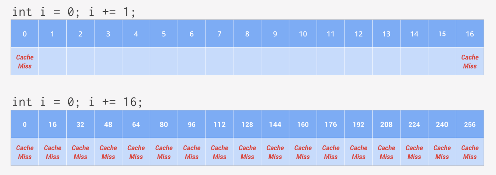

즉, 위에서의 test1의 경우보다 test2의 캐시 미스 횟수가 많아서 더 느린 것입니다.

### 그렇다면 JVM 문제 아닌가?

JVM은 컴파일 이후에도 JIT 컴파일러를 사용하여 네이티브 코드로 변환하는 과정이 있기 때문에, 이 때문이라고 생각할 수도 있습니다. 
그러나 오라클의 실험에서는 리눅스의 시스템 성능 프로파일링 도구인 'perf'를 사용하여 네이티브 코드의 동작 이후부터 측정을 진행했습니다. 그 결과로 L1, L2, L3 캐시와의 관련성을 확인할 수 있었습니다.

> 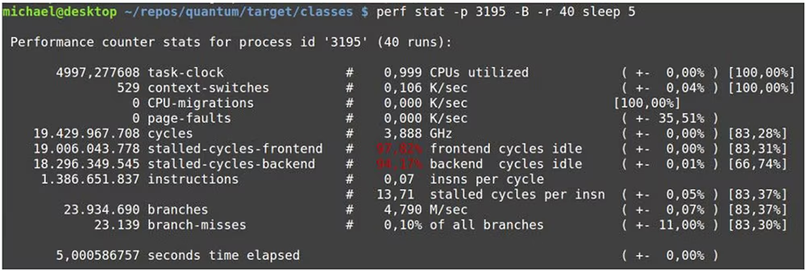
> - [https://blogs.oracle.com/javamagazine/post/java-and-the-modern-cpu-part-1-memory-and-the-cache-hierarchy](https://blogs.oracle.com/javamagazine/post/java-and-the-modern-cpu-part-1-memory-and-the-cache-hierarchy)


이러한 결과는 Java로 작성한 코드와 JVM은 결국 하드웨어의 구조에 기반하고 있다는 것을 상기시켜주는 계기가 됩니다.

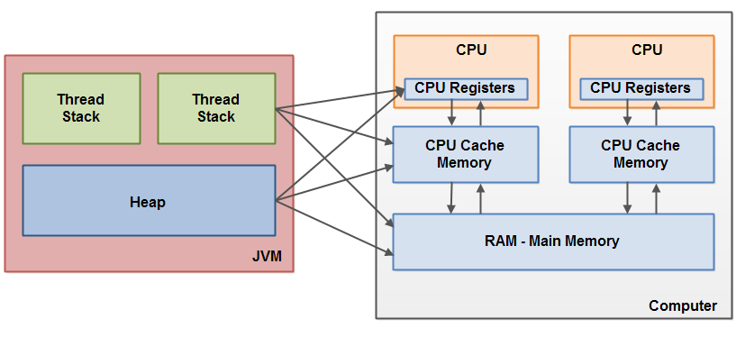

- [https://jenkov.com/tutorials/java-concurrency/java-memory-model.html](https://jenkov.com/tutorials/java-concurrency/java-memory-model.html)

앞서 살펴본 것처럼, 데이터를 배열에 할당하는 것과 같은 간단한 작업이라도 성능을 고려하면 프로그래밍 방식에 대해 신중하게 고민해야 합니다. 이런 데이터의 성능을 중점으로 설계를 고민하기 시작했고, 그렇게 생겨난 설계 방식 중 하나가 바로 데이터지향설계(Data-Oriented Design, DOD)입니다.

---

## 데이터지향 디자인(Data-Oriented Design, DOD)

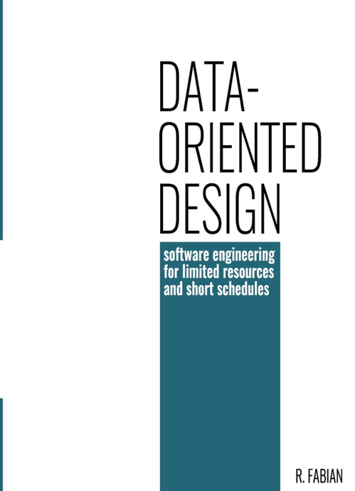

데이터지향 설계는 컴퓨터 과학과 소프트웨어 엔지니어링에서 성능 최적화를 위한 설계 접근 방식입니다. 이 방식은 전통적인 객체 지향 설계(Object-Oriented Design, OOD)와 달리, 데이터의 구조와 접근 방식에 초점을 맞춥니다. 데이터 지향 설계는 특히 게임 개발, 시뮬레이션, 고성능 컴퓨팅 등 자원 제한이 있는 환경에서 매우 효과적입니다.

데이터 지향 설계의 핵심 원칙은 다음과 같습니다:

1. 데이터 구조화: 데이터를 구조화하고 관련 있는 데이터를 물리적으로 서로 가까운 위치에 저장하여 메모리 접근 속도를 높이고 캐시 효율성을 개선합니다.
2. 데이터 변환: 프로그램을 데이터 변환 단계로 분해하여 각 단계에서 데이터를 처리하는 데 필요한 최소한의 정보만 사용하도록 합니다.
3. 메모리 접근 최적화: 데이터를 연속적인 메모리 블록에 저장하여 캐시 지역성을 개선하고, 메모리 접근을 최소화하며, 메모리에 효율적으로 접근하는 알고리즘을 사용합니다.
4. 병렬성 고려: 데이터를 독립적으로 처리할 수 있는 작은 단위로 분할하여 병렬 처리를 용이하게 하고, 다중 코어 및 다중 스레드 프로세서의 성능을 최대한 활용합니다.

데이터 지향 설계의 장점은 성능 최적화와 관련된 것이 주로 있습니다. 캐시 효율성을 높여 연산 속도를 빠르게 하고, 병렬 처리를 통해 다중 코어 및 다중 스레드 프로세서의 성능을 극대화할 수 있습니다. 이러한 이유로 데이터 지향 설계는 자원 제한이 있는 환경에서 선호되는 설계 방식이 되었습니다.

### 시나리오로 살펴보기

“백만개의 상품(Item) 중에서 가장 높은 판매가격(sell price)을 추출해라” 시나리오로 코드를 통해 살펴보겠습니다.

- 판매가격은 가격(price) * 수량(quantity) 로 이뤄진다.

객체지향설계를 따르는 프로그래밍은 아래와 같은 모습을 띕니다. 흔히 보는 모습이죠. 각 Item 인스턴스 생성 후에 다른 객체를 이용해서 Getter를 통해 멤버변수의 값을 호출 한후 비교 후 반환하게 됩니다.

```java
// 1. 상품 클래스
public class Item {
    private String itemName;
    private int price;
    private int quantity;
    private String description;

    public Item(String itemName, int price, int quantity, String description) {
        this.itemName = itemName;
        this.price = price;
        this.quantity = quantity;
        this.description = description;
    }
    public int getSellPrice() {
        return this.price * this.quantity;
    }
}

// 2. 상품 백 만개 담기
List<Item> items.add(... Item Instance)

// 3. 최대 판매가 조회
items.map((item) -> 가장 높은 판매가격 비교 후 반환
```

그러나 데이터지향설계를 따라 만들면 각 상품의 속성을 순서에 맞춰 담은 이후에 일괄조회하는 책임을 갖는 메서드를 만들게 됩니다.

```java
// 0. 상품 컬렉션 클래스
public class Items {
    private static final int ONE_MILLION = 1000000;

    private int currentIndex = 0;

    // 상품의 속성 배열 목록으로 순서(currentIndex)에 맞춰서 담아야 한다.
    private String[] itemName = new String[ONE_MILLION];
    private int[] price = new int[ONE_MILLION];
    private int[] quantity = new int[ONE_MILLION];
    private String[] description = new String[ONE_MILLION];

    // 상품을 담는 함수
    public void add(String name, int price, int quantity, String description) {
        this.itemName[currentIndex] = name;
        this.price[currentIndex] = price;
        this.quantity[currentIndex] = quantity;
        this.description[currentIndex] = description;
        currentIndex++;
    }

    // 최대 판매가를 반환하는 함수
    public int getMaxSellPrice() {
        var maxPrice = 0;

        for (int i = 0; i < this.currentIndex; i++) {
            if(maxPrice <= this.price[i] * this.quantity[i]){
                maxPrice = this.price[i] * this.quantity[i];
            }
        }

        return maxPrice;
    }

// 2. 상품 백 만개 담기
Items items = new Items();
items.add();

// 3. 최대 판매가 조회
items.getMaxSellPrice();
```

아래와 같이 두 코드를 작성하여 비교를 수행해보겠습니다.

```java
public static void main(String[] args) {
        int oneMillion = 1000000;
        System.out.println("Ready");
        var test1 = new Item[oneMillion];
        var test2 = new Items();

        for (int i = 0; i < oneMillion; i++) {
            test1[i] = new Item("Item"+ i, i, i, "DESC" + i);
            test2.addElement("Item"+ i, i, i, "DESC" + i);
        }
        System.out.println("Ready - done!");

        long start = System.nanoTime();

        var maxPrice = 0;

        for (int i = 0; i < oneMillion; i++) {
            if(maxPrice <= test1[i].getSellPrice()){
                maxPrice = test1[i].getSellPrice();
            }
        }
        System.out.println("maxPrice = " + maxPrice);

        long end = System.nanoTime();
        System.out.println("test1() 수행시간: " + (end - start) + " ns");

        System.out.println("------");

        long start2 = System.nanoTime();
        test2.getMaxSellPrice();
        System.out.println("maxPrice = " + maxPrice);
        long end2 = System.nanoTime();
        System.out.println("test2() 수행시간: " + (end2 - start2) + " ns");
    }
```

작성 후 실행을 해보면 결과 객체지향코드 대비 데이터지향코드가 더 빠른 시간안에 동작하는 것을 확인 할 수 있습니다.

> 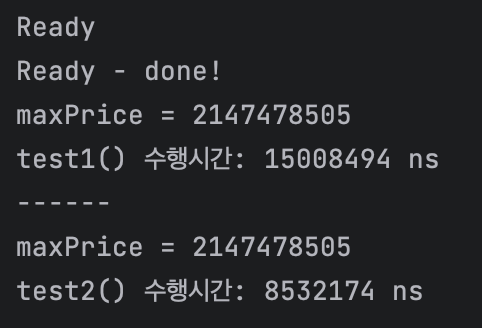

### 그렇다면 왜 아직도 객체지향설계를 사용할까?

아마도 웹 개발에서는 나노초 정도를 다루는 문제를 다룰 일이 적어서 그런것이라고 생각합니다. 0.003초의 차이는 웹 환경에서는 크게 영향을 주지 않기 때문이죠. 그래서 성능보다는 가독성과 유지보수성을 중요하게 생각하게 되는 것 같습니다. 그렇기에 현재 우리는 객체지향 디자인을 더 많이 사용하고 있는것으로 생각됩니다.

> 객체지향설계 결과
> 

> 데이터지향설계 결과
> 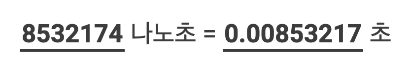

## 참고

- [https://www.dataorienteddesign.com/dodmain/node3.html](https://www.dataorienteddesign.com/dodmain/node3.html)
- [https://www.manning.com/books/data-oriented-programming](https://www.manning.com/books/data-oriented-programming)
- [https://android-developers.googleblog.com/2015/07/game-performance-data-oriented.html](https://android-developers.googleblog.com/2015/07/game-performance-data-oriented.html)
- [https://blogs.oracle.com/javamagazine/post/java-and-the-modern-cpu-part-1-memory-and-the-cache-hierarchy](https://blogs.oracle.com/javamagazine/post/java-and-the-modern-cpu-part-1-memory-and-the-cache-hierarchy)