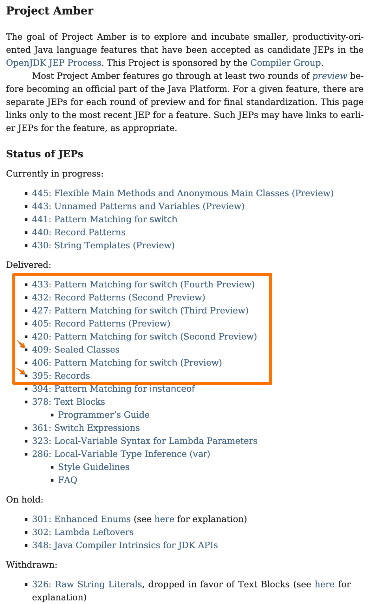

# 초보개발자 데이터지향 프로그래밍(Data Oriented Programming) with JDK 20

객체지향 프로그래밍(Object-Oriented Programming, OOP)은 클래스(Class)를 통해 데이터와 행위를 묶어 관리하는 프로그래밍 패러다임입니다. 그렇지만 OOP의 사용에 대한 모호함에 대한 논의는 여전히 진행되고 있으며, 이러한 배경 속에서 예호나난 샤르빗(Yehonathan Sharvit)이 데이터 지향 프로그래밍(Data Oriented Programming)이라는 새로운 개념을 제안하였습니다.

이번 글에서는 데이터 지향설계(Data Oriented Design)에 이어 데이터 지향 프로그래밍은 어떤내용인지 알아보겠습니다.

지난글 보기: 

- [초보개발자-데이터지향-설계-data-oriented-design-알아보기](https://medium.com/monday-9-pm/%EC%B4%88%EB%B3%B4%EA%B0%9C%EB%B0%9C%EC%9E%90-%EB%8D%B0%EC%9D%B4%ED%84%B0%EC%A7%80%ED%96%A5-%EC%84%A4%EA%B3%84-data-oriented-design-%EC%95%8C%EC%95%84%EB%B3%B4%EA%B8%B0-c0bbd36ea9da)

---

# **객체 지향 프로그래밍**

모든 프로그래밍 패러다임의 목표는 복잡성을 관리하는 것입니다. 그러나 복잡성은 다양한 형태로 나타나며 모든 패러다임이 모든 형태의 복잡성을 동등하게 잘 처리하는 것은 아닙니다. 대부분의 프로그래밍 패러다임에는 "Everything is a ..." 형식의 한 문장 슬로건이 있습니다. OOP의 경우 이것은 분명히 "모든 것이 객체입니다." 함수형 프로그래밍은 "모든 것이 함수다"라고 말합니다. 액터 기반 시스템은 "모든 것이 액터다"라고 말합니다. (물론 이것들은 모두 과장된 표현입니다.)

OOP는 상태와 동작을 결합하는 개체를 사용하여 복잡한 엔터티 및 프로세스를 모델링하도록 권장합니다. OOP는 캡슐화(개체 동작이 개체 상태에 대한 액세스를 중재함) 및 다형성(공통 인터페이스 또는 어휘를 사용하여 여러 종류의 엔터티가 상호 작용할 수 있음)을 권장하지만 이러한 목표를 달성하기 위한 메커니즘은 OO 언어마다 다릅니다. 

객체로 세상을 모델링할 때 우리는  *is-a*  (예금 계좌는 은행 계좌) 및  *has-a*  (저축 계좌에는 소유자와 계좌 번호가 있음) 관계의 관점에서 생각하도록 권장됩니다.

그리고 각 객체는 공개된 메서드(Public Method) 를 이용해서 메시지를 주고 받죠.


일부 개발자는 객체 지향 프로그래밍이 실패한 실험이라고 큰 소리로 선언하는 것을 좋아하지만 진실은 더 미묘합니다. 모든 도구와 마찬가지로 일부 항목에는 적합하고 다른 항목에는 덜 적합합니다.

OOP는 유지 관리 경계, 버전 관리 경계, 캡슐화 경계, 컴파일 경계, 호환성 경계, 보안 경계 등의 *경계를* 정의하고 방어할 때 가장 좋습니다. OO 언어는 이러한 경계를 정확하게 정의, 탐색 및 방어하기 위한 도구를 제공합니다.

큰 프로그램을 명확한 경계가 있는 더 작은 부분으로 나누면 복잡성을 관리하는 데 도움이 됩니다.  *모듈식 추론*  (한 번에 프로그램의 한 부분을 분석하면서도 전체에 대해 추론하는 기능)이 가능하기 때문입니다. 

모놀리식 프로그램에서 합리적인 내부 경계를 설정하면 여러 팀에 걸쳐 있는 더 큰 애플리케이션을 구축하는 데 도움이 되었습니다. 모놀리스 시대에 자바가 번창한 것은 우연이 아닙니다.

절차식 프로그래밍(Procedural programming) 시절에는 프로시저(루틴,메서드, 함수) 등의 연속적인 계산을 기반으로 코딩을 했습니다. 그러나 유지보수를 위해 만들어진 GOTO, JUMP 로 인한 코드의 스파게티 화로 어려움을 느꼈습니다. 그런데, 합리적인 경계를 나누고 복잡성을 관리 할 수 있으며 캡슐화를 통해 모듈식 추론이 가능한 OOP를 쓰지 않을 이유는 없었던 것으로 생각됩니다.


**그 이후로 프로그램은 더 작아졌습니다. 모놀리식을 구축하는 대신 많은 작은 서비스에서 더 큰 애플리케이션을 구성합니다. 소규모 서비스 내에서는 내부 경계가 덜 필요해졌습니다**. 충분히 작은 서비스는 단일 팀(또는 단일 개발자)에 의해 유지 관리될 수 있습니다. 마찬가지로 이러한 소규모 서비스 내에서는 장기 실행 상태 저장 프로세스를 모델링할 필요가 적습니다.

서비스 등의 로직을 해결하는 클래스를 만드는 경우도 있지만, 데이터를 주고 받는 개체를 만드는 일이 더 빈번했죠. 요즘에는 자바의 정적 타입을 데이터를 주고 받는 명세로서 적극적으로 이용합니다.

### 외부세상으로부터의 개체 관리

자바의 정적 타입은 유용하게 쓰입니다. 숫자는 숫자 문자열이 아닌 int 또는 long으로, 날짜는 LocalDateTime과 같은 클래스로, 목록은 긴 쉼표로 구분된 문자열이 아닌 컬렉션으로 표현되죠. 


> 다만, HTTP와 JSON, XML, YAML 등과 함께 사용되는 객체는 데이터를 표현하는 개체로 많이 이용 합니다.
> 

### OO는 복잡하다


OO에서는 코드와 데이터는 클래스로 묶여서 함께 표현됩니다. 코드는 메서드로, 데이터는 멤버변수로 말이죠. 

그런데 시스템 분석 관점에서 코드와 데이터가 뒤섞인다는 사실은 엔터티가 많은 관계에 관여하는 경향이 있다는 점에서 시스템을 복잡하게 만듭니다.


데이터의 관계들 (Data relations):

- `Library` has `Member`s →
- `Member` has `BookLending`s

코드의 관계들 (Code relations):

- `Member` extends `User`
- `Librarian` uses `Member`
- `Member` uses `BookItem`

이해하기 쉽게 풀어보면, 우리는 데이터와 메서드(로직)가 결합된 '객체'를 이용하여 프로그램을 설계하는 객체지향 프로그래밍 방식을 많이 사용합니다. 그런데 이 객체가 데이터만 전달하는 역할을 할 때, 그 객체 안에 메서드(로직)을 포함시켜야 하는지 아니면 그저 데이터 전달만을 목표로 할지에 대한 의견이 갈립니다.

일부 개발자들은 객체가 '상태'와 '행동'을 함께 갖는 것이 객체지향의 핵심 원칙이라고 주장합니다. 이들에게 따르면, 메서드는 객체가 상호작용하는 방식을 정의하며, 이는 객체가 각자의 책임과 역할을 수행하는데 있어 중요합니다. 그래서 이런 관점에서는 메서드를 포함시키는 것이 자연스러울 수 있습니다.

반면, 다른 개발자들은 데이터를 전달하는 객체가 단순히 '데이터 컨테이너' 또는 '데이터 구조체'로서 역할을 하도록 설계하는 것이 더 명확하고 간결하다고 주장합니다. 이들은 함수와 데이터를 분리하고, 데이터는 단순히 전달의 수단으로만 사용하는 것이 프로그램 전체의 복잡성을 줄이고, 코드의 재사용성을 높이는데 도움이 된다고 생각합니다.

이렇게 봤을 때, 데이터를 주고 받는 객체가 메서드를 포함해야 하는지는 개발 상황, 설계 원칙, 그리고 프로젝트의 요구 사항에 따라 달라질 수 있습니다.


- [https://enterprisecraftsmanship.com/posts/dto-vs-value-object-vs-poco](https://enterprisecraftsmanship.com/posts/dto-vs-value-object-vs-poco/)

---

# DOP(Data Oriented Programming)

객체지향 프로그래밍(OOP)의 일부 불명확성을 극복하기 위해, 데이터와 코드(로직)를 처리하는 객체를 분리하는 아이디어가 제시되었습니다. 이런 접근 방식에서는 코드를 순수 함수(pure function)로 이용할 수 있게 됩니다. 순수 함수는 동일한 입력에 대해 항상 동일한 출력을 제공하고, 외부 상태에 영향을 주지 않으므로 프로그램의 예측 가능성을 높이는데 도움이 됩니다.

이런 시도는 데이터 중심의 설계를 추구하지만, 이전에 다루었던 데이터 지향 설계(DOD: Data-Oriented Design)처럼 데이터 조회 성능을 중점으로 두지는 않습니다. DOD는 데이터의 구조와 그 데이터에 접근하는 방법에 초점을 맞춰, 계산 성능을 최적화하는데 중점을 둡니다. 반면 이 새로운 접근법은 데이터와 코드를 분리하여 코드의 명확성과 유지 관리성을 높이는데 초점을 둡니다.

이런 식으로, 객체지향 프로그래밍(OOP)에서의 설계를 이 데이터와 코드의 분리 접근법, 즉 데이터 중심 프로그래밍(DOP: Data-Oriented Programming)의 설계로 재구성하게 되면 다음과 같은 형태가 될 수 있습니다.

### Only data entities + Only code entities


데이터 중심 프로그래밍은 객체지향 프로그래밍의 아래 네 가지 문제를 해결하려는 목표를 가지고 있습니다.

1. 코드와 데이터가 혼합됨 (Code and data are mixed)
2. 객체는 가변적임 (Objects are mutable)
3. 데이터는 객체 내의 멤버로 갇혀 있음 (Data is locked in objects as members)
4. 코드는 클래스 안의 메서드로 갇혀 있음 (Code is locked into classes as methods)

따라서, 데이터 중심 프로그래밍은 데이터를 (불변의) 데이터로 표현하고, 이 데이터에 대한 독립적인 연산을 수행하는 비즈니스 로직을 구현하는 코드를 작성하는 것을 추천합니다. 이렇게 하면 데이터와 로직이 명확하게 분리되어, 프로그램의 구조가 더욱 명료해지며 유지보수도 용이해지도록 돕습니다.

참고)

- [https://www.infoq.com/articles/data-oriented-programming-java](https://www.infoq.com/articles/data-oriented-programming-java/)
- [https://blog.klipse.tech/dop/2022/06/22/principles-of-dop.html](https://blog.klipse.tech/dop/2022/06/22/principles-of-dop.html)


DOP의 핵심은 바로 데이터를 일급 시민으로 취급하는 것입니다. 이는 프로그래머가 숫자나 문자열을 다루는 것처럼 단순하게 프로그램 내의 데이터를 조작할 수 있게 함을 의미합니다. 이를 가능하게 하는 네 가지 핵심 원칙은 다음과 같습니다.

- [**원칙 #1](https://blog.klipse.tech/databook/2022/06/22/separate-code-from-data.html) : 데이터에서 코드(동작)를 분리합니다.**
- [**원칙 #2](https://blog.klipse.tech/databook/2022/06/22/generic-data-structures.html) : 일반 데이터 구조로 데이터를 표현합니다.**
- [**원칙 #3](https://blog.klipse.tech/databook/2022/06/22/immutable-data.html) : 데이터를 불변으로 취급합니다.**
- [**원칙 #4](https://blog.klipse.tech/databook/2022/06/22/data-validation.html) : 데이터 스키마와 데이터 표현을 분리합니다.**

이 네 가지 원칙이 결합되면, 응집력 있는 전체 구조를 형성합니다. DOP로 만들어진 시스템은 더욱 간단하고 이해하기 쉬워, 개발자의 경험을 크게 향상시킵니다.


---

# Java 에서 지원하는 DOP

객체지향 프로그래밍(OOP)은 복잡한 엔티티와 프로세스를 모델링할 때 상태와 행동을 결합하는 객체 사용을 권장합니다. OOP는 상태화 행동의 결합에 대한 경계를 정의하고 방어하는데 효과적입니다.

반면, 데이터 중심 프로그래밍은 데이터를 (불변의) 데이터로 모델링하고, 이에 대한 행동을 정의하는 비즈니스 로직 코드는 분리하여 관리하는 것을 권장합니다. 레코드, 봉인된 클래스, 패턴 매칭을 활용하면 이런 작업을 더욱 쉽게 수행할 수 있습니다.

복잡한 엔티티를 모델링할 때는 객체지향 기법이 큰 이점을 제공합니다. 그러나 간단한 임시 데이터를 다루는 서비스를 모델링할 때는 데이터 중심 프로그래밍 기법이 더 효과적일 수 있습니다.

OOP와 데이터 중심 프로그래밍은 서로 상충하는 것이 아니라, 각기 다른 상황과 요구 사항에 따라 선택할 수 있는 도구입니다. 따라서 상황에 맞게 이들을 혼합하여 사용하는 것이 가능합니다.

## Project Amber

[https://openjdk.org/projects/amber/](https://openjdk.org/projects/amber/)

**[Project Amber](https://openjdk.java.net/projects/amber/) 는 Java 및 OpenJDK 개발자의 현재 이니셔티브로 JDK에 대한 작지만 필수적인 변경 사항을 제공하여 개발 프로세스를 더 좋게 만드는 것을 목표로 합니다** . 이 작업은 2017년부터 진행되어 왔으며 이미 Java 10 및 11에 일부 변경 사항을 제공했으며 다른 변경 사항은 Java 12에 포함될 예정이며 향후 릴리스에서 더 추가될 예정입니다.




> JDK 20은 오픈JDK 프로젝트 앰버(Amber, 스위치 표현식과 구문을 위한 레코드 패턴 및 패턴 매칭)의 개선된 언어, 오픈JDK 프로젝트 파나마(Panama)의 자바 버추얼 머신(JVM) 및 네이티브 코드(외부 함수 및 메모리 API, 벡터 API) 간 향상된 상호 연결성, 프로젝트 룸(Project Loom) 관련 주요 기능(범위가 지정된 값, 가상 스레드, 구조화된 동시성)을 제공한다. 이를 통해 높은 처리량 및 동시성을 갖춘 애플리케이션들의 작성, 유지 관리 및 모니터링 프로세스를 극적으로 간소화할 예정이다.


DOP에서 필요한 Java20의 기능인 레코드(Record), 봉인된 클래스(Sealed), 패턴 매칭(Pattern Matching)에 관해 간략하게 살펴보겠습니다.

---

## 레코드(Record)

- Java 14 등장 → 16 정식 릴리즈
- [https://openjdk.org/jeps/395](https://openjdk.org/jeps/395)
- [https://www.baeldung.com/java-record-keyword](https://www.baeldung.com/java-record-keyword)

### 목표

- 값의 단순한 집계를 표현하는 객체 지향 구성
- 개발자가 행위 확장보다는 immutable data 모델링에 집중 할 수 있도록 함
- `equals`와 같은 데이터 엑세서 지원

```java
public record Person (String name, String address){
}

// 사용
var a = new Person("kim", "addr1");
System.out.println(a.address());
System.out.println(a.name());
```

```java
public class Person {

    private final String name;
    private final String address;

    public Person(String name, String address) {
        this.name = name;
        this.address = address;
    }

    @Override
    public int hashCode() {
        return Objects.hash(name, address);
    }

    @Override
    public boolean equals(Object obj) {
        if (this == obj) {
            return true;
        } else if (!(obj instanceof Person)) {
            return false;
        } else {
            Person other = (Person) obj;
            return Objects.equals(name, other.name)
              && Objects.equals(address, other.address);
        }
    }

    @Override
    public String toString() {
        return "Person [name=" + name + ", address=" + address + "]";
    }

    // standard getters
}
```


레코드는 Compact canonical constructor를 지원합니다.

- 개발자가 매개변수를 필드에 할당하는 지루한 작업 없이 매개변수를 검증하고 정규화하는 데 집중할 수 있도록 도와줍니다.


## 패턴매칭(Pattern Matching)

패턴 매칭을 통해 객체 간의 메서드를 통한 메시지 전달의 제약에서 벗어날 수 있게 되었습니다.

이로 인해 데이터 타입을 중심으로 생각하고 이해하는 데 더 효과적이게 되었습니다.

또한, 대수적 자료형(Algebraic Data Type)을 활용할 수 있는 가능성도 열렸습니다.

> 참고1 : [https://ko.wikipedia.org/wiki/대수적_자료형](https://ko.wikipedia.org/wiki/%EB%8C%80%EC%88%98%EC%A0%81_%EC%9E%90%EB%A3%8C%ED%98%95)
>
> 참고2: [https://medium.com/@lazysoul/대수적-데이터-타입이-algebraic-data-type-이란-26d9e73d96b6](https://medium.com/@lazysoul/%EB%8C%80%EC%88%98%EC%A0%81-%EB%8D%B0%EC%9D%B4%ED%84%B0-%ED%83%80%EC%9E%85%EC%9D%B4-algebraic-data-type-%EC%9D%B4%EB%9E%80-26d9e73d96b6)

패턴 매칭은 Java 16에서 **`instanceof`**를 통해, 그리고 Java 20에서는 **`Record Patterns`**의 형태로 지원이 시작되었습니다.

- [https://openjdk.org/jeps/394](https://openjdk.org/jeps/394) ****: Pattern Matching for instanceof →**** Java 16
- [https://openjdk.org/jeps/432](https://openjdk.org/jeps/432) : ****Record Patterns (Second Preview) →**** Java 20

### ****Pattern Matching for instanceof****

### 목표

- 보다 정교하고 구성 가능한 데이터 쿼리를 표현하기 위해 패턴 일치를 확장합니다.


```java
public class Duck {
    private final String name;

    public Duck(String name) {
        this.name = name;
    }

    public void fly() {
        System.out.println(this.name + " I'm flying");
    }
    public void quack() {
        System.out.println(this.name + " Quack");
    }
```

### instanceof 패턴매칭

- 패턴매칭을 통해서 더 이상 캐스팅 혹은 강제형변환 작업을 하지 않아도 됩니다.

instanceof 패턴매칭으로 인해 더이상 equals에서 강제 형 변환 작업이 필요 없게 되었습니다.


### Record Patterns (Second Preview)

- 레코드의 구조 분해 할당이 가능합니다.

아래의 코드 예시를 보면, **`Person`** 인스턴스의 **`a`**가 **`Object`** 타입으로 선언되어 있음에도 불구하고, **`if`**문의 조건에서 **`Person(String x, String y)`**를 선언한 후, 하위 코드에서 **`x`**와 **`y`** 멤버를 바로 사용할 수 있게 되었습니다.


이외, Loops 및 Generic도 지원한다고 합니다.

## 봉인된 클래스(Sealed)

- [https://openjdk.org/jeps/397](https://openjdk.org/jeps/397) → java 16 출시

## **목표**

- 클래스 또는 인터페이스의 작성자가 구현을 담당하는 코드를 제어
- 수퍼클래스의 사용을 제한하기 위해 액세스 수정자보다 더 선언적인 방법을 제공

Sealed Class는 몇 가지 제약 사항을 두고 있습니다.

- 상속/구현하는 클래스는 final, non-sealed, sealed 중 하나로 선언되어야 한다.
- Permitted Subclass들은 동일한 module에 속해야 하며 이름이 지정되지 않은 module에 선언 시에는 동일한 package 내에 속해야 한다.
- Permitted Subclass는 Sealed Class를 직접 확장해야 한다.

예시)

```java
public abstract sealed class Car permits Kia, Tata {

}

public final class Kia extends Car {

}

public non-sealed class Tata extends Car {
}
```

---

# DOP 사용 시나리오

### 개요

상품을 처리하는 기능이 있습니다. 상품 검색상품(SearchItem)과 대여상품(RentalItem)으로 구분됩니다.

이런 경우 아래와 같이 데이터와 비즈니스 코드로 구분 할 수 있습니다.


사용을 위한 메인메서드는 아래와 같습니다.

```java
import java.util.List;
import sealed.Item;
import sealed.Item.RentalItem;
import sealed.Item.SearchItem;
import sealed.spec.ItemSpec;
import sealed.spec.ItemSpec.BasicItem;
import sealed.spec.ItemSpec.Price;
import sealed.spec.RentalItemSpec;
import sealed.spec.RentalItemSpec.ConsultingInfo;
import sealed.spec.RentalItemSpec.Discount;

public class Main4 {

    public static void main(String[] args) {
        
        // DATA 를 담는 부분
        var a = new SearchItem<ItemSpec>(
                new BasicItem(
                        "Macbook Pro M3 16",
                        "This is a Macbook Pro M3 16",
                        new Price(10000)));

        var b = new RentalItem<RentalItemSpec>(
                new RentalItemSpec.BasicItem(
                        "Macbook Pro M3 16 - special",
                        "This is a Macbook Pro M3 16 with consulting",
                        new RentalItemSpec.Price(10000),
                        new ConsultingInfo("11a",
                        new Discount(10, 10))));

        List<Item> items = List.of(a, b);
        
        // 비즈니스를 처리하는 부분
        execute(items);
    }

    /**
     * Business rules:
     * @param items
     */
    public static void execute(List<Item> items){
        for (Item item : items) {
            switch (item) {
                case SearchItem(ItemSpec itemSpec)
                        -> execute(itemSpec);
                case RentalItem(RentalItemSpec rentalItemSpec)
                        -> execute(rentalItemSpec);
            }
        }
    }

    // TODO: SearchItem BIZ Class

    public static void execute(ItemSpec itemSpec){
        switch (itemSpec) {
            case Price(var price)
                    -> System.out.println(price +"매출액에 추가되었습니다.");
            case BasicItem(var name, var description, var price)
                    -> {
                System.out.println(name + "-" + description + " 처리되었습니다.");
                System.out.println(price +" 매출 추가되었습니다.");
            }
            default -> System.out.println("알 수 없는 요소입니다.");
        }
    }

    // TODO: RentalItem BIZ Class
    public static void execute(RentalItemSpec rentalItemSpec){
        switch (rentalItemSpec) {
            case RentalItemSpec.Price(int price)
                    -> System.out.println(price +"매출액에 추가되었습니다.");
            case RentalItemSpec.BasicItem(var name, var description, var price, var consultingInfo)
                    -> System.out.println(name + "-" + description + consultingInfo.toString() + " 처리되었습니다.");
            default -> System.out.println("알 수 없는 요소입니다.");
        }
    }
}
```

## ITEM 인터페이스

`sealed` 를 사용하면 가능한 데이터 타입의 값의 범위를 제한할 수 있습니다. 이는 기존 클래스(레코드) 기반의 처리를 대수적 타입에서 '곱 타입'에서 '합 타입'으로 변경하는 데 사용됩니다.

'곱 타입'의 경우, 모든 경우를 처리할 필요는 없지만, '합 타입'의 경우, 반드시 모든 경우를 다루는 코드를 작성해야 합니다. 만약 모든 경우를 처리하지 않는다면, 아래와 같은 메시지와 함께 컴파일이 실패하게 됩니다. 이에 따라 IDE는 가능한 한 'default'를 생성하여 처리되지 않은 케이스를 처리하도록 가이드를 제공합니다.


더 자세한 얘기는 아래 블로그에 잘 쓰여있습니다.

- [https://medium.com/@lazysoul/대수적-데이터-타입이-algebraic-data-type-이란-26d9e73d96b6](https://medium.com/@lazysoul/%EB%8C%80%EC%88%98%EC%A0%81-%EB%8D%B0%EC%9D%B4%ED%84%B0-%ED%83%80%EC%9E%85%EC%9D%B4-algebraic-data-type-%EC%9D%B4%EB%9E%80-26d9e73d96b6)

그래서 Item은 sealded 인터페이스로 정의하여 각 구현체는 최대 SearchItem, RentalItem로 가능하게 했습니다.

```java
package sealed;

import sealed.spec.ItemSpec;
import sealed.spec.RentalItemSpec;

sealed public interface Item {
    record SearchItem<T extends ItemSpec>(T items) implements Item {}
    record RentalItem<T extends RentalItemSpec>(T items) implements Item {}
}
```

각 클래스의 프로퍼티로 인한 곱타입또한 별도의 ItemSpec과 RentalItemSpec 과 같은 Sealed 인터페이스로 선언하여 합타입으로 제한을 줍니다.

다만 BasicItem과 같은 최종 레코드에서는 프로퍼티에 대한 제약이 없기 때문에 곱타입으로 이용이됩니다.

```java
package sealed.spec;

public sealed interface ItemSpec {
    record Price(int price) implements ItemSpec {
        public Price{
            if(price < 0) {
                throw new IllegalArgumentException("price cannot be negative");
            }
        }
    }
    record BasicItem(String name, String description, Price price) implements ItemSpec {
        public BasicItem {
            if(name == null) {
                throw new IllegalArgumentException("name cannot be null");
            }

            if(description == null) {
                throw new IllegalArgumentException("description cannot be null");
            }
        }
    }
}
```

```java
package sealed.spec;

public sealed interface RentalItemSpec {
    record Price(int price) implements RentalItemSpec {
        public Price{
            if(price < 0) {
                throw new IllegalArgumentException("price cannot be negative");
            }
        }
    }

    record Discount(int max, int min) implements RentalItemSpec {
        public Discount {
            if(max < 0) {
                throw new IllegalArgumentException("max cannot be negative");
            }

            if(min < 0) {
                throw new IllegalArgumentException("min cannot be negative");
            }

            if(min > max) {
                throw new IllegalArgumentException("min cannot be greater than max");
            }
        }
    }

    record ConsultingInfo(String consultantId, Discount discountRate){
        public ConsultingInfo {
            if(consultantId == null) {
                throw new IllegalArgumentException("consultantId cannot be null");
            }

            if(discountRate == null) {
                throw new IllegalArgumentException("discountRate cannot be null");
            }
        }
    }

    record BasicItem(String name, String description, Price price, ConsultingInfo consultingInfo) implements RentalItemSpec {
        public BasicItem {
            if(name == null) {
                throw new IllegalArgumentException("name cannot be null");
            }

            if(description == null) {
                throw new IllegalArgumentException("description cannot be null");
            }
        }
    }
}
```

### 실행결과


## 다시보는 DOP 원칙

- [원칙 #1](https://blog.klipse.tech/databook/2022/06/22/separate-code-from-data.html) : 데이터에서 코드(동작)를 분리합니다. → O 레코드 사용 및 패턴 매칭 이용
- [원칙 #2](https://blog.klipse.tech/databook/2022/06/22/generic-data-structures.html) : 일반 데이터 구조로 데이터를 표현합니다. → O 레코드를 통한 데이터 표현
- [원칙 #3](https://blog.klipse.tech/databook/2022/06/22/immutable-data.html) : 데이터를 불변으로 취급합니다. → O 레코드 및 실드 사용을 통한 해결
- [원칙 #4](https://blog.klipse.tech/databook/2022/06/22/data-validation.html) : 데이터 스키마와 데이터 표현을 분리합니다. → O 레코드 및 실드 인터페이스 사용

---