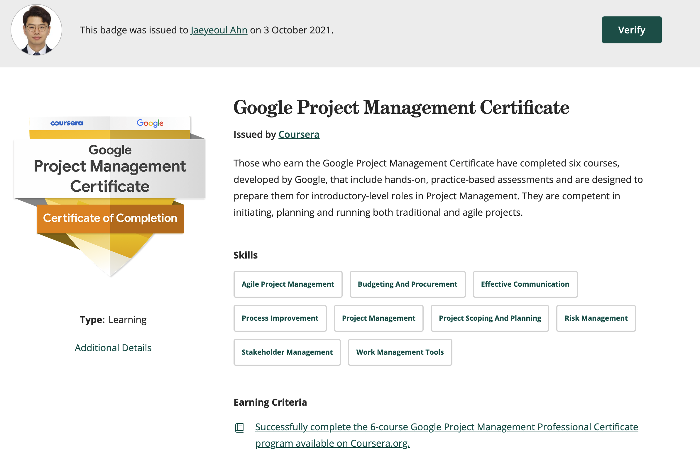

# Google Career Certificate 획득 하기

Created: October 4, 2021 8:53 AM
Tags: Article, Career, Personal

가끔은 개발자로 일을 하다보면 종종 생각이 든다. 

- '우리 프로젝트는 어디로 가고 있을까, 제대로된 방향으로 진행중일까?'

특히 뭔가 납득이 가지 않을때는 더욱 그렇다. 아주 틀린방법이지만, 사회 초년기에는 쉽사리 탓을 하기도 했다. 

돌이키면 그렇다고 나아지는건 없었다. 그럼 무작정 PM 이나, PL 을 탓하는 것도 이상하고, 고객을 탓하는건 더욱이상했다. 누군가의 탓으로 돌려서 해결하기에는 문제가 단순하지는 않았다. 문제의 해결방법으로도 너무나 잘못된 접근이다.

그럼 다시 처음 질문으로 되돌아가서, 방향과 진행에 대한 '제대로' 는 무엇인지를 고민하기 시작했다. 그리고 탄식했다.

> 아! 그렇다. 내가 프로젝트가 무엇인지를 모른다.

그렇다. 단지 내 관점으로만 일의 상황의 단편을 꼬집어, 전체 프로젝트로 바라보고 있었다.

우선  '프로젝트'가 뭔지에 대해서 어느정도는 학습을 해야 이해가 가능할 것 같았다.

학습 해야 할 것은 알지만, 이런저런 핑계로 기웃거리며 시간은 흘러갔다. 

어느날 아래의 온라인 기사를 접했다.

> ‘구글 커리어 서티피키츠’는 업계와 기업을 넘어서 4년제대학 졸업과 동등자격으로 취급된다. 구글을 비롯, 현재까지 월마트, 인텔, 뱅크오브아메리카 등 복수의 기업이 채용 시에 이 코스 수료자를 대졸과 같이 취급한다고 발표했다.
> 

> 출처 : 미디어빌(http://www.mediaville.co.kr) - [http://www.mediaville.co.kr/news/articleView.html?idxno=308](http://www.mediaville.co.kr/news/articleView.html?idxno=308)
> 

1주일 무료라는 말에 홀린듯 등록을 해버렸다.

---

7월부터 10월까지

- [https://www.coursera.org/professional-certificates/google-project-management](https://www.coursera.org/professional-certificates/google-project-management)

Google Project Management의 총 6가지의 강좌를 듣고 각 단계별 과제와 시험을 통과하면 Google Career Certificate를 제공한다. 각 단계별 구성은 1~4 까지는 프로젝트 관리 기초부터, 프로젝스 시작, 관리, 실행을 배우게 된다. 이 과정에서는 Google에서 진행하는 프로그램이라서 OKR 중심으로 배우지는 않는다. Waterfall, Agile에 해당하는 항목들도 배우지만, 대부분 특정 프로젝트 프레임워크를 통괄하는 방법들을 고루 배운다. 심지어 이메일을 보내는 법도 배운다. 또 PM, PO로 취업하는 방법들도 중간중간 나온다. 이후 5강에서는 Agile에 대해서 전반적으로 배우며 6강에서는 시나리오를 기반으로 실습하는 과정을 겪는다.  나름 인상깊었던 내용들이 몇몇 있는데, 가장 생각나는 것은 회고(Retrospect)다. 기억하기로는 6가지 수업 모두에서 언급되었다. 아마 이 글 또한 수업의 연장선으로 봐도 무방 할 것 같다.

방법론만 배우는것은 아니고, 실제 도구를 사용하는 방법도 배운다. 여기서는 Asana를 이용한 방법을 알려주며, 이외에도 다양한 Template의 문서를 제공해준다. 문서만 가지고 있어도 도움이 될 것같다.

해당 수업의 진행방식은 강의, 읽기자료, 미니게임, 시험, 동료와의 상호평가 과제로 구성된다. 각 단계별 쉬는 시간으로 실제 구글직원의 이야기도 사례중심으로 제공한다.

여기서 살짝 아쉬웠던 부분이 동료와의 상호평가다. 채점을 위한 기준표는 제공이 되지만, 제한된 문제상황과 그에 맞는 답변이 정해져있어서 다들 비슷한 답변을 주고 받는다. 또한 수강생끼리 서로 주고받는 내용이라 전문적인 피드백은 기대하기 어렵다. Coursera 플랫폼에서의 한계점일 수도 있다고 생각이 들었다. 아니면 간접경험으로는 얻을 수 없는 지식일 수도 있다고 생각된다.

그래도 인상깊은게, 다양한 국가의 사람들이 24시간 365일 자유롭게 드나들며 학습을 한다. 함께 공부를 진행하는 짝꿍들은 없을 것이라고 생각했다. 그런데 있었다! 나와 같이 함께 주말에 몰아서 수강하는 사람들이 같은 페이스로 진행을 하고 있었다. 동료와 상호평가시간에 알 수 있었는데, 계속 같은 학생과 채점을 주고받고 있었다. 

마무리로는 한번 더 취업에 관련된 특강을 진행해준다. 한국에서 취업을 할 때도 나름 도움될 내용들을 알려준다. 다만, 취업준비중에 듣고 경험한 내용들이라서 빠르게 넘어갔다.

수료가 끝나면 아래와 같이 credly와 Coursera에서 Certificate를 제공한다.

---

마무리

혜택은 잘 모르겟지만 일단 구글에서 만든 인터뷰 관련 서비스를 이용 할 수 있다.

- [https://googlecerts.biginterview.com/](https://googlecerts.biginterview.com/) 에서 12개월 무료 사용을 할 수 있는 쿠폰을 준다.

credly를 통해서 해당 포지션에 관련된 Job Offer도 제공한다고는 하는데 지켜봐야겠다.

아마도 언론에서 말한것처럼 구글, 월마트, 인텔, 뱅크오브아메리카등에 입사시에 도움이 될지는 모르겠지만, 직접 확인되지 않은 사실이라서, 잘 모르겠다.

우선, 내가 얻은 것은 아래와 같다고 정리 할 수 있다.

1. Certificate
2. 각종 템플릿
3. Biginterview 쿠폰
4. 업무 경험으로 생긴 추측을 뒷받침할 근거
5. 현재 진행중인 프로젝트에 대한 공감
6. 이메일 쓰기 및 목표설정방법
7. 더 학습을 해야 할 주제들
8. 자신감

살아가면서 도움이 되는 일이 있으면 추가로 올려봐야겠다. 누군가에겐 도움이 되길 기대하며 글을 마무리한다.