# Deep Learning Quantization (딥 러닝 양자화)

양자화라는 단어를 처음 들으면, 뭔가 양자 컴퓨터가 떠오를 수 있습니다. 아니면 복잡하고 이해하기 어려운 개념이나 수식이 연상될지도 모릅니다. 처음에 저 역시 양자화를 접했을 때 그랬었거든요.

그러나 다행인 점은 양자 컴퓨팅과 양자화는 관련이 없으며, 더 다행인 점은 양자화는 상당히 쉬운 개념이라는 것입니다.

아래 글에서는 양자화가 무엇인지, 양자화의 기술에는 무엇이 있고 어떻게 사용해야 할지를 알아 볼 겁니다.

## 구구단을 외자

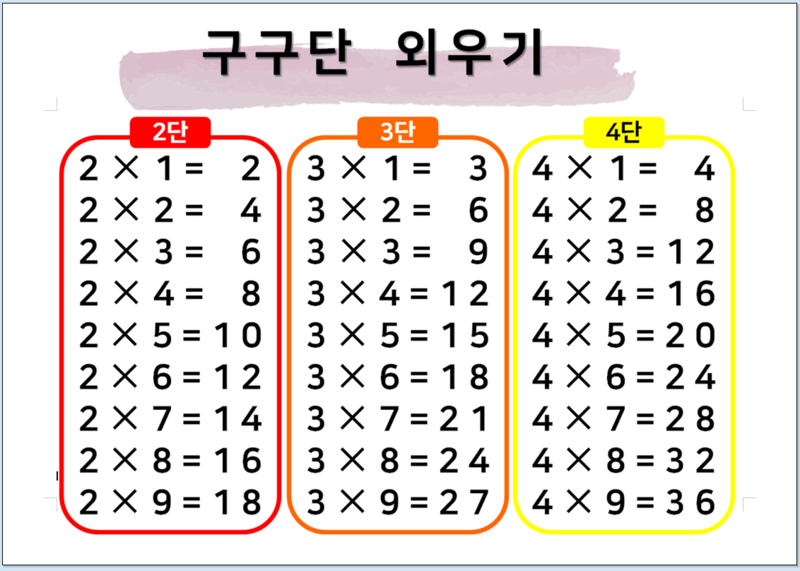

양자화를 설명하기 전에 간단한 곱셈을 해보겠습니다. 7 * 8은 얼마일까요? 대부분 바로 56이라고 대답할 수 있을 겁니다. 이제 조금 복잡한 곱셈을 해볼까요? 7.0129 * 8.0236은 얼마일까요? 이 계산도 그렇게 빠르게 할 수 있을까요? 대부분 계산기를 사용할 것입니다. 계산 결과 56.2687이 나왔습니다. 값을 반올림하면 56이네요.

**왜 7 * 8은 쉽고 7.0129 * 8.0236은 어려운 걸까요?** 정수를 곱하는 것은 소수점이 있는 숫자를 곱하는 것보다 훨씬 쉽기 때문입니다. 그렇다면 빠른 계산을 위해서는 대충 계산하면 어떨까요? 7.0129와 8.0236을 각각 7과 8로 반올림하고, 이들을 곱해 56이라는 대략적인 답을 얻는 것이죠. 56.2687과 56은 거의 차이가 나지 않습니다.

**이것이 바로 양자화의 기본 개념입니다.** 양자화는 float32로 이루어진 숫자를 더 작은 float16, int8로 변환시켜서 연산을 더 빠르게, 메모리도 적게 쓰게 해줍니다.

## float32에서 float16으로 내려가다

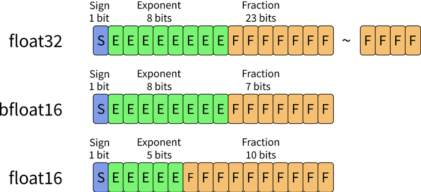

양자화에 관해 설명하기 전에, float32 개념을 알아보겠습니다. 모델 대부분은 특수한 경우를 제외하고 수많은 float32(대략 0.12901306과 같은 값) 행렬을 가지고 있습니다. 모델에 입력을 넣을 때도 float32 형식을 사용합니다.

모델의 가중치 행렬과 입력 행렬이 왜 float32일까요? 그 이유는 **대부분의 GPU 코어들은 float32 연산에 최적화되어 있기 때문입니다.**

하지만 float32는 너무 메모리를 많이 잡아먹었습니다. 더군다나 모델은 해가 지나면 지날수록 점점 커져갔습니다. 이 문제를 해결하기 위해 NVIDIA는 2016년에 Tesla P100이라는 데이터센터 GPU를 출시했습니다.

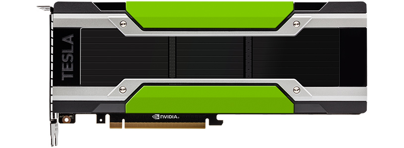

P100 GPU부터는 float32보다 더 빠르고 메모리도 적은 연산을 지원하는 **float16 연산**을 공식적으로 지원하기 시작했습니다. 예전부터 딥러닝 연구원들은 **딥러닝에 float32 연산처럼 정교한 연산이 필요할까?** 라고 생각한 연구원들이 많았습니다.

그래서 그 연구원들은 float16을 활용하여 연구를 진행했고, 2017년에는 Mixed Precision Training이라는 논문이 발표되어 float16이 딥러닝에도 유효하다는 것을 입증했습니다. 이 덕분에 학습 시 **GPU 메모리 사용량을 절반으로 줄이면서도 더 빠르게, 큰 모델을 학습**할 수 있게 되었습니다.

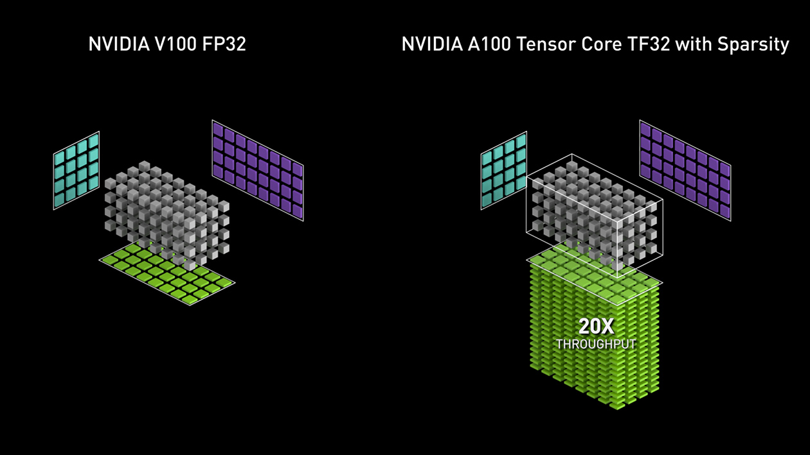

float16의 성공에 힘입어, P100의 다음 아키텍처인 V100부터는 float16과 int8 연산을 위한 전용 칩인 **Tensor Cores**가 추가되었습니다. 이 Tensor Cores의 기점으로 float16, int8 연산이 획기적으로 빨라졌습니다. 또한 이 Tensor Cores는 게임 업계에서도 DLSS로 톡톡히 사용되고 있습니다.

## float16으로 모델 양자화

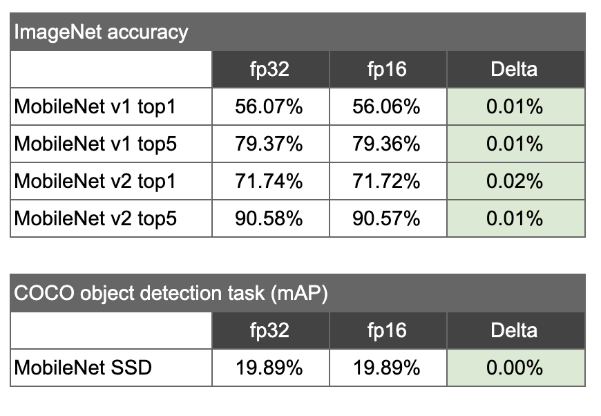

모델 학습이 아닌 모델 추론에 관심이 있는 연구원들도 이 좋은 float16 연산을 사용하고자 했습니다. 추론에 적용하는 것은 학습하는 것 보다 훨씬 더 간단했습니다. **float32의 가중치와 활성화 함수의 값을 그냥 반올림해서 float16으로 바꾼 것입니다.** 막상 이렇게 양자화를 하고 값을 뽑아내니 신기하게도 float32와 float16간의 정확도 차이가 거의 없었습니다.

이유는 딥러닝 모델이 긴 체인 형태로 구성되어 있어서, float32에서 float16으로 내려가도 모델의 결론 도출에 큰 지장이 없었기 때문입니다. 그래서 현재는 모델 추론은 float16은 일단 기본으로 두고 최적화를 진행하고 있습니다.

사족 - 많은 사람이 float16 양자화는 너무나도 당연하게 잘 된다고 생각하고 있어 최근까지 위의 내용에 대한 딱히 실험 연구가 없었는데, 이를 잘 정리하여 낸 논문을 글 작성 중에 발견했습니다. 제목은 [Comparative Study: Standalone IEEE 16-bit Floating-Point for Image Classification](!https://arxiv.org/pdf/2305.10947.pdf)이며 결론을 보면 역시나 float16 모델이 float32와 Mixed Precision에 동등한 성능을 낼 수 있다고 합니다.

많은 학습에 Mixed Precision은 잘 사용되고 있었는데, 혼합이 아닌 float16만으로도 잘 되면서, 더 빠르기 까지 하다니 신기하네요.

## float32에서 int8로 더 내려가다

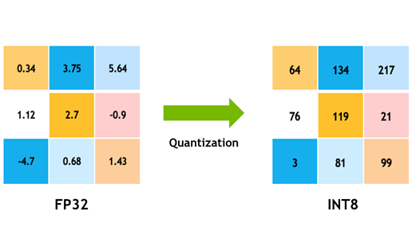

욕심 많은 연구원들은 여기에 만족하지 않고, float16보다 훨씬 작은 int8을 사용하려 했습니다. 연구 끝에, 학습에서는 int8을 사용하는 것이 어렵고, 그나마 추론에서 int8 양자화를 적용할 수 있다는 결론을 내렸습니다. 다만 float32에서 float16으로 내려갈 때처럼 간단한 반올림이 아니라, int8 양자화 과정에 약간의 기술들이 필요합니다. 그 기술 중에는 **PTQ 중 하나인 Calibration 작업과 QAT (Quantization Aware Training)이 있습니다.**

## PTQ(Post Training Quantization)와 Calibration

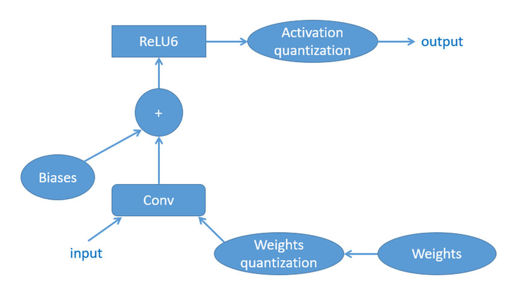

우선 PTQ 라는 용어는 int8 양자화 이전에도 있었던 개념입니다. 한국어로 직역하면 훈련 후 양자화라는 뜻이며, 앞 내용에 있었던 float16 양자화 기법(반올림)도 PTQ에 해당합니다. 어쨌거나 훈련 후에 양자화를 하는 것이니까요.

float32에서 int8로 단순 반올림을 하니, 모델의 정확도 손실이 아주 크게 났습니다. 왜나면 int8은 -127 ~ 128까지 밖에 안되고 float32는 대략 소수점 8자리까지의 정확한 범위를 가지고 있기 때문입니다. 이렇게 **float32와 int8은 데이터 범위에서의 엄청난 차이**가 있습니다.

연구원들은 이 엄청난 차이를 해소하기 위해 **Calibration 기술**을 도입했습니다.

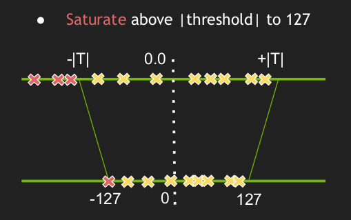

Calibration은 학습 데이터를 넣어서 float32의 layer 별 출력값과 int8의 layer 별 출력값을 비슷하게 만들어주는 scale factor를 찾아주는 작업입니다. 이런 식으로 int8로 내려갈 때 float32의 출력 값과 그나마 비슷하게 만들어 줄 수 있습니다.

알고리즘 중에 Histogram, MinMax, Entrophy 등등이 있는데, 이미 잘 정리해 놓으신 분들이 많아서 여기에는 설명을 따로 생략하겠습니다. 어쨌거나 **Calibration은 데이터를 밀어 넣어서 float32와 int8의 출력 값을 비슷하게 만들어주면서, int8이 float32의 결과로 이동하는 것이라고 생각하시면 될 것 같습니다.**

## QAT (Quantization Aware Training)

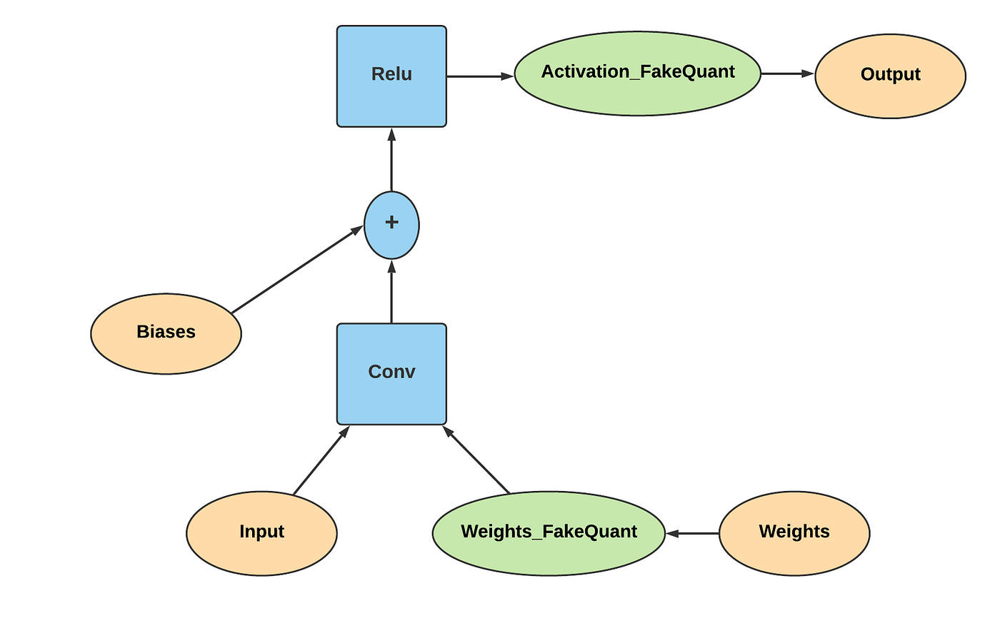

구글에서는 PTQ 대신 다른 접근 방법을 시도했습니다. 그것은 바로 QAT, 양자화 인식 훈련입니다. PTQ와는 다르게 QAT는 학습 후에 양자화를 하는 것이 아닌, 학습 중에 양자화를 인식하여 훈련합니다.

[Quantization and Training of Neural Networks for Efficient
Integer-Arithmetic-Only Inference](https://arxiv.org/pdf/1712.05877.pdf) 논문에서 QAT가 설명이 되었는데, 원리는 다음과 같습니다.

**학습을 할 때 가중치를 int8로 변환할 것을 염두해두고 계산을 합니다.** 이걸 FakeQuant라고 하는데, FakeQuant는 모델의 가중치나 활성화 값을 int8 형식으로 변환할 수 있는 값으로 제한합니다. 이는 실제로 float32 값들을 사용하지만, int8 범위 내에 맞도록 스케일링하고 클리핑합니다.

PTQ와 크게 다른 점은 PTQ는 학습이 완전히 끝난 것을 양자화 하는 반면, QAT는 학습이 되어 있는 것을 다시 재학습을 하면서 양자화를 염두에 두고 학습한다고 생각하시면 될 것 같습니다.

## PTQ vs QAT

**그럼 과연 PTQ와 QAT 둘 중에 뭐가 더 좋을까요?** PTQ보다 QAT가 더 좋다라고 대부분의 사람들에게 인식이 되어 있었습니다. 아무래도 학습을 하면서 양자화를 진행하는 것이, 학습 후에 양자화를 하는 것보다 복잡하니 더 좋을 것이라고 생각한 것이죠. 하지만 실제로는 그렇지 않았습니다.

최근에 int8 Quantization 작업을 진행을 한 적이 있는데, 처음에는 PTQ 중에 가장 대표적인 Calibration을 통해서 작업을 했습니다. 손쉽게 성공했고, 결과는 정확도가 아주 약간 감소했으며, 속도 향상은 약 18.0ms에서 6.0ms 정도로 빨라졌었습니다.

PTQ가 좋으니 QAT는 더더욱 좋을 줄 알고 QAT를 진행했었는데, 결과는 참담했습니다.

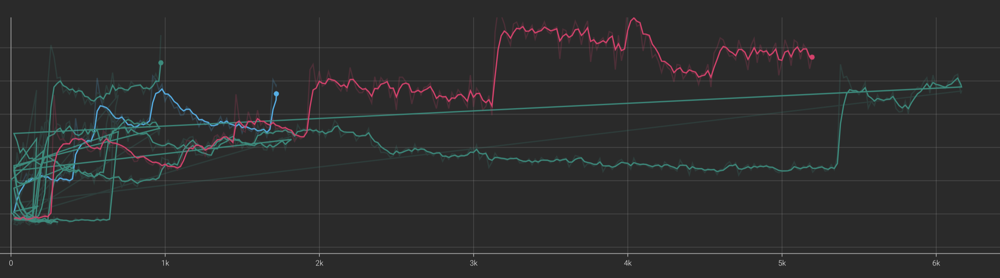

QAT한 결과인데 loss가 내려가거나 아래로 수렴해야 하지만, 튀어버리면서 학습이 실패한 것을 확인 할 수 있습니다. 이 QAT의 학습 방법, 파라미터를 조사하고자 구글링을 했는데, NVIDIA에서 낸 양자화 실험 삽질을 한 내용을 정리한 논문이 있었습니다.

[INTEGER QUANTIZATION FOR DEEP LEARNING INFERENCE: PRINCIPLES AND EMPIRICAL EVALUATION](https://arxiv.org/pdf/2004.09602.pdf) 이라는 논문이며, 이 논문에는 양자화에 관한 수많은 실험이 정리되어 있었습니다.

이 논문에서 꽤나 충격적인 결과가 있었는데, QAT가 항상 좋지는 않고, 대부분의 모델, Task에는 PTQ로만 해도 충분하다. 라는게 결론이였습니다.

백문이 불여일견, 표를 한번 보겠습니다.

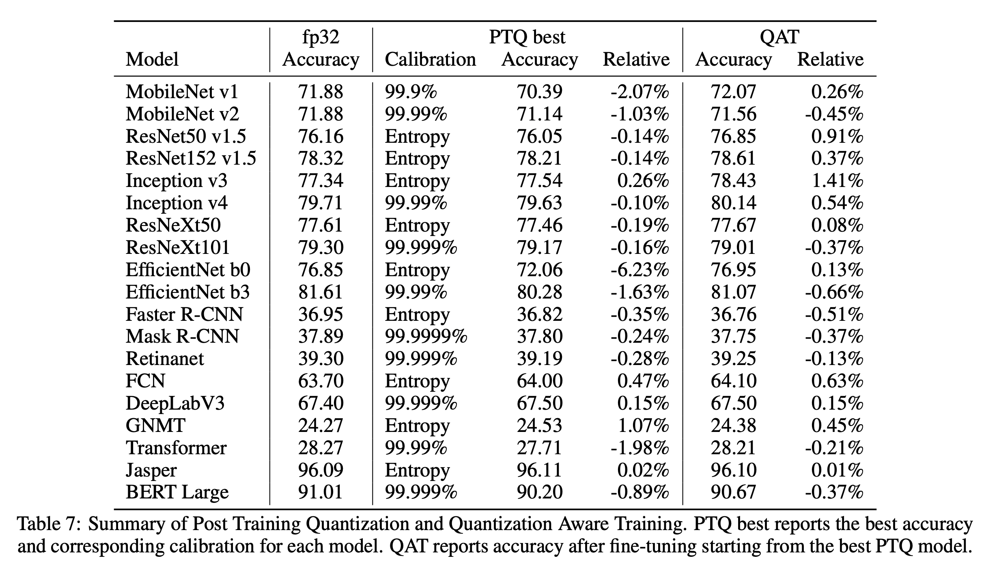

표를 보시면 다양한 모델, Task에 따른 PTQ, QAT의 Accuracy, Relative가 나와있습니다. 전반적으로 Classification 모델은 QAT에서 전반적으로 더 성능이 좋아졌지만, Segmentation, Object Detection과 같은 경우에는 오히려 PTQ가 더 좋거나, QAT가 더 미세하게 좋거나의 차이인 것을 볼 수 있습니다.

Transformer와 같은 큰 모델 같은 경우는 PTQ에서 많은 성능 하락이 있었습니다. 대신 QAT를 할 경우에는 성능 하락의 폭이 줄어들었습니다.

**QAT가 PTQ에 비해 생각보다 월등히 좋지 않다는 것을 알 수 있습니다.** 하지만 QAT가 대체로 약간은 성능이 더 좋은 편입니다. 하지만 PTQ에 비해 QAT는 들이는 수고가 굉장히 많습니다. PTQ의 대포 Calibration은 단순하게 데이터만 넣으면 되지만 QAT는 학습을 추가 진행해야하며, 위에 보시다시피 학습도 매우 힘든편이죠.

그래서 NVIDIA는 이 논문에서 합리적인 양자화 워크플로우를 제시를 했습니다.

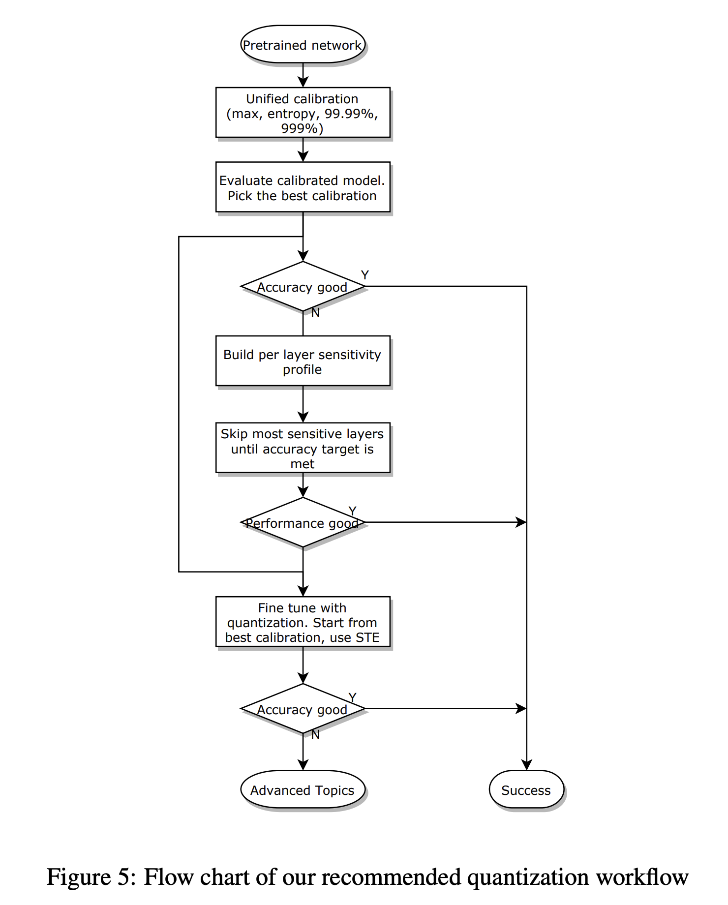

워크플로우에 대해 간단하게 설명하면 다음과 같습니다.

1. 우선적으로 PTQ를 진행합니다. 모델을 **여러 캘리브레이션 알고리즘(Entropy, Histogram, MinMax)를** 통해서 정확도를 측정하고 그 정확도 중에서 제일 좋은 것을 고릅니다.
2. 제일 좋은 것을 골라도 정확도가 많이 떨어진 경우에는 민감도 분석을 수행해서 가장 민감한 레이어를 찾고 이 레이어만 부동 소수점으로 남겨 놓습니다. 이 작업을 **Partial Quantization** 이라고 합니다.
3. 이 마저도 정확도 감소가 이루어지면, **그 때서야 QAT를 진행**합니다. 학습은 이전 대비 10% 정도로만 학습하고, lr은 기존 학습 lr의 1/100 수치로 조정을 합니다. lr 스케쥴러는 코사인 어널링이 제일 좋은 QAT 성능을 보여준다고 하였습니다. 위의 실험들이 모두 다음과 같이 진행되었다고 합니다.

이 워크플로우를 보면 **PTQ를 가장 우선순위로 두고, 그 다음에 부분적인 PTQ, 정말 답이 없으면 QAT**를 써라 라는 결론을 볼 수 있습니다. PTQ는 학습한 이미지만 밀어 넣으면 되기 때문에, 정말 쉬운 작업이고, 성능 감소도 적고 효과적이기 때문에, QAT의 성능이 미세하게 좋아도 PTQ가 괜찮으면 그냥 그거 써라 라는 느낌입니다.

## 결론

GPU의 부동 소수점 연산과 양자화가 무엇인지에 대해 알아보았고, 약간의 심화 과정인 양자화의 기법 종류(PTQ, QAT), PTQ vs QAT에 대해 정리를 해보았습니다.

양자화는 모델 경량화 분야에서 꾸준하게 논문이 나오고 있습니다. 요즘 핫한 GPT와 같은 LLM 모델 워낙 크다보니 LLM 경량화가 특히 더 많이 나오는 것 같습니다.

솔직히 우리나라는 모델 학습 연구원에 비해서 모델 경량화 연구원이 매우 적은 것 같습니다. 그래도 요즘 모델이 프러덕션 단계에 들어가면서 모델 경량화가 많이 중요해지고 있는 추세여서, 점점 모델 경량화 연구원도 많아지고 있는 것 같습니다.

모델 경량화를 연구하고, 연구할 예정인 분들께 이 뛰어나지 않는 글이 참고가 되었으면 좋겠습니다.
