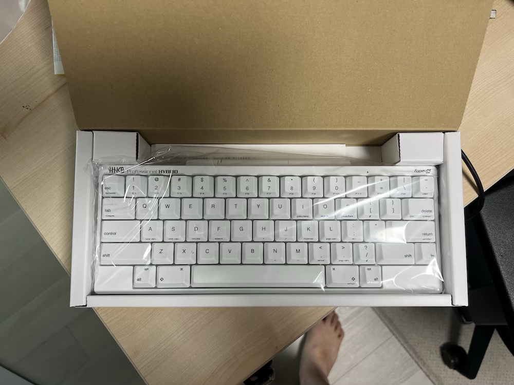
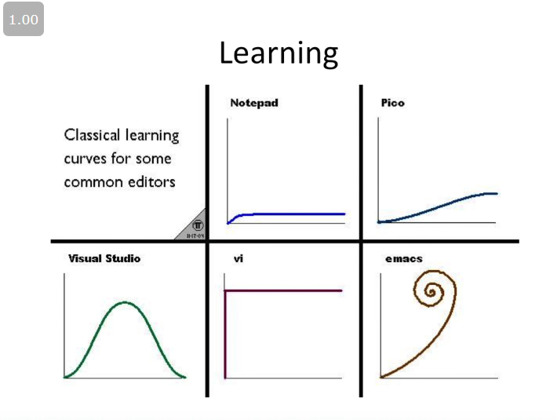
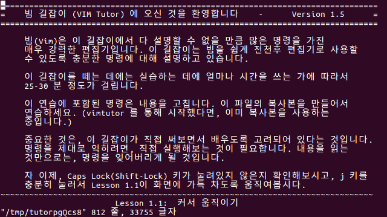
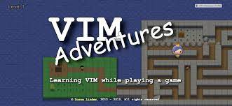
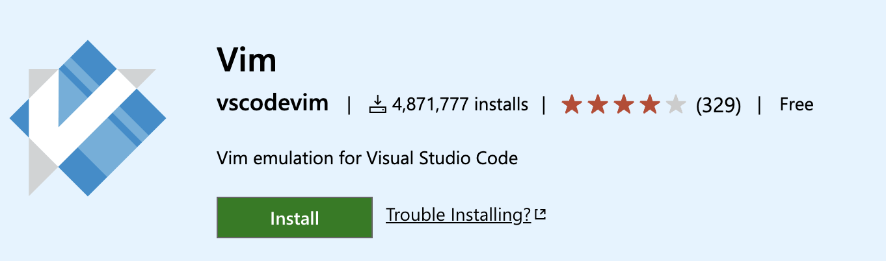
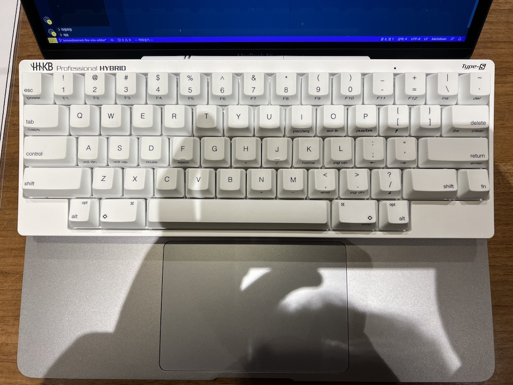

# Vim 한 달 사용 후기 및 개발환경 재구축

## Vim을 사용하려고 마음먹은 계기

**어째서 이런 힙스터 짓을 하냐고 물을 수 있다.** 나도 처음에는 내 스스로 너무 힙스터가 되려고 그러나 생각했지만, 꽤 오래 사용하고 나니 만족하고 있고, 실제로 코드 작성을 하는 속도도 옛날보다 더 빨라진 것 같다. Vim을 사용하자고 마음먹은 계기는 두 가지가 얽혀 있다.

**전에 읽었던 책에 일주일 동안 마우스나 트랙패드를 치워놓고 개발을 해보라는 문구가 있었다.** 바로 실천해보았지만, 컴퓨터를 처음 했던 때로 돌아간 것처럼 아무것도 하지 못하였다. 하지만 그 덕분에 VSCode에 있는 단축키를 여러 가지 배우게 되어, 에디터 창, 탐색기, 터미널 Focus 등등 내가 주로 많이 접근하는 것들은 단축키로 빠르게 접근할 수 있었다. 그러나 **에디터 안에서 만큼은 개선이 불가능했다.** 문득 에디터에서 단축키나 명령어로 빠르게 작성할 수 있는 Vim 에디터가 생각났다. 이게 첫번째 계기이다.

두번째 계기는 바로 이것이다.

무려 39만원 주고 산 **HHKB Type-s Hybrid**이다.

예전에 어떤 분께서 해피해킹 키보드를 사용하는 것을 보았다. 특이로운 생김새에 홀린듯이 타이핑을 좀 해보았다 *(물론 허락 받고)*. 이 때 태어나서 처음으로 키보드에 뽐뿌가 왔었고 마침 해피해킹 키보드가 Vim 에디터를 사용하는 사람에게 정말 편하다 라는 말도 있고, 마침(2) Vim 에디터를 배워볼까 생각을 하고있는 나에게, 고민이란 개념은 그저 배송만 늦추게 하는 것이였다.

## Vim을 배우기 위해 피나는 노력

위 사진은 유서 깊은 프로그래머 농담인데 설마 이 정도겠어 라고 생각했었지만, 큰 오산이였다. 실제로 Vim을 사용하는데 상하좌우 움직임도 제대로 하지 못하는 내 모습을 보고 내 스스로가 정말로 바보같이 여겨졌다. 상하좌우만 매끄럽게 하는게 이틀~사흘은 넘게 걸린 것 같으니 말 다한 것이다.

아무튼 Vim을 배우기 위해서 무엇을 찾아보았고, 어떤 노력을 했는가에 대해서 정리하고자 한다.

기초적으로 가장 도움이 된건 **vimtutor**인 것 같다. vim이 설치된 기기의 터미널 창에 vimtutor라고 만 치면 위와 같은 텍스트 파일이 켜지며, 거기에 서술된 것만 잘 사용하면 Vim의 기초는 다 배우는 것이라고 해도 무방하다. 오죽하면 다른 거 다 필요없이 매일 vimtutor만 처음부터 끝까지 하다보면 된다라는 말도 있을까.

그래서 나도 2주정도는 매일 vimtutor를 지루하더라도, 반복해서 했었다. 처음에는 vimtutor 하나 마치는데 30분이 넘게 걸렸지만, 2주 정도 반복하자 마치 고인물이 된 것 마냥 5분 안에 끝내는 모습을 볼 수 잇었다. 또 vimtutor만 한 것이 아니라 다른 것도 해서 실력이 금방 늘었던 것 같다.

그 다른 것은 바로 **Vim-Adventures**다.

Vim-Adventures는 게임으로 Vim을 학습할수 있는 사이트이며, 유료로 **6개월 라이센스에 무려 25달러를 내야한다..** 그러나 내가 Vim을 사용하면서 가장 실력에 영향을 미쳤던 것은 이 Vim-Adventures였던 것 같다. Vimtutor에서 가르치지 않는 여러가지 기능에 대한 조합도 가르쳐주고, 생각보다 어렵고, 스스로 해결하는 방식 덕분에 기능에 대한 기억도 더 오래 남았었다.

가격이 비싸지만, 결제를 해서 Vim-Adventures를 해본 소감은 일단 돈이 그렇게 아깝지는 않다는 생각이 들었다. 내 성격이 일하는 데에는 돈을 아끼지 않는 마인드가 있어서 그런 것도 있지만, 실제 개발을 하면서 쓰고있는 명령어들이 다 Vim-Adventures에서 배운것을 활용하고 있었기 때문이다. 물론 vimtutor는 도움이 되지 않았다는게 아니다. vimtutor는 기초적인 부분을 숙달하는 느낌이라면, Vim-Adventures는 숙달 과정을 하는 느낌이다.

**Vim을 아예 사용할 방법조차 모르고, 에디터에서 나가는 방법조차 모른다면,** Vim-Adventures를 먼저 하기보다는 vimtutor를 일주일 정도 해보고 Vim-Adventures를 병행하는게 좋을 것이다.

## 개발환경 재구축
Vim을 배웠으니 이젠 개발할 때 도움이 되어야 한다. 처음에는 모든 개발환경을 Vim으로 대체 할 수는 없을까 생각해서 여러가지 조사를 해보았지만, Docker container를 붙어서 작업하는 Vim extension은 없었다.

Linux Docker Container에 Attach해서 작업하는 나로썬 순수 Vim을 사용할 수는 없었다. 그래서 VScode와 Vim을 같이 쓸수 없을까 해서 찾아봤더니 VSCode에 Vim extension이 있었다.

그러나 이것저것 세팅하는데 삐그덕거리기도 많이했고, Vim Plugin을 마음대로 추가할 수 없고, 심지어 vim을 에뮬레이팅하는 것 이여서 성능도 안좋다는 소리가 있어서, 다른 방법이 없을까 해서 구글링을 열심히 해보고, Vim의 강화버전인 Neovim을 사용하는 VSCode Extension이 있었다.

이 Extension은 vscode-vim과는 다르게 로컬에 설치된 Neovim을 VScode에서 실행시키는 구조로, 에뮬레이팅 방식이 아니라 네이티브에 가까운 성능도 낼수 있고, Vim Plugin도 물론 사용할 수 있다. (가끔 vscode에서 작동하지 않는 플러그인도 몇몇 있다), 제일 좋았던 것은 Vscode-Vim에서 한글을 입력할 시에 깨지는 문제도 neovim에서는 발생하지 않았다.

Plugin을 사용할 수 있는 이점때문에, 여러 인터넷 글과 유튜브 등등에서 추천해주는 세팅값을 그대로 VScode에 적용 시킬 수 있었고, 

현재 최종적으로 개발환경을 VSCode-Neovim으로 환경을 구축하였고, Vim Insert 모드로 사용하면 그냥 VScode 에디터를 사용하는 것과 다를게 없어서, VSCode의 단축키와 Vim의 단축키를 섞어서 잘 사용하고 있다.

## Vim의 장점
Vim을 사용하면서 느꼈던 장점이다.

1. 이전보다 코드 작성이 훨씬 빠르다.

**사실 Vim을 꾸역꾸역 배우려고 하는 제일 큰 이유이다.**

전에 읽은 책에서 에디터를 유창하게 써야 한다는 대목이 있었다. 어느 정도 에디터를 써야 유창하다고 볼 수 있을까? 이에 대한 리스트들이 있다.

- 텍스트를 편집할 때 문자, 단어, 줄, 문단 단위로 커서를 이동하거나 내용을 선택
- 코드를 편집할 때 반대쪽 괄호로 이동하거나, 함수, 모듈 등 다양한 문법 단위로 커서를 이동
- 변경한 코드의 들여쓰기를 자동으로 맞추기
- 여러 줄의 코드를 명령 하나로 주석 처리했다가, 해제
- 에디터 창을 여러 구역으로 쪼개고, 각 구역 사이를 이동
- 특정 줄 번호로 이동
- ...

여러가지가 있지만 내가 중요하다고 생각하는 리스트들이다. 책의 저자는 이것을 마우스나 트랙패드 없이 모두 수행할 수 있어야 한다고 했다. 또한 이것들을 키보드의 자동 반복 없이 할 수 있다면 더더욱 좋다고 하였다.

위 리스트들은 VScode의 에디터도 충분히 가능했지만, 키보드의 자동 반복 없이는 힘들었다. 그러나 vim으로 바꾸면서 이러한 것들은 모두 해결이 되었다. 

- 텍스트를 편집할 때 문자, 단어, 줄, 문단 단위로 커서를 이동하거나 내용을 선택 -> w, e, b, $, 0, {, }, ... 
- 코드를 편집할 때 반대쪽 괄호로 이동하거나, 함수, 모듈 등 다양한 문법 단위로 커서를 이동 -> %, gd, ...
- 변경한 코드의 들여쓰기를 자동으로 맞추기 -> = (사실 Python 같은 경우는 Black을 사용하면 된다.)
- 여러 줄의 코드를 명령 하나로 주석 처리했다가, 해제 -> NERDComment Plugin 사용
- 에디터 창을 여러 구역으로 쪼개고, 각 구역 사이를 이동 -> Ctrl+w
- 특정 줄 번호로 이동 -> 12j, 12k, 12gg ..

Vim 에디터에 익숙해지면서 위 리스트 내용을 더 적은 키보드 입력으로 이리지리 현란하게 움직일 수 있었고, 트랙패트를 사용하던 때에 비해서 . 가장 큰 핵심은 **내가 보는 곳에 마우스나 트랙패드 없이 빠르게 커서를 이동시키는 것**인 것 같다.

2. 배울 게 많다.

이걸 장점으로 해야하나 단점으로 해야하나 고민을 많이 했지만 장점으로 적어놓았다. Vim의 살펴보면 살펴볼수록 기능이 어마어마하게 많다. 기능이 많으면 배워야 할 것도 더 많은 것이다. 그러므로 지금보다도 코드 작성이 **더 빨라질 수 있다는 것이다.** 실제로 Vim을 사용하는 해외 유튜버를 보면 믿을 수 없는 속도로 코드를 작성한다. 그런 걸 보면서 현타도 많이 왔지만, 나도 언젠간 저렇게 작성할 수 있다는 꿈을 꾼다.

3. 다양한 Plugin과 설정

Vim에 기능이 엄청 많지만, 정말 가끔 내가 원하는 기능이 Vim에 없을 때도 있다. 사람 생각은 다 똑같다는 말이 있듯이, 내가 생각했던 기능들은 남이 다 Plugin으로 만들어놓았다.

예를 들어, 여러 줄을 주석한다던가(NERDComment), 여러 문단을 괄호로 감싼다던가(vim-surround), 보다 빠르게 문자를 찾는 다던가(vim-sneak) 등등이 있고, 이런 것들이 하나하나 모여서 나만의 Vim 환경을 셋업 할 수 있다.

## Vim의 단점
1. 어렵다.

많은 사람들이 Vim을 잘 안쓰려고 하는 이유이지 않을까? 만약 Vim이 쉬웠으면 모든 사람은 Vim만 썼을 것이다. 하지만 Vim은 **너무너무 어렵다.**

왜 어려울까? Vim은 아예 마우스를 못쓰는 것도 한 몫하는 것 같다. vim은 오로지 키보드로만 모든 동작을 해야한다. 왜냐하면, vi가 나온 시기는 마우스라는게 없었기 때문이다. 그래서 코드 작성을 모두 키보드로 해야했고, 더군다나 기능들이 많아지면서 Vim까지 오게 된 것이다. _사실 이 단점도 이제는 의미없는게, neovim은 마우스 작동이 된다! 마찬가지로 VSCode+Neovim도 마우스가 잘 된다._

또 어려운 이유는 명령어가 너무 많고, 단축키도 생소한 점이 있다. vim의 강력한 기능에는 단축키, 명령어 조합이란 것이 있다. 예를 들면 문자를 삭제하는 d와 단어를 이동하는 w를 조합하면 dw (한 단어를 삭제함), 여기어 2w를 쓰면 d2w (두 단어를 삭제함), 줄의 맨 끝으로 이동 $을 쓰면 (커서부터 줄의 맨끝 까지 삭제), 등등 수많은 조합이 가능하다, d 뿐만아니라 문자를 교체하는 c를 조합하거나, 다른 아무 명령어에도 호환이 된다. 단축키 조합을 이래저래 사용하다보면 "와 이런것 까지 되네.."라고 생각이 든적이 많다.

그 다음 어려운 이유는 초기 설정이 쉽지 않다는 것이다. Vim은 vimrc, init.vim 과 같은 초기 설정 파일이 있는데, 사용자는 이 파일을 수정하여 Vim을 사용자 정의할 수 있다. Vim 설정 파일을 수정하기 위해서는 Vim의 설정 파일 구조를 이해해야 하며, 설정 파일에 올바른 구문을 작성해야 한다.
예를 들어, 사용자가 Vim에서 사용할 색상 테마를 변경하고자 하는 경우, .vimrc 파일에 테마를 적용하는 구문을 작성해야 한다. 이를 위해서는 Vim의 색상 테마를 지정하는 올바른 구문을 찾아서 .vimrc 파일에 추가해야 하는 것이다.

종합하면, GUI의 부재, 난해한 명령어 조합, 초기 설정 등등이 Vim을 어렵게 만드는 이유이다.

2. 한영키 이슈

Vim을 사용하는 개발자들은 다 영어권 개발자들이라 그런지, 다른 언어를 사용하는 사람에게 배려를 해놓지 않은 느낌이다. 명령어는 한영키에 대응되지 않고 영어를 써야한다. 코드를 작성하다가 주석을 한글로 달거나 print를 한글로 작성할때 esc를 누르고 명령을 입력하려고 할 때 한글

3. 완벽하지 않은 VSCode+Neovim

Vim의 문제가 아닌 VSCode와 Neovim을 같이 쓸때 문제가 생기는 것인데, vim plugin중에서 가끔 vscode에서 잘 안되는 경우가 있다. 멀티 커서를 지원하게 해주는 vim-visual-multi이 하나의 예다. 중요한 기능중 하나라고 생각되는데, 이상하게 vscode에서 작동하지 않는다.

이렇듯 일부 vim Plugin은 VScode에 작동하지 않는다.

## (Optional) 해피해킹 키보드 리뷰

Vim과는 다른 얘기지만 해피해킹 키보드를 한 3개월 동안 사용한 후기에 대해서 작성해보려고 한다. (아마 이걸 궁금해 하는 사람도 많을 것 같기 때문이다.)

전체적으로 Vim을 사용하기에 키보드가 편하다기 보다는 그냥 키보드 자체가 편한 것 같다. 무게도 가벼워서(500g) 들고다니기에도 편하고 사이즈도 작아서 이렇게 개발할 수 있다.

실제로 해피해킹 키보드를 사용하는 사람들 중에 이렇게 사용하는 사람도 많다고 한다. 이렇게 노트북 위에 얹어서 사용하면 트랙패드는 엄지손가락으로 컨트롤 하면 되고, 손 움직임도 최소화 할 수 있어서 좋은 것 같다. 씽크패드의 빨콩을 쓰는 기분이랄까.

또 ESC가 1 옆에 있어서 vim을 사용하는 사람은 esc를 많이 누르는데, 손을 멀리 보내서 esc를 누르지 않아도 되서 좋다.

해피해킹 키보드의 이상한 점이라고 하면 방향키를 fn누르고 시용해야한다는 것이다. 처음엔 이게 가장 큰 불편함이 있을 줄 알았지만, 의외로 방향키는 금방 적응이 되는 것 같다.

종합적으로는 Vim을 사용하지 않아도 편한 키보드이다. 물론 키보드에 적응하는데 좀 걸리지만, 손목을 이동하지 않고 타이핑을 할 수 있다는 게 이 정도로 큰 이득이 될 줄은 상상도 못했다. 게다가 39만원 키보드 답게 키보드 타이핑감도 아주 아주 좋아, 맨날 하는 타이핑이 재미가 느껴져서, 내가 지른 물품중에 제일 안아까운 장비라고 생각한다.

물론 단점도 있다. **이 키보드에 적응하면 다른 키보드를 쓸때 오타가 정말 많이난다.** 아무래도 해피해킹 키보드는 키 배열이 다른 키보드와는 많이 달라서, 이거에 적응하다가 다른 키보드를 쓸때 백스페이스로 문장을 지울때 \\\\\\ 역슬래쉬를 연타하고 있는 자신의 모습을 볼 수 있을 것이다. 또한 esc누를때 ₩₩₩₩₩ 원화를 연타하는 모습을 볼 수 있다.

## 결론

Vim은 어렵지만 배우면 배울수록 매력적인 에디터고, 코드 작성도 매우 빨라질 수 있다. 만약 리눅스 개발자면 vi를 사용하게 될 확률이 높으므로, Vim을 배우는 것을 추천한다. 물론 리눅스 개발자가 아닌 사람들에게도 Vim을 배우는 것에 대해 적극 추천한다.

Vim을 배울 시간이 없다고 한다면, 내가 사용하는 IDE의 단축키를 배워서 마우스 없이 IDE를 자유자재로 다룰 수 있게라도 해보자. 개발 속도가 정말 빨라지는 것을 느낄 수 있을 것이다.

