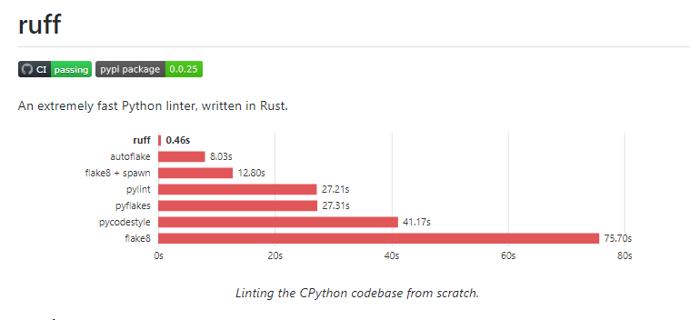
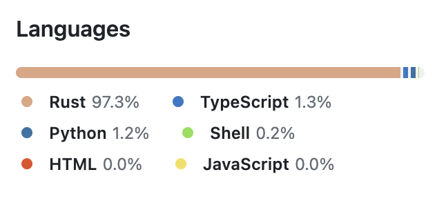
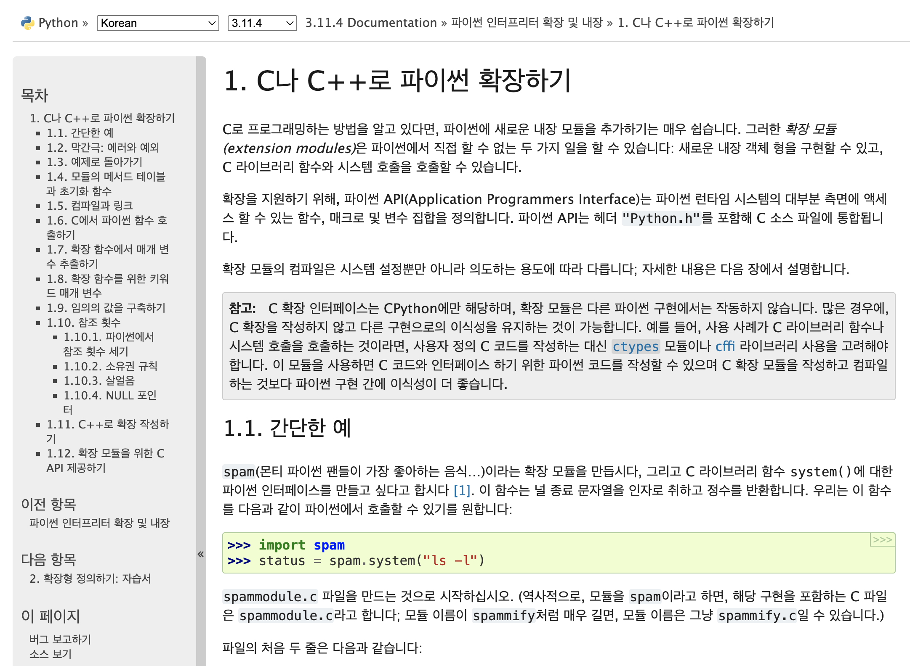
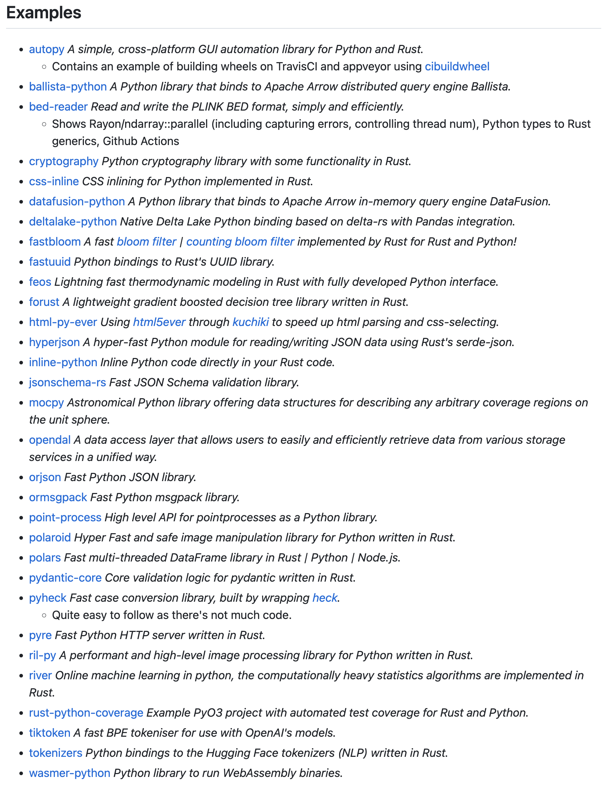

# Rust로 Python의 함수를 100배 빠르게 하기

## 서론

최근 모델 경량화와 파이프라인 최적화 작업을 진행하면서 느낀 점은 모델 자체의 처리 속도가 꽤 빠르다는 것입니다. 그러나 전체 처리 시간을 분석해보면, 전처리와 후처리 단계에서 상당한 시간이 소비되는 것을 확인했습니다.

현재 다루고 있는 파이프라인에서는 전 후 처리 과정이 대부분 이미지 프로세싱 함수들로 이루어져 있습니다. 이 중에서도 특히 몇몇 함수들은 실행 시간이 길게 소요되는 경향이 있습니다. 대부분의 이미지 프로세싱 작업들은 많은 반복문을 필요로 하며, 그 안에서 다양한 값을 찾고 계산하는 과정이 포함되어 있습니다. 이런 과정은 인터프리터 언어의 특성상 어쩔 수 없이 느린 실행 시간을 보입니다.

c++로 작성되어 있는 opencv-python을 활용하여 많은 함수들을 대체하면 처리 속도를 크게 향상시킬 수 있지만, 때로는 opencv로 해결할 수 없는 연산도 있습니다. 이런 경우에는 고민이 필요하며, 이러한 문제를 해결하기 위해 새로운 방법을 찾아야 합니다.

## Rust에 관심을 가지게 된 계기

Rust라는 언어에 관심을 가지게 된 건 ruff라는 도구 때문에 관심을 갖게 되었습니다.

예전에 medium 아티클을 둘러보다가 pylint보다 훨씬 빠르게 작동하는 Python Lint 도구인 ruff를 발견한 적이 있었습니다. 바로 다운 받아서 ruff를 실행시켰는데 실행하자 마자 아무것도 나오지 않고 바로 종료되서 프로그램이 버그가 생긴 줄 알았고, 코드를 일부러 Lint에 어긋나게 만들고 다시 실행했는데 정상적으로 작동되는 것이구나 라는 것을 깨닫고 놀랐던 기억이 있습니다.

Pylint에서는 길게는 10초, 아니면 5초가 걸렸던 Lint 작업들이 ruff에서는 0.05초 정도가 걸리는 것을 볼 수 있었습니다. ruff가 기존 lint 도구와 비교할때 100배, 1000배가 빠르다는게 허풍이 아니구나 라는 생각을 했습니다. 그럼 이게 왜 빠른 건가 했는데,

ruff라는 프로그램은 모두 Rust로 작성이 되어 있습니다. Rust의 성능이 엄청나다는 것을 알게 되었고, Rust를 늘 마음에 두면서 지내고 있었습니다. 또한 Python과 Rust를 같이 쓸 수 없을까? 라는 생각도 같이 늘 하고 있었습니다.

## PyO3

Python은 공식적으로 C와 C++을 바인딩하는 것을 제공합니다. 즉 Python의 일부 모듈을 C나 C++ 모듈로 대체해서 모듈의 실행속도를 더욱 빠르게 할 수 있는 것이죠, 위에 서술한 opencv-python도 마찬가지입니다. 하지만 Python 모듈을 빠르게 하기 위해 C, C++ 모듈을 작성할 수 있겠지만, 이젠 저는 더 이상 C, C++을 하고 싶진 않았습니다. 개발 속도도 오래 걸리며, 메모리 안정성에 신경 써야 되고 등등 여러가지 이유가 있지만 사실 제일 큰 이유는 C, C++를 다시하기엔 이젠 흥미가 없어서 그런 것 같습니다.

그래도 어쩔 수 없이 C, C++을 다시 해야하나 갈등하고 있는 저에게 한줄기의 희망이 내려온 프로젝트가 있었습니다. 그것은 바로 PyO3 프로젝트입니다.

ruff 프로젝트가 인기가 많아진 이후로 Python의 일부 core 모듈을 Rust로 대체하여 작업하는 라이브러리들이 점점 많이 생겨나고 있습니다.  pydantic의 core를 Rust로 재작성이 되었다던가, pandas를 Rust로 재작성한 polars 프로젝트라던가 등등 그리고 하나같이 그 라이브러리들이 기존의 라이브러리를 존재를 위협할 정도로 큰 성능 향상이 있었습니다. 그리고 그 중심에는 PyO3라는 프로젝트가 있었습니다.

