# Rust로 Python의 함수를 가속화하기

최근 모델 경량화와 파이프라인 최적화 작업을 진행하면서 느낀 점은 모델 자체의 처리 속도가 꽤나 빠르다는 것입니다. 전체 처리 시간을 분석해보면, 오히려 전처리와 후처리 단계에서 상당한 시간이 소비되는 것을 확인했습니다.

현재 저희 팀에서 다루고 있는 파이프라인에서는 전 후 처리 과정이 대부분 이미지 프로세싱 함수들로 이루어져 있습니다. 이 중에서도 특히 몇몇 함수들은 실행 시간이 길게 소요되는 경향이 있습니다. 대부분의 이미지 프로세싱 작업들은 많은 반복문을 필요로 하며, 그 안에서 다양한 값을 찾고 계산하는 과정이 포함되어 있습니다. 이런 과정은 인터프리터 언어의 특성상 어쩔 수 없이 느린 실행 시간을 보입니다.

C++로 작성되어 있는 opencv-python을 활용하여 많은 함수들을 대체하면 처리 속도를 크게 향상시킬 수 있지만, 때로는 opencv-python으로 해결할 수 없는 연산도 있습니다. 이런 경우에는 고민이 필요하며, 이러한 문제를 해결하기 위해 새로운 방법을 찾아야 합니다.

그래서 대개의 경우 C, C++로 작성한 함수나 코드를 Python에 바인딩하곤 합니다. 근데 이것은 저는 늘 최후의 수단으로 두고 살아왔었습니다. 그러다가 연구 개발을 하다보면서 Rust에 관심이 많이 생겼고, Python과의 조합이 참 좋구나라고 생각이 들었던 적이 있습니다.

## 갑자기 Rust에 관심을 가지게 된 계기
Rust라는 언어에 관심을 가지게 된 건 ruff라는 도구 때문에 관심을 갖게 되었습니다.

예전에 Medium 아티클을 둘러보다가 pylint보다 훨씬 빠르게 작동하는 Python Lint 도구인 [ruff](https://github.com/astral-sh/ruff)를 발견한 적이 있었습니다. 바로 설치해서 ruff를 실행시켜 봤는데, 실행하자 마자 아무것도 나오지 않고 바로 종료되서 프로그램이 버그가 생긴 줄 알았고, 코드를 일부러 Lint에 어긋나게 만들고 다시 실행했는데 이때서야 이 도구가 정상적으로 작동되는 것이구나라는 것을 깨닫고 놀랐던 기억이 있습니다.

대략적으로 Pylint에서는 길게는 10초, 아니면 5초가 걸렸던 Lint 작업들이 ruff에서는 0.05초 정도가 걸리는 것을 볼 수 있었습니다. ruff가 기존 lint 도구와 비교할때 100배, 1000배가 빠르다는게 허풍이 아니구나 라는 생각을 했습니다. 그럼 이게 왜 빠른 건가 했는데,

ruff라는 프로그램은 모두 Rust로 작성이 되어 있습니다. Rust의 성능이 엄청나다는 것을 알게 되었고, Rust를 늘 마음에 두면서 지내고 있었습니다. 또한 Python과 Rust를 같이 쓸 수 없을까? 라는 생각도 같이 늘 하고 있었습니다.

## 근데 Python에서 C, C++ 충분히 사용 할 수 있지 않나요?

Python은 공식적으로 C와 C++을 바인딩하는 것을 제공합니다. 즉 Python의 일부 모듈을 C나 C++ 모듈로 대체해서 모듈의 실행속도를 더욱 빠르게 할 수 있는 것이죠, 위에 서술한 opencv-python도 마찬가지입니다. 하지만 Python 모듈을 빠르게 하기 위해 C, C++ 모듈을 작성할 수 있겠지만, 이젠 저는 더 이상 C, C++을 하고 싶진 않았습니다. 개발 속도도 오래 걸리며, 메모리 안정성에 신경 써야 되고 등등 여러가지 이유가 있지만 사실 제일 큰 이유는 C, C++를 다시하기엔 이젠 흥미가 없어서 그런 것 같습니다.

그래도 어쩔 수 없이 C, C++을 다시 해야하나 갈등하고 있는 저에게 한줄기의 희망이 내려온 프로젝트가 있었습니다.

## PyO3를 이용하여 Python에 Rust를 바인딩하기

ruff 프로젝트가 인기가 많아진 이후로 Python의 일부 core 모듈을 Rust로 대체하여 작업하는 라이브러리들이 점점 많이 생겨나고 있습니다.  pydantic의 core를 Rust로 재작성이 되었다던가, pandas를 Rust로 재작성한 polars 프로젝트라던가 등등 그리고 하나같이 그 라이브러리들이 기존의 라이브러리를 존재를 위협할 정도로 큰 성능 향상이 있었습니다. 그리고 그 프로젝트들의 중심에는 PyO3라는 것이 있었습니다.

PyO3의 궁극적인 목표는 Python에 Rust를 바인딩 하는 것, Rust에서 Python을 바인딩 하는 것입니다. Python의 느린 성능을 Rust로 교체하여 빠른 성능을 이끌 수 있습니다. 또한 Rust의 부족한 생산성을 Python으로 매꿔줄 수 있습니다. 완전히 상호 보완적이게 작동하는 것이죠.

PyO3 github README에는 여러 모범사례가 있습니다. 이 중에서 [Making Python 100x faster with less than 100 lines of Rust](https://ohadravid.github.io/posts/2023-03-rusty-python/)라는 아주 자극적인 제목을 가진 아티클이 있어서 따라 해보고 튜토리얼 형식으로 진행했습니다.

해당 튜토리얼에는 3번에 걸쳐서 최적화를 하는 내용이 있습니다. 이 아티클에서는 1단계 까지만 해보고 그에 대한 설명을 간략하게 하겠습니다. 1단계 정도로만 잘 이해를 하시면, 2단계, 3단계는 쉬울 거라고 생각합니다.

## 개발 환경 구축
우선 Python에서 Rust 코드를 사용하기 위해 PyO3의 프로젝트 중 하나인 [maturin](https://github.com/PyO3/maturin)이라는 도구를 사용하여 구축을 합니다. 

maturin은 Rust 코드를 Python 패키지로 만들어주며, 아래와 같은 폴더 구조를 자동으로 생성시켜주고, 개발환경을 구축해줍니다.

설치 및 구축 방법은 간단합니다. pip install maturin 해서 설치를 하고 maturin develop만 해주면 개발 환경이 구축됩니다. 개발 환경이 구축되면 아래와 같은 트리 구조를 가진 폴더가 생성 될 것입니다.

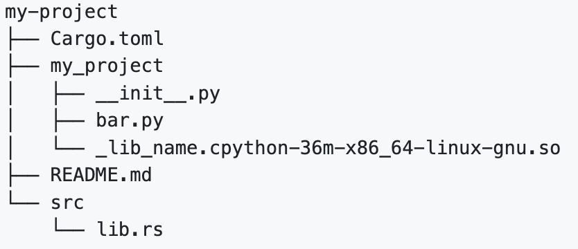

maturin develop을 통해 생성된 src/lib.rs는 숫자 2개를 받아서 더한 다음 String으로 Type을 변경해주는 간단한 예제 코드가 작성되어 있습니다.

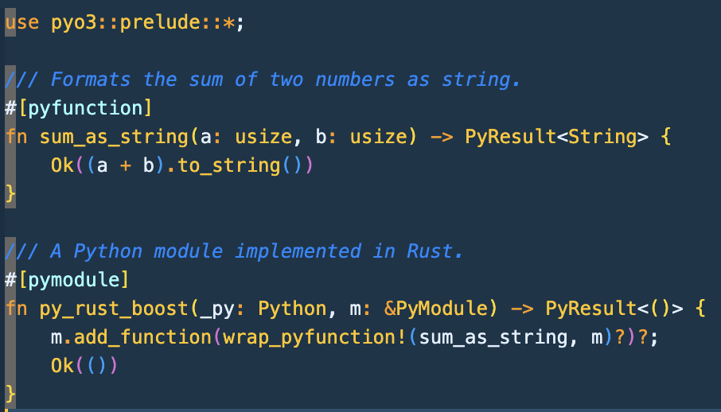

이 코드에 대해 대략적으로 설명을 하자면 #[pymoudle] 데코레이터는 일종의 패키지화를 돕는 데코레이터고, #[pyfunction] 데코레이터는 일종의 함수를 만들어주는 코드입니다. 그 다음에 사용하는 것은 정말로 간단합니다.

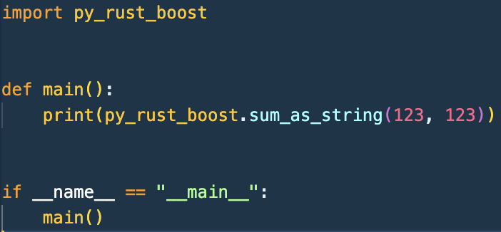

py_rust_boost라는 이름을 import 해주고, 그 다음에 위에 작성되어진 sum_as_string을 가져와서 사용하면 되는 것이죠. PyO3의 Documents는 [PyO3 user guide](https://pyo3.rs/v0.19.0/)에서 볼 수 있습니다.

## Code Benchmark
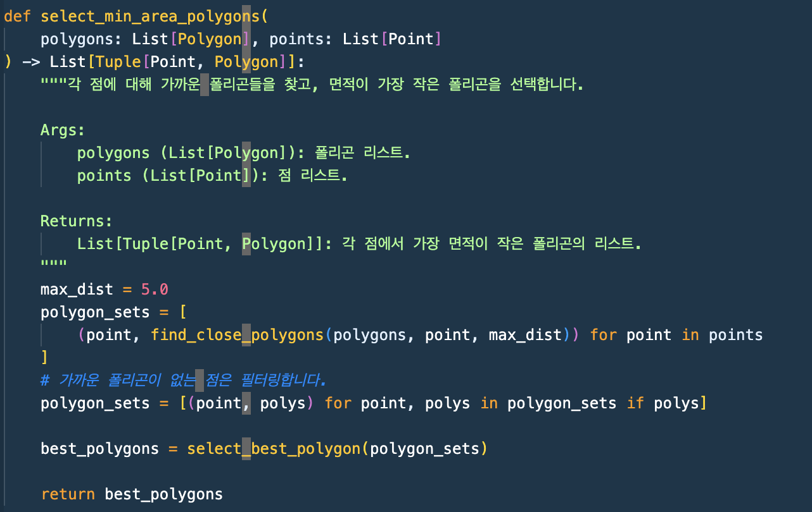

해당 튜토리얼은 [100, 100]의 범위에서 100개의 점을 임의로 생성하고 여러 폴리곤 중에서 점과 폴리곤이 가장 가까운 것을 찾고, 그 중에서 폴리곤 면적이 제일 작은 것을 골라내는 함수를 제작합니다. 이 함수는 속도 측정시 Ryzen R5-7700에서 약 144ms가 나오는 모습을 볼 수 있습니다. 이 결과는 Python 코드로 전부 제작된 코드를 실행한 것입니다.

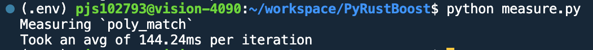

일반적인 경우 코드가 느리다는 것은 코드의 모든 함수가 다 느리지는 않습니다. 대부분 어느 특정 함수에서 느린 경우가 많습니다. 지피지기면 백전백승이라는 말이 있듯이, 무작정 성능 개선을 하겠다고 개발에 착수하는 것보다 무엇이 문제인지 어디에서 성능이 하락하는지를 먼저 알아야합니다. 그러나 이 측정 정보로 코드 중 어떤 부분이 느린지 알지 못합니다.

그래서 튜토리얼에서는 세세한 벤치마크를 위해서 [flamegraph](https://github.com/brendangregg/FlameGraph)로 표현 할 수 있는 [py-spy](https://github.com/benfred/py-spy)라는 라이브러리를 사용합니다.

Flamegraph는 Performance Engineering로 아주 저명한 [Brendan gregg](https://en.wikipedia.org/wiki/Brendan_Gregg)께서 만들었습니다. Flamegraph에 대해 짤막하게 설명하면 소프트웨어의 성능 분석 및 프로파일링을 위해 사용되는 시각화 도구입니다. 주로 프로그램의 실행 시간을 각 함수 또는 코드 조각에 할당하여 시각적으로 나타냅니다. Flamegraph 형식으로 나온 파일들은 svg 파일로 생성되며 웹에서 아래와 같이 간단하게 볼 수 있습니다.

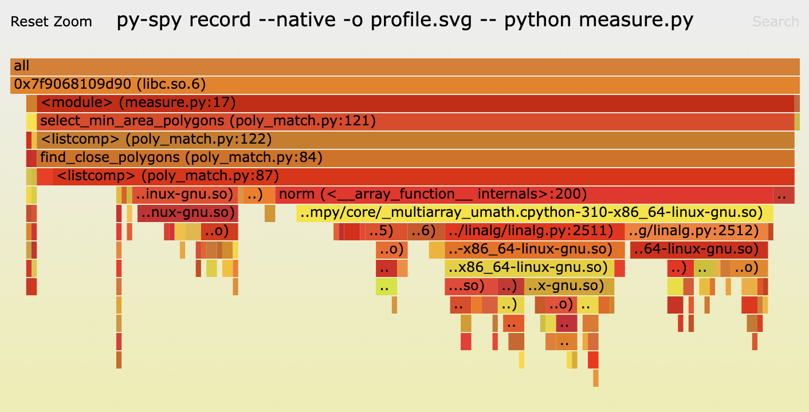

웹에서 svg 파일을 열면 클릭해서 module을 확대하여 더 세부적으로 볼 수 있고, 우측 하단의 Search를 통해서 특정 모듈을 찾을 수도 있습니다. flamegraph는 Low한 측정도 작동하게끔 만들어놔서 Python 뿐만 아니라 C로 작성된 공유 라이브러리까지도 측정을 하는 모습을 볼 수 있습니다. 여기서 py-spy로 flamegraph를 작성할 때 빛을 발하는 것입니다. py-spy는 Python을 profiling하며 native한 profiling도 지원합니다. 그래서 py-spy와 flamegraph와 찰떡궁합인 것이죠. 또한 py-spy로 flamegraph 표준을 지킨 파일도 작성합니다. ~~재밌게도 py-spy도 모두 Rust로 작성되었습니다 ㅋㅋ~~

## 수술을 시작해 봅시다.
사실 위 그래프는 select_min_area_polygon 함수를 측정한 내용입니다. 사진을 보시면 중간쯤 norm이라는 것이 함수의 60% ~ 70%를 잡아 먹고 있는 것을 볼 수 있습니다. 즉 select_best_polygon, init을 제외한 나머지의 시간은 오로지 norm이 있는 find_close_polygons가 잡아먹는 것이죠.

그러면 find_close_polygons 함수를 Rust Code로 재작성 해봅시다.

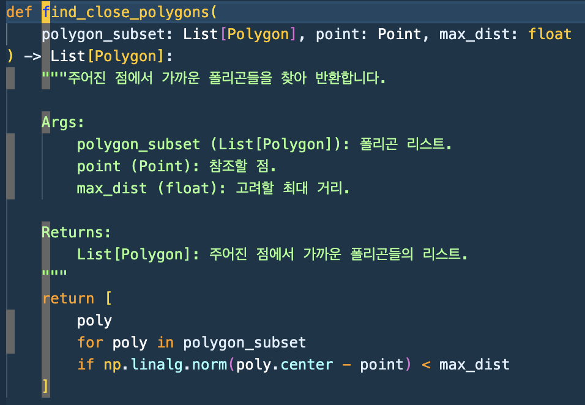

이 함수에서 Rust로 정말 단순하게 API만 일치시켜서 다시 재작성 해보겠습니다. 

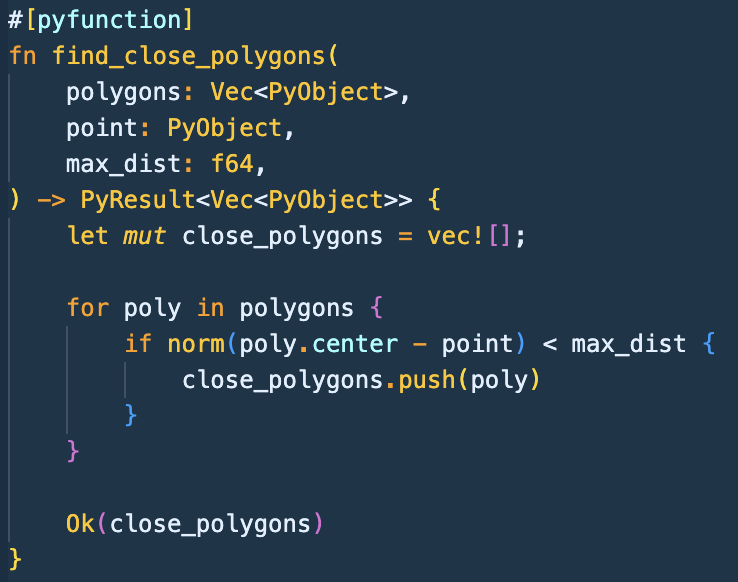

PyObject를 이용하면 Python의 모든 객체를 불러 올 수 있습니다. Python에서 List로 던져주면 PyO3는 자동적으로 Rust의 vector로 가져올 수 있습니다. 하지만 이게 빌드가 잘 될 수 있을까요?

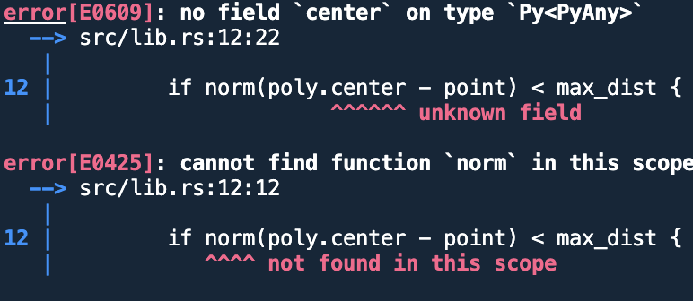

안타깝게도 Build가 되지 않는 모습을 볼 수 있습니다. 총 두 가지의 문제점이 있습니다.
- Python에 있는 np.linalg.norm 함수가 Rust 코드에는 구현되어 있지 않습니다.
- Polygon Dataclass에 있는 center를 가져오지 못하고 있습니다.

그러나 다행히 이 두가지 문제점은 간단하게 해결 할 수 있습니다. 

- Rust에는 numpy와 같은 작동을 하는 ndarray라는 라이브러리가 있고, 심지어 ndarray-linalg 라이브러리도 있습니다. 이 두 라이브러리는 C로 작성된 numpy 라이브러리와 다르게 모두 Rust 코드로 작성되어 있습니다. 그리고 PyO3에는 Rust의 ndarray와 Python의 numpy를 서로 연결시켜주는 API 라이브러리도 제공하고 있습니다.

- PyObject로 가져온 객체에서 하위의 객체를 사용하려면 바로 불러올 수 있는 것이 아닌 getattr(py, "center")? 이렇게 가져올 수 있습니다. 그러면 왼쪽값에 있는 py는 무엇인가요? 라고 되물을수 있습니다. 이 py는 중요한 요소이므로 아래에서 설명하겠습니다.

우선 첫번째 문제부터 해결해 봅시다. 라이브러리가 없는 문제이므로 각 필요한 라이브러리들을 설치해줍니다.

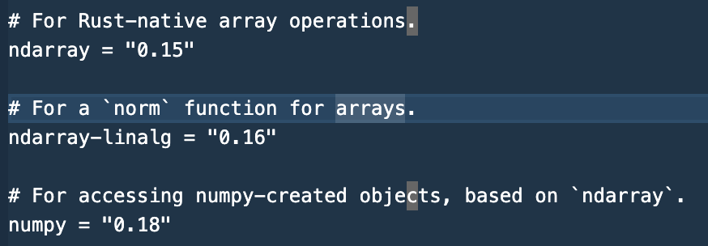

Rust에는 Cargo라는 의존성 관리 도구가 있습니다. Python에는 Poetry, Node.js에는 yarn, Java에는 Maven이나 Gradle가 있듯이, Rust에는 Cargo가 있다라고만 생각하시면 됩니다. Cargo.toml에 추가해서 다시 maturin develop -r 명령을 실행하시면 라이브러리를 다운받는 것을 볼 수 있습니다. 첫번째 문제는 이제 이에 대해서 일부 코드만 수정하면 해결이 됩니다.

두번째 문제는 Python의 객체를 Rust에서 읽어오려면 GIL(Global Interpreter Lock)을 가져와야 Python에 있는 객체들의 정보를 읽어올 수 있습니다. 그 GIL이 getattr(py, "center")? 여기서의 py인 것이죠, py의 GIL에서 정보를 받아와서 Polygon 객체의 center 객체를 가져와라 라는 뜻이 되는 겁니다.

(사족이지만, Python을 자주 사용하시는 분들이면 GIL을 가져와야 한다라는 내용을 듣고, "앗" 아니면 "헉" 이런 반응을 하실거라고 생각합니다. Python에서 멀티쓰레딩 작업을 못하는 이유 중 하나가 GIL 때문인데요, 하지만 PyO3에서도 이러한 문제점을 잘 알고 있어서 라이브러리 내부에서 GIL을 해제해서 멀티쓰레딩 효과를 누릴수 있게 하는 작업도 준비되어 있습니다. 게다가 정말 간단하게 할 수 있습니다. 이 점에 대해 궁금하신게 따로 있으면 [parallelism](https://pyo3.rs/v0.18.3/parallelism)를 참고하시기 바랍니다.)

그러면 이 두가지 문제점을 해결한 코드를 다시 작성해봅시다.

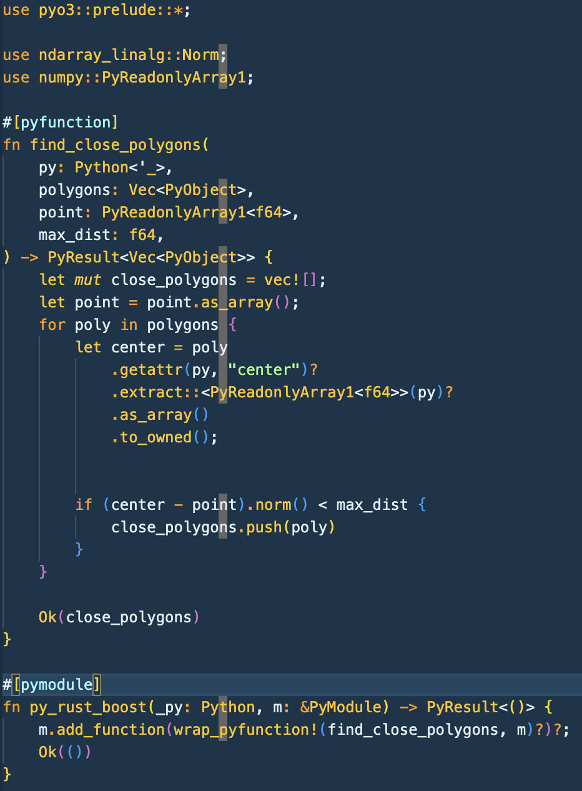

Rust에는 ndarray_linalg 라이브러리에도 norm이 있습니다. numpy의 norm 메소드와 완전히 동일하게 작동합니다. 그리고 numpy::PyReadonlyArray1을 이용해서 Python의 numpy array를 Rust의 ndarray로 가져옵시다.

find_close_polygons의 args를 보시면 polygons, point, max_dist 이외의 py라는 것이 새로 추가된 것을 볼 수 있습니다. 이게 바로 PyO3에서 GIL을 가져올수 있는 일종의 약속입니다.

이제 point 부분을 보시면 PyObject로 가져왔던 일반적인 방법에서 PyReadonlyArray1로 가져오는 모습을 볼 수 있습니다. Python에서 Rust로 np.array를 Rust에서는 PyO3에서 만든 numpy 라이브러리를 통해서 Rust의 ndarray로 받을 준비를 하는 것입니다. 이를 as_array() 로 Rust의 ndarray로 가져오는 것입니다.

이제 center 부분을 봅시다. Polygon 객체에서 .getattr(py, "center")?로 Python의 객체를 GIL을 통해서 읽어와서 center라는 객체를 읽게 될 수 있고, center는 Python numpy array이기 때문에 PyReadonlyArray1을 통해서 ndarray로 받을 준비를 하고 as_array()로 Rust의 ndarray로 가져옵니다.

대신 point와 다르게 to_owned()를 더 쓰는 걸 볼 수 있는데, 이는 일종의 copy와 비슷한 작업을 한다고 생각하시면 됩니다. 이것을 하는 이유는 center는 PyReadonlyArray1 즉 읽기 전용으로 뽑아낸 array이므로 center - point를 할 때 에러가 발생 할 수 있습니다. center를 to_owned로 값을 복사해 올 수 있으므로, center를 write를 할 수 있게 해주는 것입니다.

그 다음은 Python에서 만든 구현과 동일합니다. center - point를 한 후에 norm 하고 max_dist와 비교해서 가까운 폴리곤을 골라 냅니다. 최종적으로 얼마나 개선이 되었을까요?

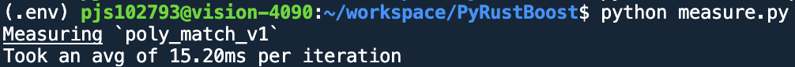

무려 144ms에서 15ms(- 129ms)로 단축되었습니다! 다시 한번 flamegraph를 뽑아봅시다. 그리고 측정을 할때 maturin develop -r 로 생성된 라이브러리로 측정을 하면 안됩니다. -r 옵션이 release 옵션이기 때문에 정보가 거의 나오지 않습니다. 측정을 할 때는 debug 모드를 켜고 측정을 합시다.

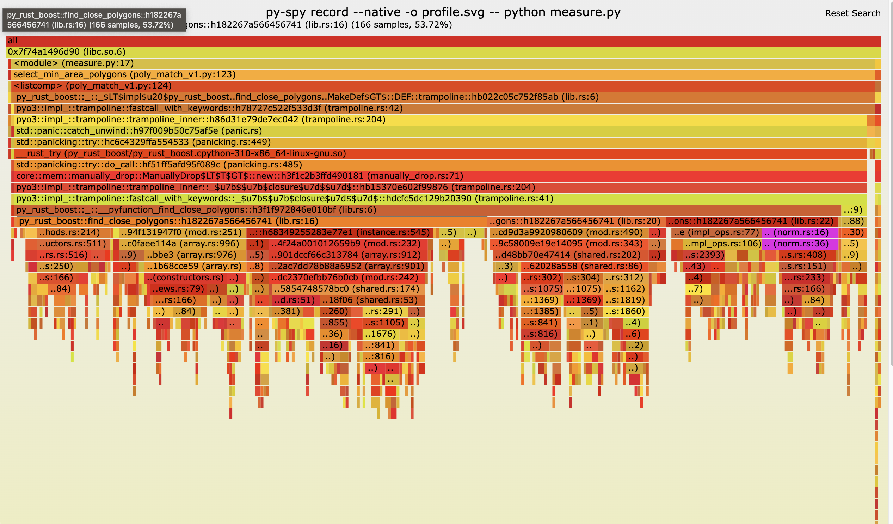

뭔가 Native Python으로 작성된 것보다 깊이가 깊어졌죠. Python과 Rust를 API로 서로 연결되면서 호출되는 것이 많아진 것도 있고, 또 Rust의 Debug 모드로 생성되서 Rust 언어 자체의 Core 단까지 출력이 되서 그런 것이니 크게 신경쓰지 않으셔도 됩니다. 오히려 주목해야할 부분은 사진에 있는 보라색 부분입니다. 저 보라색 부분이 norm 함수입니다. 150ms가 소요되는 Python에서는 전체 코드의 60~70%를 잡아먹고 있었던 norm 함수가 15ms가 소요되는 Rust에서의 norm은 불과 5~6%를 잡아먹고 있는 것입니다. 그럼 나머지는 무엇일까요? 

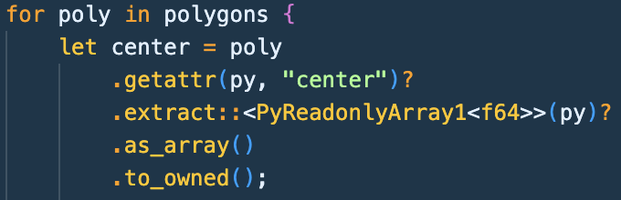

바로 이 부분입니다. 많은 반복문에서 일일히 polygon 객체에서 getattr해서 객체를 가져오고, extract, as_array를 통해서 Rust의 ndarray로 바꾸고, 게다가 to_owned()로 객체를 복사까지 하는 것입니다. 한 두번이면 모를까 polygons이 1,000개 있으니 이것을 반복하고 point도 100개 있으니까 총 100,000를 반복하여 오버헤드 크게 생기는 것입니다. 실제로 getattr, as_array, extract, to_owned가 find_close_polygons에서 70%를 잡아먹고 있습니다.

이에 대한 해결법은 아티클의 저자는 Polygon 객체를 Rust에 Rewrite를 하여 해결하였습니다. 이 이후에 최적화는 해당 아티클을 참고하면 될 것 같습니다. 

## 결론

저는 이 아티클을 따라하면서 오히려 Rust 성능의 위대함 보다는 성능 프로파일링을 하면서 최적화하는 매커니즘이 굉장히 중요한 것을 깨달았습니다. flamegraph로 어떤 특정 부분에서 소요가 많이 되고, 그 부분만 도려내서 최적화를 하는 것입니다. 그리고 그 다음 다시 flamegraph로 측정하고 이를 재반복 하는 것입니다. 이는 Rust로 재작성 하는 것 뿐만 아니라, 하나의 언어 안에서도 최적화 할 때 유용할 것이라고 생각합니다.

그리고 최적화 작업을 하면서 과연 극도로 최적화를 하는게 이득일까? 라는 생각도 몇번 들었습니다. 위에 튜토리얼처럼 1단계 최적화만 해도 성능이 비약적으로 상승하기 때문입니다. 또 2단계, 3단계 최적화를 할 수록 Python의 가독성이 점점 떨어지며, Rust로 재작성하는 부분이 많아집니다. 생산성과 속도 두마리 토끼를 잡아야하는데, 너무 속도에만 매달리면 생산성을 못 가져가는 것입니다. 반대로 생산성을 너무 챙기면 속도를 못 챙기는 것이죠. 그러므로 내가 작업할 수 있는 총 시간과, 최적화 할 수 있는 속도를 trade-off 관계로 잡고 두 개의 고점을 가져갈 수 있는 부분까지 하는게 제일 좋을 것 같습니다. 실제로 내가 해야 할 일은 find_close_polygon 뿐만 아니라, 다른 느린 함수를 최적화 해야 하니까요.

## Reference

이 튜토리얼 아티클을 작성해주시며 자세한 설명을 해주신 분께 감사드리고, PyO3 프로젝트를 만들어 주시고 발전시켜 주신 모든 Contributer 분들께 감사드립니다.
- https://ohadravid.github.io/posts/2023-03-rusty-python/ -> 이 아티클에 메인이 되는 튜토리얼 아티클입니다.
- https://github.com/ohadravid/poly-match.git -> 해당 튜토리얼에 관한 리파지토리입니다.
