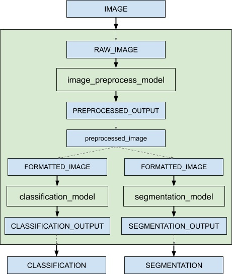
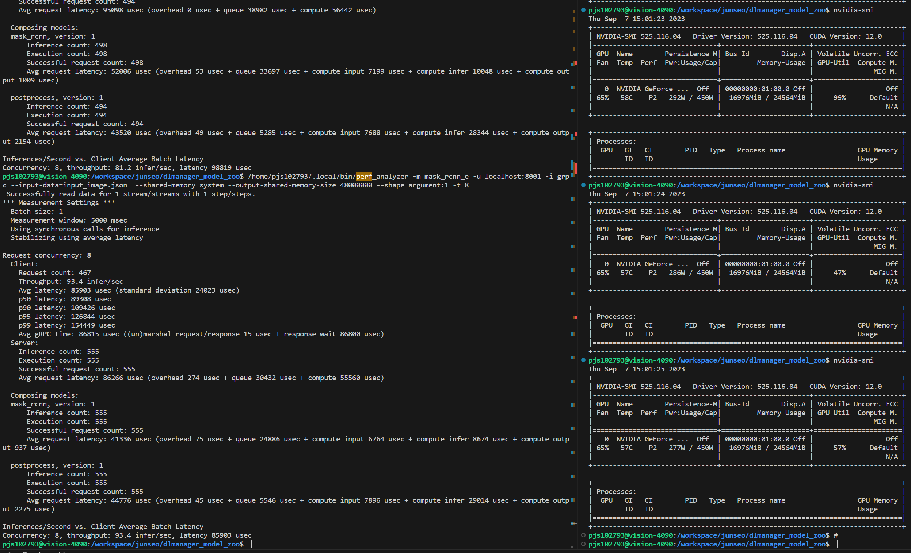
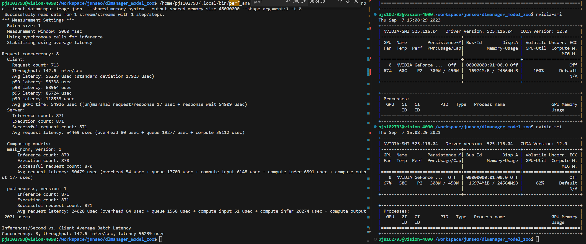

# Triton Inference Server의 파이프라인 오버헤드 줄이기

기본적으로 CPU와 GPU는 연산하는 "위치"가 다릅니다. CPU는 메인보드 대략 중앙에 있는 거대한 쿨러 속에 숨어있고, GPU는 그 아래에 요즘따라 점점 거대해지고 있는 쇳덩어리가 바로 그것이죠. 그리고 그것을 연결해주는 것이 PCIe 버스가 있습니다. 이 PCIe 버스에 CPU의 데이터와 GPU의 데이터가 오가죠.

많은 사람들이 간과하는 중요한 부분이 바로 이 PCIe 버스를 통한 데이터 전송입니다. 예시를 들어볼까요? 저희가 인천에서 모란으로 이사를 간다고 생각해봅시다. 이사를 가려면, 인천 집에 있는 물건들을 모란 집으로 옮겨야 합니다. 이럴 때 대부분 트럭을 사용하거나, 그에 준하는 큰 차를 이용합니다.

이제 인천 집은 CPU, 모란 집은 GPU, 트럭은 PCIe 버스로 생각봅시다.

- 트럭의 크기 (대역폭): 트럭이 클수록 한 번에 많은 물건을 옮길 수 있습니다. 일반적으로 저희는 왕복 이동을 최소화하기 위해 짐을 최대한 많이 실으려고 합니다. 작은 트럭을 여러 번 왕복시키는 것보다 큰 트럭 한 대가 한 번만 가는 것이 효율적이니까요. PCIe 버스의 대역폭도 마찬가지입니다. 높은 대역폭을 가진 버스는 더 많은 데이터를 효율적이고 빠르게 전송할 수 있습니다.

- 트럭의 속도 (지연 시간): 트럭이 빠를수록 물건을 빨리 옮길 수 있습니다. 하지만 트럭은 대부분의 차량보다 빠르지 않습니다. 단지 트럭은 많은 짐을 한꺼번에 옮길 수 있습니다. 그러므로 트럭이 출발하고 도착하는 데에도 꽤 시간이 걸립니다. PCIe 버스도 이와 비슷하게, 데이터의 전송 시작과 종료 사이에는 이러한 지연 시간이 발생합니다.

- 짐을 싣고 내리는 과정 (오버헤드): 트럭에 물건을 싣거나 내리는 데에도 시간이 걸립니다. 마찬가지로, CPU와 GPU간의 데이터를 복사할 때도 추가적인 시간이 필요합니다. (CPU와 GPU간의 데이터 전송은 move가 아닌 copy입니다.)

데이터를 CPU에서 GPU로 전송하는 것은 단순히 '데이터 이동'과는 다릅니다. 이를 이사와 비교하면, 짐을 다른 집으로 옮기는 것이 짐이 자동으로 뚝 떨어지는게 아닌 것과 같습니다. 결론은 데이터의 양, 전송 빈도, 그리고 필요한 전송 시간을 모두 고려하여야만 최적의 성능을 달성할 수 있습니다.

## 모델 파이프라인

옛날에는 많은 사람들이 인공지능이 굉장히 복잡하며, 다양한 일들을 수행할 수 있을 것이라고 생각했습니다. 지금도 실제로 인공지능은 굉장히 복잡한 일들을 수행하고 있죠. 또한 딥 러닝과 같은 최신 기술의 등장으로, 원시 데이터 입력부터 최종 결과 출력까지 모든 과정을 하나의 모델로 처리할 수 있게 되었는데, 이를 "End-to-end 모델"이라고 합니다.

그러나 모든 Task에 End-to-end 모델이 효과적이진 않았습니다. 예시로, 모델에서 나온 값을 검증된 알고리즘에 덧붙여서 더 좋은 성능을 이끌어 내기도 하며, 여러 모델의 예측을 조합하여 전반적인 성능을 향상시키는 앙상블 기법을 사용하기도 하고, 모델에서 나온 값은 알고리즘을 통과한 뒤 다시 다른 모델로 다시 처리하는 경우도 있습니다. 

이러한 경우는 모델의 성능을 상승시킬 수는 있으나, 모델의 속도는 어떨까요? 파이프라인이 복잡할 수록, 데이터의 이동도 많아집니다. 데이터의 이동이 많아진다는 것은, CPU와 GPU를 오가는 과정이 많아진다는 의미이므로 오버헤드가 생길수 있습니다.

모델에서 나온 GPU 데이터를 후처리를 하기 위해 CPU 데이터로 전환하고 후처리를 한 후에 GPU 데이터로 바꾸고 다시 모델에 넣는 경우를 생각하면, 가능한 후처리 코드를 GPU 코드로 바꾸어서 데이터 이동이 없게 하는게 가장 효율적인 방법이겠죠. 하지만 GPU 데이터를 다른 프로세스의 GPU 데이터에 맞게 전송하기란 꽤나 힘든 일입니다.

예를 들면, TensorRT 모델에서 나온 GPU 데이터를 PyTorch GPU 데이터로 온전하게 옮길 수 있을까요? 물론 GPU 메모리 포인터를 잘 쓰면은 가능 할 것입니다. 하지만 이 작업은 C, C++, CUDA에서 할 수 있는 난이도가 높은 작업이고, 자주 사용하는 Python에서는 아마도 불가능할 것입니다.

예시로 설명한 TensorRT와 PyTorch 간의 데이터 전달 뿐만 아니라, GPU를 활용하는 다양한 라이브러리 간의 데이터 전달은 종종 복잡한 문제로 다가왔습니다. 이에 대한 해결책을 모색하던 연구자와 엔지니어들은 GPU 메모리 배열에 대한 통합된 표준의 필요성을 인지하였고, 이러한 고민의 결과로 DLPack이라는 표준이 탄생하게 되었습니다.

## DLPack

DLPack은 위에 말한 것처럼 텐서의 메모리 배열을 표현하기 위한 개방형 표준입니다. DLPack을 사용하면 다양한 딥 러닝 프레임워크 간에 텐서를 오버헤드 없이 교환할 수 있습니다. 즉 PyTorch에서 GPU에 있는 데이터를 dlpack으로 묶어서 TensorFlow, MXNet, TensorRT 등등의 라이브러리에 오버헤드 없이 데이터를 전송할 수 있는 것입니다.

그리고 큰 장점은 이 DLPack이 Python에서도 유효하다는 것입니다. 즉 Python에서 GPU 데이터를 오버헤드 없이 전달 할 수 있습니다. 사용법도 매우 간단합니다.

```python
import torch
import tensorflow as tf
from torch.utils.dlpack import to_dlpack

# PyTorch GPU 텐서 생성
tensor = torch.randn(3, 4).to("cuda:0")

# DLPack으로 변환
dlpack_tensor = to_dlpack(tensor)

# DLPack을 Tensorflow GPU 텐서로 다시 변환
tf_tensor = tf.experimental.from_dlpack(dlpack_tensor)
```

이러면 끝입니다. 단 두줄의 Python 코드로 PyTorch의 GPU 데이터를 TensorFlow GPU 데이터로 복사조차 하지 않고 간단하게 옮겼습니다. 
이 DLPack은 점점 표준이 되어가면서, Model Serving Server인 Triton Inference Server에서 빛을 발하게 되었습니다.

## Triton Inference Server와 DLPack의 시너지

Triton Inference Server는 Model Serving Server이며, 여러 백엔드 프레임워크를 지원합니다. TensorRT Backend, PyTorch Backend, Tensorflow Backend, 심지어 Python Backend도 사용할 수 있습니다. 이 많은 백엔드 프레임워크는 Ensemble을 통해서 연결이 가능합니다.



위 사진과 같이 image_preprocess_model을 Python 코드로 제작하고 Classification model을 TensorRT로도 Segmentation_model도 Tensorflow로도 만들어서 Ensemble을 할 수 있습니다. 이러면 사용자는 내부의 상황을 몰라도 Image만 서버에 전달 해주면 내부의 파이프라인을 타고 Classfication, Segmentation 결과가 나오는 것입니다.

여기서 더 복잡한 파이프라인이 작성된다면 어떨까요? 예를 들어서 모델에서 나온 값을 Pytorch 코드로 GPU를 사용하는 후처리가 추가된다거나, 모델 -> 후처리 -> 모델이라던가, 이런 상황이 오면 매번 CPU와 GPU를 오가는건 매우 손해입니다. 이에 대해 Triton Inference Server의 Python Backend 개발자가 문제점을 느끼고, DLPack이 추가가되면서 해결이 되었습니다.

기존의 Python Backend는 값이 전달되면 무조건 CPU로 변환되는 과정이 있었는데, DLPack이 지원되면서 값이 전달된 것을 to_dlpack을 통해서 오버헤드 없이 GPU 데이터를 사용할 수 있게 되었습니다.

```python
from torch.utils.dlpack import from_dlpack
import triton_python_backend_utils as pb_utils

class TritonPythonModel:

  def execute(self, requests):
    ...
    input0 = pb_utils.get_input_tensor_by_name(request, "RAW_IMAGE")

    # Python Backend 텐서를 복사하지 않고 PyTorch 텐서로 변환했습니다.
    pytorch_tensor = from_dlpack(input0.to_dlpack())
```

이런 작업을 거치면 pytorch_tensor는 GPU 데이터를 가지고 있게 되는 것입니다. 이 GPU Pytorch Tensor로 GPU에 적합한 후처리 작업을 진행 할 수 있습니다. CPU로는 처리가 느린 grid_sample 같은 것도 빠르게 할 수 있죠. 자 그럼 실험을 해봅시다.

## 실험

간단한 파이프라인인 TensorRT Model(Mask RCNN) -> Python Pytorch Code(postprocess)를 ensemble한 파이프라인을 측정해보겠습니다. 한 실험은 DLPack을 사용하는 Python Code, 다른 실험은 DLPack을 사용하지 않고 CPU로 받은 값을 GPU로 변환한 다음 처리하는 Python Code입니다. 두 실험 모두 postprocess의 프로세스 개수는 4개로 실험했습니다. 

아래는 Request를 numpy로 가져온 후 torch.tensor로 Pytorch Tensor로 바꾼 후에, GPU 메모리로 다시 옮기는 과정입니다. DLPack을 사용하지 않으면 numpy로 받아와야 합니다.
```python
...
# Converting numpy arrays to torch tensors
num_detections_box_outputs = (
    torch.tensor(num_detections_box_outputs.as_numpy()).squeeze()
)
detection_boxes_box_outputs = (
    torch.tensor(detection_boxes_box_outputs.as_numpy()).squeeze().cuda()
)
detection_scores_box_outputs = (
    torch.tensor(detection_scores_box_outputs.as_numpy()).squeeze().cuda()
)
detection_classes_box_outputs = (
    torch.tensor(detection_classes_box_outputs.as_numpy()).squeeze().cuda()
)
detection_masks = torch.tensor(detection_masks.as_numpy()).squeeze().cuda()
...
```
간단한 파이프라인인데 Input(CPU) -> Mask RCNN(GPU) -> postprocess(CPU -> GPU) -> output(CPU) 무려 4번의 데이터 교환이 일어나는 모습을 볼 수 있습니다. 더 복잡한 파이프라인으로 가면 엄청나게 많은 데이터 교환이 일어날 겁니다.

아래는 Request를 DLPack을 통해서 gpu tensor로 가져오는 코드입니다.
```python
...
# 입력을 dlpack으로 가져와서 torch.from_dlpack으로 gpu tensor로 가져옵니다.
# 이를 통해서 GPU -> CPU의 병목현상을 해결 할 수 있습니다.
num_detections_box_outputs = torch.squeeze(
    from_dlpack(num_detections_box_outputs.to_dlpack())
)
detection_boxes_box_outputs = torch.squeeze(
    from_dlpack(detection_boxes_box_outputs.to_dlpack())
)
detection_scores_box_outputs = torch.squeeze(
    from_dlpack(detection_scores_box_outputs.to_dlpack())
)
detection_classes_box_outputs = torch.squeeze(
    from_dlpack(detection_classes_box_outputs.to_dlpack())
)
detection_masks = torch.squeeze(from_dlpack(detection_masks.to_dlpack()))
argument = from_dlpack(argument.to_dlpack())
...
```
반면 DLPack을 사용함으로써 Input(CPU) -> Mask RCNN(GPU) -> postprocess(GPU) -> output(CPU) 단 2번의 데이터 교환이 일어나는 모습을 볼 수 있습니다. 과연 효과가 있는지 perf_analyzer로 측정을 해봅시다.


위는 DLPack을 사용하지 않는 numpy로 가져오고, tensor로 바꾸고, gpu 데이터로 다시 옮긴 작업입니다. 보시다시피 GPU 사용량이 들쑥날쑥한게 별로 좋아보이진 않군요.


반면 DLPack을 사용하여 데이터 교환을 줄인 작업입니다. GPU 사용량도 훨씬 좋아지고, throughput도 1.5배 증가하였고, latency도 1.4배 가량 감소하였습니다. (이 두 작업은 다른 프로세스에 학습하고 있는 프로세스가 있어, mask_rcnn 부부닁 queue가 느려졌습니다.)

## 결론

[결론 쓰고 중간중간 사진넣고 글 다듬기] 