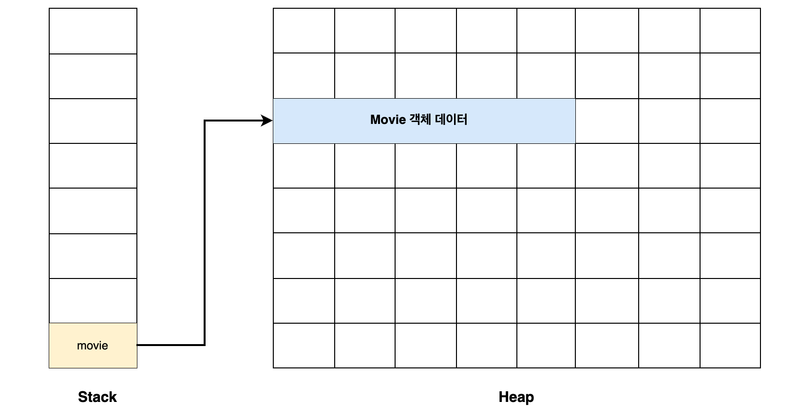
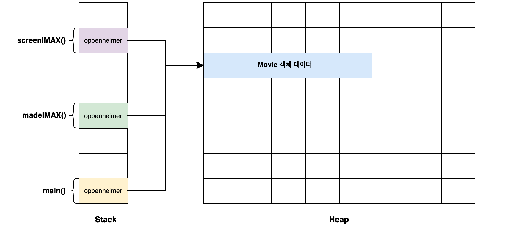

이번글에서는 객체지향언어, 특히 자바에서 객체를 다루는 다양한 방식에 대해서 알아봅니다.

# 1. Object References

객체(Object)를 생성해서 사용하려면, 언어에서는 필연적으로 변수에 객체를 담아야합니다. 이 변수에 담기는 것은 객체를 참조(Reference)하는 주소값입니다. 이를 Object Reference라고 부르고, 객체를 다루는 언어에서 객체를 사용하는 방법입니다.

간단한 영화 예제를 살펴보겠습니다.

```java
// Movie Object
public class Movie {
    private String title;
    private String directorName;
    private int runningTime;

		// 생성자 생략
}

// Object Reference
Movie movie = new Movie("오펜하이머", "크리스토퍼 놀란", 180);
```

생성한 `Movie` 객체는 메모리 어딘가에 저장이 될 것이고, `movie` 변수는 이 저장된 메모리의 시작 주소값을 할당받습니다. 이렇게 객체를 참조한 `movie` 변수를 통해 객체를 다룰 수 있습니다.



객체지향언어는 이러한 객체 생성 방식을 바탕으로 다양하고 복잡한 소프트웨어를 구현합니다. 그러다보니, 복잡한 객체들을 다루기 위해서 여러가지 제약을 만들어 다양한 방식으로 객체를 만들고 여기에 용어를 붙여서 사용하고 있습니다.

# 2. POJO(POCO, …)

POJO(Plain Old Java Object)는 이름 그대로 오래된 방식의 간단한 자바 객체라는 의미입니다. 시작은 Java EE와 같은 중량 프레임워크 사용으로 인해 자바 객체가 이에 종속되어 무거워지고 있는 것에 반발하여 사용하게 된 용어입니다. 따라서, 해석하면 POJO는 외부 프레임워크나 기술에 종속되지 않은 순수한 자바 객체입니다.

POJO를 만드는 방법은 getter/setter 이외에는 존재하지 않는 객체라고도 말하기도 하는데, 꼭 그렇지만은 않습니다.

현재, 특히 스프링 프레임워크에서 말하는 POJO는 **객체지향적이면서, 환경과 기술에 종속적되지 않고 필요에 따라 재활용될 수 있는 방식으로 설계된 오브젝트**입니다. (스프링 프레임워크는 기본적으로 POJO를 기반한 프레임워크입니다.) 넓게 보면, 프레임워크에 종속되지 않는 대부분의 자바 객체를 POJO라고도 볼 수 있습니다.

POCO(Plain Old CLR Object)는 POJO와 의미가 같지만, .Net 프레임워크 진영에서 사용하는 용어입니다. 그 외에도 PODS(Plain Old Data Structures, C++ 진영), POD(Plain Old Documentation, Perl 진영) 등등이 존재합니다.

# 3. Entity와 Value Object(VO)

위 두 개념은 DDD(Domain-Driven Design)에서 소개된 것으로 알려져있습니다. 도메인 모델을 언어에서 표현하기 위해서 Entity와 Value Object (이하 VO)를 사용합니다.

## 3.1. Entity

엔티티는 ‘식별자를 갖는 객체’입니다. 식별자를 갖는다는 것은 각각의 객체를 유일하게 구분할 수 있다는 것입니다. 이는 비즈니스를 구현하는데 매우 유용하게 쓰일 수 있습니다.

앞선 영화 예제를 엔티티로 표현해보면 다음과 같습니다.

```java
// Movie Object
public class Movie {
		private Long id;
    private String title;
    private String directorName;
    private int runningTime;

		// 생성자 생략
}

// Object Reference
Movie movie = new Movie(100L, "오펜하이머", "크리스토퍼 놀란", 180);
```

식별자로 `id` 라는 숫자를 부여한 모습입니다. 사실 식별자는 ‘고유하게 구별’만 할 수 있다면 어떤 값을 쓰는지는 상황에 따라 선택할 수 있습니다. 숫자대신 UUID와 같은 값으로 할 수도 있고, ‘주민등록 번호’와 같이 의미있는 값을 식별자로 선택할 수 있습니다.

> 식별자는 정해진 이후에 변경하기에는 부작용이 매우 클 수 있습니다. 특히, 의미있는 식별자를 사용하는 경우에는 이 의미가 변경될 수 있음을 항상 인지해야합니다. 따라서 요즘에는 식별자로 대부분 의미없는 숫자의 나열과 같은 값을 사용하는 것을 추천하고 있습니다.
> 

이렇게 식별자를 갖는 순간, 해당 객체는 **추적**이 가능해집니다. 서비스는 서비스가 지속되는 동안 변경해야할 정보들이 많습니다. 서비스를 사용하는 동안 상태값이 계속 변하고 이에 따라 적절한 결과가 발생해야 합니다. 따라서, 변경이 필요한 정보가 어떤 것인지 알아내야 합니다. 엔티티는 이러한 정보를 다루기 위한 객체입니다.

예를 들어, 입출금 서비스가 있습니다. A 계좌에서 출금하여, B 계좌에 입금을 하려고 한다면 모든 계좌 중에 A, B 계좌를 식별해야 입출금 기능이 가능해집니다.

식별자를 갖는 순간, 엔티티의 생명주기를 관리할 수 있습니다. 다시 입출금 서비스를 예로 들면, A 계좌를 생성하였다가 시간이 지나 해지를 하는 순간이 올 것입니다. 해지를 하는 순간 A 계좌 엔티티의 생명은 끝이 났다고 볼 수 있죠. 아니면 해지가 아닌 잠시 중단을 할 수도 있을 것입니다. 중단 이후에 다시 계좌를 살릴 수도 있겠죠. 엔티티는 이러한 비즈니스 관점에서 생명주기를 관리할 수 있습니다. 

주의할 점은 구현 기술에 대한 생명주기와 구분을 해야합니다. 엔티티도 결국 자바와 같은 언어에서 구현하게 된다면 Object Reference일 뿐입니다. 이는 서비스가 시작될 때 메모리에 잠시 올라가 있을 뿐이고, 어떠한 경우에는 GC에 의해 해제가 되어 없어질 수도 있습니다. 이때 엔티티의 생명주기가 끝났다고 봐야할까요?(Object Reference의 생명주기는 끝났다고 볼 수 있을 것입니다.) 그렇지 않을 것입니다. 엔티티는 비즈니스 도메인 개념을 나타내는 객체입니다. 그러므로 서비스가 지속되는 동안은 영구히 지속되는 공간에 저장을 해야합니다. 대표적으로 데이터베이스가 있습니다. 여기에 엔티티를 저장하고, 다시 가져올 때는 식별자가 있기 때문에 구현 기술에 관련없이 같은 식별자라면 같은 엔티티로 판단하고 비즈니스 로직을 수행할 수 있습니다.

### Entity의 한계

엔티티는 계속 내부 상태가 변경됩니다. 이는 관리하기가 복잡하다는 의미이기도 합니다. 여기에 더해 자바와 같은 언어에는 이를 더욱 복잡하고 관리가 어렵게하는 문제가 있습니다. 바로 **aliasing(별칭) 문제**입니다.

다시 영화 예제를 살펴봅시다.

```java
// Movie Object
public class Movie {
		private Long id;
    private String title;
    private String directorName;
    private int runningTime;
		private int limitAge;

		// 생성자 생략
}

// Object Reference
Movie movie = new Movie(100L, "오펜하이머", "크리스토퍼 놀란", 180);
```

여기서 별칭은 `movie` 라는 변수입니다. 객체를 사용하기 위해서 사실 별칭 문제는 피할 수 없습니다.

한 가지 더 별칭을 사용하는 예제를 봅시다.

```java
public boolean isItForAllAges(Movie movie) {
	// ...
}
```

메서드를 선언하여 `Movie` 객체를 매개변수로 받는다고 하면, 이 `movie` 매개변수 역시 별칭을 갖습니다. 별칭의 문제는 이 별칭에서는 모두 해당 객체에 접근해서 변경을 할 수 있다는 가능성이 존재하기 때문입니다.

```java
Movie oppenheimer = new Movie(100L, "오펜하이머", "크리스토퍼 놀란", 180);

if (movieService.madeIMAX(oppenheimer) {
	theaterService.screenIMAX(oppenheimer);
}

if (movieService.made4DX(oppenheimer) {
	theaterService.screen4DX(oppenheimer);
}

// ...
```

위처럼 여러 메서드에서 `Movie` 객체를 매개변수로 받는 경우라면, 나중에 변경을 추적할 때 해당 메서드의 모든 곳을 찾아보아야합니다. 



자바에서 이 별칭 문제가 더욱 위험한 것은 이를 막아줄 키워드가 존재하지 않는 것입니다. `final` 키워드를 떠올릴 수 있지만, 이는 C++, C#의 `const` 와는 다르게 객체의 변경을 막아주지는 않고 재할당만 막아주는 키워드일 뿐입니다.

```java
final Movie oppenheimer = new Movie(100L, "오펜하이머", "크리스토퍼 놀란", 180, 15);
System.out.println(oppenheimer.getRunningTime()); // 180
oppenheimer.setRunningTime(190);
System.out.println(oppenheimer.getRunningTime()); // 190
```

```java
final Movie oppenheimer = new Movie(100L, "오펜하이머", "크리스토퍼 놀란", 180, 15);
System.out.println(oppenheimer.getRunningTime()); // 180
setRunningTime(190);
System.out.println(oppenheimer.getRunningTime()); // 190

private void setRunningTime(final Movie movie, int runningTime) {
        movie.setRunningTime(runningTime);
}
```

정리하면, 객체에서 변경이 가능하다는 것은 관리하기가 복잡하게 되는 원인 중 하나입니다. 이를 해결하는 방법은 간단합니다. 불변 객체로 만드는 것입니다.

## 3.2. 불변 객체 (Immutable Object)

불변 객체는 ‘객체 생성 이후에는 객체의 상태가 변경되지 않는 객체’를 말합니다.

불변 객체의 장점은 다음과 같습니다.

- 이해하기 쉽고 안정적인 서비스 개발에 도움이 된다.
- map, set, cache에 쓰기에 적절하다.
- thread-safe
- 방어적 복사를 할 필요가 없다.

불변 객체는 의미는 단순하고 장점이 많지만, 자바에서 구현할 때는 다음의 요구사항을 충족시켜주어야 합니다.

- 상태 변경 메서드는 모두 제거한다.
- 내부 필드는 모두 private final로 선언한다.
- 클래스 상속을 금지한다.
- 필드 중 mutable 객체 또는 컬렉션의 레퍼런스는 공유하지 않는다. ⇒ 방어적 복사 사용

이를 구현하는 영화 예제를 살펴보겠습니다.

먼저, mutable 객체입니다.

```java
public class Movie {
    private String title;
    private Director director;
    private int runningTime;
    private List<Tag> tags;

		public Movie(String title, Director director, int runningTime, List<Tag> tags) {
        this.id = id;
        this.title = title;
        this.director = director;
        this.runningTime = runningTime;
        this.limitAge = limitAge;
        this.tags = tags;
	  }
		
    public String getTitle() {
        return title;
    }

    public Director getDirector() {
        return director;
    }

    public int getRunningTime() {
        return runningTime;
    }

    public List<Tag> getTags() {
        return tags;
    }
}
```

이를 immutable한 객체로 바꾼 모습입니다.

```java
public final class Movie {
    private final String title;
    private final Director director;
    private final int runningTime;
    private final List<Tag> tags;

		public Movie(String title, Director director, int runningTime, List<Tag> tags) {
        this.id = id;
        this.title = title;
        this.director = new Director(director);
        this.runningTime = runningTime;
        this.limitAge = limitAge;
        this.tags = copyAllTags(tags);
	  }
		
    public String getTitle() {
        return title;
    }

    public Director getDirector() {
        return new Director(director);
    }

    public int getRunningTime() {
        return runningTime;
    }

    public List<Tag> getTags() {
        return copyAllTags(tags);
    }

		public List<Tag> copyAllTags(List<Tag> tags) {
        List<Tag> copiedTags = List.copyOf(tags);
        tags.forEach(t -> copiedTags.add(new Tag(t)));
        return copiedTags;
    }
}
```

여기서 주목할 것은 `Director` 와 `List<Tag>` 입니다. `Director` 는 mutable한 객체이고, `List<Tag>` 는 컬렉션이기 때문에 방어적 복사를 생성자와 `getter` 에 사용하였습니다. (만약 `Director` 도 immutable 객체하면 방어적 복사는 필요없습니다.)

> Java 10 버전 이상부터는 List, Map, Set 등 컬렉션 인터페이스가 기본적으로 Unmodifiable로 변경된 것으로 보입니다. `add()` 시도시 `UnsupportedOperationException` 예외가 발생합니다. 런타임 에러라는 것이 아쉽긴 합니다.
> 

모든 부분에 불변 객체를 사용할 수는 없겠지만, 사용할 수 있는 모든 부분은 불변 객체로 사용하는 것이 안정적이고 이해하기 쉬운 코드를 만들 수 있습니다. 추천하는 방법은 처음에는 모두 불변 객체로 만들었다가 변경이 필요한 시점에 점진적으로 풀어나가는 것입니다.

엔티티로 돌아가보면, 엔티티는 서비스가 진행됨에 따라서 상태가 변경하다보니 그 자체로 불변 객체로 하기에는 거의 불가능하다고 볼 수 있습니다. 하지만 내부 필드 중에는 불변 객체로 만들 것들이 분명 존재할 것입니다.

## 3.3. Value Object

VO는 문자그대로 value(값)을 나타내는 객체입니다. 단순히 값을 나타내는 것이므로 엔티티와 달리 상태와 생명주기를 관리할 필요가 없으며, 무엇보다 불변 객체로 관리할 수 있습니다.

‘값’이라는 것은 다양하고, 정하기 나름입니다. 입출금 예제에서라면 입금되고 출금될 때는 10,000원 또는 20,000원 등 금액이 있을 것입니다. 이 금액도 값입니다. 영화 예제에서라면 `title` 과 같은 제목 문자열도 그 자체가 값이라고도 볼 수 있습니다. 이 값은 그 값 자체가 같으면 모두 같다고 볼 수 있습니다.

VO를 만족시키기 위해서는 아래 두 가지 조건을 만족시켜야합니다.

- 내부 필드가 같으면 같은 객체이다.
- 불변 객체이다.

아래 예제에서는 `Director` 를 값으로 보고 VO로 선언해보겠습니다.

```java
public final class Director {
    private final String name;
    private final int debutYear;
		// 생성자 및 getter 생략
		
		@Override
    public boolean equals(Object o) {
        if (this == o) return true;
        if (o == null || getClass() != o.getClass()) return false;
        Director director = (Director) o;
        return debutYear == director.debutYear && Objects.equals(name, director.name);
    }

    @Override
    public int hashCode() {
        return Objects.hash(name, debutYear);
    }
}

public class Movie {
    private final String title;
    private final Director director;
    private final int runningTime;
    private final List<Tag> tags;
		
		public Movie(String title, Director director, int runningTime, List<Tag> tags) {
        this.id = id;
        this.title = title;
        this.director = director;
        this.runningTime = runningTime;
        this.limitAge = limitAge;
        this.tags = copyAllTags(tags);
	  }

    public Director getDirector() {
        return director;
    }

		// ...
}
```

먼저, `Director` 는 불변 객체가 되었으므로, 더이상 방어적 복사를 할 필요가 없어졌습니다. 또 한가지 내부 필드인 `name` 과 `debutYear` 으로 `equals()` 및 `hashCode()` 메서드를 구현하여 내부 필드가 같은 객체는 값으로 보고 모두 같은 객체로 취급하고 있습니다.

이렇게 엔티티 내부에 VO를 사용하면, VO인 객체는 추적할 필요가 없어서 추가 및 변경할 때 신경쓸 포인트를 줄일 수 있습니다. 즉, 복잡성을 줄여줍니다. 거기에 더해 VO에 필요한 기능은 여기에 담을 수 있으므로 역할이 분리되어 더욱 변경에 유연한 코드를 만들 수 있습니다.

# 4. DTO (Data Transfer Object)

DTO는 단순히 데이터를 전달하는 역할을 하는 객체입니다. 데이터를 전달하는 목적만을 가지고 있어 대부분 규칙없이 최대한 편리함을 위해 구현됩니다. 로직은 없다고 볼 수 있고, getter/setter 정도만 있는 것이 일반적입니다.

```java
public class MovieDto {
    private String title;
    private Director director;
    private int runningTime;
    private List<Tag> tags;
		// 생성자, getter, setter 생략
}
```

DTO를 사용하는 목적은 계층간의 의존성을 최대한 끊어내는데 있습니다. 레이어드 아키텍처를 기준으로 설명하면, controller / service / domain / intra 계층이 존재합니다. 계층간의 데이터를 주고 받을 때, 같은 데이터 형태를 사용한다면, 서로서로 영향을 줄 수 있습니다. 이를 끊기 위해서는 각 계층만의 데이터 형태를 쓰고, 이를 주고 받을 때는 DTO를 사용해서 적절히 변환하는 것입니다.

하지만, 이러한 경우 관리할 객체가 너무 많아져서 일반적으로는 view와 controller 사이의 데이터를 주고받을 때 정도 DTO를 사용합니다. HTTP API를 구현한다면 HTTP의 요청과 응답 값만 DTO로 관리하는 것입니다.

# 5. 일급 객체 (First-class object)

일급 객체는 first-class object, first-class citizen, first-class function 등 마지막 단어는 여러가지이지만, 모두 같은 의미입니다. 

> 컴퓨터 프로그래밍 언어 디자인에서, **일급 객체**(first-class object)란 다른 객체들에 일반적으로 적용 가능한 연산을 모두 지원하는 객체를 가리킨다. 보통 함수에 인자로 넘기기, 수정하기, 변수에 대입하기와 같은 연산을 지원할 때 일급 객체라고 한다. - 위키백과 ([https://ko.wikipedia.org/wiki/일급_객체](https://ko.wikipedia.org/wiki/%EC%9D%BC%EA%B8%89_%EA%B0%9D%EC%B2%B4)) -
> 

사실 위키의 정의로는 와닿지 않았는데, 간단히 생각해보면 **변수와 같이 다룰 수 있는 객체**정도로 이해하면 편합니다.

일급 객체를 만들기 위해서는 아래 요구사항을 만족시켜야합니다.

1. 함수의 매개변수가 될 수 있다.
2. 함수의 반환값이 될 수 있다.
3. 변수에 할당할 수 있다.
4. 동일 비교 대상이 될 수 있다.

자바에서는 Java 8 버전 이후 람다식과 스트림 API가 도입되면서, 일급 객체를 사용할 수 있게 되었습니다.

간단한 예제를 살펴보겠습니다.

```java
@Test
void square() {
    // 변수에 할당할 수 있다.
    Function<Integer, Integer> square = x -> x * x;

    // 함수의 매개변수가 될 수 있다.
    operateOnNumber(5, square);

    // 함수의 반환값이 될 수 있다.
    Function<Integer, Integer> cube = x -> x * x * x;
    Function<Integer, Integer> resultFunction = operateOnNumber(3, cube);
    Assertions.assertEquals(27, resultFunction.apply(3));

    // 동일 비교 대상이 될 수 있다.
    Assertions.assertEquals(square, square);
    Assertions.assertNotEquals(square, cube);
}

// 함수를 인자로 받는 메서드
private Function<Integer, Integer> operateOnNumber(int number, Function<Integer, Integer> operation) {
    System.out.println("Input: " + number);
    System.out.println("Output: " + operation.apply(number));
    return operation;
}
```

일급 객체와 같이 고차 함수 (Higher-Order Functions)와 콜백 함수(Callback Functions) 두 가지가 언급됩니다.

고차 함수는 일급 객체를 1번과 2번 요구사항대로 사용하는 것입니다. 즉, 함수의 매개변수로 사용되거나 반환값으로 사용되면 이를 고차 함수라고 부릅니다.

- `operateOnNumber()` 메서드는 함수를 매개변수로 사용하고 있는 고차 함수 입니다.
    - `operation` 이 매개변수를 함수 내에서 사용하고 있는데, 이를 콜백 함수라고 부릅니다.

```java
// 함수를 반환하는 고차 함수
private static Function<Integer, Integer> getPowerFunction(int exponent) {
    return x -> (int) Math.pow(x, exponent);
}
```

# 6. 일급 컬렉션 (First-class collection)

일급 컬렉션은 이름으로만 보면 일급 객체와 연관되어 있을 것 같지만은 그렇진 않습니다. 일급 컬렉션이라는 용어는 소트웍스 앤솔러지 책(The ThoughtWorks Anthology, 마틴 파울러 저)에서 소개되었습니다.

> 규칙 8: 일급 콜렉션 사용
> 
> 
> 
> 이 규칙의 적용은 간단하다.콜렉션을 포함한 클래스는 반드시 다른 멤버 변수가 없어야 한다.
> 
> 각 콜렉션은 그 자체로 포장돼 있으므로 이제 콜렉션과 관련된 동작은 근거지가 마련된셈이다.
> 
> 필터가 이 새 클래스의 일부가 됨을 알 수 있다. 필터는 또한 스스로 함수 객체가 될 수 있다.
> 
> 또한 새 클래스는 두 그룹을 같이 묶는다든가 그룹의 각 원소에 규칙을 적용하는 등의 동작을 처리할 수 있다.
> 
> 이는 인스턴스 변수에 대한 규칙의 확실한 확장이지만 그 자체를 위해서도 중요하다.
> 
> 콜렉션은 실로 매우 유용한 원시 타입이다.
> 
> 많은 동작이 있지만 후임 프로그래머나 유지보수 담당자에 의미적 의도나 단초는 거의 없다. 
> 
> - 소트웍스 앤솔로지 객체지향 생활체조편
> 

일급 컬렉션을 만드는 방법은 간단합니다. 

- 컬렉션을 클래스로 Wrapping
- 해당 클래스는 컬렉션 필드만 갖고, 그 외 다른 필드는 존재하지 않음.

다시 영화 예제로 돌아가보겠습니다. 영화에 출현한 배우를 나타내는 `Actor` 객체가 있고, `Movie` 는 해당 영화에 출현한 모든 배우를 갖고 있는 `List<Actor>` 가 있습니다. 이 리스트를 `Actors` 라는 일급 컬렉션으로 만들어봅니다.

```java
public class Actors {
    private List<Actor> Actors;
		// ...
}

public class Movie {
    private String title;
    private Director director;
    private int runningTime;
    private Actors Actors;
		// 생성자, getter, setter 생략
}
```

`Actors` 처럼 일급 컬렉션으로 분리하면 얻는 장점은 다음과 같습니다.

- 비즈니스에 종속적인 자료구조
- 컬렉션의 불변성을 보장
- 필요한 상태와 행위를 한 곳에서 관리 가능
- 이름이 있는 컬렉션

비즈니스에 종속적인 자료구조와 필요한 상태와 행위를 한 곳에서 관리한다는 것은 추상화 개념에서 쉽게 이해할 수 있을 듯 합니다. `Actors` 예제를 살펴보면, 배우들이라는 개념에 필요한 모든 역할과 책임은 `Movie` 객체가 아닌 `Actors` 객체가 담당하게 되었습니다.

마지막으로 이름이 있는 컬렉션은 같은 `List<Actor>` 를 갖는 일급 컬렉션이라도 비즈니스적으로 구분되어야 하는 경우가 있을 수 있습니다. 이를 두 개의 일급 컬렉션으로 나눠서 관리한다면 더욱 복잡도를 낮출 수 있을 것입니다. 예를 들어, 주연 배우들과 조연 배우들에 따라 나뉘는 기능이 있다고 합시다.

```java
public class LeadingActors {
    private List<Actor> Actors;
		// ...
}

public class SupportingActors {
    private List<Actor> Actors;
		// ...
}
```

위처럼 일급 컬렉션을 두 개로 나눠서 만들면, 검색하기도 용이하고 각각의 필요한 변경사항을 적용하기가 쉬워질 수 있습니다.

# 참고자료

- [POJO] https://ko.wikipedia.org/wiki/Plain_Old_Java_Object
- 토비의 스프링 3.1
- [Value Object와 Reference Object에 대한 조용호님 블로그 글 정리 (원글은 현재 존재하지 않음.)] [https://github.com/parker1609/TIL/blob/master/DDD/조영호님_블로그/1.VALUE_OBJECT와_REFERENCE_OBJECT.md](https://github.com/parker1609/TIL/blob/master/DDD/%EC%A1%B0%EC%98%81%ED%98%B8%EB%8B%98_%EB%B8%94%EB%A1%9C%EA%B7%B8/1.VALUE_OBJECT%EC%99%80_REFERENCE_OBJECT.md)
- [불변 객체] https://www.youtube.com/watch?v=EOGOJdBy2Rg
- [DTO VS VO VS Entity] https://tecoble.techcourse.co.kr/post/2021-05-16-dto-vs-vo-vs-entity/
- [일급 객체와 일급 컬렉션] https://medium.com/ryanjang-devnotes/who-is-first-class-citizen-in-programming-world-b92c67b32635
    - https://javadoc.io/doc/io.vavr/vavr/0.9.2/io/vavr/Function3.html
- [일급 컬렉션] https://jojoldu.tistory.com/412
- [소트웍스 앤솔러지 책] https://www.yes24.com/Product/Goods/3290339