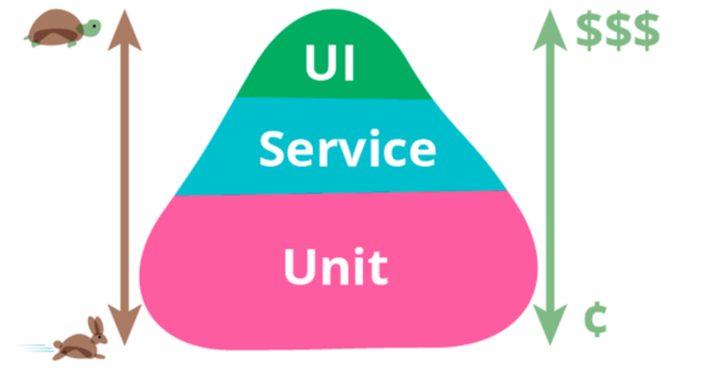
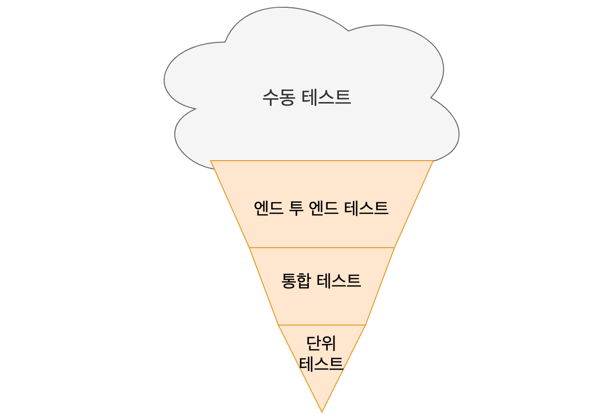
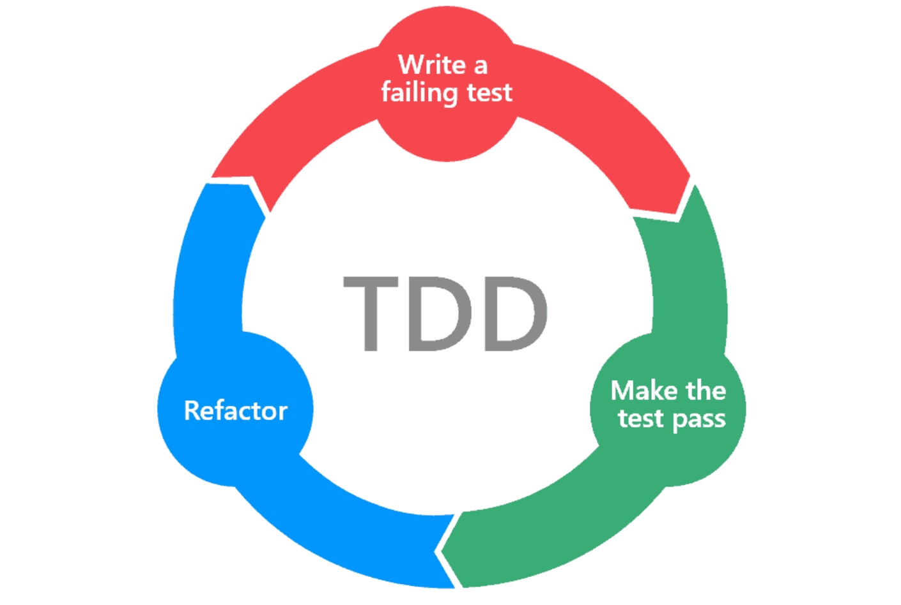

소프트웨어를 개발하면서 테스트에 대한 중요성은 많이 알려져있습니다. 테스트는 크게 수동 테스트와 자동화된 테스트 두 가지로 나뉩니다. 수동 테스트는 말그대로 손으로 직접 테스트를 하는 것으로 기능을 직접 실행하여 테스트합니다. 이는 테스트 환경을 설정하거나 테스트 과정을 직접 따라하는 과정의 시간이 오래 걸리고, 같은 테스트를 반복하기가 어렵습니다. 그리고 사람의 눈으로 확인하는 것이기 때문에 실수할 확률이 높아 신뢰도가 떨어집니다. 

반면에 자동화된 테스트는 일련의 스크립트를 작성하여 이 스크립트를 실행하는 것만으로 테스트가 완료됩니다. 스크립트를 잘 작성해야하는 어려움이 있지만, 한 번 작성한 테스트는 실행 한 번으로 모든 테스트를 할 수 있고 쉽게 반복할 수 있습니다.

이 글에서는 개발자가 할 수 있는 자동화된 테스트에 대해 이야기합니다.

> 이 글의 예제는 Java 언어 기준으로 작성되어 있습니다.

# 범위에 따른 테스트 종류

테스트의 종류는 일반적으로 테스트를 하는 범위에 따라서 나뉩니다. 아래는 범위가 작은 순서의 종류입니다.

- 단위 테스트 (unit test)
- 통합 테스트 (integration test)
- 엔드 투 엔드 테스트 (end-to-end test, 종단 테스트)

## 단위 테스트

단위 테스트는 가장 작은 범위의 테스트입니다. 일반적으로 코드 중에서 하나의 클래스 또는 메서드 단위의 로직을 검증하는 테스트입니다.

```java
@Test
void 두 수의 더하기 계산() {
    int result = StringCalculator.calculate("1+2");

    assertThat(result).isEqualTo(3);
}
```

위는 간단한 문자열 계산기의 더하기를 검증하는 테스트입니다. `StringCalculator.calculate()` 메서드라는 작은 단위이고, 다른 객체와의 의존성도 없습니다.

## 통합 테스트

통합 테스트는 중간 범위의 테스트로 볼 수 있고, 여러 모듈간의 상호작용을 검증하는 테스트입니다. 여기서 여러 모듈이란, 백엔드 개발 기준으로 일반적으로 데이터베이스 또는 외부 서버 간의 상호작용으로 볼 수 있습니다.

```java
@Test
void 게시글_정상_생성() {
		Long userId = 100L;

    Article article = articleService.save(articleRequestDto, userId);

    assertThat(result).isNotNull();
}
```

위는 게시글을 생성하는 서비스에 관한 테스트입니다. `articleService` 내에서는 userId에 해당하는 유저 정보를 DB에서 조회하고, 요청받은 내용을 가지고 게시글을 만들어 DB에 게시글을 저장하는 기능입니다. 이 기능은 DB와 상호작용을 해야하므로 통합 테스트입니다. (위를 단위 테스트로도 작성할 수 있는데, 이는 아래에서 살펴보겠습니다.)

## 엔드 투 엔드 테스트

엔드 투 엔트 테스트는 가장 큰 범위의 테스트로, 실제 사용자의 흐름에 따라 전체 기능을 검증하는 테스트입니다. 예를들어, 게시판에 글을 쓰는 기능을 테스트하고 싶은 경우라면 실제 앱에서는 다음과 같은 과정이 진행될 수 있습니다.

1. 게시판 웹 사이트 접속
2. 로그인
3. 글쓰기 버튼 클릭
4. 글 작성
5. 글쓰기 완료 버튼 클릭

이 전체를 테스트하는 것을 엔드 투 엔드 테스트라고 하고, 유사한 용어로 인수 테스트(acceptance test)라고도 볼 수 있습니다.

```java
@Test
void 전체_공개_게시글_정상_작성() {
    JSONObject articleJson = new JSONObject();
    articleJson.put("contents", ALL_CONTENTS);
    articleJson.put("imageUrl", IMAGE_URL);
    articleJson.put("videoUrl", VIDEO_URL);
    articleJson.put("openRange", RANGE_ALL);
    respondApi(loginAndRequest(HttpMethod.POST, "/api/articles", articleJson, HttpStatus.OK, loginSessionId(userRequestDto)))
            .jsonPath("$..contents.contents").isEqualTo(ALL_CONTENTS)
            .jsonPath("$..imageUrl.fileUrl").isEqualTo(IMAGE_URL)
            .jsonPath("$..videoUrl.fileUrl").isEqualTo(VIDEO_URL)
    ;
}

private ResponseSpec loginAndRequest(HttpMethod method, String url, Object object, HttpStatus httpStatus, String sessionId) {
    return webTestClient.method(method).uri(url)
            .cookie("JSESSIONID", sessionId)
            .contentType(MediaType.APPLICATION_JSON_UTF8)
            .body(Mono.just(object), Object.class)
            .exchange()
            .expectStatus()
            .isEqualTo(httpStatus)
            ;
}

private String loginSessionId(Object object) {
    return Objects.requireNonNull(webTestClient.method(HttpMethod.POST).uri("/api/signin")
            .body(Mono.just(object), Object.class)
            .exchange()
            .returnResult(String.class)
            .getResponseCookies()
            .getFirst("JSESSIONID"))
            .getValue()
            ;
}
```

위는 게시글을 작성하는 API에 대한 인수 테스트입니다. 서버의 관점에서는 5개의 과정중에서 로그인과 게시글 작성 요청 두가지가 순서대로 오는 시나리오로 정리할 수 있습니다. 위는 이 시나리오대로 테스트를 작성한 코드입니다. 그리고 실제로 해당 API를 호출하여 실제 환경과 유사한 환경에서 테스트를 하는 것이 중요합니다.

이렇게 보면 엔드 투 엔드 테스트만 작성하면 모두 테스트가 되지 않느냐라고 말할 수 있습니다. 이가 틀린 말은 아닐 수 있지만 매우 매우 비효율적인 것은 사실입니다. 엔드 투 엔드 테스트는 실제 환경과 유사한 환경에서 동작해야 합니다. 그러므로 환경 설정이 실제 환경만큼 복잡하고 매우 느립니다. 테스트를 동작하는 시간이 길어지면 길어질수록 테스트에 대한 반감이 커지고 결국 테스트를 하지 않는 지경에 까지 이를 수 있습니다. 

테스트는 검증하는 기능에 대한 피드백입니다. 피드백은 빠르면 빠를수록 좋습니다. 하지만 테스트의 범위가 커질수록 이 피드백 속도는 느려질 수 밖에 없습니다. 반대로 그러면 단위 테스트만 하면 되지 않느냐라고도 할 수 있습니다. 이도 적절하지 않습니다. 작은 독립적인 단위의 기능이 검증되었다고 하더라도 실제로 DB나 다른 서버와 연동했을 때 어떤 현상이 있을지는 전혀 모릅니다.

결국 3가지 모든 테스트는 모두 상호보완적이고 중요합니다. 그러면 어떻게 효율적으로 작성할 수 있을까요? 가장 대표적인 패턴으로 테스트 피라미드 패턴이 있습니다.



> 이미지 참고 링크: https://martinfowler.com/bliki/TestPyramid.html

위는 마틴 파울러의 블로그 글에서 발췌한 그림입니다. 테스트 피라미드 그림 중 가장 잘 나타내는 그림이라 생각되어 가져왔습니다. 피라미드의 아래쪽으로 갈수록 그 개수가 많아야합니다. 즉, 단위 테스트가 가장 테스트 개수가 많아야 하며, 엔드 투 엔드 테스트가 가장 적어야 합니다.

위 그림에서는 왜 그런지도 잠깐 살펴볼 수 있습니다. 피라미드 위로 올라갈수록 속도가 느려지고 비용이 커지기 때문에 그 수가 적은 것이 효율적입니다. (구글에서는 단위 테스트 80%, 통합 테스트 15%, 엔드 투 엔드 테스트 5% 비율을 권장한다고 합니다.)

반대로 안티패턴이라고 부르는 그림도 잠깐 살펴보겠습니다.



아이스크림 콘 패턴은 피라미드 패턴과 완전히 반대되는 패턴입니다. 엔드 투 엔드 테스트를 가장 많이 작성한 경우이며, 이는 속도도 느리고 변경하기도 쉽지 않습니다. 심지어 수동 테스트를 가장 많이 하는 것은 매우 좋지 않은 테스트 환경입니다.

여기서 알 수 있는 점은 단위 테스트가 가장 효율적이며, 많이 작성해야 하는 테스트입니다. 그만큼 더 중요하다고도 볼 수 있습니다. 그러면 단위 테스트에 대해서 조금 더 살펴보겠습니다.

단위 테스트는 3가지 속성이 있습니다.

1. 작은 코드 조각(단위) 검증
2. 빠르게 수행
3. 격리된 방식으로 처리하는 자동화된 테스트

1번과 2번은 바로 직관적으로 이해할 수 있습니다. 반면 3번에서는 ‘격리’란 단어에 주목할 필요가 있습니다.

코드를 작성하면서 하나의 클래스는 대부분 여러 클래스와 의존을 하고 있습니다. 그 상황에서 특정된 하나의 클래스만 독립적으로 테스트를 할 수 있어야 합니다. 그것이 작은 단위에 적합하고, 그 작은 단위에만 집중해서 효율적으로 테스트를 할 수 있습니다. 이를 위해 다른 의존성을 끊어내야하는데, 이때 격리를 사용할 수 있습니다.

격리를 하기 위해서는 일반적으로 **가짜 객체(fake object) 또는 모의 객체(mock object)**를 사용합니다. 이를 **테스트 대역(test double)**이라고도 부릅니다. 이를 사용하면 여러 의존성을 갖는 클래스라도 이 의존성은 모두 테스트 대역으로 대체하고 온전히 테스트하는 클래스에만 집중할 수 있습니다.

```java
@Test
void 게시글_정상_생성() {
    given(articleRepository.save(any(Article.class))).willReturn(article);
    given(modelMapper.map(article, ArticleResponseDto.class)).willReturn(articleResponseDto);
    given(userService.findById(any(Long.class))).willReturn(user);

    injectArticleService.save(articleRequestDto, USER_ID);

    verify(articleRepository).save(any(Article.class));
}
```

위는 자바에서 사용하는 라이브러리 중 하나인 mockito를 사용하여 게시글을 생성하는 단위 테스트입니다. 실제 로직에서는 DB에 조회 및 저장을 하지만, 테스트에서는 mock으로 이를 대체한 모습니다. `given` 절은 선언한 메서드는 실제로 실행하지는 않고 `willReturn` 에 명시한 반환값을 반환하여줍니다. 즉, 직접 DB에 접근하지 않는 것입니다. `verify` 절은 선언한 메서드의 실행 여부를 검증해줍니다.

마지막으로 어떤 단위 테스트가 좋은 테스트인지 살펴보고 마치겠습니다. 대표적으로 F.I.R.S.T 원칙이라는 것이 있습니다.

- **F**ast: 단위 테스트는 빨라야 한다.
- **I**solated: 다른 테스트에 종속적이지 않고 독립적이어야 한다.
- **R**epeatable: 테스트는 실행할 때마다 같은 결과를 만들어야 한다.
- **S**elf-validating: 테스트는 스스로 결과물이 옳은지 그른지 판단할 수 있어야 한다.
- **T**imely: 유닛 테스트는 프로덕션 코드가 테스트를 성공하기 직전에 구성되어야 한다.

# 학습 테스트

일반적으로 테스트를 말할 때는 기능을 테스트하는 것으로 볼 수 있습니다. 기능 외에도 학습을 위한 테스트도 매우 유용합니다. API, 라이브러리, 프레임워크에서 제공하는 기능을 학습 차원에서 확인이 필요할 때 주로 작성합니다.

```java
@Test
void convert_date_string() {
    String source = "20231029171208"; // yyyyMMddhhmmss

    String result = LocalDate.parse(source.substring(0, 8), 
															DateTimeFormatter.ofPattern("yyyyMMdd"))
			            .format(DateTimeFormatter.ofPattern("yyyy-MM-dd"));

    assertThat(result).isEqualTo("2023-10-29");
}
```

위 예제는 java에서 `LocalDate.parse()` API의 사용법을 익히는 학습 테스트입니다. 이렇게 라이브러리의 사용법이 궁금할 때 학습 테스트를 작성할 수 있습니다. 그리고 이를 그대로 남겨두면 팀원들에게도 코드를 이해하는데 도움이 될 수 있습니다. (나중에 이를 팀원이 사용해야한다면 더더욱 큰 도움이 될 수도 있습니다.)

# 테스트 개발 방법론

테스트를 위한 대표적인 방법론을 두 가지 살펴보겠습니다.

## TDD (Test Driven Development)

TDD는 기능에 대해 구현 코드를 작성하기 전 먼저 이에 대한 테스트 코드를 먼저 작성하는 개발 방식의 프로그래밍 방법입니다. 그 과정은 아래 그림과 같습니다.



> 이미지 참고 링크: [https://velog.io/@suhongkim98/TDD-BDD-ATDD-알아보기](https://velog.io/@suhongkim98/TDD-BDD-ATDD-%EC%95%8C%EC%95%84%EB%B3%B4%EA%B8%B0)

TDD는 세 가지 과정을 통해서 이루어집니다.

1. (RED) 먼저 실패하는 테스트 코드를 작성한다.
2. (GREEN) 1번에서 작성한 테스트 코드를 통과시키기 위해 빠르게 구현 코드를 작성한다.
3. (BLUE) 구현 코드와 테스트 코드를 리팩토링한다.

위 과정을 반복적으로 수행하며 작은 단위로 기능을 만들어나가면서 목표의 기능에 다가간다.

## BDD (Behavior Driven Development)

BDD는 TDD에서 파생된 개발 방법론입니다. TDD에서 작성한 테스트 케이스에 관한 방법론으로 테스트 케이스 자체가 요구사항이 되도록하는 개발 방법이다. 테스트 단위가 단순히 함수(또는 메서드) 단위가 아니라 기능의 시나리오(행동)에 따라 작성하는 것이며, 개발자가 아닌 사람이 봐도 이해할 수 있을 정도의 수준으로 작성하는 것을 권장한다.

BDD에서 대표적인 패턴은 두 가지가 있다.

### Given-When-Then 패턴

가장 많이 활용되는 패턴이다.

- Given: 테스트에 필요한 값을 설정한다.
- When: 테스트에 해당하는 시나리오를 실행한다.
- Then: 테스트 결과로 보장해야하는 값을 명시한다.

```java
@Test
void 두 수의 더하기 계산() {
		// Given
		String input = "1+2";

		// When
    int result = StringCalculator.calculate(input);

		// Then
    assertThat(result).isEqualTo(3);
}
```

사실 위에서 살펴본 예제 대부분은 이 패턴의 형태로 구현되어 있습니다. 그 중에서 첫 번째로 사용한 예제인데, 이는 이 패턴으로 정확히 표현은 하지 않았어서, 이를 다시 given-when-then 패턴으로 표현한 모습입니다.

### Describe-Context-It 패턴

이 패턴은 given-when-then 패턴과 유사하지만 행동에 대해 좀 더 상세한 설명이 가능합니다.

- Describe: 테스트 대상이 되는 클래스 및 메소드 이름을 명시한다.
- Context: 테스트할 메소드에 입력할 파라미터를 설명한다.
- It: 테스트 대상 메소드가 무엇을 리턴하는지 설명한다.

```java
@Nested
@DisplayName("calculate 메소드는")
class Describe_calculate {
  @Nested
  @DisplayName("더하기 문자열 계산식이 주어진다면")
  class Context_with_string_plus_formula {
		private final String input = "1+2";

    @Test
    @DisplayName("계산한 결과를 반환한다")
    void it_returns_result() {
			int result = StringCalculator.calculate(input);
	    assertThat(result).isEqualTo(3);
    }
  }
```

Java의 JUnit5 버전에서는 아직 이 패턴을 제공해주지는 않습니다. 그래도 `@Nested` 를 사용하면 계층 구조를 표현할 수 있어 이를 활용할 수 있습니다. 위는 given-when-then 패턴의 예제를 그대로 describe-context-it 패턴으로 변경한 것입니다. 보시다시피 좀 더 상세한 설명을 할 수 있고, 계층 구조이다 보니 다양한 테스트 케이스를 보기 쉽게 추가할 수 있습니다.

> 복잡한 케이스에 대해 테스트를 할 때는 현재 이 패턴을 주로 사용하고 있습니다. 이에 대한 자세한 내용은 이 [링크](https://johngrib.github.io/wiki/junit5-nested/)를 참고하시면 많은 도움이 될 듯 합니다.
> 

# 테스트 안티 패턴 13가지

테스트에 대한 개인적인 기준은 사실 여전히 모호하다고 생각됩니다. 사실 이는 제 개발 인생동안 명확한 기준을 만들 수 있을지도 잘 모르겠습니다. 그럼에도 예전에 공감갔던 글을 하나 정리해둔 적이 있어서 다시 보았는데 아직도 같은 생각이고 나름 실천을 하고 있었습니다. 

> - [소프트웨어 테스트 안티 패턴 - 1, 번역](https://velog.io/@leejh3224/%EC%86%8C%ED%94%84%ED%8A%B8%EC%9B%A8%EC%96%B4-%ED%85%8C%EC%8A%A4%ED%8A%B8-%EC%95%88%ED%8B%B0-%ED%8C%A8%ED%84%B4)
- [소프트웨어 테스트 안티 패턴 - 2, 번역](https://velog.io/@leejh3224/%EC%86%8C%ED%94%84%ED%8A%B8%EC%9B%A8%EC%96%B4-%ED%85%8C%EC%8A%A4%ED%8A%B8-%EC%95%88%ED%8B%B0-%ED%8C%A8%ED%84%B4-2)

위 글은 번역글인데, 원문 글은 현재 링크가 들어가지지 않는 군요..
> 
1. 통합 테스트를 전혀 작성하지 않는다.

통합 테스트가 중요한 이유는 해당 테스트로만 발견할 수 있는 이슈가 있기 때문입니다. 즉, 단위 테스트로는 알 수가 없는 이슈가 있습니다. 대표적으로 DB와 관련된 이슈입니다. 트랜잭션이 실패하거나 DB에 의도한대로 저장 및 조회가 되는지는 직접 연결해서 테스트를 해야 합니다. 외부 API와 의존하는 통합 테스트도 외부 API가 실패했을 때 어떻게 처리할지에 대해서 테스트는 반드시 필요합니다.

1. 단위 테스트를 전혀 작성하지 않는다.

위에서 계속 단위 테스트의 중요성을 강조하였습니다. 반복적인 말이지만, 통합 테스트(+ 엔드 투 엔드 테스트) 로 내부에서 같은 기능을 테스트하였다고 해서 단위 테스트를 작성할 필요가 없는 것은 아닙니다. 오히려 통합 테스트에서 모든 것을 테스트하기에는 너무 비효율적입니다. 통합 테스트는 복잡하고, 느리고, 디버깅이 어렵다는 큰 단점이 있습니다. 이러한 테스트는 개발자가 테스트하는데 피곤함을 느끼게 하는 것도 단점입니다.

1. 잘못된 비율로 테스트를 작성한다.

이 비율은 단위 테스트와 통합 테스트의 비율입니다. (이 글에서는 엔드 투 엔드 테스트는 언급하지 않는데, 이 역시 포함입니다.) 위에서도 언급하였지만, 구글에서 제시한 비율이 정답은 아닙니다. 이 비율은 애플리케이션의 성격마다 환경마다 효율적인 지점을 찾아서 결정하는 것이 좋습니다. 자세한 비율은 각각 정하더라도 피라미드 형태를 유지하는 것은 중요합니다.

1. 테스트 우선 순위 선정에 실패한다.

코드마다 중요도는 각각 다릅니다. 당연히 중요도가 높은 코드부터 테스트를 하는 것이 가장 우선시 되어야 합니다. 그러면 중요한 코드는 무엇일까요? 바로 가장 자주 변경되는, 가장 비즈니스에서 핵심이되는 코드입니다.

1. 내부 구현을 테스트한다.

내부 구현까지 테스트한다는 것은 너무 많은 테스트를 비효율적으로 작성하고 있다는 의미와 같습니다. 개인적으로 이에 대한 기준이 가장 어려운 듯 합니다. 다른 말로는 “설계를 테스트해야한다.” 라고도 부르는 것 같습니다. 추상화된 기능에 대해서 테스트해야지, 이를 구현한 구현체에 대해서 테스트하는 것은 비효율적입니다. 말로는 뭔가 알듯하지만, 아직까지 코드단에서는 그렇구나라고 느낀적이 아직은 잘 없는 듯합니다.

1. 코드 커버리지에 대한 과도한 집착
2. 자주 실패하거나 너무 느린 테스트
3. 테스트를 수동으로 실행한다.

테스트는 빌드 또는 배포 시점에 자동으로 실행되는 것이 이상적입니다. 기능을 구현한 코드가 적용되는 시점은 배포 시점입니다. 요즘은 CI/CD로 이를 자동화하고 있는데, 여기에 테스트도 포함이 되어야 합니다. 

1. 테스트 코드를 좋은 코드로 유지하지 않는다.

테스트 코드 역시 프로덕션 코드와 같이 변경되는 코드입니다. 그러므로 테스트 코드도 좋은 코드로 최대한 유지해야 합니다.

1. 프로덕션에서 발생한 버그에 대해서 테스트하지 않는다.
2. TDD를 맹목적으로 따른다.

개인적으로 TDD가 모든 경우에 효율적이라고 생각하지는 않습니다. 자기 자신이 너무 잘알고 있는 기능에 대해서 개발한다면 오히려 생산성이 떨어질 수도 있을 것입니다. 하지만 비즈니스적으로 크리티컬하거나 낯선 기능에 대해서 개발한다면 TDD는 큰 도움이 될 것이라고 생각합니다. 작은 단위로 피드백을 받으며 안전하게 기능 개발을 할 수 있을 것입니다.

1. 공식문서를 읽지 않고 테스트를 작성한다.

좋은 테스트를 작성하려면 어떤 테스트 관련 라이브러리 및 프레임워크가 있는지, 그 도구가 어떤 API를 제공하는지 알고 있는 것이 좋습니다.

- 파라미터화된 테스트
- 목킹과 스텁
- 테스트 set up/tear down
- 테스트 카테고리화
- 조건부 실행

웹 애플리케이션에 대한 테스트를 작성한다면 아래 목록에 대해 베스트 프렉티스가 무엇인지는 알아야한다고 합니다.

- 테스트 데이터 생성
- HTTP 클라이언트 라이브러리
- HTTP 목킹 서버
- 변이 테스트 (mutation/fuzz testing)
- DB clean up/rollback
- 로드 테스팅

사실 스프링 부트 + 자바 환경에서는 JUnit과 스프링에서 제공해주는 기능으로 위를 대부분 만족시킬 수 있었습니다.

1. 잘 알지 못한 채 테스트를 비난한다.

현재에는 이런 경우는 많이 없는 것으로 보입니다. 그만큼 테스트에 대한 중요성을 많은 개발자분들이 공감하고 있다고 느껴졌습니다. 

# 참고자료

- [책] 구글 엔지니어는 이렇게 일한다.
- [책] 단위 테스트
- https://martinfowler.com/bliki/TestPyramid.html
- https://tech.buzzvil.com/handbook/test-principles/
- [소프트웨어 테스트 안티 패턴 - 1, 번역](https://velog.io/@leejh3224/%EC%86%8C%ED%94%84%ED%8A%B8%EC%9B%A8%EC%96%B4-%ED%85%8C%EC%8A%A4%ED%8A%B8-%EC%95%88%ED%8B%B0-%ED%8C%A8%ED%84%B4)
- [소프트웨어 테스트 안티 패턴 - 2, 번역](https://velog.io/@leejh3224/%EC%86%8C%ED%94%84%ED%8A%B8%EC%9B%A8%EC%96%B4-%ED%85%8C%EC%8A%A4%ED%8A%B8-%EC%95%88%ED%8B%B0-%ED%8C%A8%ED%84%B4-2)
- [https://velog.io/@suhongkim98/TDD-BDD-ATDD-알아보기](https://velog.io/@suhongkim98/TDD-BDD-ATDD-%EC%95%8C%EC%95%84%EB%B3%B4%EA%B8%B0)
- https://johngrib.github.io/wiki/junit5-nested/