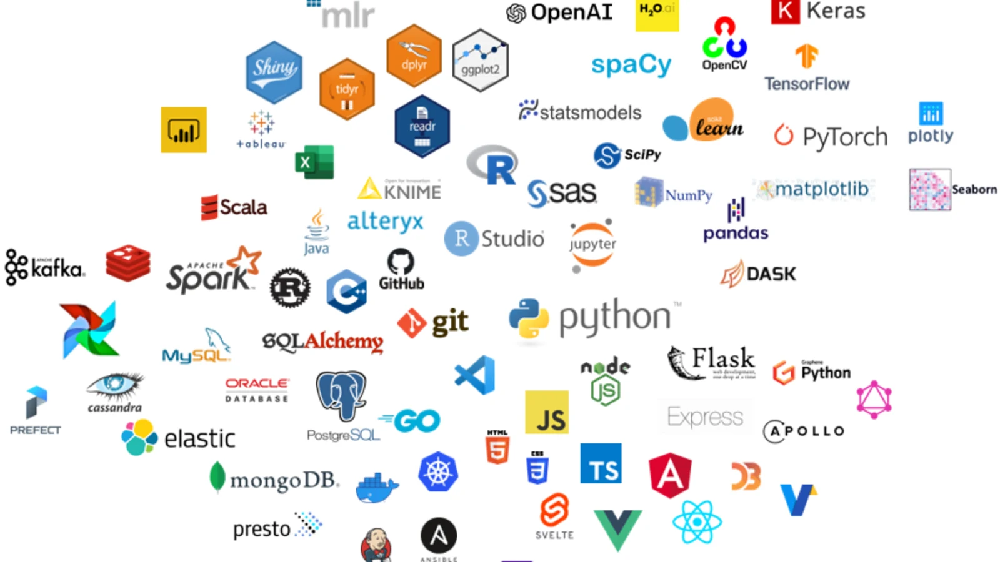
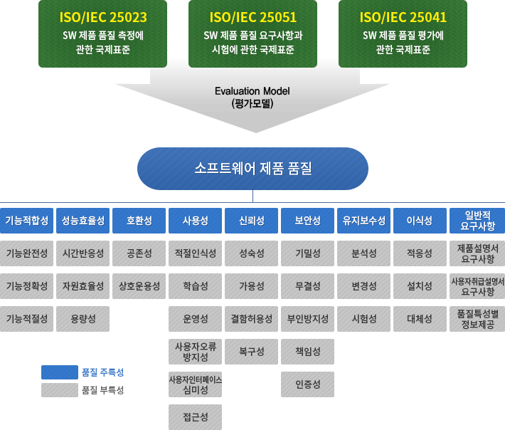
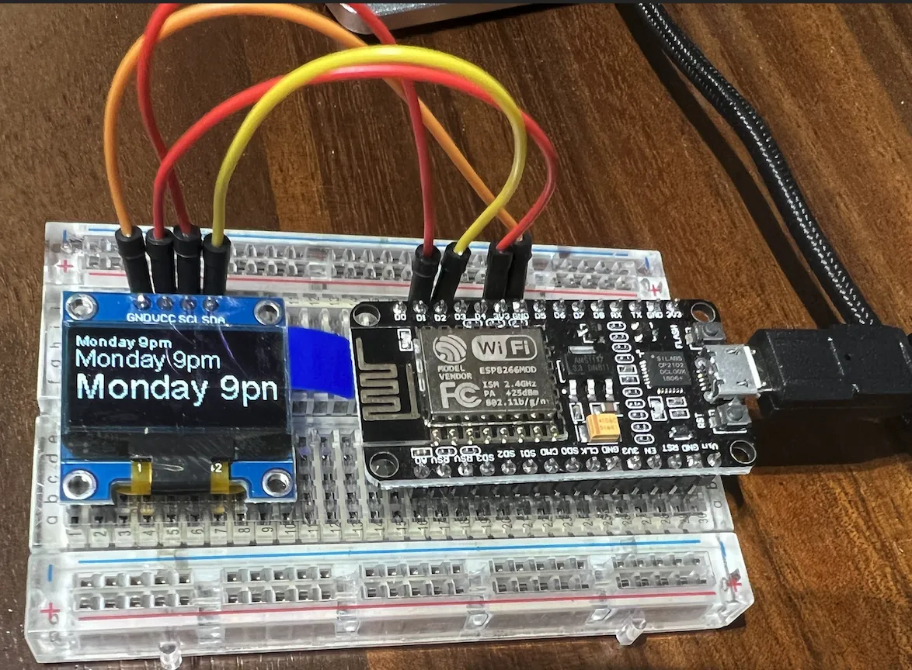
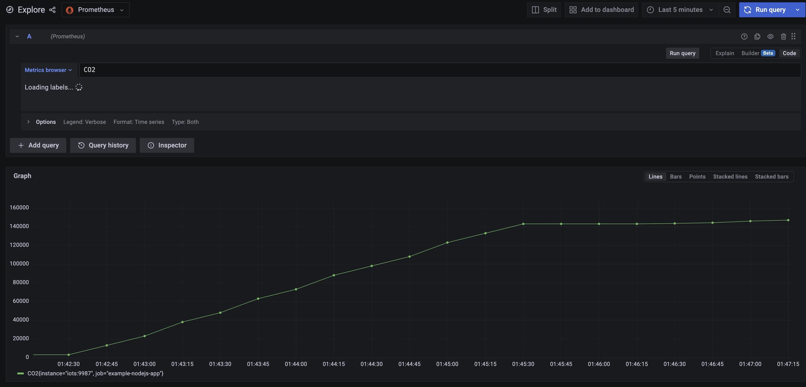
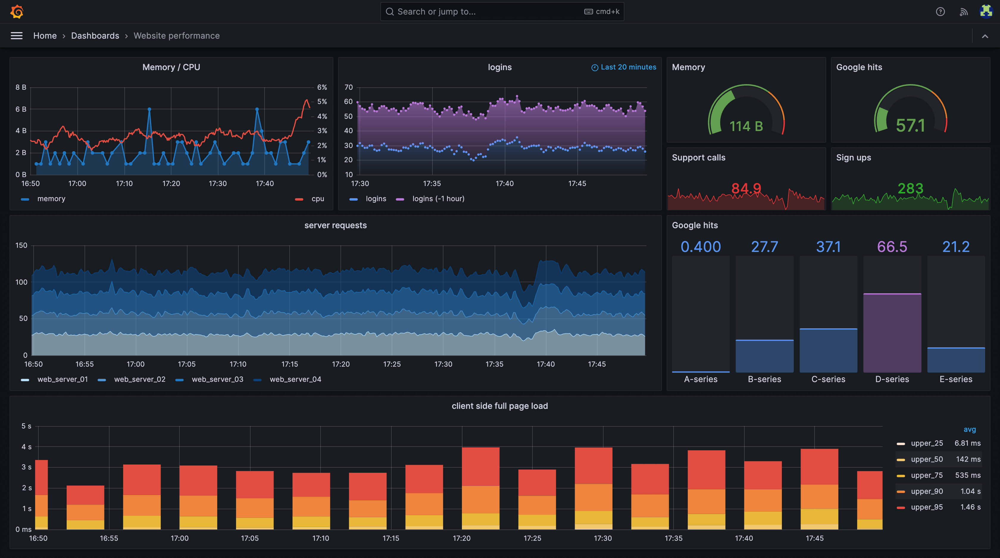
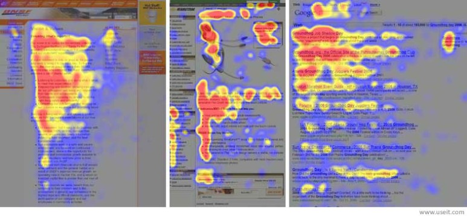
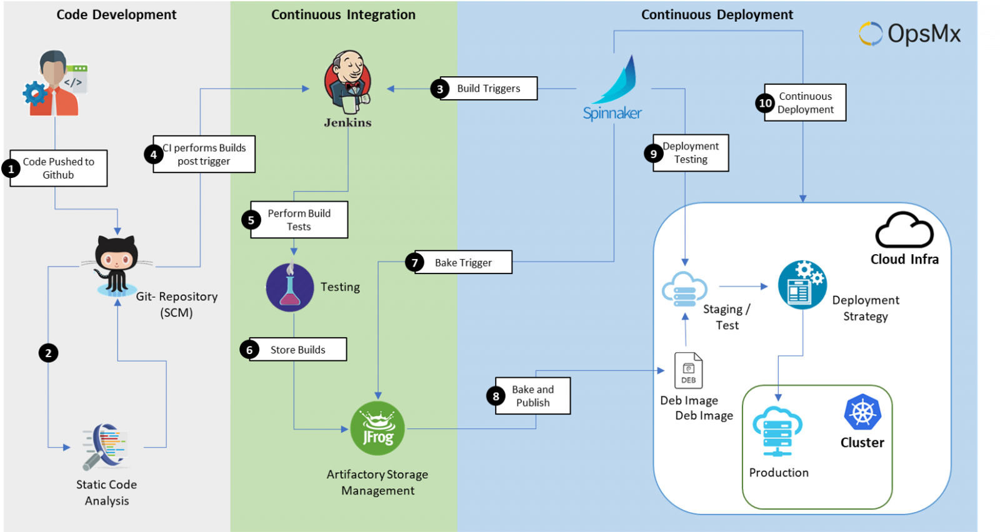
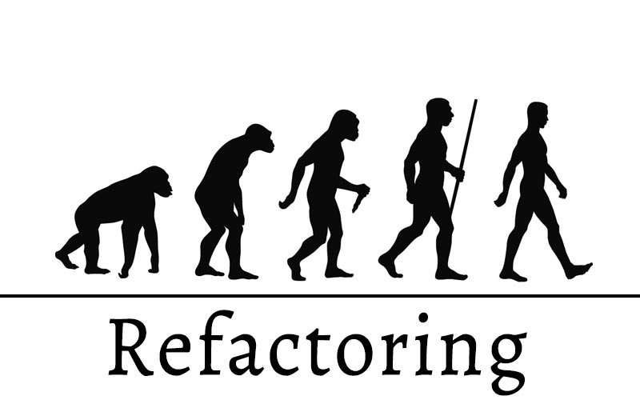

# 올해는 무엇을 만들어야 좋을까? - 품질과 도전과제

2024년 새해가 밝았습니다. 저를 포함하여 많은 개발자 분들은 새해의 목표를 세우고 계실 것 입니다. 

특히 올해에는 ‘어떤 것’을 개발 해볼까? 어떤 개발적인 ‘도전 과제’가 있을까? 를 생각 하시는 분들도 많을 것이라고 생각합니다.  이번 글에서는 무엇을 어떤 기준으로 만들면 좋을지에 대한 힌트 될 만한 요인을 소프트웨어 품질표준에 따라서 한번 살펴보고자 합니다.

---

# 들어가며

소프트웨어 개발자는 우수한 품질의 소프트웨어를 통해 사용자 경험을 개선하고, 신뢰성을 확보하며, 시장에서의 경쟁력을 높이는 것을 목표로 합니다. 이는 사용자가 불만을 가지지 않고, 오류 없이 안전하게 소프트웨어를 사용할 수 있도록 하는 것을 의미합니다. 품질이 낮은 소프트웨어는 반대로 사용자 불만, 빈번한 오류, 심지어 보안 문제를 일으킬 위험이 있습니다. 소프트웨어 개발에서 품질은 단순히 기능적인 측면을 넘어서, 소프트웨어가 추구하는 비즈니스 목표를 시장에서 성공으로 이끄는 핵심 요소입니다.

이러한 이유로, 개발자들은 소프트웨어의 품질을 지속적으로 평가하고 개선하는 것을 중요한 목표로 삼아야 합니다. 이를 위해, 많은 개발자들은 클린 코드, 디자인 패턴, 애자일 개발 방법론, 도메인 주도 설계, 마이크로서비스 아키텍처와 같은 다양한 기술과 방법론을 배우려고 노력합니다. 이런 접근 방식은 소프트웨어 개발의 효율성과 품질을 향상시키는 데 큰 도움이 됩니다.

또한, 개발자들 중에는 새로운 프로그래밍 언어, 프레임워크, 미들웨어(MQ, 검색 엔진, NoSQL 등)를 배우고자 하는 분들도 많습니다. 이러한 도구와 기술들은 개발자가 현대 소프트웨어 개발의 도전과제에 효과적으로 대응하고, 끊임없이 변화하는 기술 환경에서 경쟁력을 유지할 수 있도록 합니다.

결국, 소프트웨어 개발자로서 지속적인 학습과 자기 개발은 단순한 선택이 아닌 필수적인 요소가 되었습니다. 이는 개인의 성장은 물론이고, 소프트웨어 품질을 높이고, 그 결과로 비즈니스의 성공을 이끌어내는 데 중요한 역할을 하게 됩니다.

그렇다면, 소프트웨어의 품질은 무엇일까요?

# 소프트웨어 품질의 기준

소프트웨어의 품질은 큰 범주로 아래와 같이 기능성, 신뢰성, 사용성, 효율성, 유지보수 가능성, 이식성으로 나눌 수 있습니다.

- **기능성(Functionality):** 소프트웨어가 사용자의 요구를 충족하는 기능을 제공하는 능력을 말합니다. 이는 정확성, 적합성, 상호 운용성, 보안 등을 포함합니다. 기능성은 소프트웨어가 그 목적에 부합하는지를 평가하는 척도로, 사용자의 요구사항과 시장의 기대를 충족시키는 기본 요소입니다.
- **신뢰성(Reliability):** 소프트웨어가 특정 조건과 기간 동안 안정적으로 작동하는 능력입니다. 이는 성숙도, 오류 허용성, 복구 가능성 등을 포함합니다. 신뢰성은 시스템의 안정성과 오류 대응 능력을 보장하며, 사용자 신뢰를 구축하는 데 필수적입니다.
- **사용성(Usability):** 사용자가 소프트웨어를 쉽게 이해, 학습, 사용하고, 그에 대해 만족할 수 있는 정도를 말합니다. 이는 사용자 인터페이스 디자인, 직관성, 접근성, 사용자 경험을 포함합니다. 사용성은 사용자의 만족도와 제품의 시장 수용도에 직접적인 영향을 미칩니다.
- **효율성(Efficiency):** 소프트웨어가 자원을 얼마나 효과적으로 사용하는지를 나타냅니다. 이는 시간 효율성과 자원 효율성을 포함합니다. 효율성은 시스템의 성능 최적화와 비용 절감에 기여합니다.
- **유지보수 가능성(Maintainability):** 소프트웨어를 수정하고 개선하기 쉬운 정도를 말합니다. 이는 분석성, 변경 용이성, 안정성, 테스트 용이성을 포함합니다. 유지보수 가능성은 소프트웨어의 지속적인 개선과 적응력을 보장합니다.
- **이식성(Portability):** 소프트웨어가 다양한 환경에서 효과적으로 작동하는 능력입니다. 이는 적응성, 설치 용이성, 대체성 등을 포함합니다. 이식성은 제품의 범용성과 확장 가능성을 높이는 데 중요합니다.

소프트웨어의 품질은 더 자세하게는 ISO/IEC 25000 시리즈에서 국제 표준으로 자세하게 다루고 있습니다.

우리나라에서는 TTA에서 국제표준을 이용하여 평가모델을 만들고, 이를 통해서 소프트웨어 제품 품질을 측정 및 인증하는 제도를 진행하고 있습니다.

- TTA 제품품질 모델

---

# **도전과제 예시**

소프트웨어 품질 지표를 중심으로 올 한해 도전해볼만한 프로젝트를 살펴보겠습니다. 특히 기능성, 신뢰성, 사용성, 효율성, 유지보수성을 대상으로 살펴보겠습니다.

## **기능성(Functionality)**

기능성(Functionality)에 초점을 맞춘 소프트웨어 개발 프로젝트는 사용자의 필요와 요구사항을 충족시키는 데 중점을 두어야 합니다. 우리 생활에 필요한 요소를 해결하는데 초점이 맞춰져 있어서 많은 분들이 토이프로젝트로 쉽사리 시도해보는 내용들이 많습니다.

- **온라인 예약 시스템:** 음식점, 호텔, 또는 이벤트를 위한 예약 시스템을 개발합니다. 사용자는 원하는 날짜와 시간에 예약할 수 있으며, 시스템은 예약 상황을 관리하고 사용자에게 알림을 보냅니다.
- **개인 재정 관리 앱:** 사용자의 수입과 지출을 추적하고 관리할 수 있는 모바일 앱을 개발합니다. 이 앱은 예산 설정, 비용 분석, 재정 목표 추적 등의 기능을 제공합니다.
- **사용자 맞춤형 추천 시스템:** 책, 영화, 또는 음악을 추천하는 시스템을 개발합니다. 사용자의 과거 선택과 선호도를 분석하여 개인화된 추천을 제공합니다.
- **건강 및 운동 추적 앱:** 사용자의 일일 활동, 운동 루틴, 식단을 추적하고 분석하는 모바일 앱을 개발합니다. 이 앱은 건강 목표 설정과 진행 상황 추적 기능을 포함합니다.
- **교육용 퀴즈 애플리케이션:** 학생들이 특정 주제에 대해 학습하고 퀴즈를 통해 지식을 평가할 수 있는 앱을 개발합니다. 이 시스템은 다양한 난이도의 퀴즈와 즉각적인 피드백을 제공합니다.
- **스마트 홈 자동화 시스템:** 집안의 조명, 온도, 보안 시스템 등을 제어할 수 있는 스마트 홈 애플리케이션을 개발합니다. 사용자는 앱을 통해 집안의 다양한 장치를 원격으로 제어할 수 있습니다.

개인적으로는 이렇게 기능성 위주의 프로젝트는 우리가 업무로도 많이 접하기도 하고, 쉽게 접근했다가 곧잘 포기하기도 합니다. 비즈니스의 영역에 가까울 수록 포기할 확률도 높은 것 같습니다. 만약 정말로 커다란 문제를 해결했다면 창업을 꿈꿀수도 있겠지만요. 연초의 목표로 삼기에는 부담스럽기도 하네요.

- [https://medium.com/monday-9-pm/co2-alert-system-만들기-7144304a404a](https://medium.com/monday-9-pm/co2-alert-system-%EB%A7%8C%EB%93%A4%EA%B8%B0-7144304a404a)

## **신뢰성(Reliability)**

신뢰성(Reliability)은 소프트웨어가 지속적이고 안정적으로 작동하는 능력을 의미합니다. 신뢰성과 관련된 프로젝트는 일반적으로 오류 허용성, 복구 능력, 안정성 및 성능 일관성에 중점을 둡니다. 

운영이 예정된 프로젝트가 있거나 계획이 있다면 오류 감지와 보고 시스템을 구축하는 방법들을 알아두고, 이전에 부하테스트와 성능을 모니터링 하는 방법들을 학습하고 적용해보는 과정을 경험하면 크게 도움이 될 것입니다. 

앱 개발자라면, 오프라인 모드를 지원하는 방법들에 관한 구현 방법을 고민하고 학습해보는 과정도 큰 도움이 될 것으로 기대됩니다.

1. **오류 감지 및 보고 시스템:** 소프트웨어 내부의 오류를 실시간으로 감지하고, 관련 정보를 로깅하는 시스템을 개발합니다. 이 시스템은 개발자가 오류를 빠르게 식별하고 해결할 수 있도록 도와줍니다.
2. **부하 테스트 및 성능 모니터링 도구:** 소프트웨어의 성능을 모니터링하고, 과부하 상황에서의 안정성을 테스트하는 도구를 개발합니다. 이 도구는 피크 시간에도 시스템이 안정적으로 작동할 수 있도록 보장합니다.
3. **오프라인 모드 지원 모바일 애플리케이션:** 인터넷 연결이 불안정하거나 없는 환경에서도 기능을 유지할 수 있는 모바일 앱을 개발합니다. 이 앱은 오프라인에서도 데이터를 저장하고, 연결이 복원되었을 때 동기화할 수 있습니다.

- K6 and Grafana

## **사용성(Usability)**

사용성(Usability)은 소프트웨어가 사용자에게 쉽고, 편리하며, 직관적으로 사용될 수 있도록 하는 것을 의미합니다. 사용자 중심의 디자인, 직관적인 인터페이스, 그리고 효과적인 사용자 경험(UX)이 핵심입니다. 개발자가 직접 UI 디자인을 진행하는 것은 어려울 수 있습니다. 그렇지만, 웹 접근성 강화를 위해서 필요한 기술들에 관해 추가로 학습을 해보는 방법이나, 사용성 테스트를 위한 기술들이 무엇이 있을지를 고민하고, 학습하고 적용하는 과정은 큰 도움이 될 것입니다.

개인적으로는 게이미피케이션 요소에 관해서 학습을 해보는 목표를 설정해 보는것도 꽤나 개발 외적으로 재밌을 것 같습니다.

1. **사용자 경험 개선을 위한 웹사이트 재디자인:** 기존 웹사이트를 사용자 친화적으로 재디자인하는 프로젝트입니다. 이는 사용자의 탐색 경험을 개선하고, 정보 접근성을 높이며, 전반적인 사용자 만족도를 증가시키는 것을 목표로 합니다.
2. **모바일 애플리케이션 사용성 테스트:** 특정 모바일 앱의 사용성을 평가하고 개선하기 위한 프로젝트입니다. 사용자 테스트, 설문 조사, 피드백 수집을 통해 앱의 인터페이스와 기능을 사용자 중심으로 개선합니다.
3. **접근성 강화 프로젝트:** 장애를 가진 사용자들도 쉽게 접근하고 사용할 수 있도록 웹사이트나 앱의 접근성을 개선하는 프로젝트입니다. 스크린 리더 호환성, 대비 강화, 키보드 탐색 지원 등이 포함될 수 있습니다.
4. **인터랙티브 UI 프로토타입 개발:** 사용자의 요구와 피드백을 반영하여 새로운 인터랙티브 사용자 인터페이스(UI) 프로토타입을 개발하는 프로젝트입니다. 이는 사용자의 경험을 우선시하며, 효과적인 상호 작용을 제공하는 것을 목표로 합니다.
5. **게이미피케이션 요소를 활용한 앱 개발:** 사용자의 참여와 관심을 높이기 위해 게임의 요소를 일상적인 태스크 관리 앱이나 교육 앱에 통합하는 프로젝트입니다. 사용자의 동기 부여와 참여를 증가시키는 것이 목표입니다.

- 아이트래킹의 히트맵 | 출처: [https://www.nngroup.com/articles/f-shaped-pattern-reading-web-content/](https://www.nngroup.com/articles/f-shaped-pattern-reading-web-content/)

## **효율성(Efficiency)**

효율성(Efficiency)과 관련된 프로젝트는 소프트웨어가 자원을 어떻게 효과적으로 사용하며, 시스템의 성능을 최적화할 수 있는지에 초점을 맞춥니다. 알고리즘을 학습해 볼 수도 있고, CI/CD 파이프라인을 구성해보며 자동화된 배포와 확장성 관리를 해보는 걸 도전과제로 삼아봐도 좋을 것 같습니다. 

1. **성능 최적화를 위한 알고리즘 개선 프로젝트:** 기존 소프트웨어나 애플리케이션의 알고리즘을 분석하고 개선하여 처리 속도와 성능을 높이는 프로젝트입니다. 이는 데이터 처리, 검색, 정렬 알고리즘의 최적화를 포함할 수 있습니다.
2. **클라우드 기반 자원 관리 시스템:** 클라우드 환경에서 자원을 효율적으로 관리하고 할당하는 시스템을 개발합니다. 이 시스템은 클라우드 스토리지와 컴퓨팅 자원의 사용을 최적화합니다.
3. **데이터 압축 및 최적화 도구:** 대용량 데이터를 효율적으로 저장하고 전송하기 위한 압축 및 최적화 도구를 개발합니다. 이는 네트워크 대역폭 사용 최소화와 저장 공간 절약에 기여합니다.
4. **캐싱 시스템:** 웹 애플리케이션 또는 서비스의 응답 시간을 단축하기 위해 캐싱 시스템을 구현하는 프로젝트입니다. 자주 사용되는 데이터를 효과적으로 캐시하여 빠른 접근을 가능하게 합니다.
5. **자동화된 배포 및 확장성 관리 도구:** 애플리케이션의 배포를 자동화하고, 트래픽에 따라 자동으로 확장할 수 있는 도구를 개발합니다. 이는 수요 변화에 따라 자원 사용을 최적화합니다.
6. **시스템 모니터링 및 리소스 관리 대시보드:** 시스템의 성능과 리소스 사용을 실시간으로 모니터링하고 관리할 수 있는 대시보드를 개발합니다. 이는 시스템의 효율성을 향상시키고 비용을 절감하는 데 도움이 됩니다.

- [https://www.opsmx.com/blog/what-is-a-ci-cd-pipeline/](https://www.opsmx.com/blog/what-is-a-ci-cd-pipeline/)

## **유지보수 가능성(Maintainability)**

유지보수 가능성(Maintainability)은 소프트웨어가 시간이 흐름에 따라 쉽게 수정되고, 업데이트되며, 확장될 수 있는 정도를 나타냅니다. 이러한 관점에서 볼 때, 리팩토링은 매우 중요한 도전과제가 될 수 있습니다. 시스템을 모듈화하거나 마이크로서비스 아키텍처로 전환하는 것도 훌륭한 접근법이지만, 프로젝트의 규모가 크다면 시작하기에 앞서 단위테스트와 통합테스트의 작성부터 시작하는 것이 좋습니다.

코드 리뷰와 품질 관리 시스템을 도입하는 것도 매우 중요합니다. 이런 과정을 통해 개발 과정에서 발생할 수 있는 문제들을 미리 식별하고, 지속적인 품질 개선을 할 수 있습니다. 

테스트와 코드 리뷰에 기반한 품질 관리 시스템이 잘 구축되어 있다면, 규모가 큰 프로젝트도 점진적인 리팩토링을 통해 효율적으로 모듈화를 진행할 수 있습니다.

1. **리팩토링 프로젝트:** 기존의 코드베이스를 리팩토링하여 더 깔끔하고 관리하기 쉬운 구조로 만드는 프로젝트입니다. 이는 코드의 가독성과 재사용성을 향상시키고, 장기적인 유지보수를 용이하게 합니다.
2. **문서화 및 코딩 표준 개선:** 소프트웨어 개발에 있어서 체계적인 문서화와 코딩 표준을 개발하거나 개선하는 프로젝트입니다. 이는 미래의 개발자들이 코드를 이해하고 유지보수하기 쉽게 만듭니다.
3. **자동화된 테스트 프레임워크 구축:** 단위 테스트, 통합 테스트, 시스템 테스트를 자동화하는 프레임워크를 구축하는 프로젝트입니다. 이는 오류를 조기에 발견하고, 코드 변경에 따른 영향을 쉽게 파악할 수 있게 합니다.
4. **모듈식 아키텍처 설계:** 소프트웨어의 모듈성을 향상시키기 위해 기존 시스템의 아키텍처를 분석하고 개선하는 프로젝트입니다. 모듈식 설계는 시스템의 각 부분을 독립적으로 유지보수하고 확장할 수 있게 합니다.
5. **코드 리뷰 및 품질 관리 시스템 도입:** 코드 리뷰 프로세스를 도입하고, 코드 품질 관리를 위한 시스템을 구축하는 프로젝트입니다. 이는 코드의 품질을 지속적으로 모니터링하고 개선합니다.
6. **의존성 관리 및 업데이트 전략 개발:** 프로젝트의 의존성을 관리하고, 안전하고 효율적인 업데이트 전략을 개발하는 프로젝트입니다. 이는 외부 라이브러리와 툴의 변경에 유연하게 대응할 수 있게 합니다.
7. **마이크로서비스 전환:** 대규모 모놀리식 애플리케이션을 마이크로서비스로 전환하는 프로젝트입니다. 이는 시스템의 각 부분을 독립적으로 업데이트하고 유지보수할 수 있게 합니다.

---

# 마무리

이번 글을 통해서 소프트웨어의 품질을 높이기 위한 주제를 하나 선택하고 각자의 도전과제를 선정하는 데 도움이 되었으면 합니다. 그리고 올 한해 성공적으로 도전과제를 완수하셔서 꼭 더 나은 내일의 개발자가 되시길 기원합니다.

새해 복 많이 받으세요.