# 초보개발자의 고성능 JSON 직렬화를 위한 FastJson2와 Vector API

> ### Summary
>### 1) FastJson2는 왜 빠를까?
> - FastJson2는 알리바바에서 개발한 고성능 JSON 라이브러리로, Jackson이나 Gson보다 약 두 배 이상 빠르게 작동합니다. 그 비결은 Java의 Vector API를 활용하여 데이터를 병렬로 처리하기 때문입니다. 이를 통해 대량의 JSON 데이터를 빠르고 효율적으로 변환할 수 있어, 대용량 데이터 처리에 강점을 보입니다.
>### 2) Vector API와 SIMD의 역할
> - Vector API는 Java에서 벡터 연산을 쉽게 할 수 있도록 도와주는 도구입니다. 여기서 벡터란 수학에서의 벡터로, 방향과 크기를 가진 값을 말합니다. SIMD(Single Instruction Multiple Data)는 하나의 명령으로 여러 데이터를 동시에 처리하는 기술로, Vector API는 이 SIMD를 활용합니다. 이를 통해 여러 데이터 요소를 한꺼번에 계산하므로, 연산 속도가 크게 향상됩니다.
>### 3) 고성능 서버 개발에서의 중요성
> - 대용량 데이터를 다루는 서버나 애플리케이션에서는 성능이 매우 중요합니다. JSON 데이터의 직렬화와 역직렬화 과정에서 병목 현상이 발생할 수 있는데, FastJson2와 Vector API를 사용하면 이러한 문제를 완화할 수 있습니다. 개발자가 이러한 기술을 이해하고 활용하면, 더욱 효율적이고 빠른 애플리케이션을 만들 수 있습니다.

---

개발자라면 한 번쯤은 JSON을 다뤄보게 됩니다. 특히 백엔드 API 개발자의 경우, 데이터를 JSON 포맷으로 변환하거나, JSON 형식의 텍스트 데이터를 프로그래밍 언어의 특정 타입으로 변환하는 과정이 필요하죠.

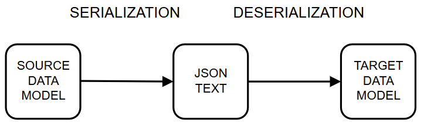
> 출처: https://einarwh.wordpress.com/2020/05/13/proper-json-and-property-bags/

특히 RESTful API가 대중화되면서 JSON의 사용률도 크게 증가했습니다. 과거 불편했던 인터페이스 표준으로 자리 잡았던 SOAP과 XML은 점차 자리를 잃고, 그 자리를 RESTful API와 JSON이 차지하게 되었죠.

또한, MSA 같은 분산 시스템 환경이나 CSR(Client Side Rendering) 구조의 시스템 운영은 JSON 사용을 더욱 촉진했습니다.

Java 진영에서 대표적인 프레임워크인 Spring Framework는 HTTP 기반의 API를 만들고 URI 라우팅을 편리하게 구현할 수 있도록 Spring Boot Web 프로젝트를 제공합니다. 이 과정에서 자바 객체와 JSON 간의 상호 변환을 지원하는 ObjectMapper를 사용하게 되며, 기본적으로는 Jackson과 Gson을 활용하게 됩니다.

이렇듯 JSON을 다룰 일이 많아지고 편리하게 사용할 수 있다 보니, 간혹 예상치 못한 문제들이 발생하기도 합니다. 초보 개발자들은 종종 데이터를 JSON 형태로 프레임워크가 자동 처리해주는 것으로 당연히 받아들이곤 합니다.

하지만 API가 느려졌을 때 성능 문제를 분석하는 과정에서 JSON과 객체 간의 변환 문제가 종종 간과되거나 고려되지 않는 경우가 많습니다. 특히 대용량 데이터를 JSON으로 처리하는 상황에서는 관련 문제가 더욱 쉽게 발생할 수 있습니다.

아래 표를 보면, 스프링에서 기본적으로 제공하는 Jackson이나 Gson은 성능이 아주 뛰어난 편은 아닙니다. 가장 빠른 것으로 알려진 Alibaba의 fastjson2와 비교하면 Jackson이나 Gson은 약 두 배 정도 느리며, fastjson2 외에도 더 빠른 구현체들이 존재합니다.

#### 역직렬화
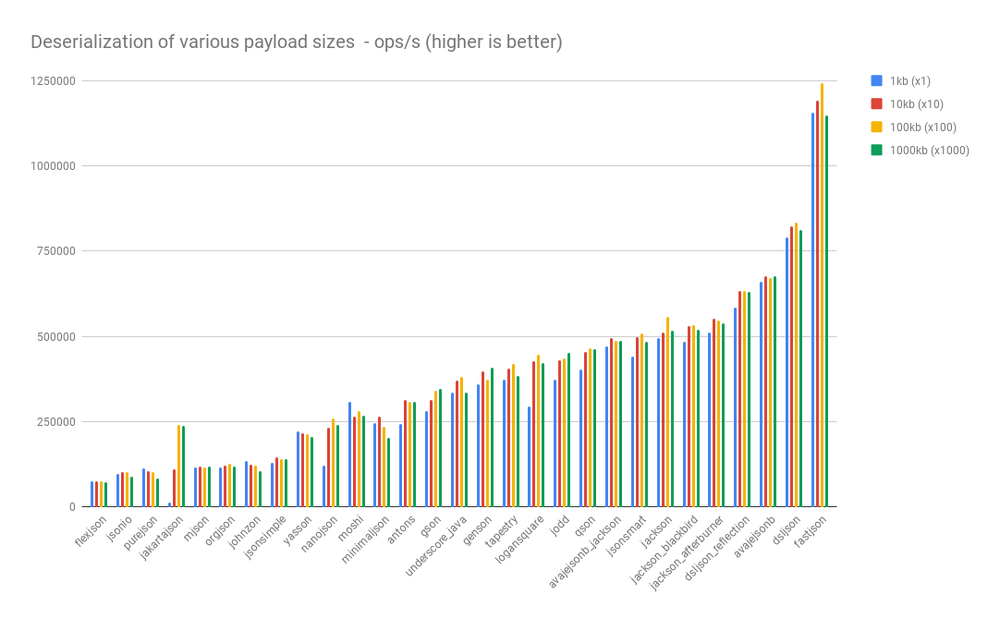

#### 직렬화
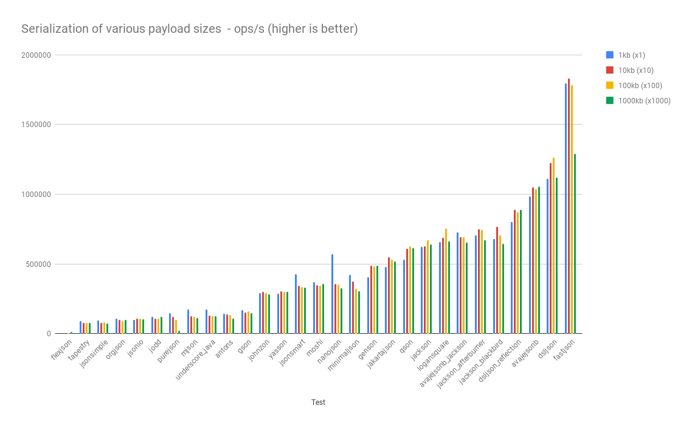
> 출처: https://github.com/fabienrenaud/java-json-benchmark

저도 현업에서 API 요청당 약 500만 개 이상의 JSON 객체를 다뤄야 하는 상황이 있었고, 이와 관련해 JSON 직렬화를 주요 개선 대상으로 삼아 작업한 적이 있습니다. 그 과정에서 FastJson2를 적극적으로 적용했고, 이를 통해 상당 부분 문제를 해결할 수 있었습니다.

그렇다면 FastJson2가 왜 빠를까요?

### FastJson2 는 왜 빠른가?

여러 가지 기술적인 해결법이 있지만, FastJson2는 Vector API를 활용하여 더욱 빠른 매핑을 제공하는 것으로 보입니다. 이를 통해 JSON 데이터와 객체 간의 변환 속도가 크게 개선되었습니다.

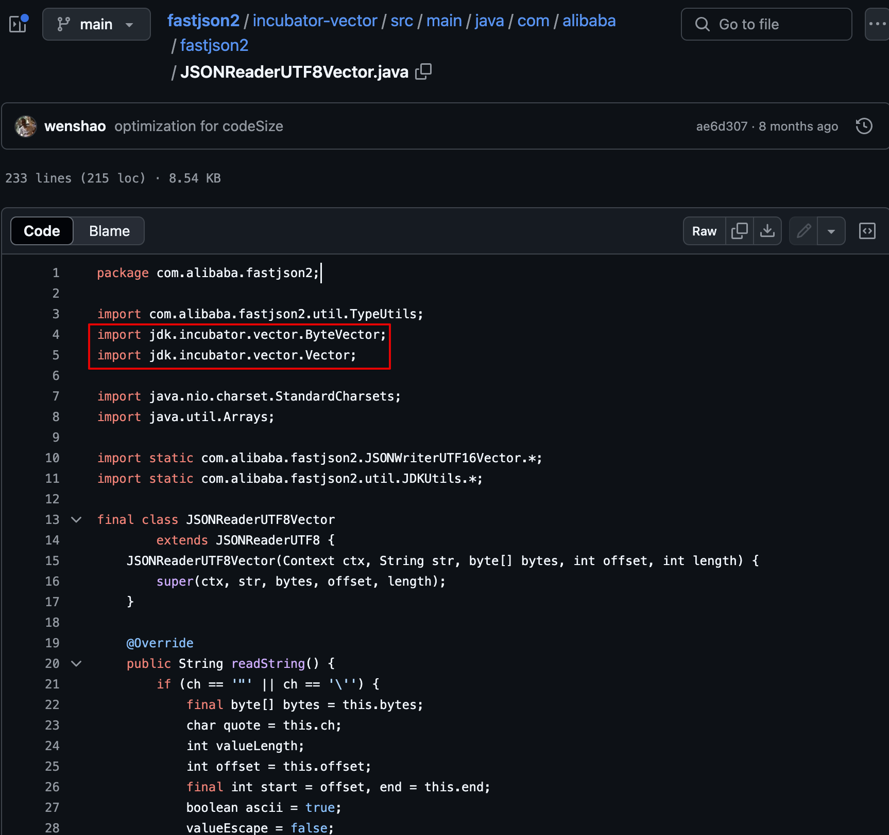

> 출처: https://github.com/alibaba/fastjson2/blob/main/incubator-vector/src/main/java/com/alibaba/fastjson2/JSONReaderUTF8Vector.java


## Vector API ?

> https://openjdk.org/jeps/489

>지원되는 CPU 아키텍처에서 런타임에 최적의 벡터 명령어로 안정적으로 컴파일되는 벡터 계산을 표현하는 API를 도입하여 동등한 스칼라 계산보다 우수한 성능을 달성합니다.

Java에는 예전부터 데이터를 저장하는 용도로 사용되는 객체인 Vector가 있었습니다. 하지만 여기서 말하는 Vector는 그와는 조금 다릅니다. 데이터 컬렉션이 아닌, 수학에서의 스칼라와 벡터 개념을 말합니다. 이를 통해 FastJson2는 SIMD와 같은 병렬 처리 방식을 활용하여 연산을 더욱 효율적으로 수행할 수 있게 되죠.

## 스칼라와 벡터

스칼라(Scalar)는 실수(Real Number)로 표현 가능한 양(Quantity)을 의미합니다. 반면, 벡터(Vector)는 크기(Magnitude)와 방향(Direction)을 동시에 갖춘 양을 뜻합니다.

> **_유클리디안 벡터(Euclidean vector)_**(그리스 수학자 유클리드의 이름을 따랐으며 기하학적 벡터(geometric vector) 로도 알려져 있음) 입니다. 이 과정에서 “벡터”라는 용어를 보면,_크기와 방향을 모두 가지는 어떤 양_으로 정의되는 유클리디안 벡터라고 생각하면 됩니다.

간단하게 표현하자면 벡터는 데이터를 1차원으로 표현하는 방식이고, 행렬은 데이터를 2차원으로 표현하는 방식을 말합니다.

보통 크기와 방향성을 갖는 물리량을 나타내는데 사용 방향이 없으면 스칼라라고 합니다.

벡터는 일반적으로 위의 화살표 (→) 를 갖는 소문자의 형태로 표현 됩니다. =v

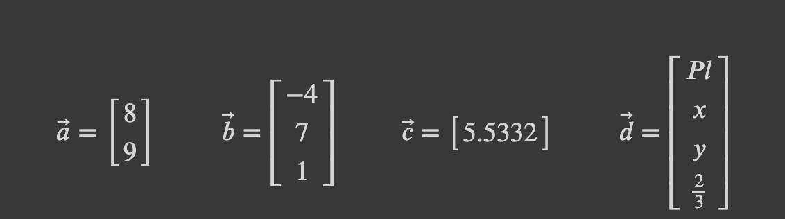

수학적으로 표시할 때 열벡터(Column)가 기본이고 행(Row)벡터로 표현시 아래와 같이 트랜스포즈(Transpose)하여 사용합니다.

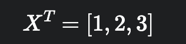

이런 백터와 스칼라을 가지고 계산을 하게 됩니다.

#### 벡터의 합

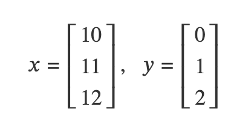

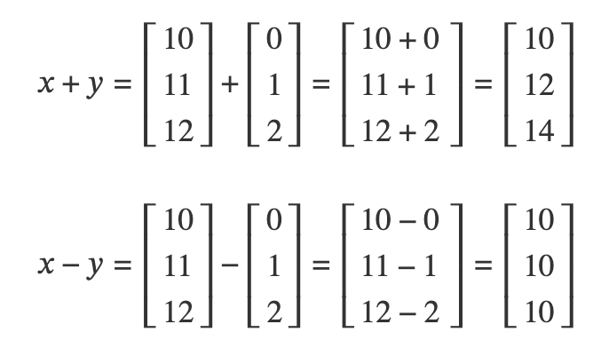


#### 행렬곱

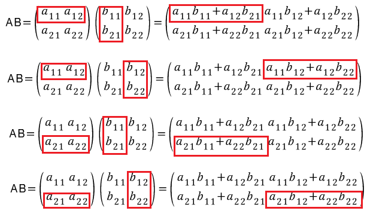

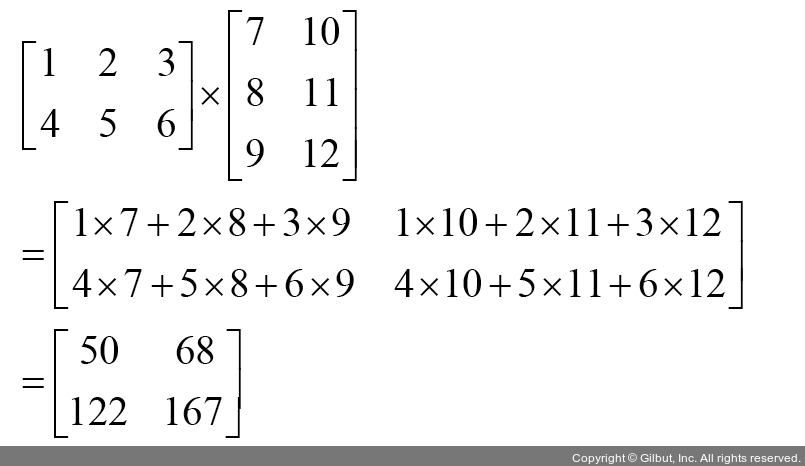


#### 스칼라와 벡터/행렬의 곱셈

벡터𝑥x또는 행렬𝐴A에 스칼라값𝑐c를 곱하는 것은**벡터𝑥x또는 행렬𝐴A의 모든 원소에 스칼라값𝑐c를 곱하는 것**과 같습니다.

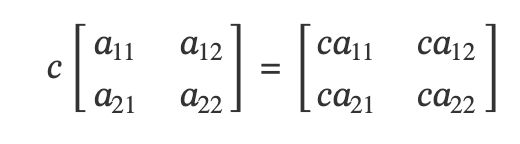

행렬과 벡터 계산

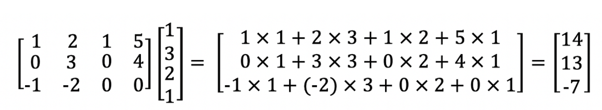

두 벡터 𝑎⃗ 와 𝑏⃗ 의 내적은, 각 구성요소를 곱한 뒤 합한 값과 같습니다.

v = [1, 2, 3, 4]  
x = [5, 6, 7, 8]  
v ⋅ x = 1_5 + 2_6 + 3_7 + 4_8 = 70

벡터의 내적을 위해서는 쌍끼리 순서를 맞춰서 곱하고 더하려면 쌍이 있어야 하기 때문에 두 벡터의 길이가 반드시 동일해야 합니다.

이러한 벡터의 계산은 머신 러닝, 선형 대수학, 암호화, 금융 분야에서 사용됩니다.

---

## Vector API 와 SIMD


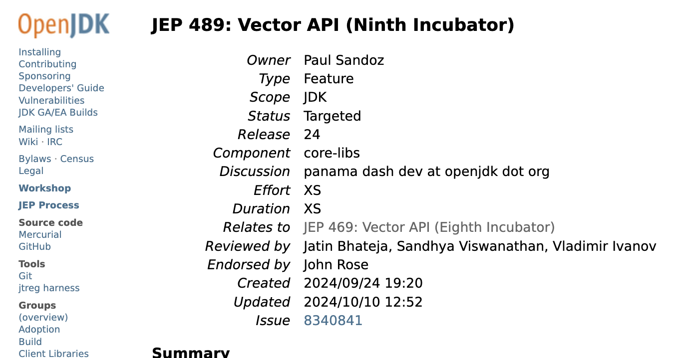
> 출처: https://openjdk.org/jeps/489

Vector API는 벡터와 스칼라의 계산을 손쉽게 할 수 있는 API 메서드 시그니처를 제공합니다. 직접 계산하지 말고 편리하게 제공되는 객체를 도구로 이용하라는 것이죠.

> 명확하고 간결한 API - API는 루프 내에서 구성된 벡터 연산 시퀀스와 제어 흐름으로 구성된 광범위한 벡터 계산을 명확하고 간결하게 표현할 수 있어야 합니다. 벡터 크기 또는 벡터당 레인 수와 관련하여 일반적인 계산을 표현할 수 있어야 하며, 따라서 다양한 벡터 크기를 지원하는 하드웨어에서 이러한 계산을 이식할 수 있어야 합니다.

사용자에게 가독성에 관한 편의성만 제공하는 것은 아닙니다.
x64 및 AArch64 CPU 아키텍처 기반에서 SIMD 병렬처리를 통해서 계산을 가속화 합니다.

#### SIMD(Single Instruction Multiple Data)

SIMD는 병렬 컴퓨팅의 한 종류로, 하나의 명령어로 여러 개의 값을 동시에 계산하는 방식을 말합니다. 데이터 풀이 있으면 이를 여러개의 Process Unit 병렬로 처리를 합니다.

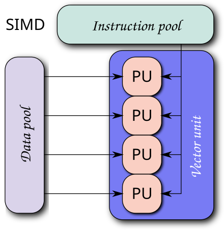
>출처: https://en.wikipedia.org/wiki/Single_instruction,_multiple_data


SISD(Single Instruction Single Data) 프로세스를 이용하는 구조에서는 스칼라 연산의 경우에는 스칼라 인수로 피연산자를 하나씩 받은 이후, 각각의 프로세스에서 순차적으로 처리하게 됩니다.


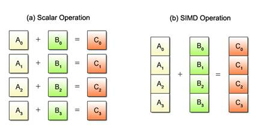
> 출처: https://modulabs.co.kr/blog/simd-programming/

처리하는 방법을 Stream으로 살펴보면 아래와 같습니다.

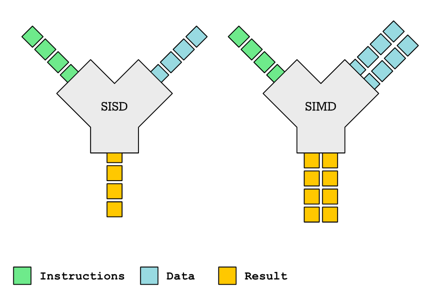
> 출처: https://johnnysswlab.com/crash-course-introduction-to-parallelism-simd-parallelism/

더 알아보고 싶으신 분은 플린분류체계를 참고해보세요. (Flynn's taxonomy)
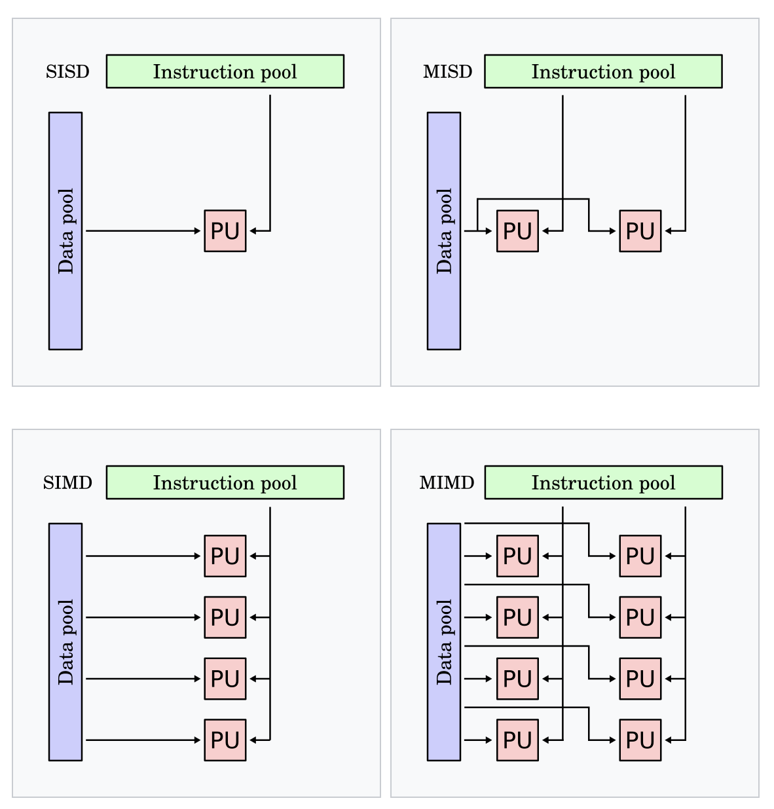
> 참고: https://ko.wikipedia.org/wiki/%ED%94%8C%EB%A6%B0_%EB%B6%84%EB%A5%98

---
## Vector API 사용 예시

JEP-489 명세에 나와 있는 예시를 통해 Vector API를 어떻게 사용하는지 살펴보겠습니다.

예를 들어, 벡터 `a`와 `b`의 제곱의 합의 역수를 구할 때, 일반적으로 스칼라로 다루는 방법은 다음과 같습니다. 여기서 '스칼라'라는 표현은 벡터 객체(Vector API)를 사용하지 않고 순수한 스칼라 계산 방식으로 다룬다는 의미로 사용됩니다.

```java
void scalarComputation(float[] a, float[] b, float[] c) {
   for (int i = 0; i < a.length; i++) {
        c[i] = (a[i] * a[i] + b[i] * b[i]) * -1.0f;
   }
}
```

위 코드를 실행하면 `float` 배열 `c`에는 의도한 대로 벡터 `a`와 `b` 각각의 제곱 합의 역수가 순차적으로 계산되어 저장됩니다.

이 과정을 Vector API를 사용하여 처리하면 다음과 같이 작성할 수 있습니다.

```java
static final VectorSpecies<Float> SPECIES = FloatVector.SPECIES_PREFERRED; // `SPECIES`는 벡터 연산에서 사용할 벡터의 종류와 길이를 정의하는 상수입니다. `FloatVector.SPECIES_PREFERRED`는 현재 시스템에서 가장 효율적인 벡터 크기를 선택합니다.

void vectorComputation(float[] a, float[] b, float[] c) {
    int i = 0;
    
// `upperBound`는 벡터화된 루프의 종료 조건입니다. `SPECIES.loopBound(a.length)`는 배열 `a`의 길이를 벡터 길이의 배수로 내림한 값입니다. 이는 벡터 연산이 배열의 경계를 넘어가지 않도록 보장합니다.
    int upperBound = SPECIES.loopBound(a.length);


//벡터화된 루프를 시작합니다. 루프 인덱스 `i`는 `upperBound`까지 진행하며, 각 반복마다 `SPECIES.length()`만큼 증가합니다. 즉, 한 번의 반복에서 벡터 길이만큼의 요소를 처리합니다.
    for (; i < upperBound; i += SPECIES.length()) {
        // FloatVector va, vb, vc;
        var va = FloatVector.fromArray(SPECIES, a, i);
        var vb = FloatVector.fromArray(SPECIES, b, i);
        
        var vc = va.mul(va)
                   .add(vb.mul(vb))
                   .neg();
        //계산된 벡터 `vc`의 값을 배열 `c`의 인덱스 `i`부터 저장합니다.
        vc.intoArray(c, i);
    }
// 남은 요소들을 처리하기 위한 스칼라 루프를 시작합니다. 벡터 길이로 나누어 떨어지지 않는 배열의 끝부분을 처리합니다.
    for (; i < a.length; i++) {
        c[i] = (a[i] * a[i] + b[i] * b[i]) * -1.0f;
    }
}
```


먼저, Vector의 종류(Species)를 선택해야 합니다. `SPECIES`는 벡터 연산에서 사용할 벡터의 종류와 길이를 정의하는 상수입니다. 여기서 `FloatVector.SPECIES_PREFERRED`는 현재 시스템에서 가장 효율적인 벡터 크기를 자동으로 선택해 주어, 벡터 연산의 성능을 극대화하는 데 유용합니다.

```java
static final VectorSpecies<Float> SPECIES = FloatVector.SPECIES_PREFERRED;
```


Vector의 종류는 아래와 같이 연산 크기가 64bit 부터 512bit 까지 있으며 Max 와 Preferred가 있습니다.

Vector의 종류는 연산 크기에 따라 64비트에서 512비트까지 다양하게 제공되며, `Max`와 `Preferred` 옵션도 있습니다.

- `SPECIES_64`: 64비트 벡터 연산
- `SPECIES_128`: 128비트 벡터 연산
- `SPECIES_256`: 256비트 벡터 연산
- `SPECIES_512`: 512비트 벡터 연산
- `SPECIES_MAX`: 시스템에서 지원 가능한 최대 벡터 크기
- `SPECIES_PREFERRED`: 현재 시스템에서 가장 효율적인 벡터 크기

이러한 선택지를 통해 애플리케이션의 성능과 시스템 자원 활용을 최적화할 수 있습니다.

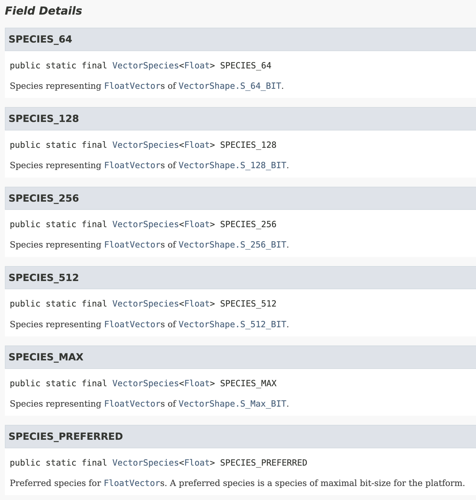

그 다음으로, 루프의 종료 조건을 설정합니다. `upperBound`는 벡터화된 루프가 언제 종료될지를 결정하는 값입니다. `SPECIES.loopBound(a.length)`는 배열 `a`의 길이를 벡터 길이의 배수로 내림 처리하여 반환하는데, 이는 벡터 연산이 배열의 경계를 넘어 실행되지 않도록 보장하는 역할을 합니다.

```java
int upperBound = SPECIES.loopBound(a.length);
```

이제 벡터화된 루프를 시작합니다. 루프 인덱스 `i`는 `upperBound`까지 진행하며, 각 반복마다 `SPECIES.length()`만큼 증가합니다. 이는 한 번의 반복에서 벡터 길이에 해당하는 요소 수만큼 데이터를 병렬로 처리하도록 하여 연산 효율을 높입니다.

```java
for (; i < upperBound; i += SPECIES.length()) {
```

배열 `a`에서 인덱스 `i`부터 시작하는 요소들을 벡터 `va`로 불러옵니다. 여기서 `SPECIES`는 사용하려는 벡터의 종류와 길이를 지정하여, 특정 길이의 벡터를 만들고 배열의 연속된 데이터 조각을 벡터화된 형태로 불러올 수 있도록 도와줍니다.

```java
 var va = FloatVector.fromArray(SPECIES, a, i);
```


그리고 벡터 a와 b의 제곱의 합의 역수를 아래와 같이 구합니다.

```java
        var vc = va.mul(va)
                   .add(vb.mul(vb))
                   .neg();

```

- `va.mul(va)`: 벡터 `va`의 각 요소를 제곱합니다.
- `vb.mul(vb)`: 벡터 `vb`의 각 요소를 제곱합니다.
- `.add(...)`: 두 제곱된 벡터를 요소별로 더합니다.
- `.neg()`: 합산된 벡터의 각 요소의 부호를 반전시킵니다.

마지막으로 계산된 벡터 `vc`의 값을 배열 `c`의 인덱스 `i`부터 저장합니다.

```java
vc.intoArray(c, i);
```


남은 요소들을 처리하기 위해 스칼라 루프를 시작합니다. 이 루프는 벡터 길이로 나누어 떨어지지 않아 벡터화된 연산에서 제외된 배열의 끝부분을 처리하는 역할을 합니다. 이를 통해 배열의 모든 요소를 정확하게 계산할 수 있습니다.

```java
    for (; i < a.length; i++) { }
```


여기서 잠깐, 왜 루프를 한번 더 도는 걸까요?

---
### 벡터 길이는 무엇이고 왜 루프를 두번 도는가?

마지막 루프는 벡터 길이로 나누어 떨어지지 않아 벡터화된 루프에서 처리되지 않은 배열의 끝부분을 처리하기 위한 것입니다. 이를 통해 남아 있는 요소들도 정확하게 연산에 포함되도록 보장할 수 있습니다.

> 예)
>- **벡터 길이 (SPECIES.length())**: 4
>- **배열의 길이 (a.length)**: 10

** `SPECIES.loopBound(a.length)` 계산:**

`SPECIES.loopBound(a.length)`는 배열의 길이 `a.length`를 벡터 길이의 배수로 내림한 값입니다. 이는 벡터 연산이 배열의 경계를 넘어가지 않도록 보장합니다.

- 배열 길이 `10`을 벡터 길이 `4`로 나눕니다:  
  `10 / 4 = 2.5`
- 소수점을 버리고 내림하여 정수 부분만 취합니다:  
  `Math.floor(2.5) = 2`
- 벡터 길이와 다시 곱합니다:  
  `2 * 4 = 8`
- 따라서 `upperBound`는 `8`이 됩니다.


그렇다면, 백터의 길이는 무엇일까요?

이는 위에서 언급한 `FloatVector.SPECIES_PREFERRED`와 밀접한 관련이 있습니다.

---

### 벡터의 길이?

벡터의 길이는 `VectorSpecies` 객체의 `length()` 메소드를 사용하여 알 수 있습니다. 코드에서 사용된 `SPECIES` 객체는 다음과 같이 정의되어 있습니다

```java
static final VectorSpecies<Float> SPECIES = FloatVector.SPECIES_PREFERRED;
```

여기서 `FloatVector.SPECIES_PREFERRED`는 현재 시스템에서 가장 효율적인 벡터 길이를 가진 `VectorSpecies`를 반환합니다. 이 벡터 길이는 하드웨어의 SIMD(Vector) 지원 능력에 따라 달라집니다.

##### 벡터 길이를 확인하는 방법

`SPECIES.length()`를 호출하면 현재 사용 중인 벡터의 길이를 알 수 있습니다. 예를 들어, 출력 결과가 `8`이라면, 벡터의 길이가 8임을 의미합니다.

```java
int vectorLength = SPECIES.length(); 
System.out.println("Vector length: " + vectorLength);
```

##### 벡터 길이의 의미

정리하면,  벡터 길이는 한 벡터 레지스터에 담을 수 있는 요소의 수를 나타냅니다. 예를 들어, 벡터 길이가 `8`이고 `float` 타입을 사용한다면, 한 번의 벡터 연산으로 `8`개의 `float` 값을 동시에 처리할 수 있습니다.

> 하드웨어 및 JVM 영향
벡터 길이는 시스템의 CPU 아키텍처와 JVM의 구현에 따라 결정됩니다.
- CPU는 다양한 SIMD 명령어 집합(예: SSE, AVX, AVX2, AVX-512)을 지원하며, 각각 지원하는 벡터 레지스터의 폭이 다릅니다.
- **SSE**: 128비트 레지스터 → `float` 타입의 경우 벡터 길이 `4`
- **AVX**: 256비트 레지스터 → 벡터 길이 `8`
- **AVX-512**: 512비트 레지스터 → 벡터 길이 `16`
- JVM은 실행 시점에 하드웨어의 기능을 감지하여 최적의 벡터 길이를 선택합니다.


예제 코드로 벡터 길이 확인하기

아래와 같은 코드로 java 코드가 동작하는 환경의 벡터 길이를 확인 해 볼 수 있습니다.

JDK 23기준으로 아직은 LTS 단계로 편입되지 않은 API로 incubator 단계에 위치하고 있어서 실행시 옵션으로 반드시 `--add-modules jdk.incubator.vector` 를 추가해주셔야 합니다.

```java
public class VectorLengthExample {
  public static void main(String[] args) { 
  VectorSpecies<Float> species = FloatVector.SPECIES_PREFERRED;
  int vectorLength = species.length();
  System.out.println("Preferred vector length: " + vectorLength);     
  } 
}
```
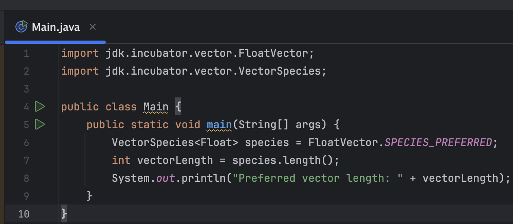
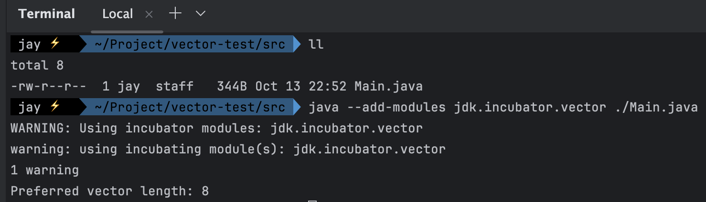

이처럼 벡터의 길이를 확인하는 것은, 앞서 살펴본 것처럼 루프 바운드를 계산하거나 벡터화된 루프에서 처리되지 않은 남은 요소들을 처리할 때 유용하게 활용됩니다. 벡터 길이를 알고 있으면 벡터 연산이 배열 경계를 넘어가지 않도록 하고, 남은 요소들을 스칼라 방식으로 정확하게 처리할 수 있습니다.

> -  **루프 바운드 계산** : 벡터화된 루프에서 처리할 수 있는 최대 인덱스를 계산할 때 벡터 길이를 사용합니다.
> - `int upperBound = SPECIES.loopBound(a.length);`
    >**남은 요소 처리:** 벡터화된 루프에서 처리하지 못한 남은 요소들은 스칼라 루프에서 처리합니다.
    `for (; i < a.length; i++) {     // 남은 요소에 대한 처리 }`

코드 작업 외에도 리눅스의 `lscpu` 명령어나 시스템 정보 도구를 통해 CPU의 SIMD 지원 여부를 확인할 수 있습니다. 이를 통해 시스템의 CPU 특성을 파악하고, 예상되는 벡터 길이를 코드 작성 전에 미리 예측할 수 있습니다. 이러한 정보는 성능 최적화에 유용하게 활용될 수 있습니다.


예시로 위에서 작성한 코드를 수행해 보면 아래와 같은 동작을 합니다.

실행 시점의 하드웨어 상태에 따라 Vector 연산과 Scalar 연산의 성능이 다소 혼재될 수 있습니다. 특히 개인용 노트북 환경에서는 연산 효율성의 차이가 크게 체감되지 않을 수 있습니다. 하지만 더 나은 하드웨어 환경에서는 Vector API의 성능 향상이 더 뚜렷하게 나타날 것으로 기대됩니다. 성능이 보장된 상용 서버 환경에서는 더욱 큰 효과를 볼 수 있겠죠.

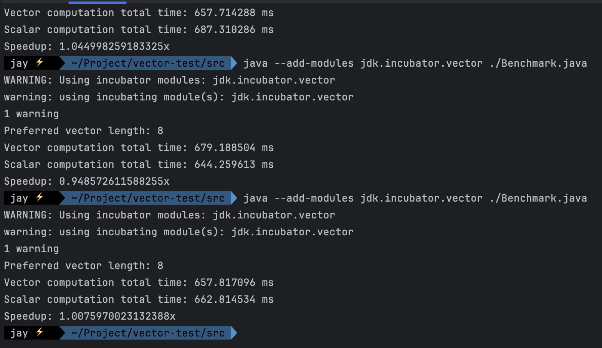

```java
import jdk.incubator.vector.FloatVector;  
import jdk.incubator.vector.VectorSpecies;  
  
import java.util.Random;  
  
/**  
 * */public class Benchmark {  
    public static final VectorSpecies<Float> SPECIES = FloatVector.SPECIES_PREFERRED;  
  
    public static void main(String[] args) {  
        int vectorLength = SPECIES.length();  
        System.out.println("Preferred vector length: " + vectorLength);  
  
        Benchmark benchmark = new Benchmark();  
  
        int size = 10_000_000; // 배열의 크기  
        int warmup = 10; // JVM 워밍업을 위한 반복 횟수  
        int iterations = 100; // 실제 측정을 위한 반복 횟수  
  
        float[] a = new float[size];  
        float[] b = new float[size];  
        float[] c = new float[size];  
  
        // 랜덤한 값으로 배열 초기화  
        Random random = new Random();  
        for (int i = 0; i < size; i++) {  
            a[i] = random.nextFloat();  
            b[i] = random.nextFloat();  
        }  
  
        // JVM 워밍업  
        for (int i = 0; i < warmup; i++) {  
            benchmark.vectorComputation(a, b, c);  
            benchmark.scalarComputation(a, b, c);  
        }  
  
        // 벡터화된 함수 실행 시간 측정  
        long vectorStartTime = System.nanoTime();  
        for (int i = 0; i < iterations; i++) {  
            benchmark.vectorComputation(a, b, c);  
        }  
        long vectorEndTime = System.nanoTime();  
        long vectorTotalTime = vectorEndTime - vectorStartTime;  
  
        // 스칼라 함수 실행 시간 측정  
        long scalarStartTime = System.nanoTime();  
  
        for (int i = 0; i < iterations; i++) {  
            benchmark.scalarComputation(a, b, c);  
        }  
  
        long scalarEndTime = System.nanoTime();  
        long scalarTotalTime = scalarEndTime - scalarStartTime;  
  
        System.out.println("Vector computation total time: " + (vectorTotalTime / 1_000_000.0) + " ms");  
        System.out.println("Scalar computation total time: " + (scalarTotalTime / 1_000_000.0) + " ms");  
        System.out.println("Speedup: " + ((double) scalarTotalTime / vectorTotalTime) + "x");  
  
  
    }  
  
    private void scalarComputation(float[] a, float[] b, float[] c) {  
        for (int i = 0; i < a.length; i++) {  
            c[i] = (a[i] * a[i] + b[i] * b[i]) * -1.0f;  
        }  
    }  
  
    private void vectorComputation(float[] a, float[] b, float[] c) {  
        int i = 0;  
  
        int upperBound = SPECIES.loopBound(a.length);  
  
  
        for (; i < upperBound; i += SPECIES.length()) {  
            var va = FloatVector.fromArray(SPECIES, a, i);  
            var vb = FloatVector.fromArray(SPECIES, b, i);  
  
            var vc = va.mul(va)  
                    .add(vb.mul(vb))  
                    .neg();  
            vc.intoArray(c, i);  
        }  
  
        for (; i < a.length; i++) {  
            c[i] = (a[i] * a[i] + b[i] * b[i]) * -1.0f;  
        }  
    }  
}
```


## 그래서 Fastjson2는 왜 빠른가?

여러 가지 이유가 있겠지만, FastJson2는 Vector를 활용하여 성능을 높였습니다. 특히 ByteVector를 사용하여 64비트 연산을 수행하며, 이를 통해 서버 프로그래밍 환경에 최적화된 JSON 직렬화 및 역직렬화 기능을 제공합니다. 이러한 접근 방식 덕분에 대용량 데이터를 다루는 서버 환경에서 더욱 효율적인 처리 성능을 발휘할 수 있습니다.

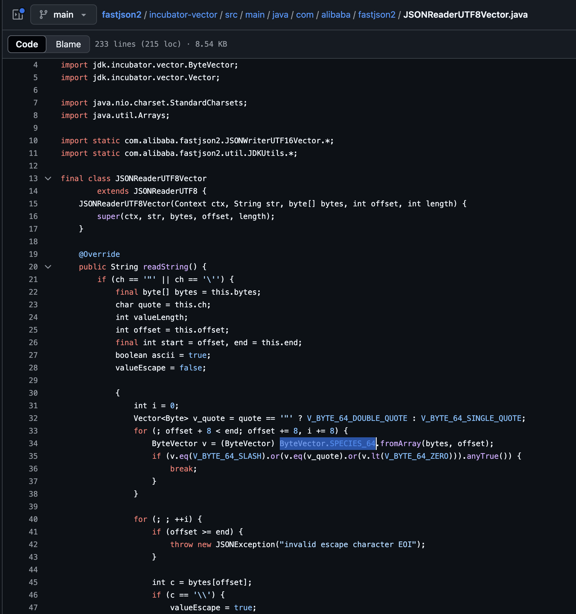

---
### 마무리하며

적어도 제게는 '아는 만큼 보인다'라는 말이 참 와닿는 경험이었습니다.

개인적으로 아직 Vector API를 충분히 많이 사용해 보지는 않아 FastJson2를 세세하게 분석하지는 못했지만, Vector API를 살펴보면서 이 구조가 서버 환경에 적합하다는 점을 이해할 수 있었습니다.

FastJson2를 단순히 성능이 좋다는 이유만으로 사용하는 것이 아니라, 그 이면의 원리를 이해하고 활용해 보길 권해 드리고 싶습니다. 여러분도 이런 한 걸음 더 나아가는 경험을 하실 수 있기를 바랍니다.

감사합니다.
