# 소프트웨어는 정말로 점점 안 좋아지고 있을까?

이전 아티클에 "The Hardware Lottery"라는 논문을 정리한 적이 있었죠. 그중에서도 가장 기억에 남는 부분은 "Low-Hanging Fruit”에 대한 언급이었는데요, 논문에서는 "과거에 하드웨어의 발전 덕분에 쉽게 얻었던 성능 향상이 이제는 더 어려워졌고, 오히려 현재는 소프트웨어 최적화를 통해 쉽게 성과를 낼 수 있는 영역이 많이 남아 있다”고 주장했습니다. 이는 얼핏 보면 "현대 소프트웨어가 과거보다 오히려 퇴보한 게 아닌가?"라는 생각이 들게 합니다. 과연 그런 걸까요? 최적화 업무를 메인으로 하는 입장에서는 공감 가는 부분도 있지만, 한편으로는 실제로 그렇게 단정 지을 수 있는지 의문이 들었습니다. 그래서 이번 기회에 이 문제를 좀 더 명확히 짚어보고 싶었습니다.

분명 오늘날의 컴퓨터는 수십 년 전의 컴퓨터에 비해 수천, 수만 배 더 빠른건 사실입니다. 하지만 사람들의 체감은 다르죠. 오히려 많은 사람들이 최신 앱과 프로그램들이 꼭 더 빠르다고 느끼지 않고 있습니다. 특히 게임 업계에서는 흔히 말하는 '발적화'로 인해 커뮤니티에서 욕을 자주 먹고 있죠.

*저는 실제로 최근 발매한 몬스터헌터 와일즈를 사서 해볼까 싶었지만, 스팀덱에서 플레이하기 힘들다고 해서 누워서 게임을 하는 걸 좋아하는 저에게는 구매를 포기할 수 밖에 없었습니다.*

게임 뿐만 아닌 단순 프로그램에서도 이런 현상이 있는데요. 2000년대 초반의 OS가 설치된 오래된 PC의 소프트웨어가 최신 OS 및 소프트웨어를 돌리는 신형 컴퓨터보다 오히려 더 반응 속도가 빠른 경우도 있습니다. 이는 과거의 향수가 아닌 실제로 실험으로 나온 결과죠.

왜 이런 일이 발생하는 걸까요? 혹시 흔히 말하는 "MZ 개발자”들이 과거 개발자보다 실력이 떨어져서 그런 걸까요? 사실 이 문제는 개인의 역량보다 기업의 비즈니스적 타협, 개발자들이 성능 대신 다른 가치를 택하거나, 다른 우선순위가 복합적으로 얽혀 있는 현상일지도 모릅니다.

아래에서는 소프트웨어 효율성이 지금까지 어떻게 변화해왔는지 살펴보겠습니다. 과거와 현재의 성능을 직접 비교하면서, 소프트웨어가 정말로 퇴보한 것인지 아닌지 확인해볼 것입니다. 더불어 개발자들이 성능 대신 다른 가치를 선택하는 이유와 비효율성이 용인되는 배경을 알아보고, 이 문제를 어떻게 해결할 수 있을지도 살펴보겠습니다.

## 목차

1. 과거의 프로그램이 정말 더 빨랐을까?
2. 과연 소프트웨어가 비효율적이게 된 것일까?
3. 성능이라는 "기능"이 너무 터부시 되고 있다.
4. 소프트웨어 효율성을 높이는 기술들
5. 결론

## 과거의 프로그램이 정말 더 빨랐을까?

오늘날의 소프트웨어가 정말 느려진 걸까요, 아니면 단순한 향수일까요? 실제로 과거 소프트웨어가 최신 소프트웨어보다 기본적인 작업에서 더 빠르게 반응하는 사례는 많습니다. 현재 소프트웨어보다 과거 소프트웨어가 더 뛰어난 걸까요? 사실 이는 **과거 소프트웨어가 더 뛰어난 것이 아니라, 단순히 더 적은 일**을 했기 때문에, 과거 소프트웨어가 더 빠르게 보이는 것이 더 큽니다.

한 [기술 블로거](https://jmmv.dev/2023/06/fast-machines-slow-machines.html#:~:text=To%20summarize%2C%20the%20Twitter%20thread,agree%20we%20have%20a%20problem)는 2000년대 초반의 오래된 PC(Windows NT 3.51)와 최신 노트북(Windows 11)을 비교한 영상을 올렸습니다. 메모장이나 그림판처럼 간단한 프로그램을 실행해보니 20년 된 컴퓨터가 최신 고사양 컴퓨터보다 훨씬 빠르게 앱을 열었습니다. 600MHz CPU에 128MB RAM을 가진 오래된 PC가 몇 GHz CPU와 32GB RAM을 가진 최신 기기보다 빠르게 작동하는 모습은 충격을 불러일으켰습니다.

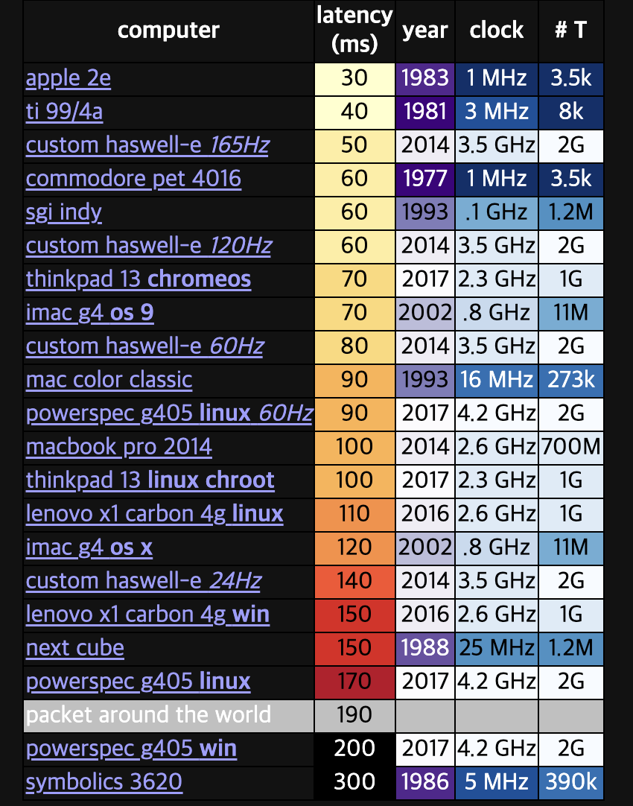

위의 시각적인 비교 이외에 정교한 수치적 비교도 있습니다. 개발자 댄 루(Dan Luu)는 [과거 40년간의 컴퓨터 입력 지연 시간을 측정해 놀라운 결과](https://danluu.com/input-lag/)를 보였습니다. 1983년 Apple IIe는 입력 지연이 약 30ms였던 반면, 2014년 맥북 프로는 약 100ms, 최신 Windows PC는 무려 200ms였습니다. **과거 기기가 최신 컴퓨터보다 반응성이 뛰어난 셈**이죠.

왜 이런 차이가 날까요? 과거 컴퓨터는 **하나의 프로그램만 실행했고, 백그라운드 작업도 적었으며, 제한된 자원에 맞춰 철저히 최적화**되어 있었습니다. 반면 현대 컴퓨터는 입력 신호가 수많은 계층(USB 드라이버, 운영체제 이벤트 큐, 그래픽 처리 등)을 통과하면서 복잡성과 지연이 증가합니다. 현대 컴푸터와 OS가 훨씬 더 많은 기능을 한다는 것이죠.

댄 루의 연구는 또 하나 흥미로운 점을 지적합니다. **입력 지연을 줄이기 위한 현대적인 노력조차도 종종 새로운 복잡성을 더하는 방향으로 진행된다고 주장합니다.** 예를 들어, 과거의 빠른 반응성을 되찾기 위해 GPU 가속 합성, 예측 입력 처리 등 추가적인 시스템이 도입되곤 합니다. 아이러니하게도, 느려진 복잡한 시스템을 빠르게 만들기 위해 또 다른 복잡한 시스템을 얹는 셈이죠. 예를 들어 백그라운드에서 미리 데이터를 로드하거나 캐시하여 지연을 감추는 식입니다. 사용자 경험은 향상될 수 있지만, 과거에 비해 훨씬 많은 일이 "보이지 않는 곳"에서 벌어지고 있다는 점을 보여줍니다.

물론, 과거와 현재의 비교가 완전히 공정하진 않습니다. 요즘 앱은 단순히 텍스트 버퍼만 열지 않고, **네트워크 연결 확인, 플러그인 로드, 클라우드 자동저장 등 더 많은 일을 수행**합니다. 기능이 많아진 만큼 무거워진 것이죠.

하지만 모든 현대 소프트웨어가 느린 건 아닙니다. 특히 스마트폰처럼 하드웨어가 제한된 환경에서는 백그라운드 작업을 엄격히 줄이고, UI와 입력 처리 흐름을 단순화하여 매우 빠른 반응성을 구현하고 있습니다. 예를 들어 최신 IPad Pro는 Apple IIe 수준인 30ms의 입력 지연을 보여줍니다. *근데 또 스마트폰이 엄청 고성능이 되면 기능이 많아져 또 느려질 수도 있겠네요.*

## 과연 소프트웨어가 비효율적이게 된 것일까?

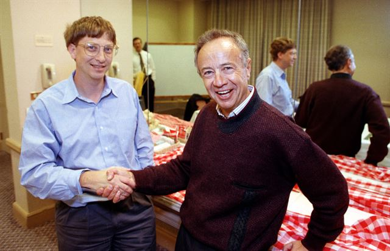

위 사례처럼 하드웨어 성능이 좋아지면서 다양한 기능이 들어가고 있으며 소프트웨어가 점점 무거워지고 있습니다. 기술 업계에서는 소프트웨어가 하드웨어 성능을 모두 소모한다는 농담이 자주 나왔었습니다. 1990년대엔 ["앤디가 주면 빌이 가져간다"](https://en.wikipedia.org/wiki/Andy_and_Bill%27s_law)라는 유명한 우스갯소리도 있었죠. 인텔의 앤디 그로브가 더 빠른 CPU를 내놓으면, 마이크로소프트의 빌 게이츠가 곧바로 그 성능을 모두 소모하는 소프트웨어를 출시한다는 이야기입니다. 즉, 하드웨어가 아무리 발전해도 그 자원을 전부 활용하는 무거운 소프트웨어가 바로 뒤따라 나온다는 것이죠.

이를 풍자한 ["위르트의 법칙(Wirth's Law)"](https://en.wikipedia.org/wiki/Wirth%27s_law)이라는 말도 있습니다. 이 법칙에 따르면, *"소프트웨어는 하드웨어가 빨라지는 속도보다 더 빠르게 느려진다"*고 합니다. 결국 시간이 흐를수록 소프트웨어는 더 많은 자원을 요구하고, 하드웨어 발전의 이점이 상쇄되는 일이 반복된다는 의미죠. (지금까지의 사례를 보면 어느 정도 일리가 있어 보입니다.)

하지만 이를 너무 부정적으로만 볼 필요는 없습니다. 우리가 소프트웨어의 속도를 약간 희생하면서 얻은 이점들이 훨씬 크기 때문이죠. 위 사례처럼 다양한 기능의 추가뿐만 아니라 저는 특히 **개발과 유지보수의 용이함**을 가장 먼저 강조하고 싶습니다.

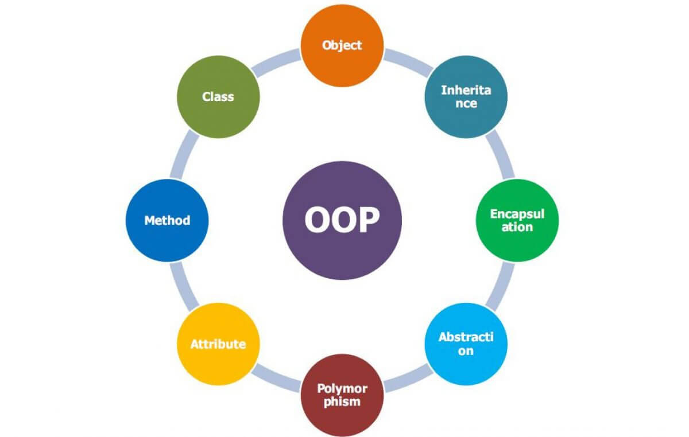

오늘날 대부분의 개발자들은 **객체 지향 프로그래밍(OOP)**을 당연하게 받아들입니다. Python, Java, C++ 같은 언어들은 모두 객체 지향 프로그래밍 방식을 기본으로 사용하며, 저 또한 Python으로 개발할 때 프로젝트의 규모가 커지면 대부분 객체 지향적 구조를 적용합니다. 하지만 사실 이 객체 지향 프로그래밍은 구조적으로 어느 정도 성능을 희생할 수밖에 없는 방식이라는 걸 알고 계실 겁니다.

객체 지향의 창시자 Alan Kay가 객체 지향 개념을 만든 이유는 성능이 아니라 **인간 중심적인 철학** 때문이었습니다. 그는 특히 교육을 중요하게 여겼고, 아이들을 위한 교육용 컴퓨터인 Dynabook를 구상하면서 최초의 객체 지향 언어인 Smalltalk을 만들었습니다. 그는 Smalltalk를 통해 아이들이 더 유연하게 생각하고 창의적인 방식으로 문제를 해결하기를 원했습니다. 그래서 Smalltalk는 객체들이 서로 메시지를 주고받는 방식으로 설계되었죠.

그러나 이러한 장점에도 불구하고 Smalltalk는 당시 널리 쓰이던 C에 비하면 성능이 상당히 느리고, 메모리 사용량도 더 많았습니다. 이는 주로 객체 지향의 런타임 다형성(dynamic dispatch), 간접 참조(indirect reference), 가상 함수 호출(virtual function call) 등으로 인한 런타임 오버헤드 때문이었습니다. 물론 애초에 Smalltalk가 성능을 목표로 만들어진 언어는 아니었지만, 이 점을 감안해도 느린 건 사실이었죠.

그렇다면 성능을 위해 객체 지향을 버리고 모든 소프트웨어를 C나 Rust처럼 저수준 언어로 작성하면 되는 걸까요? 특수한 경우를 제외하면 아마 오늘날의 현실에서 그런 걸 주장하면 동료들에게 이상한 사람 취급을 받거나 심지어 해고를 당할 수도 있겠죠.

앞에서 이야기했듯이 객체 지향 프로그래밍은 인간 중심적인 철학에서 비롯되었고, 현실 세계와 매우 유사한 방식으로 구조화된다는 점에서 코드를 쉽게 이해하고 설계할 수 있게 해줍니다. 결국 핵심은 **"개발이 쉽고 유지보수가 용이하다"**는 것입니다. 오늘날의 하드웨어는 과거보다 수천 수만 배나 빠르고 강력해졌기 때문에, 설령 객체 지향 코드가 절차적 코드에 비해 몇 배에서 많게는 수십 배 느리다고 하더라도 이미 그 차이는 실질적으로 큰 의미가 없게 되었습니다. **현대의 소프트웨어는 어느 정도의 성능을 기꺼이 희생하고라도, 더 쉽고 빠르게 개발하고, 유지보수하기 좋으며, 손쉽게 확장할 수 있는 구조를 갖추는 것**을 선택한 것입니다. 덤으로 코드의 가독성도 훨씬 좋은 편이죠.

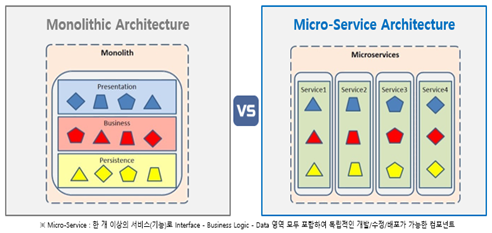

객체 지향뿐만 아니라, 컴퓨터의 성능이 부족하거나 컴퓨터 비용이 매우 비쌀 때는 아예 시도조차 불가능했던 아키텍처 방식이 있습니다. 그중 하나가 바로 **마이크로서비스 아키텍처(MSA)**입니다.

MSA는 간단히 말해 하나의 큰 애플리케이션을 작은 서비스 단위로 나누고, 이 서비스들이 네트워크를 통해 서로 통신하는 방식입니다. 각 서비스는 독립적으로 개발, 배포, 확장이 가능하며, 서로 다른 기술 스택을 사용할 수 있어 **높은 유연성**을 가집니다. 하지만 이런 방식은 서비스 간 통신을 위한 네트워크 호출, 데이터 중복, 분산 트랜잭션 처리 등의 큰 오버헤드를 불러옵니다. 당연히 **전통적인 모놀리식 방식에 비해 성능 면에서는 비효율적**일 수밖에 없죠.

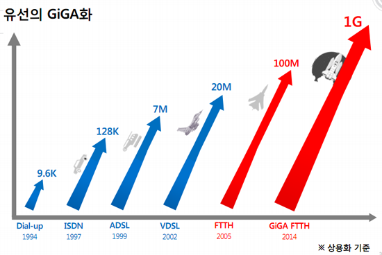

그래서 과거 컴퓨터 자원이 제한적이었을 때는 이 방식은 현실적으로 불가능했습니다. 지금이야 10기가 이더넷을 넘어 100기가 이더넷도 있지만, 과거의 네트워크는 그 보다 훨씬 떨어졌기 때문에 각 서비스 간 빈번한 네트워크 통신으로 인한 지연은 시스템의 성능을 크게 저하시켰습니다. 추가적인 하드웨어 비용과 인프라의 부족, 소프트웨어의 환경 등등 말 하면 괜히 입만 아프겠죠. 그래서 당시의 하드웨어 환경과 네트워크 환경에서는 이러한 방식이 오히려 비효율의 극치이자 **사치**였습니다.

하지만 시대가 발전하며 클라우드 컴퓨팅 시대가 열리면서 상황은 완전히 달라졌습니다. AWS나 Azure와 같은 클라우드 서비스가 보편화되면서 필요한 만큼 서버 자원을 즉각적으로 확보할 수 있게 되었고, 컨테이너와 K8s와 같은 도구들이 등장하면서 서비스 관리와 배포가 쉬워졌습니다. 이 덕분에 성능 손실이 일정 부분 발생하더라도, **개발 속도와 팀의 생산성을 더 우선하는 전략을 채택할 수 있게 된 것**이죠.

즉, MSA는 철저히 현대의 하드웨어 발전과 인프라 자동화라는 환경 변화 덕분에 가능해진 방식입니다. *(하드웨어 복권과 소프트웨어 복권이 잘 맞은 것이죠.)* 그래서 오늘날의 개발자들은 비용과 성능 효율성을 일정 부분 희생하더라도, 빠르게 변화하는 시장의 요구에 맞춰 민첩하게 움직이고 빠르게 성장할 수 있는 시스템을 더 가치 있게 여기고 있습니다.

물론 이런 MSA도 장점만 있는게 아닙니다. 단점으로는 특히 서비스의 규모가 작거나 명확한 도메인 분리가 힘든 경우, MSA가 오히려 복잡성만 키우고, 개발 속도가 더뎌지기도 하며, 불필요한 오버 엔지니어링을 야기하는 경우도 흔하죠. 이 때문에 최근에는 처음부터 마이크로서비스로 시스템을 설계하지 않고, 초반에는 모놀리식으로 빠르게 개발한 뒤, 서비스가 충분히 성숙해지고 규모가 커졌을 때 점진적으로 MSA로 전환을 시도하는 경우가 많아지고 있습니다.

위의 사례들을 종합적으로 봤을때, 저는 **성능이라는 것도 하나의 기능**이라고 생각합니다. 과거에는 하드웨어 및 인프라, 소프트웨어 등등의 제약 때문에 **성능이라는 기능**에 집중할 수밖에 없었죠. 하지만 지금은 성능 뿐만 아니라 "팀의 민첩성", "개발 속도", "유지보수의 용이성"과 "개발의 확장성" 등등 이라는 다양한 기능들이 성능과 함께 선택할 수 있게 되었다고 생각합니다.

## 성능이라는 "기능"이 너무 터부시 되고 있다.

하지만 저는 요즘에 드는 생각이 성능이라는 기능을 다른 기능에 비해서 너무 터부시하고 있다는 생각이 들기도 합니다. 제가 있는 분야는 인공지능 분야인데, 현재의 인공지능을 사용하기 위해 GPU 사용이 보편적입니다. 하지만 GPU의 비용을 결코 저렴하지 않죠. 일반적으로 이런 말도 있습니다. *"컴퓨팅 비용보다 개발자 비용이 더 비싸다."* 하지만 GPU에서는 아닐 수 있습니다.

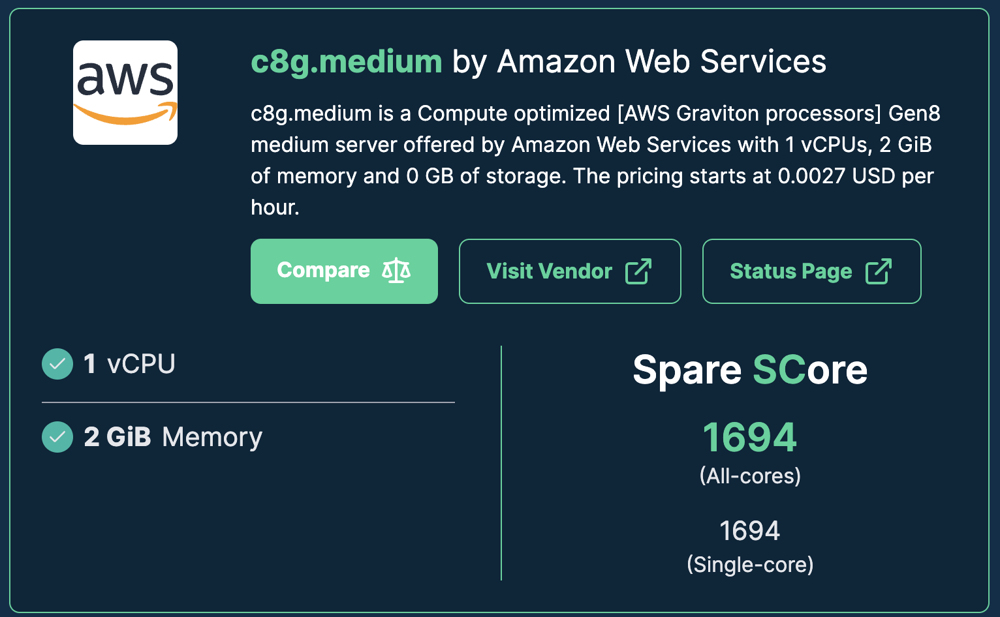

당장 AWS의 c8g.medium 인스턴스만 해도 2.7GHz 1 Core(!), 2GB 대용량 메모리(!!), 12.5기가비트 초고속 이더넷(!!!), 10기가비트로 접근 가능한 스토리지(!!!!) 를 가진 어마어마한 슈퍼 컴퓨터가 시간당 0.04달러밖에 하지 않습니다. 1년 동안 사용하면 **약 350달러** 밖에 들지 않습니다. (더불어 1년 예약하면 더 쌉니다.)

하지만 GPU는 어떨까요? GPU 인스턴스 중에 요즘 가성비가 가장 좋은 NVIDIA L4 GPU를 탑재하고 있는 g6.xlarge를 가져 왔을 때, 무려 시간당 0.8달러 입니다. 물론 4 Cores, 16GB 메모리긴 하지만 말도 안되게 비싸죠. 이를 1년 동안 풀로 돌리면 **1년에 약 7000 달러**가 소모됩니다. 무려 가격이 20배나 차이나는 것을 알 수 있습니다. 그 다음으로 성능이 뛰어난 NVIDIA L40S GPU가 탑재된 인스턴스인 g6e.xlarge를 가져오면, **1년에 15,768 달러**가 소모됩니다. 대부분 서비스를 하는데 GPU 1대만 가지고 사용하지 못하니, 적어도 10대 정도만 사용해도 평균 개발자보다 비싼 것을 알 수 있죠.

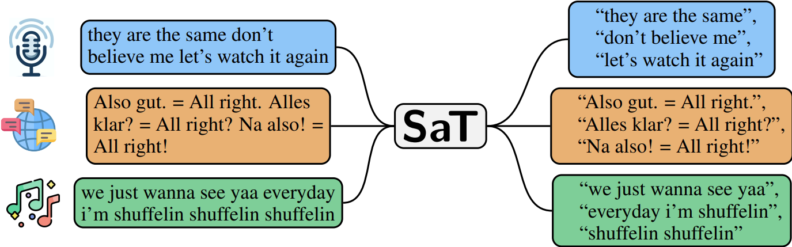

제 사례의 예시를 보면 최근에 회사 서비스에 사용하고 있는 라이브러리 중에 텍스트를 적절히 분리시켜주는 모델인 [segment any text](assets/https://github.com/segment-any-text/wtpsplit) 에 PR하여 성능 개선을 했었는데요, [코드의 단 한줄만 바꿔서, 52.7ms 가 걸리는걸 2.45ms로 줄였습니다.](https://github.com/segment-any-text/wtpsplit/pull/150) 이걸 알아낸 것은 GPU에서 해당 함수를 반복 호출했는데도 불구하고, GPU 사용률이 0%라서 분석해보니, tokenizer의 길이를 가져올때 고정적인 40ms 속도가 소요되는 것을 확인했었습니다.

만약 이 wtpsplit 라이브러리를 가져와서 데이터 전처리를 위해 **5000만 줄의 텍스트**를 해야하는 상황이 온다고 할 때 어떻게 될까요? (저희 회사는 데이터를 많이 가지고 있어, 데이터 전처리에만 일주일 내지 열 흘 동안 GPU 400대 500대 가량 사용하곤 합니다.)

텍스트 한 줄에 50ms가 소요될 시 대략 **한 달**이 걸립니다. g6 에서는 약 600 달러, g6e 에서는 약 1300 달러가 소모되는 것이죠. 이를 만약 이걸 2ms로 줄였을 때는 단 하루면 되고, g6에는 약 23 달러, g6e에서는 약 50달러가 소모되는 것이죠. 단 **한 줄**만 바꿨는데, 시간도 한 달에서 하루로 아꼈고, 비용도 약 500 ~ 1000 달러를 줄인겁니다. 이는 어떻게 보면 규모가 작아서 사소해보일 순 있습니다. 다만 큰 노력을 들이지 않은 것에 비하면 나름 꽤 크다고 할 수 있죠.

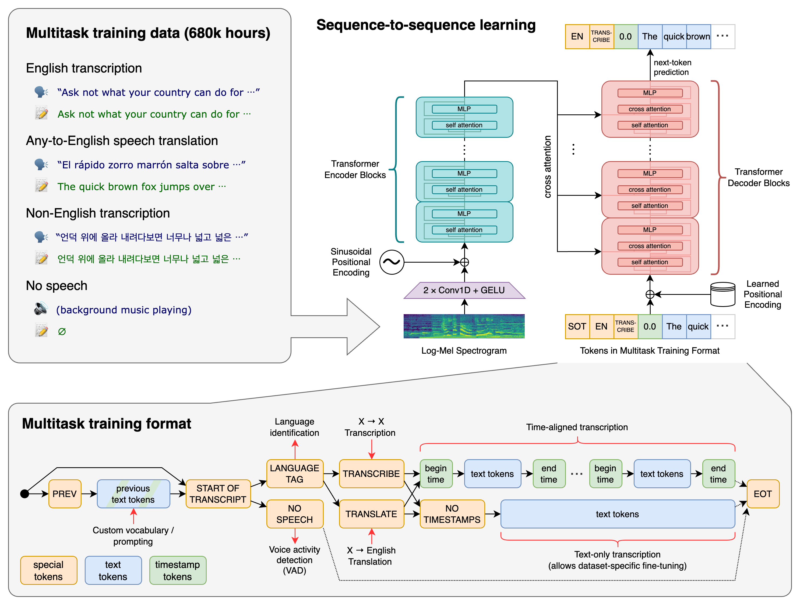

규모가 작은 것 같으니 이번엔 규모를 좀 크게 가져가 볼까요? OpenAI가 만든 Whisper 모델에 관한 건데요. Whisper 모델은 음성을 텍스트로 바꿔주는 LLM 기반의 모델인데, 성능이 최고에 가까워서 많은 기업들이 이를 활용하고 있습니다. 하지만 최대의 단점은 **정말 정말 느리다** 라는 것이 문제인데요. Whisper-Large-V3 모델을 Whisper 라이브러리를 통해서 g6e 인스턴스에서 1시간 44분 분량의 음성을 돌렸을때 14분이 걸렸었습니다.

저희 회사에서는 수 백만 시간의 음성을 이 모델을 돌려야 했는데요, 예를 들어 300만 시간의 분량을 이 모델을 돌렸을 때, GPU 1대로 돌릴시 **46년**이 소요되고, 비용은 약 **726,923달러(약 10억원)**가 소모된다는 계산이 나왔었습니다. GPU를 500대 정도 빌려도 한 달동안 돌려야 하며 비용은 여전히 그대로라는게 공포였었죠.

반면 이걸 NVIDIA 전용 모델 최적화 라이브러리인 [TensorRT-LLM을 사용하여 최적화를 진행](https://github.com/NVIDIA/TensorRT-LLM/blob/main/examples/whisper/README.md)하고 구동할 시, 1시간 44분 분량이 **단 30초**가 걸리는 걸 보고 크게 놀랐었습니다. 이는 300만 시간 분량일때, GPU 1대로 돌릴시 **1.6년**이 걸리고 비용은 **약 25,000달러(3700만원)**가 소모된다는 계산이 나왔었습니다. 이렇게 해서, 약 10억원 가량 드는게 무려 3,700만원까지 감소되었고, 비용을 **9억 4천만원** 정도 아낀게 되겠네요. 추가로 수행 시간도 매우 압축되서 이걸 GPU를 500개를 빌리면 단 하루만 있으면 끝낼 수 있게 되었구요.

아무래도 GPU 세계에서는 **"개발자보다 컴퓨팅 비용이 더 비싸다"** 라는게 맞겠네요.

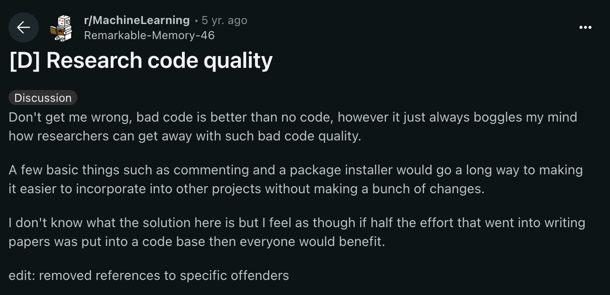

위 사례들 이외에도, 지금도 인공지능 오픈소스 내부에는 간단하면서 크게 개선할 수 있는 여지들이 많은 Low Hanging Fruit들이 혼재해 있습니다. 이게 인공지능 연구원들이 개발 지식이 부족하고 무능해서 일어난 일일까요? **아니요. 절대로 아닙니다.** 연구원 분들은 다른 목표를 가지고 있는 겁니다. 위 wtpsplit, whisper는 뛰어난 품질로 유명한 라이브러리입니다. 대부분의 연구에서는 속도도 중요시 여기지만 **정확도, 품질, 논문 재현성을 훨씬 더 우선**시 합니다. 즉 **성능이라는 기능보다 이러한 것들이 더 우선**이라는 것이죠. 게다가 연구는 시간 제약이 매우 많습니다. 연구하는 시간을 쓰기도 모자라죠.

하지만 GPU 비용이 워낙 비싸 성능이라는 기능을 결코 포기할 순 없습니다. 그러면 연구원 분들의 목표와 성능을 같이 잡을 수 있는 방법은 무엇이 있을까요? 

*- 넘어가기전에 짚고 가야할 게 있습니다. 그럼 GPU를 사용하지 않는 분야는 괜찮을까요? 지금은 괜찮을 수 있으나, 이제는 아닐 가능성이 더 큽니다. 왜냐면 하드웨어 성능은 이제 과거처럼 폭발적으로 성장하지 않기 때문입니다. 하지만 걱정마세요. 그 만큼 소프트웨어에 Low Hanging Fruit들이 많을 겁니다.*

## 소프트웨어 효율성을 높이는 기술들

제가 최적화 업무를 진행할 때 가장 무엇을 할까요? 흔히 하는 CPU, GPU OverHead 줄이기? 모델을 양자화하고 TensorRT 최적화 하기?, 느린 CPU 코드를 GPU로 바꾸기?, 뛰어난 대체 알고리즘을 찾거나 연구해서 대체시키기?

저는 이게 "라면을 끓일 때 뭐 먼저 넣나요?" 라는 질문과 비슷하게 들립니다. 스프부터 넣는 분이 있고, 면 부터 넣는 분이 있잖아요? 근데 가장 먼저 해야 하는건 **물을 먼저 넣어야 한다는 것입니다.** 이게 갑자기 무슨 노잼 드립인가 할 수 있지만, 위에 적은 방법론 같은건 제에겐 스프, 면 넣기와 같고, "물을 넣는다"라는건 저에겐 **정확하고 쉽고 빠르게 확인할 수 있는 프로파일링**입니다.

성능 최적화의 출발점은 **무조건 "측정"입니다**. 무엇을 얼마나 느리게 하고 있는지를 모르고 바로 최적화에 들어가는 건 안개 속에서 뛰는 것과도 같습니다. 프로파일링 없이 항상 예측한 것은 생각보다 안 느릴 때가 많거든요. 대부분의 느린 코드는 예상치 못하고 치명적인 단 몇 줄에서 일어나는 케이스가 흔합니다. wtpsplit과 내부 프로젝트에서 최적화를 한 것도 프로파일링을 하고나서 개선을 할 수 있었습니다. 특히 wtpsplit과 같은 경우는 제가 그 라이브러리에 지식이 아예 없는데도 불구하고, 프로파일링을 통해 단 한시간 안에 해결을 한 케이스이기도 하죠.

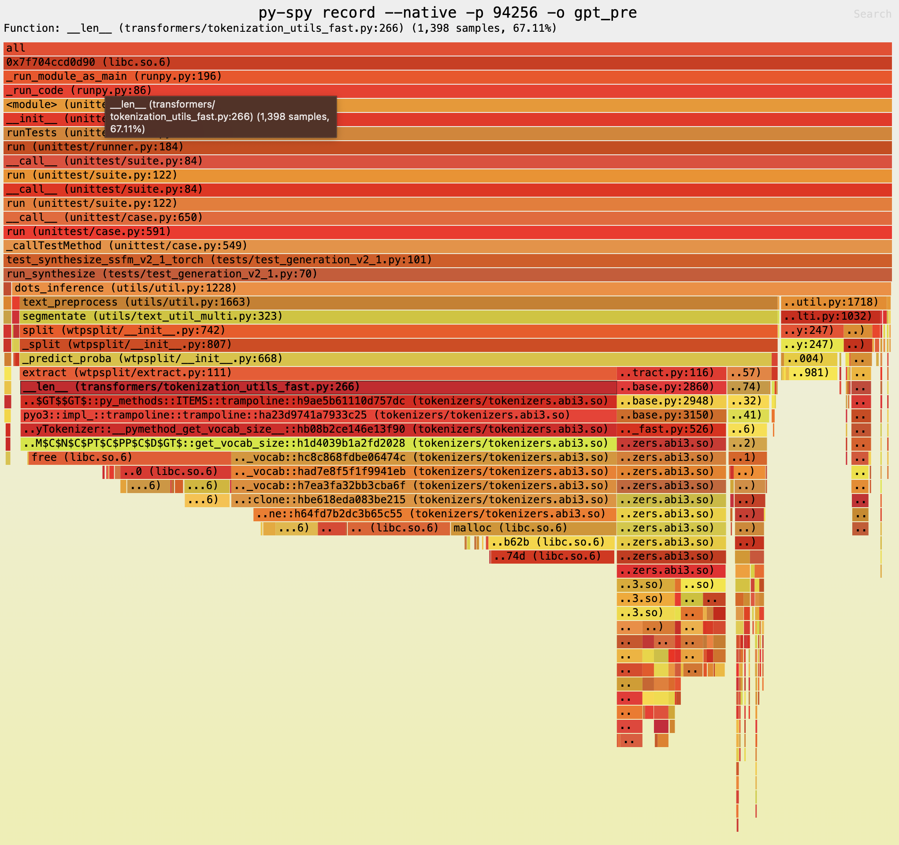

제가 최적화 능력과 기술이 뛰어나서 그런걸까요? 아니요. 저는 그냥 함수 하나를 while문을 돌리고, [py-spy](https://github.com/benfred/py-spy)와 같은 프로파일링 도구로 측정하고, 모델 추론이 아닌 다른 곳에 95% 비중을 차지하고 있는 tokenize 길이 측정을 하고 한 줄만 바꾼 단순 날먹을 했을 뿐입니다. 이외에도, 회사 라이브러리의 학습 코드에 있는 DataLoader 같은 것도 측정을 해서, 쉽고 빠르게 개선했었죠.

그러면 측정을 했는데, 코드를 어떻게 개선시키고 빠르게 하죠? 그건 어려운 일이 아닌가요? 물론 과거에는 그랬겠지만, 이제는 괜찮습니다. 우리의 사수 ChatGPT, Claude, Cursor, Github Copilot이 있으니까요!

농담이 아니라 저는 느린 부분을 프로파일링을 통해 빠르게 찾고, ChatGPT에 그대로 코드를 복사한 다음 mock input을 주어서 속도가 느린데 빠르게 개선 시킬수 있는 여지가 있을까? 이렇게 물어봅니다. 그 다음 만들어진 함수를 한번 적절한지 보고 Output이 맞고 time을 찍어서 얼만큼 개선되었는지 확인하죠. 이런 일련의 과정을 하기만 하면 프로그램의 속도가 크게는 절반 이상은 줄여 버릴 수 있게 되는 겁니다.

그런데 위에서 언급한 방식들이 다소 야매처럼 보일 수도 있지만, 실제로 이 원리를 바탕으로 한 공식적인 논문도 존재합니다. 바로 Sakana AI에서 발표한 [AI CUDA Engineer](https://sakana.ai/ai-cuda-engineer/)입니다.

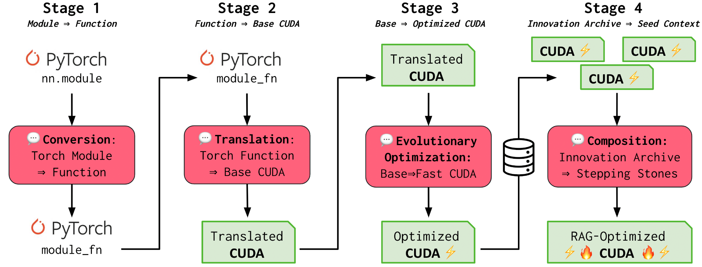

이 논문에서 제시한 아이디어는 의외로 단순합니다. PyTorch 코드를 입력으로 받아, CUDA 코드 작성 방식을 학습한 **LLM**이 해당 연산을 빠르게 실행할 수 있는 CUDA 코드로 변환해주는 것이 전부입니다. 그런데 이 단순한 구조에도 불구하고, 연구진은 이 방식이 기존 PyTorch 대비 10배에서 100배까지 빠를 수 있다고 주장합니다. 실제 논문에 제시된 벤치마크 수치를 보면 그 차이가 꽤나 인상적입니다.

이 시스템을 보면 자연스럽게 떠오르는 것이 있습니다. 바로 **"AI가 작동하는 컴파일러"**입니다.

일반적으로 컴파일러는 사람이 작성한 추상화된 코드를 하드웨어에 적합한 저수준 코드로 번역해주죠. 이 AI CUDA Engineer 역시 LLM을 이용해 고수준의 PyTorch 코드를 읽고, 그에 맞는 최적의 CUDA 커널을 생성해주는 일종의 AI 기반 컴파일러라고 볼 수 있습니다. 최근에는 이런 식으로, AI를 활용해 고수준 코드 -> 고성능 코드로 변환하는 ‘AI 컴파일러’ 연구가 활발히 진행 중입니다. 결국 이는, 성능 최적화조차 자동화될 수 있는 미래의 가능성을 보여주는 대표적인 사례라고 할 수 있죠.

물론 이 외에도 성능을 개선할 수 있는 다양한 기법들이 존재합니다. 하지만 **저는 프로파일링 없이 적용하는 최적화는 큰 의미가 없다고 생각**합니다. 어디에서 병목이 발생하는지 모른 채 기술만 적용하면, 오히려 불필요한 작업이 될 수도 있기 때문입니다.

그래서 저는 누구나 쉽게 프로파일링을 할 수 있는 환경이 갖춰져야 한다고 봅니다. 나아가 프로파일링 자체가 자동화된다면, 성능이 저하되는 지점을 훨씬 빠르고 정확하게 찾아낼 수 있겠죠. 이런 시스템이 마련되면, 최적화는 더 이상 그 들만의 영역이 아니라, 모든 사람이 접근 가능한 실용적인 도구가 될 수 있을 겁니다.

## 결론

그렇다면 "소프트웨어는 정말로 점점 안 좋아지고 있을까?"라는 질문으로 돌아가 봅시다. 앞서 살펴본 사례들을 종합해 보면, 소프트웨어가 단순히 "퇴보"했다고 단정 지을 수는 없습니다. 오히려 오늘날의 소프트웨어는 과거에 비해 **기능, 유지보수성, 확장성, 개발자의 생산성 등 다양한 가치를 최적화하는 방향으로 발전**하고 있습니다.

과거에는 제한된 하드웨어 환경 때문에 성능 최적화가 선택이 아니라 필수였지만, 현재는 하드웨어의 발전으로 인해 **일정 수준의 성능을 희생하더라도 다양한 목적과 우선순위에 맞춰 소프트웨어를 설계할 수 있게 되었습니다.** 그러나 이렇게 얻은 이점들로 인해 **성능 최적화가 무시되는 현상 또한 분명히 존재**합니다.

특히 GPU 등 고비용의 하드웨어 자원을 사용하는 분야에서는 효율성을 높이는 것이 선택이 아니라 **필수**가 되고 있으며, 앞으로는 CPU 환경에서도 하드웨어 발전 속도가 더디게 진행됨에 따라 **성능 최적화가 다시 중요하게 다뤄질 가능성이 높습니다.**

이런 상황에서 성능 개선의 가장 중요한 첫 단계는 역시 **정확하고 쉬운 프로파일링**입니다. 문제의 원인을 정확하게 진단하고 효율적으로 개선할 수 있다면, 큰 비용 절감과 생산성 향상을 동시에 이룰 수 있습니다.

나아가 최근 AI를 활용한 자동화 프로파일링과 코드 최적화 기술들이 빠르게 발전하고 있기 때문에, 앞으로 소프트웨어의 효율성 문제를 다루는 방식도 크게 바뀔 것으로 보입니다.

결국 **소프트웨어가 "안 좋아졌다"기보다는, 소프트웨어가 복잡해졌고, 동시에 우리에게는 성능 외에도 신경 써야 할 다양한 가치들이 생겨난 것**입니다. 이제 **성능을 포함한 다양한 가치들을 균형 있게 고려하며 발전하는 방향으로 나아가는 것이 더욱 중요할 것**입니다.