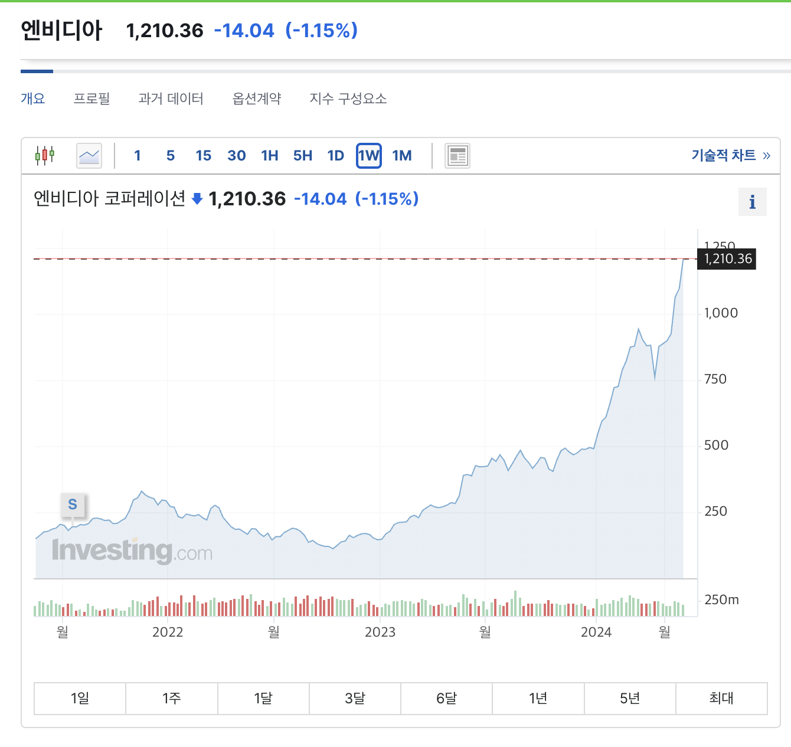
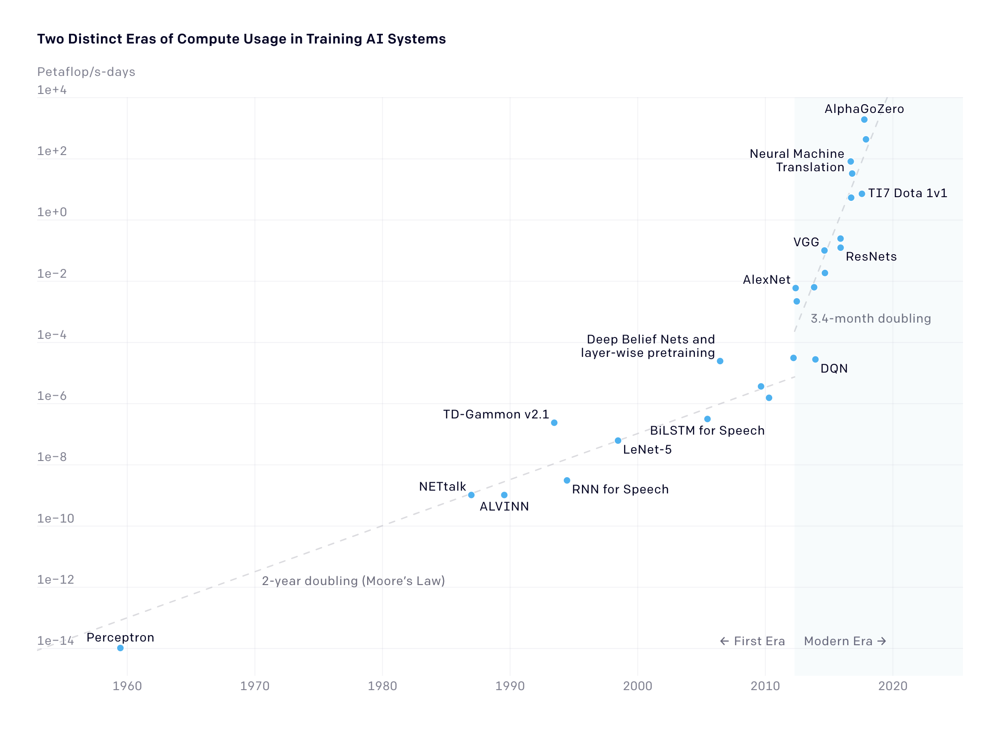
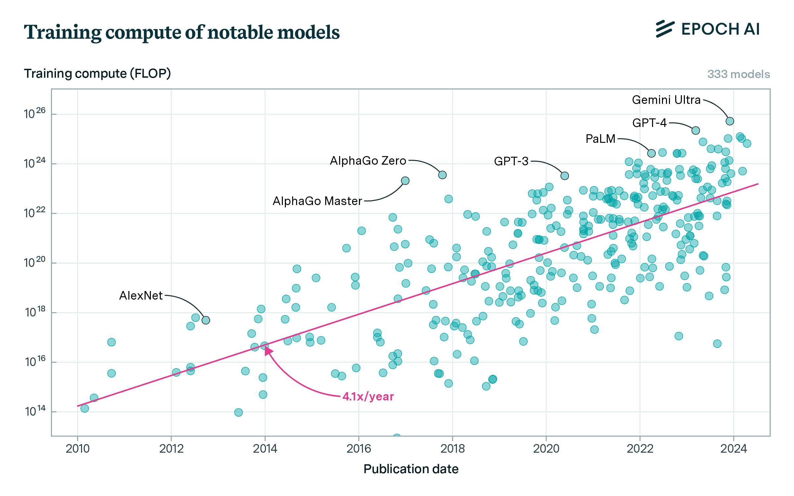
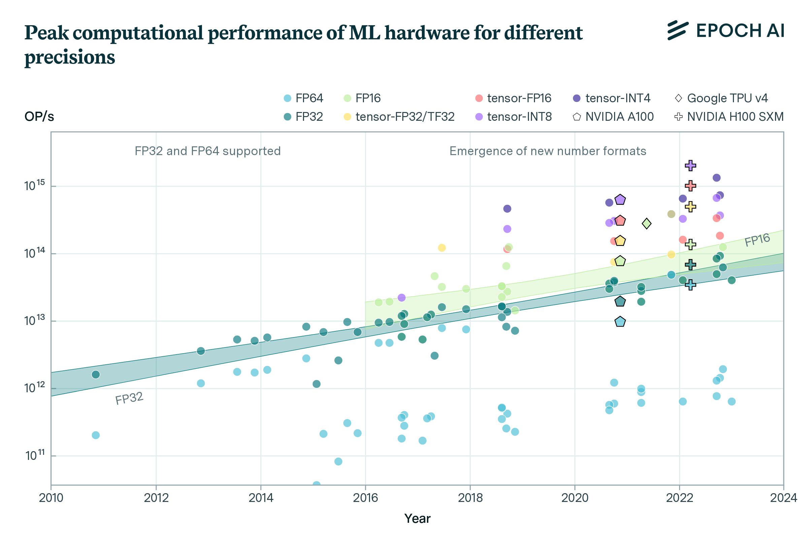
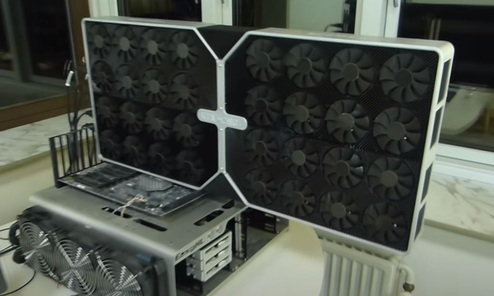
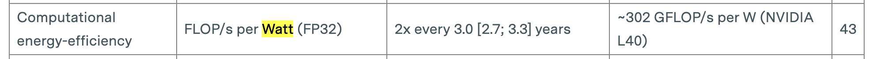

# 컴퓨팅과 AI에 관하여

요즘 NVIDIA 주식이 하늘 무서운지 모르고 상승하고 있습니다. 저도 나스닥 ETF를 투자하고 있어서 수혜를 받고 있는 중이라 기쁘기도 하지만, 보면 볼수록 어째선가 마음이 아파지는 부분도 있습니다. ~~라고 할 때 살걸~~

비록 이 시간이 종목토론 시간은 아닙니다만, 왜 NVIDIA 주식이 이렇게 광기를 가지면서 상승 중에 있을까요? 한번 차근차근 알아봅시다.

## 목차

1. 왜 NVIDIA는 미친듯이 오를까?
2. 모델의 발전 속도
3. GPU의 발전 속도

## 왜 NVIDIA는 미친듯이 오를까?

NVIDIA는 현재 AI를 학습, 추론을 하기에 매우매우 적합한 GPU를 생산하고 있는 회사입니다. GPU는 행렬 연산에 최적이며, AI는 학습이든 추론이든 앵간한 연산이 행렬 연산이기 때문이죠.

*이에 대한 자세한 내용은 [GPU란 무엇인가?](https://medium.com/monday-9-pm/gpu란-무엇인가-8b298a964b69) 를 참고하시기 바랍니다.*

게다가 CUDA라는 언어를 통해서 NVIDIA의 GPU의 소프트웨어 통합도 매우 강력하죠. **즉 AI를 하기 적절한 하드웨어에 소프트웨어까지 맞물려서, 가장 AI에 적합한 기기가 현재는 NVIDIA GPU가 되버렸죠.**

그래서요? 그러면 AI가 발전하지 않으면, NVIDIA GPU도 안 팔리는 거 아닌가요? **맞습니다. 다만 AI는 너무 많이 발전하고 있어서 문제죠. 그래서 GPU는 너무나도 잘 팔리며, 몇 년째 품귀현상이 일어나고 있습니다.** 실제로 일론 머스크는 최근에 이렇게 말하기도 하였습니다.

“지금 (NVIDIA의) 그래픽처리장치(GPU)를 구하기가 마약보다 어렵다.”

이렇다시피, 하도 AI의 발전이 너무나도 빠르다, 그래서 무섭다. 뭐 이런 내용은 인터넷이나 주변에서 귀에서 피가 날 정도로 많이 듣고 계실겁니다. 하지만 **왜 이렇게 발전이 빠르고, GPU의 품귀현상이 왜 일어나는지에 대해** 조금 더 자세히 분석을 해봅시다.

## 모델의 발전과 GPU의 발전에 대하여

위 그래프는 OpenAI가 2018년에 게재한 [AI and Compute](https://openai.com/index/ai-and-compute/)에서 가져온 그래프입니다.

위 그래프는 년도에 따른 모델 별 Training Cost입니다. x축은 년도를 의미하고, y축은 Petaflops/s-days, 즉 하루에 사용한 학습 연산량을 의미합니다. 그래프를 눈치 채신 분도 계시겠지만, 이 그래프의 무서운 점은 Linear Scale 그래프가 아닌, **Log Scale 그래프**라는 겁니다.

그래프를 보면 2012년 이전인 기계 학습 시절에는 무어의 법칙(약 2년 주기로 2배씩 증가하는 법칙)을 준수하면서 모델 학습량이 증가한 것을 볼 수 있습니다. 그러나 2012년에 대사건이 일어나죠. 바로 **ImageNet을 터트려버린 AlexNet의 출전**이였습니다. ~~엔비디아를 주 당 3$에서 1,200$로 만든 Alex 선생님...~~

이 기점을 토대로 무어의 법칙을 따르던 **학습 요구량이 약 3~4개월 주기로 2배씩 증가하게 됩니다.**

OpenAI가 약간 높은 표본을 기준으로 측정한 감이 있어서, [Epoch AI](https://epochai.org/)가 조금 더 정확하게 측정한 내용을 참고하면 딥 러닝의 시작인 2010년 부터 2024년 현재까지도 **약 6개월 주기로 2배씩 증가하고 있다고 합니다.**

결론적으로 모델의 발전 속도(대충 Training Computing)은 현재까지 **1년에 약 4.1배 상승**하고 있다는 것을 확인 할 수 있습니다.

## GPU의 발전 속도

그럼 GPU의 발전은 어떨까요? GPU는 정말 정직하게 무어의 법칙을 지키고 있는 추세입니다.

위 그래프는 년도에 따른 GPU Performance입니다. x축은 년도를 의미하고, y축은 OP/s Operations Per Second를 의미합니다. 그리고 이 그래프에는 다양한 Precision이 포함되어 있습니다. FP16, INT8과 같은 것들 말이죠.

그래도 이 그래프는 y축의 한 눈금이 위 모델 그래프처럼 100배 차이가 아닌 10배 차이인것을 확인 할 수 있습니다. 10배 차이여도 그래프가 덜 가파롭다는게 놀랍지 않나요?

그래프에 따르면 **2.3년 주기로 2배가** 된다고 합니다. 다만 여기서 유의해야할 것은 Tensor Core 같은 기술들이 나와서 OP/s의 점프가 일어난 다는 것입니다.

여기에서는 더블링이 되는 기준은 단순 FP32로 잡았을 때 기준입니다. 그래도 Tensor Core와 같은 기술 등장은 딱 한번 효과가 있을 뿐 그 후의 추세는 2.3년이 걸리는 것은 매 한가지입니다.

요즘 시대에 무어의 법칙이 깨지고 있는 추세인데, GPU는 얼추 무어의 법칙을 잘 지키는 걸 보면 훌륭한 것 같습니다... **과연 그럴까요?** 조금 다른 시선에서 한번 봅시다.

저희는 단순 GPU의 Performance만 비교를 했습니다. 하지만 저는 항상 보는게 **TDP** 입니다. TDP란 GPU가 몇 W를 잡아먹는가에 대한 것이라고만 알아둡시다. *사실 조금은 다르지만 거의 같습니다.*

왜 TDP를 중요하게 보냐면 저는 같은 W에서 성능이 증가해야 제대로 된 성능이라고 생각하기 때문입니다. TDP는 일종의 체급입니다. 예를 들어 RTX 3090이 350W였고, RTX 4090은 450W 입니다. 둘은 마치 미들급과 헤비급의 권투 대회랄까나요? 당연히 W가 높은 만큼 더 강력합니다. 물론 RTX 3090과 RTX 4090을 서로 350W 씩 맞춰도 4090이 더 빠른 건 사실입니다.

이와 같이 Full Load일 때 2년에 2.3배 가 된다라는 것이고, TDP 즉 전성비를 고려해봤을 때는 아래와 같습니다.

2년에 약 3배씩 증가하고 있습니다. 2.3배에 비하면 무어의 법칙을 지키고 있지는 않죠.

즉 GPU Performance는 전성비를 고려할 시 **1년에 약 1.7배 상승**하고 있다는 것을 확인 할 수 있습니다.