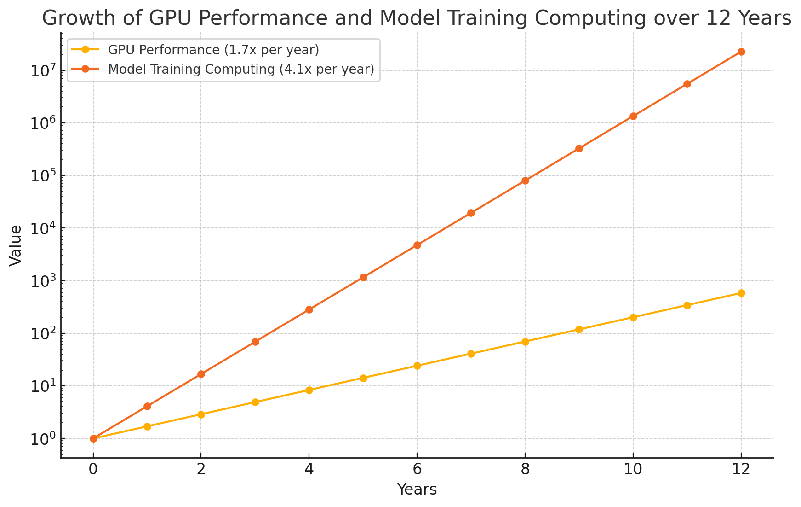
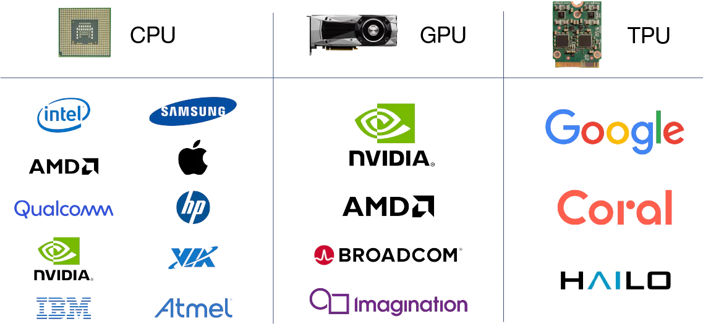
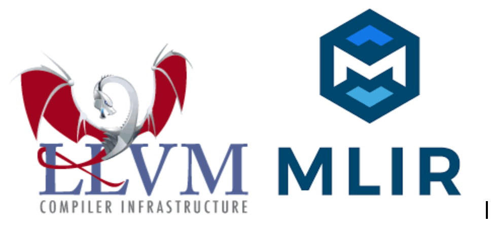
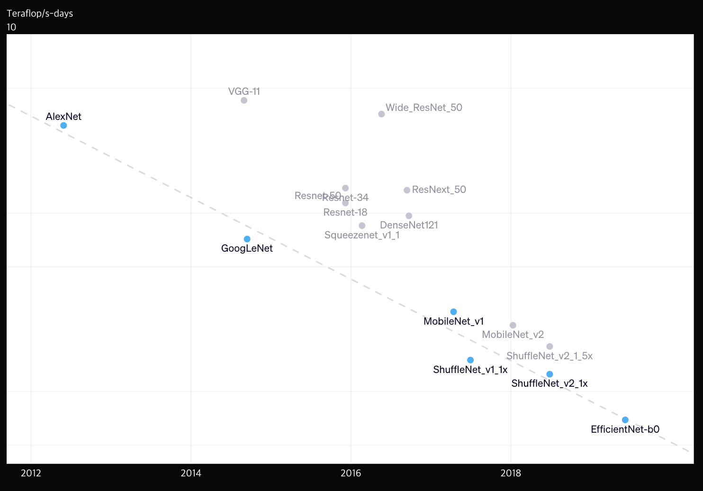
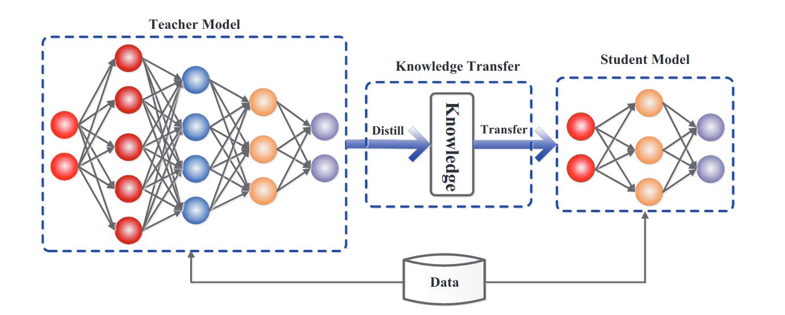
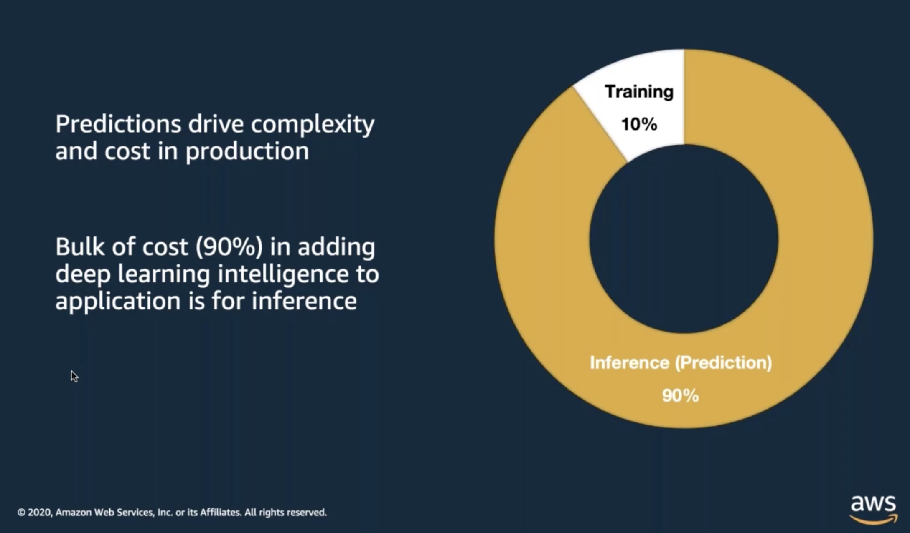
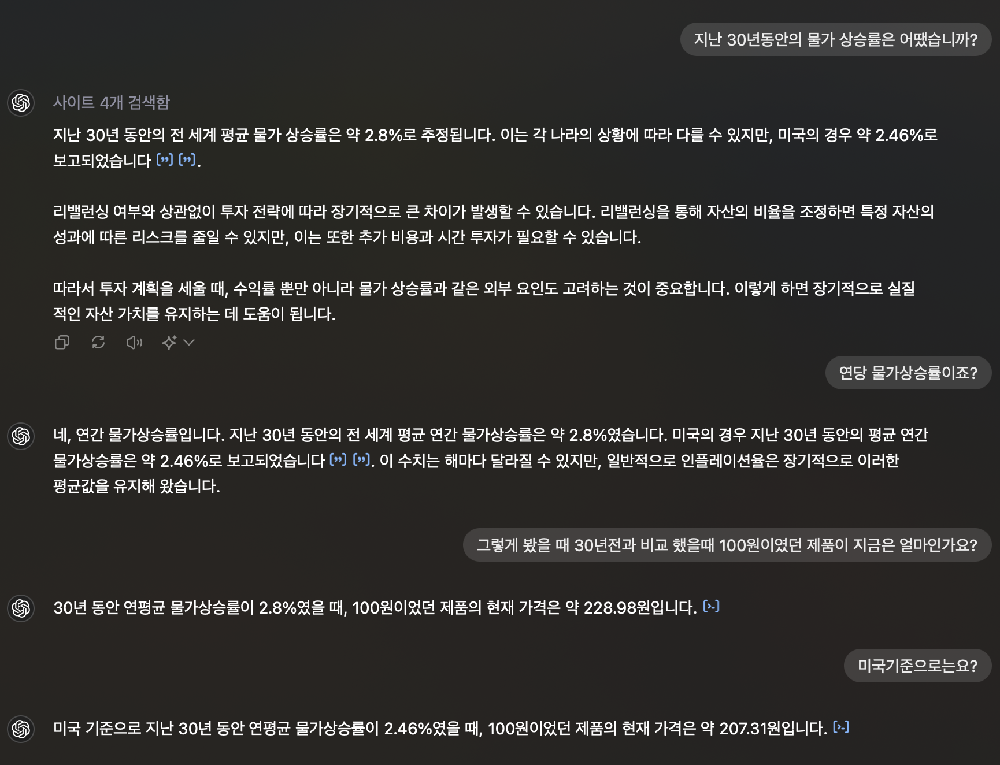
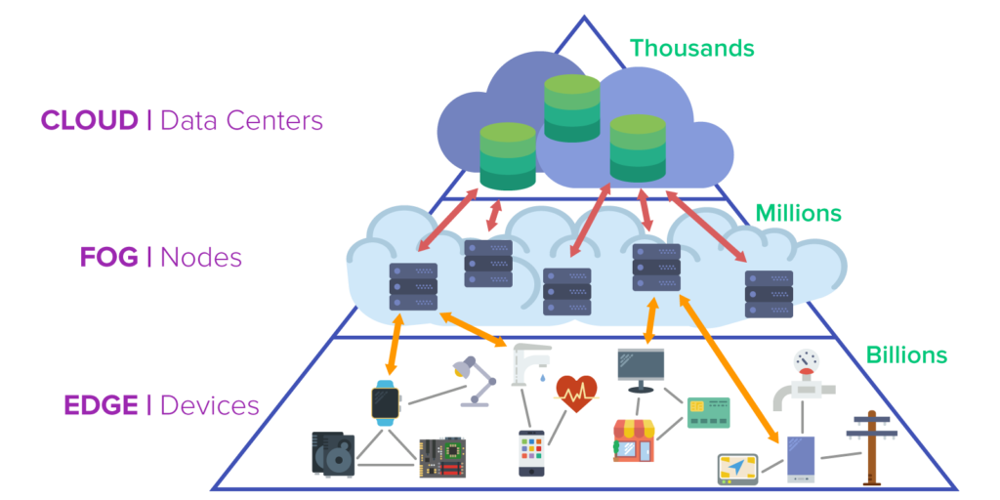

# 컴퓨팅과 AI에 관하여

여러분 중에서 주식을 하고 계시는 분도 있으실 것이고, 안 하고 계신분도 계실겁니다. 하고 계시는 분들 중에서도 많이 미국 주식을 하고 계실겁니다. 요즘 미국 주식에서 아주 핫한

요즘 NVIDIA 주식이 하늘 무서운지 모르고 상승하고 있습니다. 저도 나스닥 ETF를 투자하고 있어서 수혜를 받고 있는 중이라 기쁘기도 하지만, 보면 볼수록 어째선가 마음이 아파지는 부분도 있습니다. ~~라고 할 때 살걸~~

비록 이 시간이 종목토론 시간은 아닙니다만, 왜 NVIDIA 주식이 이렇게 광기를 가지면서 상승 중에 있을까요? 이번 글에서는 AI와 컴퓨팅에 관하여 설명하면서 한번 차근차근히 알아가봅시다.

## 목차

1. 왜 NVIDIA는 미친듯이 오를까?
2. 모델의 발전과 GPU의 발전에 대하여
3. 모델 성장을 따라갈 여러 대처

## 왜 NVIDIA는 미친듯이 오를까?

NVIDIA는 현재 AI를 학습, 추론을 하기에 매우매우 적합한 GPU를 생산하고 있는 회사입니다. GPU는 행렬 연산에 최적이며, AI는 학습이든 추론이든 앵간한 연산이 행렬 연산이기 때문이죠.

*이에 대한 자세한 내용은 [GPU란 무엇인가?](https://medium.com/monday-9-pm/gpu란-무엇인가-8b298a964b69) 를 참고하시기 바랍니다.*

게다가 CUDA라는 언어를 통해서 NVIDIA의 GPU의 소프트웨어 통합도 매우 강력하죠. **즉 AI를 하기 적절한 하드웨어에 소프트웨어까지 맞물려서, 가장 AI에 적합한 기기가 현재는 NVIDIA GPU가 되버렸죠.**

그래서요? 그러면 AI가 발전하지 않으면, NVIDIA GPU도 안 팔리는 거 아닌가요? **맞습니다. 다만 AI는 너무 많이 발전하고 있어서 문제죠. 그래서 GPU는 너무나도 잘 팔리며, 몇 년째 품귀현상이 일어나고 있습니다.** 실제로 일론 머스크는 최근에 이렇게 말하기도 하였습니다.

“지금 (NVIDIA의) 그래픽처리장치(GPU)를 구하기가 마약보다 어렵다.”

이렇다시피, 하도 AI의 발전이 너무나도 빠르다, 그래서 무섭다. 뭐 이런 내용은 인터넷이나 주변에서 귀에서 피가 날 정도로 많이 듣고 계실겁니다. 하지만 **왜 이렇게 발전이 빠르고, GPU의 품귀현상이 왜 일어나는지에 대해** 조금 더 자세히 분석을 해봅시다.

## 모델의 발전과 GPU의 발전에 대하여

위 그래프는 OpenAI가 2018년에 게재한 [AI and Compute](https://openai.com/index/ai-and-compute/)에서 가져온 그래프입니다.

위 그래프는 년도에 따른 모델 별 Training Cost입니다. x축은 년도를 의미하고, y축은 Petaflops/s-days, 즉 하루에 사용한 학습 연산량을 의미합니다. 그래프를 눈치 채신 분도 계시겠지만, 이 그래프의 무서운 점은 Linear Scale 그래프가 아닌, **Log Scale 그래프**라는 겁니다.

그래프를 보면 2012년 이전인 기계 학습 시절에는 무어의 법칙(약 2년 주기로 2배씩 증가하는 법칙)을 준수하면서 모델 학습량이 증가한 것을 볼 수 있습니다. 그러나 2012년에 대사건이 일어나죠. 바로 **ImageNet을 터트려버린 AlexNet의 출전**이였습니다. ~~엔비디아를 주 당 3$에서 1,200$로 만든 Alex 선생님...~~

이 기점을 토대로 무어의 법칙을 따르던 **학습 요구량이 약 3~4개월 주기로 2배씩 증가하게 됩니다.**

OpenAI가 약간 높은 표본을 기준으로 측정한 감이 있어서, [Epoch AI](https://epochai.org/)가 조금 더 정확하게 측정한 내용을 참고하면 딥 러닝의 시작인 2010년 부터 2024년 현재까지도 **약 6개월 주기로 2배씩 증가하고 있다고 합니다.**

결론적으로 모델의 발전 속도(대충 Training Computing)은 현재까지 **1년에 약 4.1배 상승**하고 있다는 것을 확인 할 수 있습니다.

그럼 GPU의 발전은 어떨까요? GPU는 정말 정직하게 무어의 법칙을 지키고 있는 추세입니다.

위 그래프는 년도에 따른 GPU Performance입니다. x축은 년도를 의미하고, y축은 OP/s Operations Per Second를 의미합니다. 그리고 이 그래프에는 다양한 Precision이 포함되어 있습니다. FP16, INT8과 같은 것들 말이죠.

그래도 이 그래프는 y축의 한 눈금이 위 모델 그래프처럼 100배 차이가 아닌 10배 차이인것을 확인 할 수 있습니다. 10배 차이여도 그래프가 덜 가파롭다는게 놀랍지 않나요?

그래프에 따르면 **2.3년 주기로 2배가** 된다고 합니다. 다만 여기서 유의해야할 것은 Tensor Core 같은 기술들이 나와서 OP/s의 점프가 일어난 다는 것입니다.

여기에서는 더블링이 되는 기준은 단순 FP32로 잡았을 때 기준입니다. 그래도 Tensor Core와 같은 기술 등장은 딱 한번 효과가 있을 뿐 그 후의 추세는 2.3년이 걸리는 것은 매 한가지입니다.

요즘 시대에 무어의 법칙이 깨지고 있는 추세인데, GPU는 얼추 무어의 법칙을 잘 지키는 걸 보면 훌륭한 것 같습니다... **과연 그럴까요?** 조금 다른 시선에서 한번 봅시다.

저희는 단순 GPU의 Performance만 비교를 했습니다. 하지만 저는 항상 보는게 **TDP** 입니다. TDP란 GPU가 몇 W를 잡아먹는가에 대한 것이라고만 알아둡시다. *사실 조금은 다르지만 거의 같습니다.*

왜 TDP를 중요하게 보냐면 저는 같은 W에서 성능이 증가해야 제대로 된 성능이라고 생각하기 때문입니다. TDP는 일종의 체급입니다. 예를 들어 RTX 3090이 350W였고, RTX 4090은 450W 입니다. 둘은 마치 미들급과 헤비급의 권투 대회랄까나요? 당연히 W가 높은 만큼 더 강력합니다. 물론 RTX 3090과 RTX 4090을 서로 350W 씩 맞춰도 4090이 더 빠른 건 사실입니다.

이와 같이 Full Load일 때 2년에 2.3배 가 된다라는 것이고, TDP 즉 전성비를 고려해봤을 때는 아래와 같습니다.

약 3년 주기로 2배씩 증가하고 있습니다. 2.3배에 비하면 무어의 법칙을 지키고 있지는 않죠.

즉 GPU Performance는 전성비를 고려할 시 **1년에 약 1.7배 상승**하고 있다는 것을 확인 할 수 있습니다.

2012년 부터 2024년 즉 12년 동안에 GPU Performance와 Training Computing을 비교해보겠습니다.

무려 12년 동안 GPU Performance와 Training Computing는 **약 38,000배** 가량 차이나는 것을 확인 할 수 있습니다. Training Computing이 멈춘다고 해도, GPU Performance가 이를 따라잡으려면 **무려 20년**이라는 시간이 더 필요합니다. 그러나 아쉽게도 Training Computing은 멈추지 않고 무섭게 상승하고 있습니다.

이를 통해서 **GPU의 성능이 모델 성장을 못 따라가고 있으며, 오히려 더 격차가 벌어지고 있는 것을 확인 할 수 있습니다.** 물론 최적화 기법과 여러 효율성을 고려한 모델과 Layer가 연구되고 있어 이 정도로 심각하게 벌어지진 않겠지만 그래도 차이가 많이 나고 있다는 것은 부정 할 수 없습니다.

이러니까 연구에 필요한 GPU의 수량이 이전보다 훨씬 많이 필요할 수 밖에 없고, 이 GPU를 만드는 곳은 아직 NVIDIA 밖에 없으니 주가 폭등이 일어나며 이마저도 거품이 아니라는 평이 있는 것 입니다.

그럼 이를 어떻게 대처를 해야할까요? 여러 대처 방법을 한번 강구해봅시다.

## 모델 성장을 따라갈 여러 대처

폭발적으로 성장하고 있는 모델을 컴퓨팅 자원이 뒤따라가기 위해서 의논되고 있는 다양한 대처가 있습니다.

1. 다양한 하드웨어 활용: NVIDIA GPU가 아닌 다른 GPU를 이용하는 방법
2. 효율적인 모델 설계 및 최적화: 모델 압축, 지식 증류, 양자화 등의 기술을 활용해 연산 자원을 절약합니다.
3. 추론에 최적화 된 AI 가속기 활용 : 흔히 NPU라고 불리는 AI 추론에 최적화된 하드웨어 가속기를 사용합니다.
4. 클라우드 컴퓨팅 활용: 클라우드 서비스의 GPU 인프라를 이용해 초기 투자 비용을 줄이고 연산 자원을 유연하게 확장합니다.

하나씩 알아보시죠.

## 다양한 하드웨어 활용

다양한 하드웨어의 활용 같은 경우는 NVIDIA GPU 뿐만 아니라 AMD, Intel의 GPU를 사용하는 방법이나, Google에서 제공하는 [TPU](https://cloud.google.com/tpu?hl=ko), Apple의 [MPS](https://developer.apple.com/documentation/metalperformanceshaders)를 사용하는 것입니다. AI에 사용할 수 있는 다양한 하드웨어를 이용하여 GPU 부족을 해결 할 수 있습니다.

하지만 NVIDIA GPU를 AMD / Intel GPU, Google TPU, Apple MPS로 대체한다는 것은 아직까지는 쉬운 일이 아닙니다.

그 이유는 많은 여러가지 이유가 있지만 굳이 하나를 꼽자면, 생태계가 가장 큰 것 같습니다. NVIDIA GPU는 CUDA라는 언어가 있어서 이 CUDA가 너무 많은 라이브러리와 프레임워크에 널리 채택되어 있고, 최적화되어 있습니다.

하지만 AMD, Intel, Apple, Google은 CUDA가 아닌 다른 기술을 사용한다는 것이죠. 그러므로, NVIDIA GPU 이외의 장비는 소프트웨어 호환성이 대체로 좋지 않은 편이 많습니다.

많은 개발자들은 이러한 단점을 감수해서 넘어가기란 조금 힘들지도 모릅니다. 그냥 잘 되고, 성능도 좋고, 많이 사용되는 CUDA 기반의 라이브러리와 프레임워크를 의존할 수 밖에 없다라는 것이죠. 어느정도 리스크를 감수하긴 싫으니까요.

최근 들어서는 오픈소스 커뮤니티나, 다른 회사들은 NVIDIA GPU에 종속된 CUDA가 널리 사용되는게 별로 좋게 보이지 않는지 LLVM, MLIR와 같은 중간 표현(Intermediate Representation)를 이용하여 다양한 하드웨어에 종속되지 않는 코드를 만들어주는 방향으로 전환하고 있습니다. 이러한 접근법은 특정 하드웨어에 대한 종속성을 줄이고, 여러 플랫폼에서 일관된 성능을 제공할 수 있게 합니다.

이런 중간 표현을 사용하는 대표적인 프로젝트는 [OpenAI Triton](https://openai.com/index/triton/), [TensorFlow MLIR](https://github.com/tensorflow/tensorflow/tree/master/tensorflow/compiler/mlir), 심지어는 CUDA를 중간 표현으로 만들어주는 [CUDA LLVM Compiler](https://developer.nvidia.com/cuda-llvm-compiler) 등등이 있습니다. ~~NVIDIA 여전히 다 해먹을라고 그런가 보네요 ㅋㅋ~~

## 효율적인 모델 설계 및 최적화

모든 딥러닝 연구원들이 모델 성능만 연구하는 것은 아닙니다. 효율성과 연산 속도에 대해서 연구하시는 분도 정말 많습니다.

OpenAI에서 게재한 [AI and efficiency](https://openai.com/index/ai-and-efficiency/)에서 확인 할 수 있습니다. 여기서는 AlexNet이 나오고 난 7년 후에는 동일한 성능(EfficientNet-b0)을 구현하는 데 필요한 컴퓨팅이 44배 줄어들었다고 말합니다. 최근에는 GPT4가 GPT4o로 되서 동일한 성능에 매우 빠른 속도를 제공받았었죠. 내부에서 무슨 일이 일어났는 지는 모르지만 분명히 효율적인 작업을 했을것이라고 생각합니다.

이렇게 연구가 쌓이고 쌓여서 GPU에 어떤 Layer가 빠른지에 대한 연구, Layer 간 병목 현상을 제거하는 연구, 성능을 제한하여 Layer의 크기를 스스로 조절하는 연구 등등 모델을 빠르게 하는 연구가 많이 진행되고 있습니다.

모델 이외에서도 많이 발전이 있었습니다. 대표적으로 지식 증류, 양자화, 가지 치기 등등이 있습니다.

지식 증류를 간단하게 설명하면, 큰 모델(교사 모델)의 성능을 작은 모델(학생 모델)로 옮기는 과정입니다.

이 과정을 통해 작은 모델은 원래의 큰 모델처럼 높은 정확도를 유지하면서도 더 적은 자원으로 실행될 수 있습니다. 쉽게 말해, 큰 모델이 배운 지식을 작은 모델에 전달하는 방식입니다.

[여기](https://github.com/NVIDIA-AI-IOT/jetson-intro-to-distillation)에서 OpenCLIP이라는 성능이 뛰어난 모델을 이용하여 Resnet18을 지식 증류하는 예제가 포함되어 있는데, Resnet18의 정확도는 81.04%에 가까우나 지식 증류를 통해서 무려 96.9%까지 상승시킬 수 있습니다. CLIP에 비해서 모델 Latency도 4배 가량 빠르지만, 지식 증류를 통해 CLIP 모델과 동일한 속도를 낼 수 있는 것입니다.

양자화는 제가 이전에 작성한 [아티클](https://medium.com/monday-9-pm/deep-learning-quantization-딥-러닝-양자화-6fb30c642cf7)을 참고하시기 바랍니다.

## 추론에 필요한 AI 가속기 활용

갑자기 왠 추론을 얘가할까요? 추론은 일반적으로 훈련보다 비용이 적다고 생각하는 경우가 많습니다. 하지만 실제로는 완전히 정 반대로, **훈련보다 추론이 훨씬 더 비용이 많이 듭니다.**

그 근거는 [Compute and Energy Consumption Trends in Deep Learning Inference](https://ar5iv.labs.arxiv.org/html/2109.05472)이라는 논문에서 확인 할 수 있습니다.

논문에는 훈련 비용에 관한 연구는 많았으나, 추론 비용에 관한 연구는 적다고 언급하고, AWS에서 발표한 내용을 인용하여 아래와 같은 그래프를 보여주었습니다.

AWS에서 Training, Inference Cost를 비교해봤을때, Training이 10% Inference가 **무려 90%의 비중**을 차지한다고 하였습니다.

왜 이렇게 비용이 많이 차이나게 되는걸까요? 해당 논문에서는 다음과 같이 이야기하고 있습니다.

훈련은 일반적으로 한 번의 학습 세션(또는 몇 번의 세션)으로 이루어집니다. 훈련 자체는 계산이 많이 필요하지만, 횟수가 상대적으로 적습니다.

반면 추론은 다양한 애플리케이션에서 수백만 번 또는 그 이상으로 실행됩니다. 추론의 횟수가 많기 때문에, 전체 비용이 매우 높아집니다.

즉, 추론은 실행되는 횟수가 훈련에 비해 훨씬 많기 때문에, 총 비용에서 큰 비중을 차지하게 됩니다. 논문에서는 이러한 차이를 “곱셈 요인”이라고 표현하며, 추론의 실행 횟수가 학습 횟수를 훨씬 뛰어넘는다고 설명합니다.

이와 같은 비용 분포는 특히 대규모 서비스에서 더욱 두드러집니다. 예를 들어, 대형 웹 서비스나 애플리케이션에서 실시간으로 사용자 요청을 처리하는 경우, 추론이 매우 빈번하게 일어나며, 이에 따른 컴퓨팅 자원과 비용이 급격히 증가하게 됩니다.

우리도 위와 같은 것을 정말 흔하게 접하고 있습니다. 예를 들어, 우리가 ChatGPT를 사용할 때 굉장히 많이 되묻고, 내가 원하는 답이 나올때 까지 묻는 경우가 많습니다. 즉 1번에 원하는 답을 얻는 경우가 많이 없어서, **1인이 사용하는 추론이 무척 많아지는 것**입니다. 이것이 많은 사람들이 사용하게 되면 서비스가 크면 클수록 급격한 비용 상승은 불가피합니다.

그래서 이를 보완하기 위해서 추론된 데이터를 캐시화 해서 저장시켜 똑같은 Input이 들어오면 [캐시를 뱉는 기능도 있는 서비스](https://docs.nvidia.com/deeplearning/triton-inference-server/user-guide/docs/user_guide/response_cache.html)가 있습니다. 또 제가 모르는 여러 방법이 있겠지요.

그러면 추론만 잘하는 하드웨어가 있으면 이 비용을 어느정도 절감을 할 수 있을지도 모릅니다.

그래서 흔히 자주 듣는 NPU(Neural network Processing Unit)을 많이 만들고, 사용하고 있습니다. 이 NPU는 대부분 인공지능 추론을 하기 위한 하드웨어이며, 전성비가 매우 뛰어난 것이 대표적입니다.

대표적으로 어떠한 제품이 있냐면 성능이 막강하기로 유명한 Apple Neural engine, 현재는 Jetson에만 탑재되어 있는 NVIDIA DLA, 요즘 핫한 스타트업인 LLM 전용 칩을 만들고 있는 Groq LPU(Language Processing Unit), 또 NPU를 제작하고 있는 퓨리오사AI, DeepX, 삼성 등등이 있습니다.

위의 제품들은 전부 추론만을 위한 칩이며, 실제로도 NVIDIA DLA를 테스트하고 Apple의 Neural Engine을 테스트 해봤을때, 뛰어난 속도와 전성비에 놀랐던 기억이 있습니다.

이렇듯 비싼 추론 비용을 절감하기 위해 전용 칩을 사용하는 것은 먼 미래에는 아마 필수적이지 않을까 개인적으로는 생각하고 있습니다.

## 클라우드 컴퓨팅 활용

마지막으로는 클라우드 컴퓨팅을 활용하는 것인데요. GPU를 사기도 힘든 판국이고, 보다 안정적인 것을 추구하는 많은 기업들이 클라우드 컴퓨팅을 활용을 하고 있습니다.

흔히 AWS, Azure, GCP 이렇게 많이 사용하고 있는 것 같습니다. AWS에는 독자적인 추론 칩인 [Inferentia](https://aws.amazon.com/ko/machine-learning/inferentia/)도 제공되고 있고, NVIDIA GPU도 굉장히 많이 보유하고 있는 것으로 유명합니다.

GCP는 유명한 TPU를 사용할 수 있고, 학습도 효율이 좋고 추론도 효율이 좋은 것으로 알고 있습니다.

이렇게 클라우드 환경을 통해서 안정적인 환경에서 GPU를 사용할 수 있습니다. 하지만 단점도 있죠. 클라우드에서 GPU를 빌리는 것은 대체적으로 비용이 비싼 편입니다. 안정적인 서비스를 운용하는 회사에서는 감수할 수 있겠지만, 연구실이나 개인적으로 간단한 연구를 하기에는 좀 비용이 부담되기는 합니다.

그래서 비용이 좀 저렴한 Colab을 사용하거나, 요즈음 많이 뜨고 있는 프로젝트인 GPU판 Airbnb라고 할 수 있는 GPU 프로비저닝 서비스인 [gpudeploy](https://news.ycombinator.com/item?id=40260259)나 [vast.ai](https://vast.ai/)를 많이 사용하기도 하는 것 같습니다. 안 쓰고 있는 GPU가 있으면 다른 사람에게 빌려주고 돈을 받을 수 있는 구조이죠.

또 최근에는 엣지 컴퓨팅이 떠오르면서, 엣지 컴퓨팅 위에서 작동하는 포그 컴퓨팅 연구도 많이 되고 있는 추세입니다.

엣지 컴퓨팅은 데이터를 중앙 집중식 데이터 센터나 클라우드가 아닌 데이터가 생성되는 “엣지”에서 처리합니다. 흔히 NVIDIA Jetson이 GPU가 달려있는 엣지 디바이스로 많이 사용되고 있죠.

포그 컴퓨팅은 엣지 컴퓨팅의 확장으로, 데이터 처리와 저장을 네트워크의 엣지와 클라우드 사이의 중간 계층에서 수행합니다. 포그 컴퓨팅은 엣지 장치와 클라우드 간의 협력적인 데이터 처리 및 저장을 가능하게 합니다. 아마 [NVIDIA Metropolis](https://www.nvidia.com/en-us/autonomous-machines/intelligent-video-analytics-platform/)가 추구하는 최종 목표일 수도 있겠네요.

이를 통해 딥러닝 파이프라인을 구축하려고 하는 케이스가 많아지고 있습니다. 대표적으로 [Fog Computing for Deep Learning with Pipelines](https://ieeexplore.ieee.org/document/10403079) 논문이 있죠. 이 포그 컴퓨팅은 아직 상용화 단계에 이르지는 않은 것으로 알고 있습니다.

이 주제에 대해서는 좀 더 깊이 보고 나눌 수 있는 시간이 있으면 좋겠네요.

## 결론

AI 컴퓨팅의 현황을 살펴본 결과, 명확한 결론과 향후 나아갈 방향에 대한 고민이 필요함을 알 수 있습니다.

현재 AI 기술은 급속히 발전하고 있으며, 이에 따라 하드웨어 요구 사항도 증가하고 있습니다. 이러한 상황은 NVIDIA와 같은 회사가 시장에서 중추적인 역할을 하고 있음을 보여줍니다. 그러나 모델의 요구 사항이 기하급수적으로 증가함에 따라 현재의 하드웨어 성능 향상만으로는 충분하지 않습니다. 이는 **향후 기술 발전과 시장 수요 간의 균형을 맞추기 위한 새로운 접근 방법이 필요함을 의미합니다.**

AI의 미래는 단순히 기술적 진보를 넘어 사회적, 경제적 변화를 촉진할 잠재력을 가지고 있습니다. 이를 위해서는 기술 혁신을 지속하면서도 **지속 가능성과 효율성을 동시에 추구**해야 합니다.

하드웨어 기업들이 자체 기술과 경쟁력을 확보하는 것도 중요하지만, 다른 기업들과의 협력을 통해 더 넓은 기술 생태계를 구축하는 것이 필수적입니다. 또한 LLVM, MLIR과 같은 소프트웨어 통합을 통해 개발 재사용성을 줄이는 것도 매우 중요합니다.

종합적으로, 기업들은 기술 혁신을 넘어서 사회적, 환경적 책임을 고려한 전략을 세워야 합니다. AI의 미래는 단순한 기술 발전을 넘어 인류의 발전과 직결되므로, 포괄적이고 책임 있는 접근 방식이 요구됩니다. 이러한 접근은 **기술 발전과 함께 사회적 가치를 창출하는 지속 가능한 방향을 제시할 것입니다.**