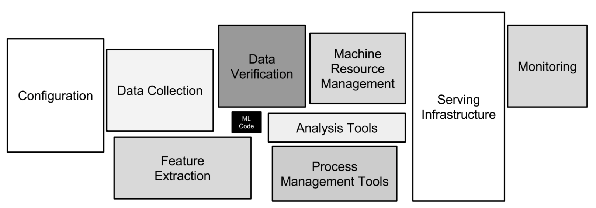

# 딥 러닝 엔지니어 되기

2024년, 요즘 딥러닝이 열풍입니다. 사실 요즘이라는 단어보단 "더더욱"이라는 말이 더 어울리겠네요. 이 열풍의 흐름에 따라서, 요즘 Deep Learning을 배워야 겠다! 라고 하시는 분들도 많아진 것 같습니다. (저는 이 흐름이 매우 긍정적이라고 생각합니다.)

실제로도 가끔씩 유튜브 커뮤니티에 올라오는 AI 국비교육 지원 광고, 회사에 우편으로 오는 국비교육 졸업생 분들의 이력서, 친구들의 Deep Learning은 할 만 하냐라는 물음, 회사에서도 AI를 하고 계시진 않지만 AI를 이용한 Side Project를 구상중이신 분 등등을 보면 AI는 이전보다 더 열풍이라는 것을 느낄 수 있습니다. 4년 전만 해도 이정도는 아니였거든요 ㅋㅋ

그리고 진로를 희망하시는 분들이 많아지고 있습니다. 최근에 대학교에서 겨울 방학 특강을 했었을 때, 학점도 주지 않는데 많은 분들이 참여를 하신 것을 보고 꽤나 놀랐었습니다. 그리고 대부분이 다 딥러닝 직종을 희망하시더라구요.

하지만 딥러닝 분야는 꽤나 따라가기가 힘듭니다. 아주 변화무쌍 하기 때문이죠. 하루마다 새 기술이 나오고, 패러다임이 바뀌고 (불과 2주전 만에도 LLM에 관한 어마어마한 떡밥 논문이 나왔습니다.), 이러한 점이 새로 시작하는 분들께 분명 힘들 것이라 생각합니다. 그래서 제 생각과 경험을 공유하며, 글을 읽는 분들께 힘이 되었으면 좋겠습니다.

*이번 글은 제 주관적인 의견이 많습니다. 또 기술적인 디테일보다는 조금 더 원초적인 내용이 많습니다. 비판적 사고로 글을 봐주시면 감사하겠습니다.*

## 목차

1. 그치만, 배워야 할 게 너무 많은 걸...
2. 딥러닝 엔지니어와 딥러닝 리서처의 차이
3. 엔지니어로서의 본인의 이야기
4. 아니 그래서 무엇을 어떻게 배워야 되죠?
5. 기술적인 것과 노하우에 관한 고찰
6. 마치며

## 그치만, 배워야 할 게 너무 많은 걸...

저는 딥러닝 업계에 종사한지 기껏해야 이제 4년 반 밖에 안됐고, 당연하게도 아직도 모르고 배워야 할 것들이 **산더미**입니다. **무서운 점은 먹어도 먹어도, 그 산더미는 줄지 않고 오히려 더 늘고 있습니다.** 실제로도 논문을 읽는 속도가, 늘어나는 속도를 못 따라가더라구요. 이렇게 AI에 관한 수많은 배울 거리를 한번에 다 먹을 수는 없습니다.

이런 점을 모르시고 새로 시작하시려고 하시는 분들께서 그냥 배울 거리가 많으니 빨리 다 먹으려고 마구잡이로 급하게 먹어버립니다. 역시 배울 거리가 너무 많고 다양해서 인가요?

결국엔 *"자신이 무엇을 하고 있는지 모르겠다"* 라고 하는 분과, *"자신이 이제 무엇을 해야 하는지 더 이상 모르겠다"* 라고 하시는 분과, *"이렇게 열심히 했는데도 알아야 할게 아직도 더 많이 남았네.."* 라고 생각하시면서 현타가 오시는 분(*어떤 분들은 이런 것에 희열을 느끼는 분들도 있었던 것 같습니다 ㅋㅋ*)들도 봤던 것 같습니다. 이런 압도감과 혼란이 오는 것은 당연한 현상이고 성장의 일부라고 생각합니다.

그리고 이렇게 다양한 지식을 쌓는 것은 저는 매우 좋은 것이라고 생각합니다. 이 과정을 통해서 **자신이 잘하는 것과 좋아하는 것을 찾을 수 있기 때문입니다.** 그래서 저는 위와 같은 사례들이 일종의 성장통이라고 생각합니다.

**그러니 좌절하지 마세요!**

딥러닝을 배우려는 우리에겐 많은 선택지가 있습니다. **딥러닝 엔지니어가 될 것인가?, 딥러닝 리서처가 될 것인가?** 라는 기본적인 선택지를 넘어서, 그 안에서도 여러가지 선택지를 찾을 수 있습니다. 딥러닝에 관한 분야도 아주 많고 할게 많거든요. **그 많은 선택지에서 자신이 흥미가 있는 것과 잘 하는 것을 찾아봅시다.**

## 딥러닝 엔지니어와 딥러닝 리서처의 차이

우선 딥러닝 엔지니어와 딥러닝 리서처의 차이는 뭘까요? 간단하게 말하자면 엔지니어는 주로 딥러닝 **기술을 구현하고 최적화하여 실제 서비스에 적용하는 역할**을 맡습니다. 반면, 리서처는 **새로운 딥러닝 모델과 알고리즘을 연구하고 발전시키는데 집중**합니다. 간단하죠?

딥러닝 분야에서 경력을 쌓고자 할 때, **가장 먼저 명백히 해야 할 것은 엔지니어가 되고 싶은지, 아니면 리서처가 되고 싶은지입니다.** 개인적으로는 리서처를 한다면 대학원에 가고, 엔지니어를 한다면 직종에 빨리 들어가는게 좋은 것 같습니다.

리서처 직군을 했을 때 대학원을 추천하는 이유는 인원이 적은 AI 회사에 가면 대부분 연구를 제대로 할 수 없을 것이며, 개발을 훨씬 더 많이 해야 할 수도 있습니다.

저도 자기는 연구가 하고 싶은데, 회사의 이런저런 하기 싫고 잘 하지 못하는 개발을 하면서 힘들어 하시는 분들을 종종 봤었습니다. **내 직종의 자아 실현을 할 수 없는 것은 굉장히 힘든 일이라고 생각합니다.**

그렇다고 연구에 열중할 수 있는 부서가 있는 AI 회사에는 석사 이상은 기본으로 요구하는 곳이 대부분입니다. 혹은 "석사에 준하는"도 많이 봤던 것 같네요.

이전 회사 동료분이 석사 과정을 마치고 전문연구요원을 하시는 분이 계셨었는데, **석사 과정은 연구와 일을 하는 방법을 배우는 것**이라는 말씀이 기억이 납니다. 이렇듯 대학원에서는 적어도 회사보다는 더 연구를 잘 하는 법을 배우실 수 있을거라 믿습니다.

*저는 대학원생이 아니라서 뭔가 더 작성하기가 무섭네요 ㅋㅋ*

엔지니어 직군을 했을 때는 **가장 좋은 것은 빨리 산업에 뛰어드는 것이 좋다고 생각합니다.** 엔지니어는 아무래도 산업 기술 발전을 하는 직업이라고 생각합니다. 회사에서 일을 하면서 현재 산업에서 무엇이 필요한지를 배우고, 실무 경험도 쌓으면서, **제일 중요한 프로젝트를 진행하면서 자신의 포트폴리오를 구축** 할 수 있습니다.

또 엔지니어로서 성공하기 위해서는, 기술적 능력뿐만 아니라, **프로젝트 관리와 팀워크, 문제 해결 능력도 중요합니다.** 이러한 능력은 직접적인 실무 경험을 통해서 가장 잘 배울 수 있습니다.

결국 두 직군은 크게 다르지만, 어찌 됐든 지향점은 똑같다고 생각합니다. **밑기반을 다지면서, 자신이 잘 할 수 있고, 재미있는 것을 찾아서 스페셜리스트가 되는 것 아닐까요?**

추가적으로, **엔지니어와 리서처를 극단적으로 이분법으로 나누지 않았으면 좋겠습니다!** 어찌 됐든 엔지니어와 리서처는 같이 일을 해야하니까요, 엔지니어가 가진 통찰과 리서처가 가진 통찰을 서로 비교해서 더 나은 길로 나아가는 것이 제일 좋습니다. 서로 상호 보완적인 관계라고 생각합니다.

저도 회사에서 리서처 분과 일하면서 특정 레이어에 병목 현상이 생길때 같이 이야기도 하여, 속도와 품질을 맞춰갈 수 있는 방향으로 모델을 개선하곤 하니까요. 이렇게 리서처 분의 지식이 저한테도 좋은 영향을 미치고, 제 지식도 리서처 분의 좋은 영향을 미치는 느낌입니다.

## 엔지니어로서의 본인의 이야기

저의 경우에는 학교를 다니다가 교수님이 추천해주신 회사에 취직하여 여러 일과 기술(PyQt, FastAPI, Flutter, 데이터 검증, 모델 경량화, DeepStream, 정부 과제, 모델 연구)등등을 그냥 했었습니다. **이때는 따로 제가 무엇을 해야할지, 어떤 커리어를 쌓아야 할지, 정확히 모르던 시기였고, 그냥 내가 잘 할 수 있는 분야, 재미있는 분야를 찾아 다닌 시기 였던 것 같습니다.**

그리고 1년 차에 전시회를 하면서 Jetson과 웹캠으로 실시간 Super Resolution(aka SR)을 구현하는 프로젝트를 했었는데, 기존의 PyTorch로는 SR 중에 성능이 그나마 쓸만한 모델 중에 제일 가벼운 모델을 사용해도 7~8fps밖에 나오지 않았습니다.

이 때 자료 조사를 하면서 TensorRT라는 것을 알게 되었고, TensorRT를 사용해서 24fps가 나와서 함께 같이 했던 개발했던 동료 분과 방방 뛰면서 좋아했던 기억이 납니다. **이 때 저는 모델 경량화와 배포하는 것에 대해 큰 재미와 관심을 가지게 되었습니다.**

1년 6개월 차에 모델 서빙 서버중 하나인 **Triton Inference Server**라는 것에 대해 가능성을 보았고, **TensorRT와 Triton Inference Server를 사용한 어플리케이션 개발에 약 2~3개월 동안 몰두**하여 성공하였었습니다. (이 때 당시 Triton Inference Server가 많이 안 쓰였어서 troubleshooting을 Issue 탭에서 엄청나게 검색했던 것이 기억이 납니다 ㅋㅋ)

회사에는 기존 PyTorch 기반의 추론 프로그램이 있었는데 그 프로그램은 A100 8대를 잘 활용하지 못했고, Triton 기반의 어플리케이션으로 돌렸을 때에는 모든 A100이 400W를 뚫어버리는 것을 보고 팀원 분들이 정말 놀라워 했던 것을 기억합니다. 기존 대비 처리량이 16배는 넘게 빨라졌었습니다. **제 터닝포인트가 된 기술이 만들어진 시점이였습니다.**

그 기술로 포트폴리오를 작성하여 AI Inference Engineer라고 이력서를 만들어서 더 좋은 조건으로 다른 회사에 이직을 성공하였고 현재 최적화 및 배포, Jetson을 주로 개발하고 있고 최근에는 MLOps, NVIDIA TAO Toolkit에 가능성을 느끼고 연구하고 있습니다.

회사에서 프로젝트를 진행하다 보면 예상 못하는 문제들을 많이 겪게 됩니다. **이 문제를 해결하는 경험은 나의 소중한 자원이 됩니다. 또 본인의 스페셜리티도 가져갈 수 있을 겁니다.**

**저는 무엇이 됐든 다양한 경험을 해보고, 이를 통해 즐겁고 잘하는 것을 찾은 것 같습니다.** 저는 딥러닝을 배포하고, 최적화하고, 어플리케이션 화 하여 사람들이 편하게 쓰는 것을 보고 즐거움을 느꼈습니다. 뭐 나중에는 다른 즐거운 일을 찾을 수도 있겠죠.

*(아마 제가 Flutter를 하는게 재밌고, 성과도 잘 나왔으면 Flutter 개발자가 됐지 않았을까요? 제 지인 중에서도 딥러닝 쪽으로 왔지만 Swift에 빠져서 Swift 개발자가 되신 분도 있습니다.)*

## 아니 그래서 무엇을 어떻게 배워야 되죠?

엔지니어와 리서처 사이에서도 데이터 사이언티스트, 데이터 엔지니어, OCR 리서처, NLP 리서처, MLOps 엔지니어, Vision 리서처, 모델 최적화 엔지니어, 딥러닝 어플리케이션 엔지니어 기타 등등 원티드나 잡플래닛, 점핏에 AI 관련하여 검색하면 이런 직업들이 우수수 나옵니다.

위처럼 원티드에서 바로 나오는 첫 페이지만 봐도 겹치는 직업이 없는 것처럼 말이죠.

이런 것들을 보면 당연히 막막할 수 밖에 없다고 생각이 듭니다. 저도 취준생이라고 생각하면 숨이 막히는 것 같습니다. 신입이라고 한다면, 나중에 자신이 무슨 커리어를 쌓아야 하는가에 대해 고민도 할 수 있겠죠.

이런 현상은 **제 개인적인 생각으로는 아직 딥러닝 분야가 아직 미성숙한 것**이라고 생각합니다. 왜냐하면 딥러닝은 계속해서 발전하고 있고, 새로운 직종도 생기고 있기 때문이죠. **불과 몇 년 전만 해도 MLOps라는 것이 없었으며, 지금은 너도 나도 사용하는 LLM이 주목 받은 것도 3년 조차 안됩니다.**

그래서 저는 **명확하게 어떤 것을 배워라, 이것을 배워라, 이런 것을 배우지 마라!** 라고 할 수 없습니다. *마치 남에게 주식을 추천하는 것과 같다고 할까나요? 제가 추천해 준 주식이 나락을 갈 수도 있으니까요 ㅋㅋ*

그러니 딥러닝 업계에 종사를 한 이상, 예측하지 못하는 기술들에 대한 대비를 늘 해야한다고 생각합니다. 그리고 **기술적 변화에 유연하게 대응할 수 있는 역량은 강력한 기본기에서 비롯된다고 생각합니다. 기본기를 다져서 굳건한 기반을 잘 다져서 인생 살면서 영원히 쓸 기본적인 능력을 높이는 겁니다.**

(주식도 "이거 사세요, 저거 사세요, 기영이 그래프... 떴냐?" 하는 것보다는 재무재표를 봐라, 기업의 본질을 이해하라는 것이 더 좋잖아요?)

그 기반은 대략 이런 것이 있을 수 있겠네요
- Machine learning과 Deep Learning에 대한 기초적인 지식 (밑바닥부터 시작하는 딥러닝을 무조건 읽는 것을 추천합니다. 저도 가끔 챙겨봅니다.)
- Python, PyTorch(Tensorflow)에 대해 잘 알고 자유자재로 쓰고 읽는 능력 (옛날에 Python의 \_\_call\_\_을 몰라서 PyTorch를 쓰면서 의문사만 날린 기억이 있네요 ㅋㅋ)
- 약간의 Computer Science 지식 (잘 알면 더 좋습니다!)
- 논문을 빠르게 읽고 나에게 필요한지 불필요한지 판단할 수 있는 능력
- 사용 기술이 본인과 회사에 양방향 긍정적 영향을 줄 수 있을지 판단하는 능력
- 건강한 사회 생활과 커뮤니케이션 및 협업 능력 (개인적으로 인간관계론 같은 책을 보면 도움이 많이 되더라구요.)
- 항상 왜? 라는 것을 중요시하게 생각하기 (개인적으로 사소한 것까지도 이유가 있는 분이 더 프로페셔널하게 보이더라구요.)

## 기술적인 것과 노하우에 관한 고찰

처음 이 글을 작성할 때는 무슨 기술을 꼭 배워라, 이렇게 하지 마라, 이렇게 해라 라고 글을 처음에는 작성하려 했습니다. 결국에는 가장 기본적인 얘기만 하게 됐네요.

그래도 기술적인 정보를 원한 분들께서 마음 아파하지 않게, 4년 반 동안 일하면서 개인적으로 필요한 노하우들을 정리해보았습니다.

- **nvidia-smi로 GPU의 TDP와 Volt를 항상 확인**해서, 낮으면 GPU를 더 잘 갈구려고 노력해보자.
- 모델을 학습할 때, 학습이 느린건 GPU를 잘 못쓰는 경우가 대부분이다. 이런 경우는 다양한 이슈가 있지만, **DataLoader가 GPU에 데이터를 느린 속도로 밀어넣을 확률이 크다.** 전처리 병목 현상을 조심하고, albumentations 이라는 라이브러리가 augmentation도 좋고, 빠른 편이다.
- **모델을 추론할 때 적어도 컴파일은 해서 써라.** Intel은 OpenVINO, NVIDIA는 TensorRT, Apple은 CoreML, 안드로이드는 Tensorflow Lite 등이 있다.
- 배포를 할거면 **모델 서빙 서버를 써서 GPU 연산을 프로그램에 분리시켜라.** 코드 내에 GPU 연산이 있는데 프로그램이 터지면 답이 없는 경우가 많다.
- **프로파일링은 매우 매우 중요하다.** 모델은 NVIDIA NSight System로 분석하고 후처리 함수는 py-spy를 통해서 병목 현상을 찾고 개선하자.
- **모델을 시각적으로 확인해 보려면 ONNX와 Netron을 잘 써라.** 가중치와 레이어 이름으로 레이어를 바로 찾을 수 있다.
- **논문은 꾸준히 보려고 노력하자.** 또 후속 논문과 흥미가 있는 Reference 논문도 챙겨 봐라. 자신이 보는 논문이 OpenReview에 올라와 있으면 보는 것을 추천한다. 시야가 넓어진다.
- **Docker**와 NVIDIA Container Toolkit를 설치 방법과 사용법, Dockerfile을 쓰는 법을 배워라.
- **하이퍼파라미터 튜닝 기법을 꼭 써라. 학습 할때 기도 횟수를 줄일 수 있다.** Optuna나 Wandb Sweep을 쓰면 좋다. 개인적으로 Optuna를 추천
- 이전에 학습한 것을 재현하지 못하면 **절대 안된다.** 내가 만든 좋은 모델을 영영 구현할 수 없게 될 수도 있다. **농담 같지만 정말 흔한 일이다.**
- **Github, Git을 써라.**
- **기본적인 Linux는 사용할 줄 알아야 한다.** ls, touch, vim(최소 i, esc, :wq, :q!는 알자), watch, wget, scp, cp, mv ...
- ... 등등

이런 내용에 대한 썰을 풀까 했는데, 저도 경력이 짧은데 누구를 훈수하는 것도 웃기고, 아무래도 이런 내용이 아이디어와 창의성을 좁혀지게 만들 위험성이 있을 것 같아서 단순히 저의 이야기를 했고 보다 근본적인 이야기로 노선을 틀었습니다.

그리고 저는 위에 작성된 구구절절 적혀있는 개인적인 노하우를 읽어서 배우려는 것 보다, 어떤 상황에 처해서 스스로 필요한 것을 깨우면서, **자기만의 노하우를 배우는 것이 열 곱절 백 곱절 더 소중하다고 생각합니다.**

그 이유는 **저런 노하우를 보고 공부를 하면 왜? 를 배울 수 없습니다.** 저런 노하우를 배우는 것이 중요한게 아니라, **"저런 노하우가 어떻게, 왜 도출되었는가"가 훨씬 더 중요한 경험이라고 생각합니다. 왜, 어떻게 라는 질문은 강력한 기본기를 더 단단하게 해주기 때문 일지도 모르겠습니다.**

## 마치며

우리는 취업의 현실 앞에서 때로는 불안과 낙담을 느낄 수도 있습니다. 특히 AI 분야와 같이 경쟁이 치열하고 변화가 빠른 분야에서는 더욱 그렇죠.

요즘 취업 시장에 찬바람이 부는 것 같습니다, 신입으로서 기회를 찾기가 쉽지 않을 수 있습니다. 그리고 이런 상황에서 기본기를 쌓는 것이 당장의 취업에 직접적인 도움이 되지 않는다고 느낄 수도 있습니다. 또 취업에 바로 도움이 되는 기술을 집중적으로 배우는 것도 좋을 수 있습니다. 그러나 기본기가 튼튼해야 그 위에 더 높이 성장할 수 있으며, 다양한 문제에 유연하게 대처할 수 있습니다.

사실 무엇이 되었든, 여러분아 하시는 모든 노력과 열정은 결코 헛되지 않습니다. 언젠가는 여러분이 꿈꾸는 기회가 찾아올 것이며, 그 때 여러분은 준비되어 있을 겁니다. 그날까지 포기하지 말고, **꾸준히 자신을 발전시키며, 항상 긍정적인 마인드**를 가지셨으면 좋겠습니다.

**여러분의 노력은 분명 결실을 맺을 것입니다. 모두 화이팅입니다!**