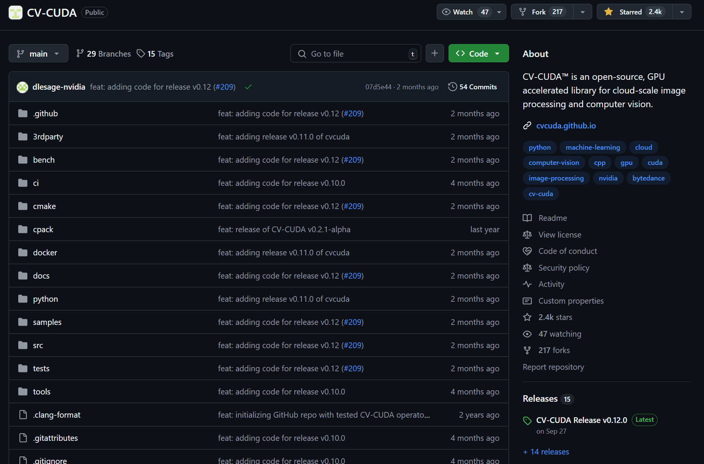
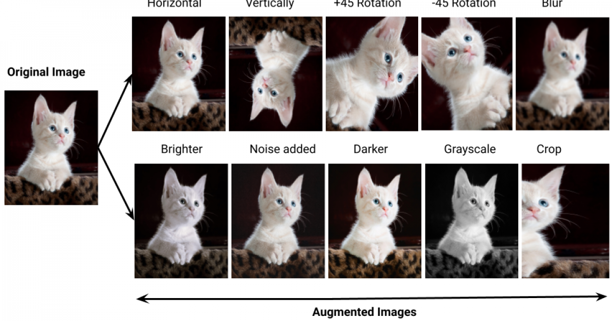
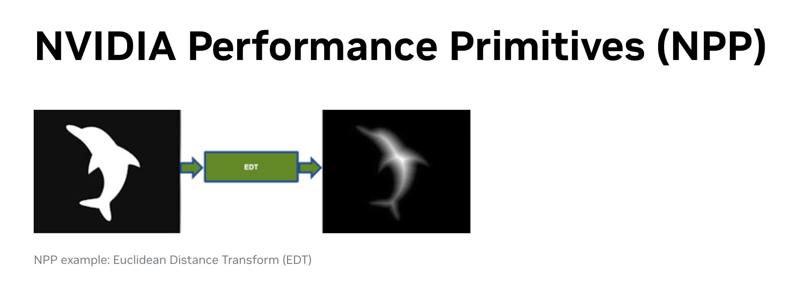
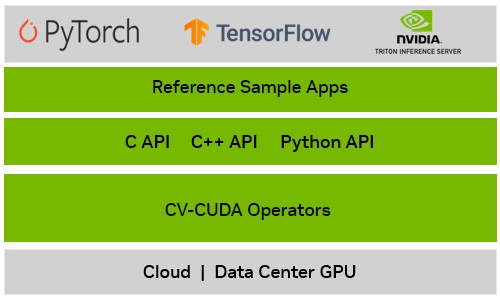
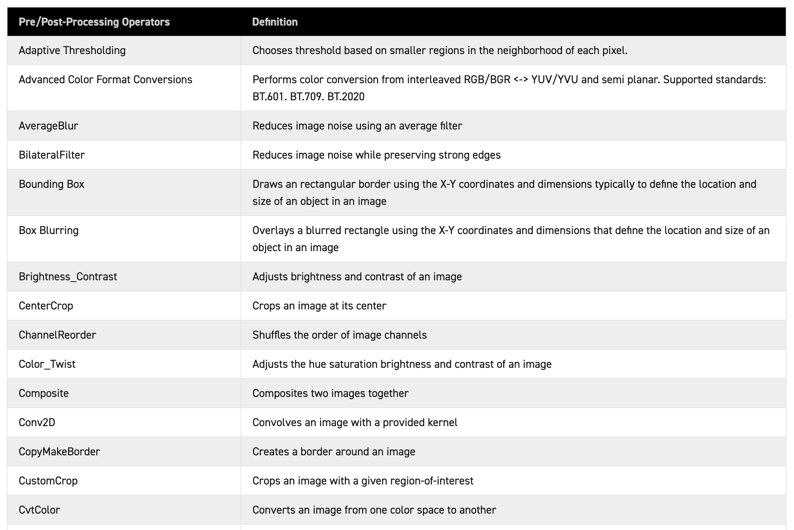
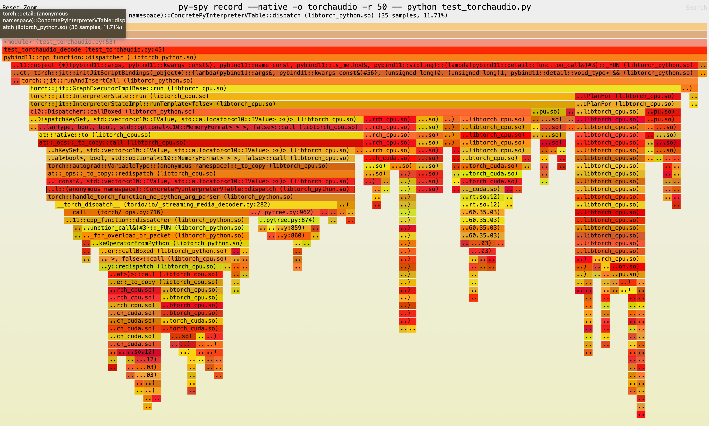
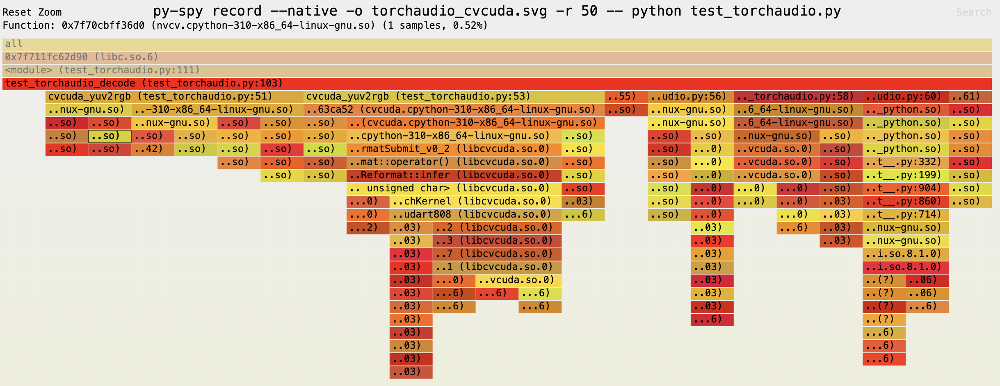
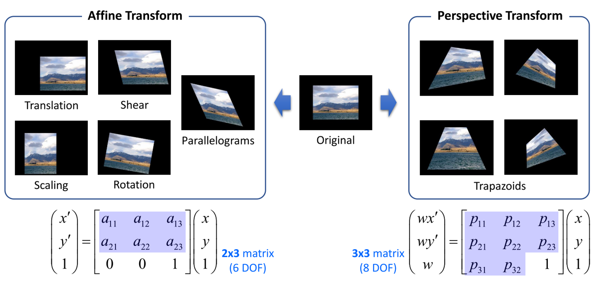

# CV-CUDA로 PyTorch에서 비디오 처리 더 가속화하기



CV-CUDA는 제가 비디오 전처리 파이프라인을 구축하면서 가장 성능 향상을 크게 이룬 2번째 Feature 입니다. CV-CUDA가 우선 무엇인지, 왜 나왔는지, PyTorch에 비해서 어떠한 이점이 있는지 간단하게  확인해보겠습니다. 우선 CV-CUDA를 설명하기 전에 근본이 되는 이미지 프로세싱에 대해서 짤막하게 설명하고 넘어가고자 합니다.

## 이미지 프로세싱이란?


이미지 프로세싱(Image Processing)은 디지털 이미지를 조작하여 원하는 결과를 얻는 기술입니다. 주로 이미지의 품질을 개선하거나, 특정 정보를 추출하는 데 사용됩니다.

이미지 프로세싱 주요 작업은 필터링, 색상 변환, 크기 조절, 회전 및 이동 등등이 있습니다. 과거 딥러닝과 머신 러닝이 주가 아니였을 때에는 사람이 직접 고도의 이미지 프로세싱을 설계하여 분류 알고리즘과 객체 검출 알고리즘을 손수 제작하곤 했었습니다. 허나 이제는 딥러닝이 등장하면서 CNN 네트워크를 통해서 자동으로 이미지의 특징을 학습하고 추출하게 되었죠.

그럼 이미지 프로세싱을 사용하지 않아도 되지 않느냐 할 수 있지만 절대 아닙니다. 오히려 이미지 프로세싱은 이전보다 훨씬 더 많이 사용되고 있습니다. 요즘 이미지 프로세싱은 모델이 이미지를 더 잘 이해하도록 돕기 위한 **전처리 과정**에서 중요한 역할을 합니다. 이미지의 해상도를 조정하거나, 노이즈를 제거하고, 색상 균형을 맞추는 작업이 이에 해당합니다. 또한, 얼굴 인식 모델의 경우, 이미지에서 얼굴만 추출하여 학습하는 크롭(Crop) 작업 등도 포함됩니다. 이렇게 모델이 이미지를 더 잘 이해할 수 있게 하며, 학습을 더 쉽게 할 수 있도록 하는 것입니다.



그리고 이미지 프로세싱은 반대로 모델 학습을 더 어렵게 만드는 데에도 사용됩니다. 예를 들어, 이미지에 노이즈를 추가하거나, 블러 효과를 넣거나, 해상도를 낮추어 데이터를 손상시키는 방식으로, 모델이 손상된 데이터에서도 좋은 성능을 내도록 학습시킬 수 있습니다. 이러한 방법을 통해 적은 데이터로도 다양한 상황을 학습할 수 있으며, 많은 데이터를 사용한 것과 유사한 효과를 얻어 더 좋은 모델을 만들 수 있습니다. 이를 **데이터 증강(Data Augmentation) 기법**이라고 합니다.

이렇게 이미지 프로세싱 작업은 정말 중요하고 효과적이지만, 처리 속도가 느리다는 단점이 있습니다. 이미지는 텍스트나 음성에 비해 데이터 크기가 훨씬 커서, 이를 처리하는 데 많은 연산이 필요하기 때문입니다. 그나마 요즘 CPU 성능이 많이 좋아지고, OpenCV와 같은 고성능 라이브러리를 통해 간단한 이미지 프로세싱은 빠르게 처리할 수 있지만, 여전히 비효율적이며 특히 비디오 작업에서는 속도가 느려지기 쉽습니다. 또한 대규모 기반으로 학습을 한다고 하면, 데이터 전처리 속도가 학습 속도를 못 따라가는 경우도 있죠.

이 문제를 해결하기 위해, 이미지 프로세싱을 병렬 연산에 특화된 GPU를 통해 가속화하는 경우가 많습니다. GPU를 활용하면 대규모 이미지와 비디오 데이터도 더 빠르고 효율적으로 처리할 수 있습니다. 이러한 작업을 도와주는 라이브러리는 대표적으로 NPP와 이번에 설명드릴 CV-CUDA가 있습니다.

## NPP와 CV-CUDA란?



CV-CUDA 이전에는 NPP라는 NVIDIA의 GPU 기반 이미지 프로세싱 라이브러리가 있었습니다. NPP는 C, C++로 작성된 라이브러리로, 다양한 이미지 프로세싱과 신호 처리 작업을 GPU에서 수행할 수 있는 기능을 제공합니다. 그러나 NPP는 오픈 소스가 아니고, Python 라이브러리를 지원하지 않으며, 매우 저수준의 라이브러리이기 때문에 다루기가 어렵다는 단점이 있었습니다. 또한, 너무 많은 알고리즘을 포함하고 있어, 딥러닝에 특화된 주요 알고리즘만 간편하게 사용하기엔 다소 복잡했습니다. 그래서 이러한 단점을 극복하기 위해 등장한 것이 바로 CV-CUDA입니다.

CV-CUDA는 컴퓨터 비전에서 자주 사용되는 이미지 프로세싱 알고리즘을 GPU로 가속화하여 빠르게 처리할 수 있는 오픈소스 라이브러리입니다. C, C++뿐만 아니라 Python 바인딩도 제공되어 Python 환경에서도 쉽게 활용할 수 있습니다. NVIDIA와 TikTok 개발사 ByteDance가 공동 개발한 이 라이브러리는 현재 Microsoft, Tencent, Baidu 등에서 채택하여 사용하고 있습니다. 또한 완전한 오픈소스이다 보니 개발자 커뮤니티도 쉽게 활성화 되고 있죠.



CV-CUDA Document에는 다음과 같은 기능이 포함되어 있다고 설명합니다.

1. 고성능의 컴퓨터 비전 및 이미지 프로세싱을 위한 통합된 특화 커널 세트
2. C, C++, Python API 지원
3. 다양한 크기의 이미지를 동시에 처리할 수 있는 Batch 처리 기능
4. PyTorch와 같은 딥러닝 라이브러리와의 Zero-Copy 인터페이스
5. 분류, 객체 검출, 이미지 분할과 같은 Sample applications

위 내용을 통해 CV-CUDA가 딥러닝과 이미지 프로세싱을 통합하고자 하는 목적이 분명하다는 것을 알 수 있습니다. CV-CUDA로 처리한 알고리즘들은 PyTorch와 같은 라이브러리와 손쉽게 통합할 수 있으며, 각 알고리즘에 대해 특화된 커널이 준비되어 있어 매우 빠르고 효율적인 연산이 가능합니다. 또한, 컴퓨터 비전에 사용되는 다양한 알고리즘이 많이 구현되어 있어 활용도가 높습니다.



실제로 CV-CUDA에서 지원하는 알고리즘은 딥러닝 기반 컴퓨터 비전 작업을 해본 분이라면 한 번쯤은 들어봤을 만큼 널리 쓰이는 알고리즘들로 구성되어 있습니다. 그렇다면, 과연 얼마나 유용한지 한번 살펴봐야겠죠?

지난 글에서는 NVDEC와 NVENC를 이용한 하드웨어 가속으로 PyTorch GPU 텐서를 빠르게 로딩하는 방법에 대해 다뤘습니다. 하드웨어 가속을 통해 실제 PyTorch 파이프라인에서 큰 성능 향상을 이룰 수 있었지만, 마지막에 언급한 몇 가지 문제점이 있었죠? 바로 YUV2RGB 변환과 uint8에서 float32로의 형변환에서 GPU 자원 소모와 속도 저하가 극심하다는 점이었습니다. 이를 빠르게 확인하고, CV-CUDA와 직접 비교해봅시다.

## PyTorch Benchmark

```python
def test_torchaudio_decode(src: str) -> None:
    s = torchaudio.io.StreamReader(src=src)

    s.add_video_stream(
        frames_per_chunk=4,
        decoder="h264_cuvid",
        decoder_option={},
        hw_accel="cuda",
        buffer_chunk_size=20,
    )

    length = s.get_src_stream_info(0).num_frames

    with tqdm.tqdm(total=length, desc="TorchAudio Processing frames") as pbar:
        for chunks in s.stream():
            pbar.update(chunks[0].size(0))


```
영상은 1920x1080 사이즈에 7503개의 프레임을 가지고 있는 영상으로 테스트 한 결과 초당 약 800프레임 가량 뽑아내는 걸 볼 수 있죠. (NVIDIA L4 기준)

GPU를 얼마나 사용하는지 한번 확인 해 볼까요?
```bash
$ python test_torchaudio.py
TorchAudio Processing frames: 100%|████████| 7503/7503 [00:09<00:00, 797.14it/s]

$ nvidia-smi dmon
# gpu    pwr  gtemp  mtemp     sm    mem    enc    dec    jpg    ofa   mclk   pclk 
# Idx      W      C      C      %      %      %      %      %      %    MHz    MHz 
    0     43     40      -     33     18      0     25      0      0   6250   2040
```
GPU의 33%와 Mem이 18%, NVDEC를 25% 가량 사용하는군요, 얼추 잘 나오는 것 같습니다. 하지만 여기에 uint8 to float32와 yuv2rgb를 집어넣으면 어떻게 될까요? 또 확인해봅시다.

이번에는 디코딩된 프레임에 torchaudio 튜토리얼에 있는 YUV2RGB를 넣고, 형변환도 해보겠습니다.

```python
def yuv_to_rgb(frames: torch.Tensor) -> torch.Tensor:
    frames = frames.to(torch.float)
    y = frames[..., 0, :, :]
    u = frames[..., 1, :, :]
    v = frames[..., 2, :, :]

    y /= 255
    u = u / 255 - 0.5
    v = v / 255 - 0.5

    r = y + 1.14 * v
    g = y + -0.396 * u - 0.581 * v
    b = y + 2.029 * u

    rgb = torch.stack([r, g, b], -1)

    return rgb
```
위 코드를 사용해서 다시 측정한 결과는 다음과 같았습니다.

```bash
$ python test_torchaudio.py
TorchAudio Processing frames: 100%|████████| 7503/7503 [00:28<00:00, 263.04it/s]

$ nvidia-smi dmon
# gpu    pwr  gtemp  mtemp     sm    mem    enc    dec    jpg    ofa   mclk   pclk 
# Idx      W      C      C      %      %      %      %      %      %    MHz    MHz 
    0     34     43      -     39     41      0      9      0      0   6250   2040 
    0     47     44      -     39     42      0      9      0      0   6250   2040
```
처리 속도가 초당 800 frames에서 초당 264 frames 크게 급감된 것을 확인 할 수 있습니다. 더불어 후처리가 느려진 덕분에 NVDEC 활용률도 줄어들은 것을 확인 할 수 있습니다.

YUV2RGB 변환을 PyTorch에서 실행할 때 성능이 크게 저하되는 이유는 간단합니다. YUV2RGB 변환은 매우 간단한 연산이지만, PyTorch는 복잡한 행렬 연산을 수행하는 범용 커널들이 개발되어 있어, 이런 간단한 연산을 복잡하게 연산하려합니다.

더군다나 Float32로 변환한 후에 yuv2rgb 연산을 하는 것이니 더 비효율적일 수 밖에 없죠, 그러면 uint8로 yuv2rgb를 연산하고, 그 다음 float32로 바꾸는게 좋지 않냐? 할 수 있지만, PyTorch는 근본적으로 float 연산에 주로 최적화되어 있어서, uint8로 연산으로 yuv2rgb를 구현한들 속도적인 이점에 크게 이득이 없습니다. 실제로 한번 해보시면 속도 차이가 크게 나지 않는 다는 걸 확인하실 수 있을 겁니다.



더군다나 py-spy로 어떻게 함수가 호출되는지 확인 해보면 단순 YUV2RGB만 하는 연산인데도 불구하고 호출 스택이 정말 깊은 것을 확인 할 수 있습니다. 이로 인해 CPU 오버헤드도 그만큼 커지고, 동시에 상대적으로 비효율적인 방식으로 연산을 수행하게 되는 것이죠. 마치 닭 잡는데 소 잡는 칼을 사용하는 것처럼요. 그럼 닭 잡는데에는 닭 잡는 칼을 써야겠죠? 그러면 이제 CV-CUDA를 사용할 준비가 된 것입니다.

## CV-CUDA Benchmark

CV-CUDA는 Github Release를 통해서 설치 할 수 있습니다. 현재 0.12 버전에 python 3.10을 사용하고 있으므로, pip install https://github.com/CVCUDA/CV-CUDA/releases/download/v0.12.0-beta/cvcuda_cu12-0.12.0b0-cp310-cp310-linux_x86_64.whl 으로 라이브러리를 설치해서 실험을 해보겠습니다.

```python
def cvcuda_yuv2rgb(frames: torch.Tensor) -> torch.Tensor:
    cvcuda_tensor = cvcuda.as_tensor(images, "NCHW")

    cvcuda_tensor = cvcuda.reformat(cvcuda_tensor, "NHWC")

    rgb_tensor = cvcuda.cvtcolor(cvcuda_tensor, cvcuda.ColorConversion.YUV2RGB)
    rgb_tensor = cvcuda.convertto(rgb_tensor, np.float32)

    rgb_tensor = cvcuda.reformat(rgb_tensor, "NCHW")
    
    rgb = torch.as_tensor(
        rgb_tensor.cuda(), device="cuda"
    )
    
    return rgb
```
이렇게 CV-CUDA로 YUV2RGB를 구현해봤습니다. 비교적 간단하죠? cvcuda는 PyTorch GPU Tensor를 그대로 CVCUDA Tensor로 바꿀 수 있습니다. 반대로 CVCUDA Tensor를 그대로 PyTorch GPU Tensor로 옮길 수 있는 Zero Copy를 할 수 있죠.

한번 실행을 해봅시다.

```bash
$ python test_torchaudio.py
TorchAudio Processing frames: 100%|████████| 7503/7503 [00:11<00:00, 669.23it/s]

$ nvidia-smi dmon
# gpu    pwr  gtemp  mtemp     sm    mem    enc    dec    jpg    ofa   mclk   pclk 
# Idx      W      C      C      %      %      %      %      %      %    MHz    MHz 
    0     54     43      -     54     47      0     25      0      0   6250   2040 
    0     54     44      -     55     46      0     25      0      0   6250   2040
```
급감되었던 초당 264 frames에서 670 frames으로 상승한 것을 확인 할 수 있습니다. 초당 800 frames 연산에서 초당 670 frames 까지 감소한 것이죠. 이전보다 연산이 훨씬 빠르다는 것을 확인 할 수 있습니다. 그러면 py-spy를 통해서 한번 봐봅시다.



yuv2rgb의 호출 스택이며, PyTorch에 비해서 훨씬 적은 호출 스택이 일어나는 것을 알 수 있습니다. 또 PyTorch와 다르게 곧바로 C++ 런타임으로 실행되서 더 저수준의 작업을 하는 것도 확인 할 수 있습니다. 코드를 분석하면 infer로 흘러 들어가며 바로 CUDA 커널에 접근하는 것을 확인 할 수 있었습니다.

오픈소스라서 CV-CUDA의 모든 커널은 Github에 가보면 바로 알 수 있습니다.

```cpp
template<typename Policy, typename SrcT, typename DstT, typename StrideT>
GLOBAL_BOUNDS void yuv_to_bgr_nhwc(const TensorWrap3D<const SrcT, StrideT> src, const TensorWrap3D<DstT, StrideT> dst,
                                   int2 dstSize, int bidx)
{
    using EltT = nvcv::cuda::BaseType<SrcT>;
    color_conversion_common<Policy, 3, 3, EltT>(
        [&src] __device__(EltT(&r_YCbCr)[3], int batch_idx, int x, int y)
        { load3_nhwc(src, r_YCbCr[0], r_YCbCr[1], r_YCbCr[2], batch_idx, x, y); },
        [] __device__(const EltT(&r_YCbCr)[3], EltT(&r_BGR)[3])
        {
            if constexpr (std::is_integral_v<EltT>)
                yuv_to_bgr_int(r_YCbCr[0], r_YCbCr[1], r_YCbCr[2], r_BGR[0], r_BGR[1], r_BGR[2]);
            else
                yuv_to_bgr_flt(r_YCbCr[0], r_YCbCr[1], r_YCbCr[2], r_BGR[0], r_BGR[1], r_BGR[2]);
        },
        [&dst, bidx] __device__(const EltT(&r_BGR)[3], int batch_idx, int x, int y)
        { store_bgra_nhwc(dst, r_BGR[0], r_BGR[1], r_BGR[2], Alpha<EltT>, batch_idx, x, y, bidx); },
        dstSize);
}
```
결국엔 [해당 코드](https://github.com/CVCUDA/CV-CUDA/blob/07d5e442855e8022ccb942ad564fc18ce0e81a99/src/cvcuda/priv/legacy/cvt_color.cu#L349-L367)에 있는 CUDA 커널이 실행됩니다. 추상화가 워낙 잘 되있어서 약간은 복잡해보이지만, 사실 정말 단순하고 평범한 행렬 덧셈, 곱셈이라고 생각하시면 됩니다.

이 외에도 자주 사용되는 warp_affine도 확인해볼까요?



warp_affine은 이미지를 변환할 때 자주 사용되는 기법으로, 이미지를 이동(translate), 회전(rotate), 크기 조절(scale), 뒤틀기(skew) 등의 변환을 통해 원하는 위치와 형태로 조정하는 작업입니다. 주어진 변환 행렬에 따라 원본 이미지의 각 픽셀을 새로운 위치로 매핑하여 변환된 이미지를 생성합니다. 흔히 Warp Affine은 이미지를 정렬하거나 크기를 맞추는 전처리 과정에서 자주 사용 됩니다.

해당 연산은 OpenCV 조차도 연산이 느린 무거운 작업입니다. 그래서 이런 연산은 GPU를 사용하면 어지간히 빠르고 PyTorch에서는 F.grid_sample을 통해서 구현할 수 있고, 속도도 꽤나 빠른 편입니다. CV-CUDA도 warp_affine이 있는데 이를 한번 짤막하게 비교해봅시다.

```python
def cvcuda_warp_affine(
    src: torch.Tensor,
    M: np.asarray,
    flags: int = cv2.INTER_LINEAR,
) -> torch.Tensor:
    cvcuda_tensor = cvcuda.as_tensor(src, "NCHW")
    cvcuda_tensor = cvcuda.reformat(cvcuda_tensor, "NHWC")

    output_tensor = cvcuda.Tensor(
        cvcuda_tensor.shape, cvcuda_tensor.dtype, cvcuda_tensor.layout
    )

    cvcuda.warp_affine_into(
        output_tensor, cvcuda_tensor, M, flags
    )

    output_tensor = cvcuda.reformat(output_tensor, "NCHW")
    frame = torch.as_tensor(output_tensor.cuda(), device="cuda")

    return frame

def warp_affine(
    src: torch.Tensor,
    M: torch.Tensor,
    flags: str = 'bilinear',
) -> torch.Tensor:
    N, C, H, W = src.shape

    grid = F.affine_grid(M, [N, C, H, W], align_corners=False)

    output = F.grid_sample(
        src, grid, mode=flags, padding_mode='zeros', align_corners=False
    )

    return output
```

두 함수를 직접 비교했고, 이 역시 1920x1080 이미지로 비교했습니다. 각각 10,000번 함수를 실행한 결과 PyTorch는 약 8.97초, CV-CUDA는 5.81초가 걸렸으며 PyTorch의 경우와 CV-CUDA의 경우 둘 다 GPU를 100% 사용하였고, 메모리 사용률은 PyTorch에선 70%, CV-CUDA에서는 100%를 사용했습니다. CV-CUDA는 GPU를 최대로 활용했다고 할 수 있습니다.

이렇듯 PyTorch에서도 효율적인 warp_affine 마저도 CV-CUDA가 더 좋다는 것을 확인 할 수 있었습니다. 사실 당연한 것이지만 각각 기능을 위해 만들어진 커널이 범용 커널보다 성능이 뒤떨어지면 안되긴 하죠.

## 결론

PyTorch의 YUV2RGB 변환을 CV-CUDA로 구현하여 성능 향상을 확인했으며, CV-CUDA의 또 다른 연산인 warp_affine도 PyTorch와 비교하여 속도를 비교해보았습니다. 사실 PyTorch의 성능이 부족한 것은 아닙니다. 대부분의 프로젝트에서는 PyTorch로 전처리를 구현해도 성능에 문제가 없는 경우가 많습니다. 일반적으로 전처리 속도가 극도로 중요한 상황이 그리 많지 않기 때문입니다.

다만, 전처리 속도가 극한으로 요구되는 프로젝트가 있습니다. 예를 들어, 자율 주행 시스템이나 성능 제약이 있는 Jetson 같은 임베디드 디바이스에서의 프로젝트, 또는 실시간 처리가 필요한 프로젝트에서는 전처리의 성능이 매우 중요해집니다. 이러한 상황에서는 CV-CUDA의 GPU 가속 기능을 활용하여 효율성을 극대화할 수 있습니다.

저의 경우에는 비디오 전처리 업무였고, 비디오 전처리 및 이미지 프로세싱이 모델보다 비중이 큰 상황이여서 좋은 성과를 이루어 냈던 것이지, 아마 모델이 비중이 더 컸다면 모델 최적화 먼저 진행을 했을겁니다. 이렇게 각자 상황에 맞게 PyTorch로 빠르게 구현할 것인지, 아니면 극한의 최적화를 위해서 CV-CUDA를 채택할지 선택하면 될 것 같습니다.