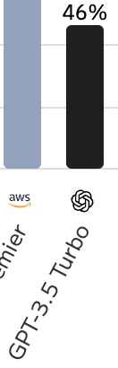

# LLM은 얼마나 좋아졌을까?

제가 ChatGPT에 대해 글을 작성한 게 시간이 제법 지난 줄 알았는데 아직 2년 반 밖에 되지 않았네요. 저는 GPT가 나름 빠르게 발전 할 줄 알았어서 그 때 당시에 "21세기 최고의 발명품"이라고 약간의 호들갑을 떨었지만, 사실 이 정도로 빠르게 발전 할 줄은 상상도 못했습니다.

과거 ChatGPT 3.5 의 결과물을 지금 보면 결과물 수준이 빈약하고, 너무나도 당연하게 되어야 하는 것들 처럼 보입니다. 요즘의 LLM은 대화창을 넘어서 Cursor나 Windsurf IDE를 통해서 Claude 4를 통해서 거의 프로젝트 전체를 코딩을 하며 버그를 수정하며 테스트 코드를 스스로 만들기 까지 하고 있죠.

또 MCP, Agent 등등 AI를 통해서 LLM이 다양하게 확장되고 있는 걸 보면, 확실히 짧은 시간안에 빠르게 발전하고 있다고 생각할 수밖에 없습니다. 오히려 서비스의 발전이 AI의 발전을 못따라간다는 이야기도 있을 정도입니다.

위와 같은 사례로 LLM이 과거보다는 훨씬 발전했다는 것을 누구나 동의할 것 같습니다. 그러면 과연 객관적으로 어떤 것이 얼만큼 발전했다고 할 수 있을까요? 모델의 수준을 보려면 성능 지표와 각종 기능들을 살펴 봐야합니다. 이번 아티클에는 가볍게 그런 것들을 살펴보고자 합니다.

1. LLM을 간단하게 설명하자면..
2. 그러면 ChatGPT 3.5는 어느 정도 수준이였나?
3. 그 후로 LLM은 과연 얼만큼 좋아졌나?
4. 더 나아져야 할 것들은 없을까?

## LLM을 간단하게 설명하자면..

LLM (Large Language Model)은 말 그대로 거대 언어 모델이며, 초 대규모 텍스트 데이터를 통해 사람의 언어를 학습하여 자연스라운 문장이나 대화, 코딩, 등등 텍스트에 관한 모든 것을 만들어내는 인공지능입니다.

작동 방식을 간단하게 설명하자면,

```
입력: 오늘 날씨가
예측 결과: 좋

입력: 오늘 날씨가 좋
예측 결과: 네

입력: 오늘 날씨가 좋네
예측 결과: 요
```

이렇게 되는 방식으로 동작합니다. 간단하죠? 입력들을 보고 그 다음에 나올 Token을 예측하는 겁니다. 그 Token은 단순 Int이며 Tokenizer라는 특정 함수를 통해 텍스트로 변환되죠. 모델이 출력을 직접 string으로 뱉을 수는 없으니까요.

현재의 LLM이 동작할 수 있는 이유로는 RNN, LSTM 처럼 한 방향으로만 처리되는 방식을 넘어 **전체 입력 텍스트를 한꺼번에 보며 간 단어의 중요도를 파악하는 [Transformer](https://arxiv.org/abs/1706.03762)** 가 등장함에 따라서 이루어졌습니다.

이 Transformer로 위 설명대로 학습하고 추론하는 GPT-1 (1.1억개 매개변수)이 나오면서 Transformer로 전체 텍스트를 처리하는데 효과적이라고 증명되었고, 이를 기점으로 LLM은 크게 발전되었습니다.

더군다나 놀라운 점은 Transformer는 다른 모델 구조와 다르게 계속해서 커지는게 가능했고, 그만큼 커질 수록 성능이 그 만큼 늘어나는 것이 가능했다는 겁니다.

그 결과로 GPT-1 대비 10배 커진 **GPT-2 (15억개 매개변수)가 나오며 이거 어디까지 좋아질 수 있는거지? 라는 질문**을 던져주었으며, 그 **GPT-2 보다 100배 커진 GPT-3 (1750억개 매개변수)에는 성능에 퀀텀 점프가 일어나서, Transformer가 커지면 커질수록 좋아진다는 것**을 실제로 보여주었습니다.

그러면 GPT-3 이후에는 GPT-3.5가 나왔으며, GPT-3.5의 소개에 따르면 GPT-3 기반 위에 fine-tune과 강화학습을 통해 대화에 특화된 모델이라고 합니다. GPT-3.5 부터는 GPT-3와 다르게 대화형으로 만들어졌으며, 이를 통해 연구원과 이해 관계자를 넘어서 일반 유저에 보급되기 시작했습니다. 이제는 너무 유명해진 ChatGPT를 통해서 말이죠.

## 그러면 ChatGPT 3.5는 어느 정도 수준이였나?

제가 맨 처음 ChatGPT를 통해 3.5를 사용했던 때를 떠올려 보면 좋았던 것 같지만, 막상 다시 생각해보면 굉장히 느렸으며, 텍스트가 긴 게 안들어가서 항상 위와 같은 오류를 보며 화를 냈던 기억이 납니다.

그나마 속도 부분에서는 3.5-turbo 가 등장하면서 꽤 빨라져서 사용감이 좋아졌지만, 그래도 여전히 텍스트가 긴 게 안들어가던 건 똑같았던 기억이 나네요.

역시 기억으로 좋았다 안 좋았다 판단하기는 확실히 무리가 있으니까 역시 확실한 지표를 보고 이야기 하고자합니다. LLM 분야에서는 성능, 가격, 속도를 가장 보기 좋은 artificialanalysis.ai 를 참고해서 봐보겠습니다.

실제로 3.5 Turbo 는 **입력과 출력을 합쳐서 4096 tokens 이 한계**였다고 합니다. 4096 token 이면 대충 3000단어 정도 되며, 대충 200줄에서 300줄에 달하는 글입니다. 입력으로 200줄을 넣으면 출력으로 100줄 결과 밖에 못 본다는 것이죠. 이 정도면 요즘 코드를 냅다 다 복사하고 "해주세요" 하는 것은 아마 상상도 못했던 시기였던 것 같습니다.

[속도 사진 넣기]

그래도 속도는 꽤나 빨랐습니다. 3.5 turbo 기준으로는 111 token/s 가 나왔다고 하며, 이는 영어 단어 기준으로 1초에 75 단어 정도로 나왔다는 것을 의미합니다. 이 정도면 사람이 문장을 빠르게 읽는다고 했을때 초당 5개 단어를 본다고 했을 때 따라갈 수 없는 속도에 가깝습니다.

그러면 답변의 퀄리티는 어떨까요? 답변의 퀄리티라고 하면 물어본 것에 대해 정확히 답변해줄 수 있는가 라고 할 수 있겠는데요, 연구원들은 LLM 모델을 객관적으로 평가해야 하기 때문에, 평가용으로 자주 사용되는 데이터셋이 많이 있습니다.

[MMLU 사진 넣기]

그 중에서 가장 대표적으로 꼽는 건 MMLU (Massive Multitask Language Understanding) 데이터셋이 있으며, 역사, 수학, 법률 등등 57개 분야의 약 15,000개 문제로 이루어져 있습니다.

하지만 MMLU는 4지 선다 문제이고 단순 지식을 암기하는 수준으로 풀 수 있어서, 요즘에는 이를 개선한 MMLU-Pro로 많이 벤치마크를 합니다. 이 데이터셋은 기존 4지 선다에서 10지 선다까지 늘어서 단순 찍기도 힘들어졌고, 기존보다 더 문제가 어려워 졌으며, 특히 암기가 아닌 추론과 생각이 필요한 문제들이 많이 포함되어 있다고 합니다.



3.5 Turbo 는 MMLU-Pro에서 46%의 정답률로 반타작도 못했군요, 그래도 옛날 모델 치고 46%면 꽤나 인상적입니다. 아마 제가 저 문제들을 풀면 10%도 못 맞추지 않을까요?

## 그 후로 LLM은 과연 얼만큼 좋아졌나?

의외로 ChatGPT 3.5가 좋은 것 같긴 합니다.. 그러면 조금 가혹할 수 있겠지만 현재 가장 대표적인 모델인 ChatGPT 4o 와 3.5를 비교를 한 번 해볼까요? 뭐 사실 볼 것도 없습니다만, 4o 뿐만 아니라 요즘 나온 모델들이 3.5의 모든 면보다 훨씬 뛰어납니다.

4o의 MMLU-Pro의 점수는 무려 80% 로 3.5 대비 34% 나 향상된 점수를 보여주었습니다. MMLU-Pro는 추론과 생각이 필요한 문제들이 많다고 했었죠? 확실히 요즘 생각하는 모델(Chain of Thought, CoT)은 80% 이상을 보여주는 모델들이 많은 것을 확인 할 수 있습니다.

그리고 LLM에는 특유의 고질병인 Hallucination (환각) 현상을 빼놓고 이야기 할 수 없는데요, 환각 현상이란 LLM이 틀린 이야기를 하거나, 거짓말을 하거나, 허무맹랑한 소리를 하는 것들이 일종의 예라고 할 수 있겠습니다.

GPT-3.5 모델에서 환각 현상이 밈이 될 정도로 자주 언급되었는데요, 실제로 HaluEval 벤치마크를 사용하여 환각 현상을 측정했을 때, GPT-3.5 Turbo는 무려 **37.8%**의 높은 환각률을 보여주었습니다. 반면, GPT-4 Turbo는 그에 비해 현저히 낮은 **14%**, 4o는 **12%**의 환각률을 기록하며 상당한 개선을 보였습니다. [(출처)](https://docs.patronus.ai/docs/research_and_differentiators/benchmarking)

그러면 속도는 어떨까요? 성능도 훨씬 좋은데 속도마저도 더 빨랐으며, 158 token/s로 측정되었고, 3.5 대비 약 1.4배 빠른 속도를 보여주었습니다.

가장 압권인 것은 Input + Output 총합량인데요, 4o는 총 128,000 tokens 을 넣을 수 있다고 합니다. 3.5의 4096 tokens에 비하면 약 30배나 많은 분량을 보장한다는 의미이죠.

성능과 속도 뿐만 아니라 **기능**에서도 엄청난 도약이 있었습니다. 현재 4o에서는 이미지를 처리할 수 있는 MutliModal 이며, pdf, csv와 같은 파일도 읽을 수 있고, 간단한 python 프로그램을 실행시킬 수 있는 기능도 포함됩니다.

뭔가 여태까지 너무 딱딱한 정량적 평가와 같은 딱딱한 평가들을 이야기한 것 같은데, 이외에도 사람의 직접적인 선호도를 경쟁하는 재미난 사이트가 있습니다. 바로 [LMArena](https://lmarena.ai/c/505830bf-e74a-4c52-8ed5-e57599380f90) 라는 사이트입니다.

이 평가는 임의의 두 모델에게 똑같은 질문을 던졌을 때 서로 다른 답변을 보고 사용자에게 어떤 답변이 더 좋냐 라는 평가를 하는 사이트인데요, 사람들의 답변 선호도를 통해서 체스나 온라인 게임 랭크 시스템에서 자주 사용되는 [Elo Rating](https://en.wikipedia.org/wiki/Elo_rating_system)을 부과해서 LeaderBoard에서 순위를 세우고 있습니다.

3.5 Turbo의 Elo rating 점수는 1215점이고, 4o는 1440점이네요. Elo rating은 각 점수의 차이를 비교해서 승률을 알 수 있는데요. 225점 차이가 나므로 GPT-3.5 Turbo가 4o의 답변을 이길 확률은 21.5% 정도 된다고 계산이 되네요.

## 더 나아져야 할 것은 없을까?

위 내용을 보았을 때 3.5 대비 모든 면에서 발전을 한 것 같습니다. 정말 퇴보한 부분이 없는걸까요? 저는 요즘 모델을 사용하면서 퇴보했다고 생각한게 하나 있었습니다.

그건 바로 아첨 현상 인데요. 요즘 4o 사용하시는 분들 중에 너무나 나를 띄워주는 것을 많이 경험해보셨지 않았나요? 실제로 이는 커다란 반향을 일으켜서 [OpenAI는 모델 업데이트를 다시 롤백 했을 정도로 큰 사건](https://openai.com/index/sycophancy-in-gpt-4o/)이였습니다.

모델이 사용자에게 **아첨하는 듯한 답변**을 내놓는 현상은 주로 **강화 학습(Reinforcement Learning)** 과정에서 발현된 것으로 분석됩니다. 강화 학습은 사용자의 답변 선호도를 모델에 학습시키는 과정인데, 이 과정에서 모델은 단순히 사실을 전달하기보다는 [**사용자가 기분 좋게 느낄 만한 답변**을 생성하도록 발전했기 때문이라는 주장](https://www.seangoedecke.com/ai-sycophancy/)이 제기되고 있습니다.

*이는 모델이 객관적인 사실이나 최적의 해결책을 제시하기보다 사용자를 기쁘게 하는 답변을 우선시하게 만들어, 결국 정보의 정확성과 유용성을 떨어뜨릴 수 있는 심각한 문제입니다.*

위에서 설명한 rating 차이도 답변에 대한 사용자 선호도의 차이로 점수가 나뉘므로 이 아첨 현상이 rating을 견인하는 것에도 분명히 영향이 있었을 것이라 생각합니다.

또 더 나아져야할 게 무엇이 있을까요? LLM은 모든 면에서 아주 훌륭한 것처럼 보입니다. 하지만 이 훌륭한 LLM 들이 최근 어떤 데이터셋에서 정답률이 매우 저조하게 나오는 데이터셋이 나와서 화근이 되고 있습니다.

이 데이터셋에서 성능이 매우 뛰어나다고 평가 받는 모델 중 **Claude Opus 4 Thinking 모델**가 고작 **8.6%**의 정답률 밖에 되지 않았고, 이 마저도 모든 모델에서의 가장 높은 정답률이라는게 아이러니 하죠. 즉 **모든 LLM 모델이 10%의 정답률을 못 넘고 있다는 겁니다.** 심지어 GPT-4o는 단 한개의 문제도 풀지 못해서 0%의 정답률을 가지고 있죠.

가장 어려운 AI 데이터셋이라고 평가받는 [인류의 마지막 시험](https://agi.safe.ai/)도 최대 21.6%의 정답률을 가지고 있는데요...

이보다 어려운 문제라는건데 도대체 문제길래 이 정도일까요? 사람도 못푸는 해괴망측한 문제들 아닐까요? 하지만 정말 놀랍게도 이 대회에서 인간의 정답률을 **100%(!)**를 가졌습니다.

도대체 어떤 문제들이길래 사람은 어렵지 않게 풀고 LLM은 어려워 하는 걸까요? 그 데이터셋의 정체는 [ARC-AGI-2](https://arcprize.org/arc-agi) 라는 데이터셋입니다.

## ARC-AGI

ARC-AGI 는 이름에 걸맞게 AGI (Artificial General Intelligence) 발전을 위해 만들어진 데이터셋입니다. 최근에는 발전을 가속화 하기 위해 ARC Prize라는 대회를 개최하여, ARC-AGI-1과 2에서 85%의 정답률을 가지면 70만 달러(한화 약 10억원)의 상금을 수여한다고 합니다.

ARC-AGI 는 2019년, 250만 명 이상의 개발자들이 사용하는 오픈소스 딥러닝 라이브러리 Keras의 창시자인 **프랑수아 숄레(François Chollet)**는 **"지능의 측정에 대하여(On the Measure of Intelligence)"**라는 논문을 발표하며, **인공지능 일반지능(AGI)을 평가하기 위한 벤치마크인 ARC-AGI**를 제안했습니다. 이 벤치마크는 지능을 측정하기 위한 새로운 기준을 제시합니다.

ARC AGI의 설계 핵심은 **“인간에게는 쉽지만 AI에게는 어려운 문제”**라는 원칙을 따릅니다. 기존의 많은 AI 벤치마크는 광범위한 훈련이나 전문 지식(예: 박사 수준의 문제 해결 능력, 인류의 마지막 시험 등등)을 요구하는 과제에서의 성능을 측정하는 데 중점을 둡니다.

반면, ARC Prize는 인간은 쉽게 풀 수 있지만 AI는 어려움을 겪는 과제에 초점을 맞췄으며, 이는 현재 AI가 추론 능력과 적응력 면에서 본질적인 한계를 지니고 있음을 드러냅니다.

ARC AGI는 AI가 명시적으로 훈련되지 않은, 새롭고 예측 불가능한 문제나 상황을 얼마나 잘 처리할 수 있는지를 평가하는 것을 목표로 합니다. 그러면 어떤 문제들이 AI가 어렵고, 인간에겐 쉬울까요? 대표적인건 **상징적 해석, 조합적 추론, 문맥 기반 규칙 적용** 이 최신 LLM에서 굉장한 어려움을 겪는다고 합니다.

**상징적 해석(Symbolic Interpretation)**의 예시로는 위 같은 이미지를 보았을때, AI는 기호는 명확하게 인식하지만, 기호를 뒤집거나, 대칭성을 조사하거나 하지, 기호에 담긴 의미를 이해하거나 해석하는 것을 어려워한다고 합니다.

그 다음으로 **조합적 추론(Compositional Reasoning)**은 AI는 여러 개의 규칙을 동시에 적용해야 하거나, 규칙들 간의 상호작용이 필요한 과제에서 큰 어려움을 겪는다고 합니다. 대신, 하나의 명확한 규칙이나 전역적인 규칙만 존재하는 경우, 이를 발견하고 적용하는 데는 비교적 능숙합니다.

위 이미지는 주어진 도형들을 하나의 공간에 조합하는 과제인데, 만약 도형이 2개만 있는 간단한 상황이라면 AI는 해당 규칙을 쉽게 찾아내고 적용할 수 있을 겁니다.

하지만 실제 과제처럼 서로 다른 색상과 구조를 가진 도형들이 여러 개 등장하면, 각 도형의 배치 방식, 회전 여부, 상대적 위치 등을 종합적으로 고려해야 하므로 AI에게는 매우 어려운 문제로 작용합니다.

다음으로는 **문맥 기반 규칙 적용(Contextual Rule Application)**은 AI는 말 그대로 맥락에 따라서 규칙을 적용해야하는 작업에서 어려움을 겪는다고 합니다. 즉 AI는 근본적인 원칙을 이해하기 보단 표면적인 패턴에 집중한다고 합니다.

위는 문맥 기반 규칙 적용의 대표적인 예시인데요, 이 그림을 보면 배경이 서로 다른 것을 알 수 있지만, **배경이 근본적인 문제에 영향을 안 미친다는 것은 사람은 쉽게 파악할 수 있습니다.** 대신 AI는 **배경 때문에 이에 대한 표면적인 패턴을 찾으려고 집중하며 결국 문제를 못 풀게 된다고 합니다.**

*실제로 4o에 이 그림을 넣고 이걸 이해할 수 있냐고 했지만 놀랍게도 배경에 따라서 달라지는 것 같다고 분석하고 말도 안되는 답을 내뱉는 것을 확인했습니다.*

위와 같은 규칙들은 ARC-AGI-1가 최신 AI에서 높은 정답률(o3-preview가 최대 88% 정답률)을 보였고, 잘 못 푸는 문제들을 모아서 분석하였고 나온 규칙들이라고 합니다.

실제로 위 규칙들로 무장한게 ARC-AGI-2 이며, o3-preview는 최대 88% 정답률을 보였던 것이 약 18%의 정답률을 가지게 되었습니다.

이러한 문제를 풀기 위해서는 문제당 약 1만 달러에 달하는 비용이 소요될 정도로 막대한 리소스가 필요합니다.
하지만 그 결과조차 100% 정답률을 기록한 인간과 비교하면, 성능 면에서 무려 72%나 뒤처지며, 비용 효율성은 5,000배 이상 낮은 수준입니다.

더군다나 ARC-AGI-2도 많은 AI가 잘 못하는데, ARC-AGI-3도 현재 개발중이라고 합니다. 현재 ARC-AGI-3는 설정된 목표가 없는 게임 형태가 될 것이며, 서로 다른 규칙을 가지고 있는 120개의 게임을 해결할 수 있어야 한다고 합니다.

*위 내용은 해당 [레딧](https://www.reddit.com/r/singularity/comments/1lb2l95/arcagi_3_is_coming_in_the_form_of_interactive/)에 올려져있는 유튜브 링크에 ARC-AGI-3에 대한 프레젠테이션이 있으며, 레딧의 댓글에 발표자가 직접 댓글을 단 내용도 있습니다.*

## 결론

지금까지 우리는 LLM이 얼마나, 그리고 어떻게 발전해왔는지 살펴보았습니다. 불과 2년 반 만에 LLM은 더 똑똑해지고, 더 빨라졌으며, 훨씬 더 많은 작업을 처리할 수 있게 되었습니다. 이는 명백한 사실이죠.

그리고 명확한 지표와 치열한 경쟁을 동력으로 삼아 GPT-3.5 에서 오늘날의 모델에 이른 여정은 하나의 성공 신화처럼 보이는 것 같습니다.

**하지만 이게 이대로 좋게 나아가야 할 방향인가는 조금 더 생각해보게 만듭니다.** 더 높은 점수를 향한 경쟁이 발전을 가속한 것은 분명하지만, 개인적으로 저는 **아첨 현상**과 같은 현상들은 어떻게 보면 위 경쟁에 대한 **편향**을 보여주는 경고처럼 보입니다.

*'더 나음'을 측정하던 우리의 기준이 우리도 모르는 사이에 왜곡된 결과를 빚어낸 것은 아닐까요?*

이 **“무엇을 측정할 것인가”**에 대한 고민은, ARC-AGI를 통해 더 근본적인 질문으로 이어집니다. 지금까지 경쟁을 통해 비약적으로 발전해온 최첨단 AI는, 왜 인간에게는 너무도 단순한 과업조차 여전히 넘지 못하는 벽으로 남아 있는 걸까요?

이는 단순히 더 커다랗게 나은 모델이나 더 많은 학습 데이터가 필요한 문제가 아닐지도 모릅니다. 이 깊은 간극은 우리가 **지금까지 걸어온 "스케일업(scale-up)"의 길에 대해 무엇을 말해주고 있을까요?** 우리는 정말로 인공'일반'지능 (AGI) 에 가까워지고 있는 것일까요, 아니면 고도로 발전했지만 본질적으로는 다른 형태의 기술을 완성해가고 있는 것일까요?

**우리가 지금까지 만들어낸 이 거대한 지능의 실체는 도대체 무엇인거죠?**
