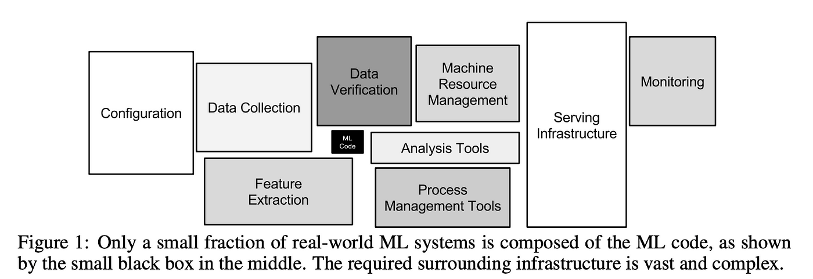
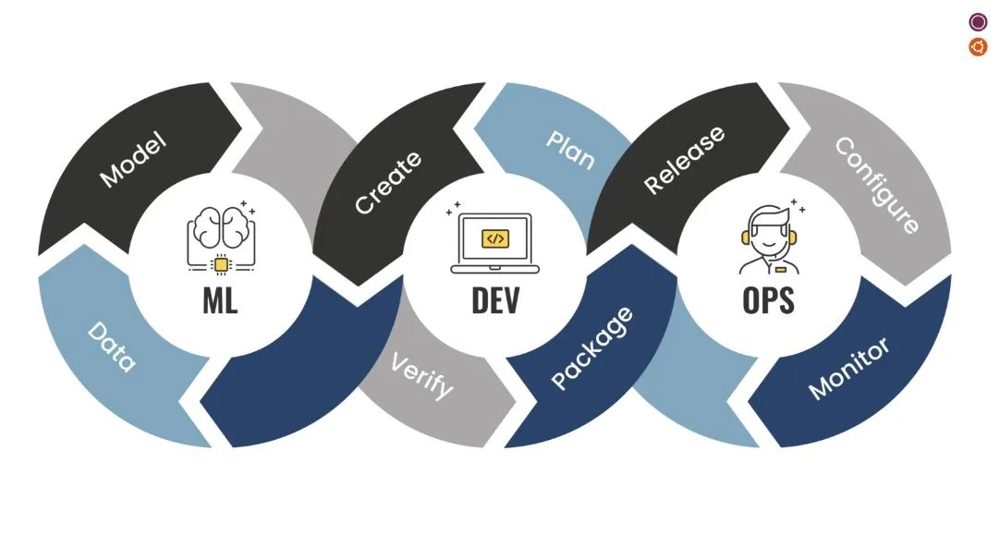
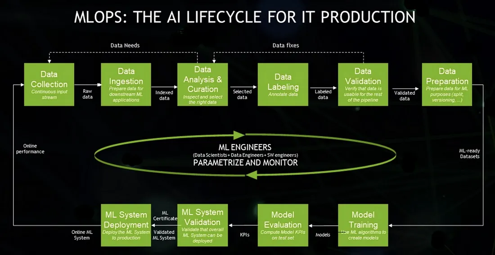
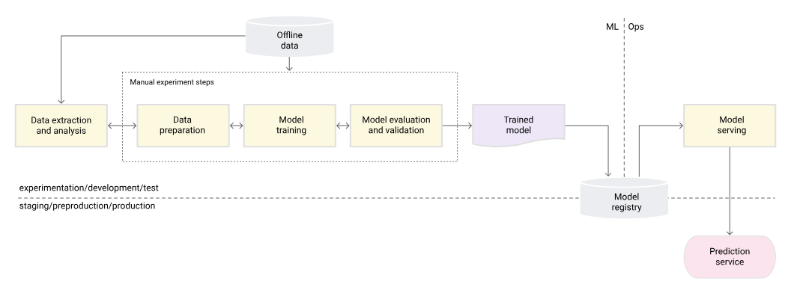
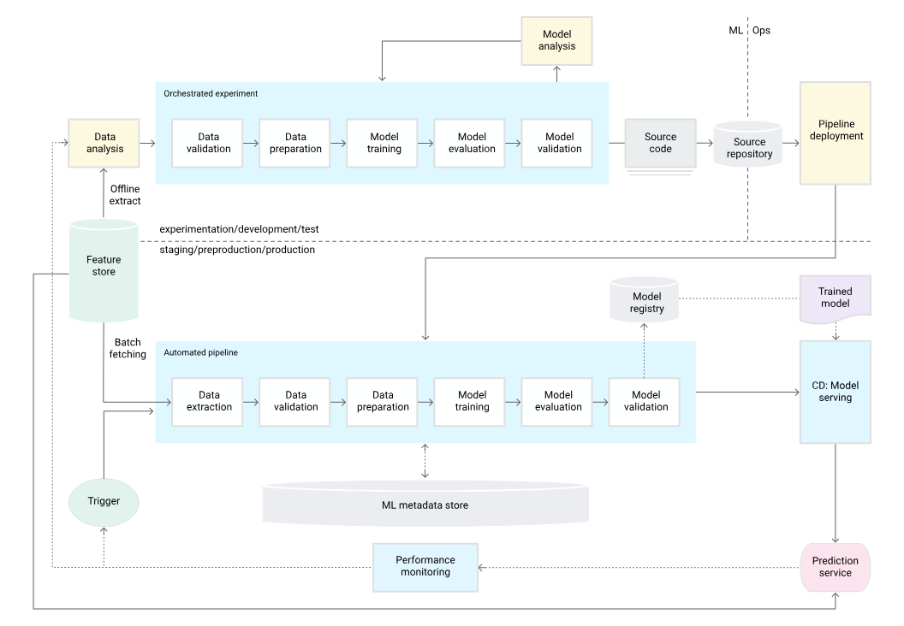
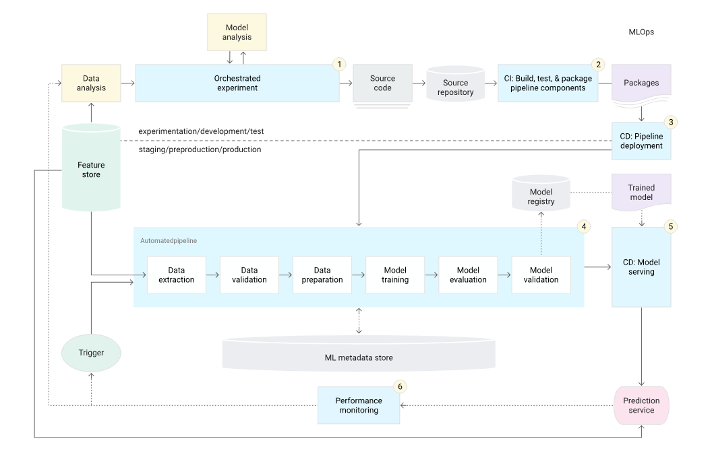
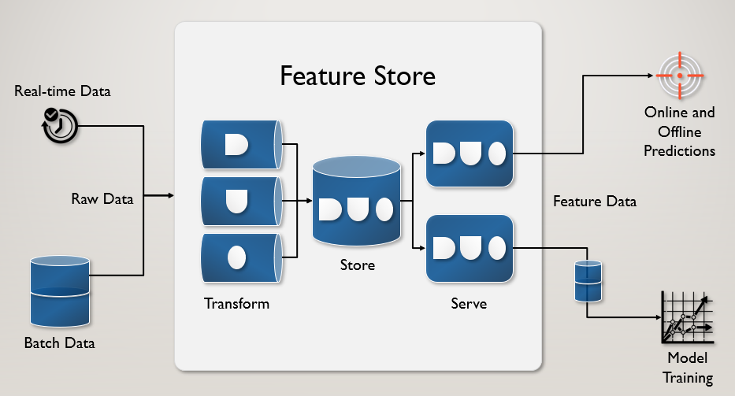

# MLOps에 대해서 알아보자

## 목차

1. 서론
2. DevOps가 무엇인가요?
3. 그럼 MLOps는 무엇인가요?
4. ???
5. 결론

## 서론

기업에서 AI를 요즘 도입을 안하는 곳이 없는 것 같습니다. 모든 산업 분야에서 AI를 활용하여 업무 효율을 높이고, 서비스를 개선하려는 노력이 활발히 이루어지고 있습니다. AI가 엄청나게 뛰어나다는 것은 부정할 수 없으니까요.

하지만 AI를 도입하여 좋은 성과를 이루어내는 것은 꽤 어려운 일입니다. 어려운 점을 좀 나열하자면, 데이터 품질과 양을 우선 보장해야하고, 매끄러운 모델 관리와 배포 관리, 또 AI 인재들이 많이 없는 점과 가장 큰 문제인 비용이 있을 것 같네요.

AI를 우스갯소리로 돈 먹는 하마라고도 부르는 것도 사실 농담이 아닙니다. 그래서 AI를 도입해서 투자 수익률을 달성하지 못하는 경우가 허다합니다. 실제로 POC 단계에서 끝내는 이유도 투자 수익률을 감당하지 못해서 끝내는 경우도 많은 것 같습니다.

그러면 어떻게 하면 좋은 성과를 이루어 낼 수 있을까요? 그 해답은 아마 MLOps라는 말에 있을 지 모릅니다.

## DevOps

MLOps를 설명하기 전에 용어 자체가 DevOps와 굉장히 유사해보이지 않은가요? 개발자 분들 께서는 DevOps란 용어를 아마 많이 들어보셨을 겁니다. 그리고 DevOps와 MLOps는 이루고자 하는 목표는 크게 다르지 않습니다.

DevOps를 간략하게 설명하자면 development(개발)와 operations(운영)를 합친 용어로써, 개발과 운영을 보다 효과적이게 하는 관행이라고 할 수 있을 것 같습니다. 간단하게는 소프트웨어 개발 및 배포를 매끄럽게 해주는 거라고 생각하면 될 것 같습니다.

CI/CD가 DevOps에서 꽤 대표적이라고 할 수 있는데요, CI/CD는 코드의 통합과 배포를 자동화하여 소프트웨어를 안정적으로 배포하고, 배포 주기를 단축하는 데 큰 역할을 합니다. 예를 들어, 개발자는 개발을 열심히 하면서 퇴근하고 휴식을 취할 때 젠킨스나 Github Actions과 같은 도구가 알아서 릴리즈 브랜치를 가져와 배포를 무사히 마치는 경우도 있을 겁니다.

DevOps는 개발과 운영을 통합하여 매끄럽게 합니다. 그러면 MLOps는 무엇일까요? MLOps도 마찬가지로 개발과 운영을 매끄럽게 하기 위함도 있고, CI/CD 개념이 있습니다. 또 DevOps와는 다르게 CT라는 개념도 있는데요, 이 내용은 MLOps를 설명하면서 이야기하고자 합니다.

## 머신러닝 시스템의 기술 부채

MLOps 라는 개념은 생각보다 얼마 나오지 않은 개념입니다. 2015년에 Google에서 나온 [Hidden Technical Debt in ML System](https://proceedings.neurips.cc/paper_files/paper/2015/file/86df7dcfd896fcaf2674f757a2463eba-Paper.pdf)라는 논문에서 처음으로 MLOps가 논의되었습니다.

해당 논문에는 머신러닝 시스템에서 기술 부채가 무엇이 있고, 이것을 어떻게 해결해야하는가에 대한 고찰이 담겨 있습니다. 구글 연구원들은 ML이 유행이 되기 아주 오래전에 이런 점들이 문제가 될 것이라는 것을 알고 있었던 것이죠. 정말 대단한 것 같습니다.

해당 논문에는 아주 유명한 이미지가 있는데요,

바로 위의 이미지입니다. 해당 이미지는 MLOps를 아신다면 한번쯤은 보셨을 이미지일 겁니다. 논문에는 머신러닝 시스템 중에서 ML Code는 극히 일부에 해당하며 기술 부채가 나오는 건 코드가 아닌 전체적인 시스템에서 기술 부채가 나온다고 이야기합니다.

머신러닝 시스템에서 기술 부채가 무엇이 있을까요? 생각나는 건 우선 데이터가 가장 클 것 같습니다. 현실 세계에서는 시간이 지남에 따라서 데이터가 달라집니다. 데이터가 달라지면, 이전의 데이터로 학습한 모델과 현재 데이터에 대한 성능이 좋지 않아 시간이 지날수록 모델의 성능이 떨어집니다.

또 데이터를 어떻게 어디에 관리를 할 것 인가도 매우 중요한 요소입니다. ML 연구원 분들 께서 각자 개발하신 모델과 데이터를 계속해서 SCP나 NAS에서 파일을 직접 주고 받으면 대참사가 날 수 밖에 없습니다. 이런 점을 규칙을 정하고 관리 할 수 있어야 합니다.

모델을 학습하고 배포를 할 때도 문제입니다. 학습이 된 모델을 서비스에 내보내려면 배포를 해야하는데 이 배포 과정도 주기적으로 해주어야 하는데, 모델이 개수가 적으면 수동으로 할 수 있지만, 모델이 많아지면 이걸 매번 수동으로 할 수 없는 노릇입니다.

위의 예시가 다는 아니지만, 중요한 점은 머신러닝 시스템은 기술 부채가 일어날 만한 상황이 단순히 코드에서만 있는 것이 아니고 시스템 전반적으로 기술 부채가 일어난다는 것입니다. 그리고 이 기술 부채를 해결할 방법을 찾아야 합니다.

## MLOps

서론이 길었습니다. DevOps는 Dev + Ops를 의미하며 개발과 운영의 통합이라면, MLOps는 ML + Ops를 의미하며 머신러닝과 운영의 통합을 의미합니다. 머신러닝 시스템 + 자동화라고 할 수 있겠네요.

머신러닝 시스템에서는 기본적인 구조는 다음과 같습니다.

지속적으로 들어오는 데이터를 수집하고, 데이터를 머신러닝 시스템에 사용할 수 있도록 준비하고, 데이터를 검사하고 분석하여 적절한 데이터를 선별하고, 데이터를 라벨링 하고, 데이터를 검증하고, 데이터를 준비합니다.

머신러닝 시스템에서는, 모델을 학습하고, 학습된 모델을 평가하고, 모델 시스템이 배포될 수 있는지 검증하고, 모델 시스템을 프로덕션에 배포합니다.

꽤나 복잡하죠? 데이터를 수집, 분석을 하기도 바쁘고, 모델을 연구하는 것도 굉장히 바쁘고 힘든 일인데 이런 걸 하나하나 수동으로 진행시키는 것은 힘든 일입니다.

그리고 더 큰 재앙은 시간이 지나면서 데이터가 달라지므로 이걸 다시 반복 해야하는 것이죠. 모델이 늘어가면 늘어갈수록 이러한 파이프라인을 늘어날 것이며, 그걸 매번 수동으로 다 할 수는 없습니다.

그래서 구글은 이 문제를 해결해 줄 MLOps 시스템을 제안을 했습니다. Google에서는 MLOps를 Level 0, 1, 2 구분지어 설명했는데요, 한번 살펴보겠습니다.

## Google MLOps

우선 Level 0는 기본적으로 모든 단계가 수동입니다. 그리고 모델을 학습하는 연구원과 배포하는 연구원이 따로 분리되어 작동합니다. 이 Level 0는 운영할 모델이 몇 없고, 배포도 1년에 한 두 번 정도인 환경에서 유효한 전략입니다. ML을 적용하기 시작할 때는 대부분 이런 프로세스에서 시작하는 것 같습니다.

하지만 Level 0의 단점은 너무나도 명확합니다. 일단 모두 수동이라는 점으로, 관리해야할 모델과 배포가 자주 일어나는 환경이면 이 환경은 매우 힘들어질 겁니다. 또한 CI/CD가 없어서 코드, 데이터 테스트도 없습니다. 모델 배포도 직접 일일이 해줘야하죠.

그리고 데이터의 특성이 많이 바뀌는 환경에 처하면 아주 피곤하겠지요. 심지어 모델 품질을 모니터링을 할 수 없어, 성능 저하도 감지하지 못합니다.

결론적으로는 Level 0은 초기 단계의 머신러닝 적용 과정에서 유용할 수 있지만, 모델이나 배포의 규모가 커지면서 자주 업데이트가 필요할 경우 적절하지 않은 전략이 됩니다. 모든 작업이 수동으로 진행되므로, 빠른 변화에 대응하기 어렵고, 오류의 가능성이 높아집니다.

따라서, 더 체계적이고 자동화된 프로세스를 통해 효율성을 증가시키고, 지속적인 통합 및 배포(CI/CD)를 도입하는 것이 중요합니다. 그리고 모델을 주기적으로 학습할 수 있는 지속적 학습(CT)이 필요합니다. 이를 통해 모델의 지속적인 개선과 데이터의 변화에 능동적으로 대응할 수 있게 됩니다.

이 지속적 학습은 Level 1에서 해결합니다.

위는 Level 1 에서는 제일 중요한 요소는 지속적 학습(CT)입니다. 이를 통해서 데이터가 달라짐에 따른 성능 감소를 방지할 수 있습니다.

Level 0과는 다른 점은 모델을 실험 할 때는 각각 단계는 자동으로 이루어집니다. 흔히 코드 하나로 다 하는 경우를 많이 봤던 것 같네요. 오히려 이 단계는 각각의 프로세스를 수동으로 하는 경우는 크게 보지 못한 것 같습니다.

그 다음에 프로덕션에서도 학습을 할 수 있게, 연구원들이 최종적인 실험에 썼던 학습 코드 전체를 프로덕션 환경에 배포를 합니다. 이 작업은 수동으로 이루어집니다. 아직까지는요.

프로덕션에 올라간 학습 코드는 최신의 데이터를 기반으로 학습이 진행됩니다.

그리고 학습이 끝나면 알아서 모델 배포를 진행합니다. 또 모델 배포를 하고 성능 모니터링이 들어가서, 그 모니터링을 통해서 트리거를 지정합니다.

트리거는 단순 시간에 따라서 트리거를 발생시켜 학습 시킬 수 있고, 성능 감소를 트리거 삼아서 학습을 진행 할 수 있겠죠.

또 Feature Store라는 것이 있는데 정말 단순히 설명하면 최신 데이터가 들어오는 데이터 저장소라고 생각하면 될 것 같습니다. 이를 통해 데이터 사이언티스트들은 최신 데이터로 실험을 할 수 있어 오프라인 학습 환경과 프로덕션 학습 환경과의 괴리를 줄일 수 있습니다.

결론적으로는 Level 1은 모델을 프로덕션에서 학습과 배포를 자동적으로 진행합니다. 연구원이 작성한 학습 코드를 통해서 프로덕션 환경에 배포하고, 적절한 트리거에 따라서 프로덕션에서 학습을 진행합니다. 학습이 끝나면 모델을 자동으로 배포합니다

Feature Store를 통해서 실제 데이터도 데이터 사이언티스트들이 접근 할 수 있어, 연구를 빠르게 할 수 있고, 좋은 성능의 모델을 학습 할 수 있게 됩니다.

이 정도는 되야 MLOps라고 부를 수 있습니다. 하지만 아직 완벽하진 않고, 더 추가해야할 것이 있습니다.

아직 ML과 Ops를 완전히 통합하지는 못했습니다. 아직까지도 연구원이 모델 학습을 위해 파이프라인을 작성하면 개발자가 이를 프로덕션에 배포를 수동으로 해야합니다.

왜냐면 이 파이프라인을 프로덕션에 넣기 위해서 손을 봐야하는 것도 몇 가지가 있을테니까요. CT는 도입을 했으니, 이제 CI/CD를 도입할 단계입니다.

CI/CD를 도입한 Level 2입니다. Level 1과 크게 다른 점은 바로 파이프라인을 프로덕션에 배포하는 것을 자동화하는 것이 추가되었습니다.

모델 파이프라인을 Github와 같은 리파지토리에 Push를 하면 단위 테스트와 파이프라인 구성요소간의 통합을 테스트 하는 과정을 거칩니다. 이는 CI에 해당합니다. 이런 테스트는 젠킨스나 Github Actions를 통해서 진행하겠죠.

그럼 파이프라인 배포는 어떻게 진행할까요? 대부분 학습 코드 파이프라인을 컨테이너로 묶어서 이미지를 만드는 형태로 진행하는 것으로 알고 있습니다. 이 또한 자동적으로 이루어집니다.

그리고 배포에 대한 테스트가 필요합니다. 예를 들어 배포할 환경에 인프라 및 호환성 체크나, 예상되는 입력으로 예상되는 응답을 가져오는지 확인하고, 프로덕션 환경에서 파이프라인이 정상적으로 실행되는 지 미리 테스트하는 것도 포함이 됩니다.

이로써 완전한 자동화를 이루어냈습니다. 모델 연구원과 데이터 사이언티스트, 데이터 엔지니어는 아주 편리하게 본인 일을 열심히 할 수 있게 되었습니다. 또한 모델 최적화 및 배포 엔지니어도 본인 일을 다 할 수 있죠.

## MLOps는 Silver Bullet인가?

MLOps는 머신러닝 시스템의 개발, 배포, 유지관리를 효율적으로 수행하기 위한 분야로, 여전히 발전 중입니다.

복잡성은 MLOps의 가장 큰 문제 중 하나로, 이를 해결하기 위해 다양한 오픈소스 플랫폼들이 개발되었습니다. 예를 들어, Kubeflow는 사용의 편리성을 목표로 제작되었으나, 그 복잡성 때문에 종종 비판의 대상이 되기도 합니다.

이러한 복잡성을 회피하기 위해 많은 기업들은 Airflow와 같은 도구를 이용해 자체 파이프라인을 구축하거나, AWS의 SageMaker나 Google의 Vertex AI 같은 클라우드 기반 서비스를 사용합니다.

이러한 다양한 접근 방식 때문에 MLOps에 대한 의견은 분분하며, 일부에서는 머신러닝 개발의 빠른 속도가 MLOps의 발전을 따라잡지 못한다고 지적하기도 합니다.

하지만 잘 구축된 MLOps 환경이 머신러닝 시스템의 성공에 큰 기여를 할 수 있다는 점은 부정 할 수 없습니다. 그렇지만, "잘 구축된 MLOps 환경"이라는 말은 엄청나게 큰 무게감을 가지고 있다는 것도 부정 할 수 없죠.

MLOps 시스템 도입에는 비용, 시간, 기술적 어려움이 동반되며, 다양한 전문가들이 협력하여 모두가 납득할 수 있는 시스템을 구축해야 합니다. 이는 데이터 과학자, 데이터 엔지니어, 모델 연구원, 최적화 엔지니어, 배포 엔지니어 모두를 만족시켜야 하는 복잡한 과정을 포함합니다.

과연 이것을 다 해결해줄 신 같은 개발자가 있을까요? 물론 있을 수 있지만, 분명 많진 않을 겁니다.

## 마치며

MLOps이 무엇인가? 시스템 구성은 어떻게 되있나? 그리고 MLOps에 대한 개인적인 견해를 작성해보았습니다.

결론은 MLOps는 여전히 발전 중인 분야이며 여러 문제점과 해야 할 일이 많이 존재하지만, 그 가능성과 중요성은 무시할 수 없습니다.

물론, 모든 기술이 그렇듯 MLOps도 도입 초기에는 투자 비용과 시간, 기술적 어려움 등의 문제에 직면할 수 있습니다. 그러나 시스템의 복잡성과 운영의 규모가 커짐에 따라, 이러한 초기 투자가 더 큰 효율성과 경제성을 가져다 줄 수 있습니다.

또한, 지속적인 모델의 성능 모니터링과 개선을 통해 변화하는 환경에 빠르게 적응할 수 있게 해주며, 이는 장기적으로 봤을 때 무시할 수 없는 큰 이점입니다.

따라서, MLOps는 머신러닝 시스템을 더욱 믿을 수 있고 관리하기 쉬운 방향으로 발전시키는 중요한 역할을 할 것이며, 기술의 발전과 함께 점차 표준화되는 과정을 거칠 것으로 보입니다.

이러한 흐름을 따라가며 기초를 쌓는 것이 머신러닝 분야에서 계속 발전하기 위한 좋은 방법이 될 것입니다.