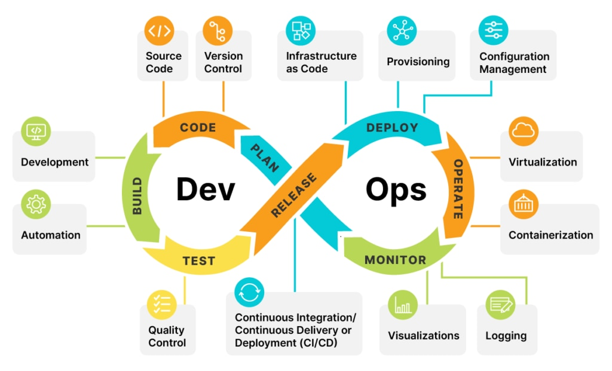

# MLOps

## 목차

1. 서론
2. DevOps가 무엇인가요?
3. 그럼 MLOps는 무엇인가요?
4. ???
5. 결론

## 서론

기업에서 AI를 요즘 도입을 안하는 곳이 없는 것 같습니다. 너도 나도 AI를 도입하려고 하는 추세이며, AI가 주 서비스가 아닌 곳도 AI를 적용하는 곳이 많습니다. AI가 엄청나게 뛰어나다는 것은 부정할 수 없으니까요.

하지만 AI를 도입하여 좋은 성과를 이루어내는 것은 꽤 어려운 일입니다. 어려운 점을 좀 나열하자면, 데이터 품질과 양을 우선 보장해야하고, 매끄러운 모델 관리와 배포 관리, 또 AI 인재들이 많이 없는 점과 가장 큰 문제인 비용이 있을 것 같네요.

AI를 우스갯소리로 돈 먹는 하마라고도 부르는 것도 사실 농담이 아닙니다. 그래서 AI를 도입해서 투자 수익률을 달성하지 못하는 경우가 허다합니다. 실제로 POC 단계에서 끝내는 이유도 투자 수익률을 감당하지 못해서 끝내는 경우도 많은 것 같습니다.

그러면 어떻게 하면 좋은 성과를 이루어 낼 수 있을까요? 그 해답은 아마 MLOps라는 말에 있을 지 모릅니다.

## DevOps

MLOps를 설명하기 전에 용어 자체가 DevOps와 굉장히 유사해보이지 않은가요? 개발자 분들 께서는 DevOps란 용어를 아마 많이 들어보셨을 겁니다. 그리고 DevOps와 MLOps는 이루고자 하는 목표는 크게 다르지 않습니다.

DevOps를 간략하게 설명하자면 development(개발)와 operations(운영)를 합친 용어로써, 개발과 운영을 보다 효과적이게 하는 관행이라고 할 수 있을 것 같습니다. 간단하게는 소프트웨어 개발 및 배포를 매끄럽게 해주는 거라고 생각하면 될 것 같습니다.

CI/CD가 DevOps에서 꽤 대표적이라고 할 수 있는데요, CI/CD는 코드의 통합과 배포를 자동화하여 소프트웨어를 안정적으로 배포하고, 배포 주기를 단축하는 데 큰 역할을 합니다.

DevOps는 개발과 운영을 통합하여 매끄럽게 합니다. 그러면 MLOps는 무엇일까요? MLOps도 마찬가지로 개발과 운영을 매끄럽게 하기 위함도 있고, 다른 이유도 있습니다. 그거는 MLOps를 설명하면서 이야기하고자 합니다.

## MLOps

MLOps는