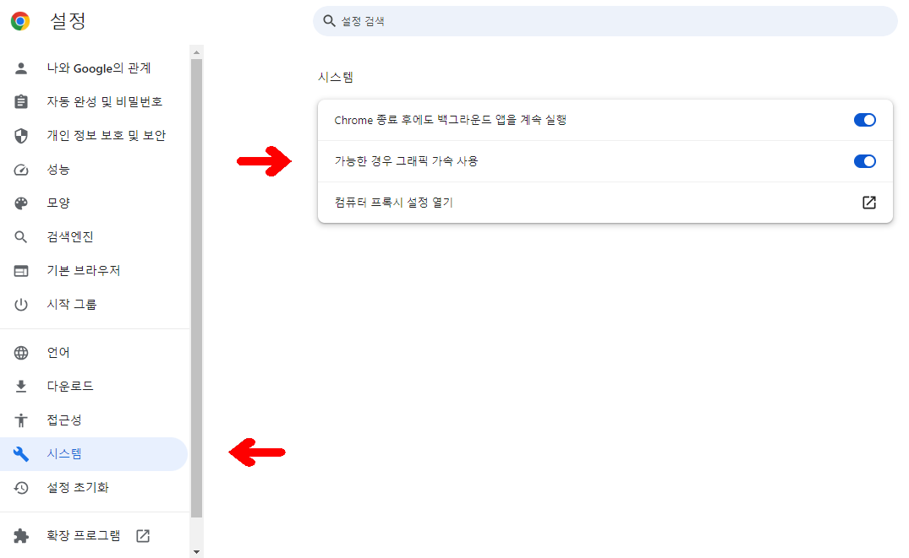

# NVIDIA Video Codec SDK로 PyTorch에서 비디오 처리 가속화하기


최근에 진행한 작업으로 학습에 필요한 비디오 데이터를 전처리하는 프로세스를 가속화하는 작업을 진행했습니다. 주로 모델을 최적화하는 일을 하다가 전체 프로세스를 건드는 일을 하니까 꽤 진이 빠지네요. 비디오 데이터 전처리는 꽤나 비용이 많이 드는 작업입니다.

왜냐하면 동영상을 디코딩해서 Tensor로 추출하고, 추출한 Tensor를 GPU에 보내고, 모델에 넣고 다시 인코딩을 하거나 정보를 뽑거나 하는 일을 해야하거든요. 게다가 1분 영상만 디코딩해도 1초에 25프레임 영상이라고 하면 1500장의 이미지를 작업을 해야합니다.

이번 작업에서 성능을 가장 크게 개선한 주요 Features 중 하나가 하드웨어 트랜스코딩이였습니다. 그래서 이런 주제를 가져와 봤구요, 다른 글에서는 주요 Features 중 다른 하나를 이야기하지 않을까 싶네요.

우선 이 글을 보기 전에 비디오 트랜스코딩에 대한 간단한 지식이 있으면 조금 더 잘 읽히지 않을까? 해서 정말 간략하고 쉽게 비디오 트랜스코딩과 하드웨어 가속에 대해 잠깐 설명허고 넘어가겠습니다.

## 개요


컴퓨터를 다루는 사람이라면 비디오 인코딩이라는 걸 해보신적이 몇 번 있을 것 같습니다. 흔히 옛날에 전자사전에 인강을 넣거나, 옛날 스마트폰에 영화를 넣거나, 심지어는 PSP에 동영상을 넣거나 이런 적이 종종 있었기도 했죠. 그런 기기에 영상을 넣을때 그냥 넣으면 "지원하지 않는 코덱입니다." 이런 오류를 자주 보았던 기억이 나네요. 그래서 곰인코더나 기타 인코딩 프로그램을 설치해서 각 기기에 맞는 코덱을 찾아서 넣고 나서야 영상이 재생되곤 했었습니다. 도대체 왜 이런 번거롭고 귀찮은 과정을 거쳐야 하는 걸까요? 다 이유가 있습니다.

## 인코딩과 디코딩 그리고 트랜스코딩

일단 비디오의 개념부터 알아야합니다. 비디오는 일종의 연속된 이미지를 포함하고 있고 추가적으로 음성이 포함되어 있기도 합니다. 하지만 말 그대로 연속된 이미지를 나열하기만 하면 다음과 같은 현상이 일어납니다.


왼쪽은 200x200 해상도를 가지는 GIF 이미지이고 총 83프레임을 가지고 있습니다. 그리고 1초에 25프레임을 재생합니다. 오른쪽은 mp4이며 똑같이 200x200 해상도를 가지는 mp4 비디오이며 83프레임을 가지고 1초에 25프레임을 재생합니다. 그런데 용량이 무려 6배나 차이나는 걸 확인 할 수 있죠.

왜 이렇게 용량 차이가 큰 걸까요? **GIF는 연속된 프레임에 대한 압축을 할 수 없습니다.** 무식하게 83장의 이미지가 하나의 GIF 파일에 그대로 담겨있는 셈이죠. 반면 MP4와 같은 비디오 형식은 연속된 프레임 간의 압축이 가능합니다. 영상의 움직임이 더 적을수록 압축 효과는 더욱 커집니다. 이처럼 비디오는 연속된 프레임에 대한 효율적인 압축 기술을 사용하며, 이 압축을 하는 게 **인코딩**이라고 합니다.

인코딩(압축)된 비디오를 재생하려면 반드시 압축을 해제해야 합니다. 우리가 비디오 플레이어를 통해 영상을 볼 때, 실제로는 비디오 디코딩 과정이 계속 진행되고 있는 것입니다. 즉, 비디오를 직접 보기 위해서는 반드시 디코딩 과정이 필요합니다.

이때 중요한 점은 압축할 때 사용한 알고리즘과 압축 해제 시 사용하는 알고리즘이 동일해야 한다는 것입니다. 이것이 바로 과거의 기기들이 지원하는 코덱이 제한적이었던 이유입니다. 인코딩과 디코딩 과정은 상당한 연산 능력을 필요로 하기 때문에, 옛날 기기의 하드웨어 성능에 맞는 코덱으로 변환해야 했던 것입니다.

예를 들어서 전자 사전에 mp4(H.264)로 된 인강을 한 10개 정도 넣는다고 생각해봅시다.


해당 전자사전은 2008년 즈음에 나온 누리안 x9이라고 하며 WMV1(WMV7) 코덱으로만 영상 재생이 가능하다고 합니다. 그러면 H.264 디코딩 -> WMV1 인코딩 을 거쳐야겠네요. 이렇게 영상의 코덱을 바꾸는 것이 **트랜스코딩**이라고 합니다.

영상들을 트랜스코딩 할 때 항상 속도가 좀 느렸곤 했었죠. 옛날에는 조금만 인코딩을 해도 예상 시간은 30분 넘기는건 기본이니 말입니다. 그래서 이걸 빠르게 못하나하고 조사를 해보면 항상 나왔던 게 **하드웨어 가속** 이였습니다. 그래서 인코딩 프로그램에서 하드웨어 가속을 키면 기존에 비해 빠르게 프로그래스 바가 채워지곤 했었죠.

그럼 어째서 하드웨어 가속이 더 빠를까요? 또 알아봅시다.

## 하드웨어 가속

하드웨어 가속이란 비디오 뿐만 아니라 다른 곳에서도 많이 사용되는 개념입니다. 아마 제일 많이 사용되는 곳은 여러분이 사용하고 계시는 인터넷 브라우저겠네요.



하드웨어 가속은 흔히 CPU에서 할 일을 GPU나 FPGA와 같은 외부 장치에서 하여 이기종 컴퓨팅을 활용하는 개념입니다. GPU는 렌더링 능력이 매우 뛰어나므로 브라우저에서 렌더링하는 걸 GPU에서 하는 것이죠.


Chorme 뿐만 아니라 Notion, VSCode도 GPU 렌더링을 사용합니다. 비디오에서도 이 GPU를 통해 하드웨어 가속을 실현 할 수 있습니다. 다만 렌더링 기술과는 좀 더 다르게 GPU에는 별도의 디코딩, 인코딩 칩이 내장되어 있고, 그 칩으로 하드웨어 가속을 실현하게 되는 것이죠.

GPU 뿐만 아니라 FPGA에도 디코딩, 인코딩 칩을 구현한 사례도 있습니다. Xilinx가 그 분야에서는 대표적이죠. 또 Mac에는 ProRes 코덱을 디코딩 인코딩하는 하드웨어 가속기도 포함되어 있죠.

설명한 것 보다 디코딩, 인코딩을 위한 칩이 내제되어 있는 디바이스는 더 많지만, 이번에는 주제가 주제인 만큼 제가 직접적으 이득을 본 NVIDIA의 NVDEC, NVENC를 설명하고자 합니다.

## NVIDIA NVDEC, NVENC


NVIDIA GPU를 이용한 비디오 트랜스코딩은 꽤나 역사가 오래되었습니다. 윈도우 95가 출시 되고 나서 가정에 PC가 보급됐던 시절 비디오 미디어의 인기가 매우 치솟았고 시간이 지나면서 HD 동영상에 대한 수요가 나왔었는데, 그 때 당시에는 CPU가 싱글 코어가 전부여서 HD 영상을 부드럽게 재생시키기 힘들었습니다. 마치 지금 시대의 8K 재생을 힘들어 하는 것 같이요.

그래서 이를 커버할 부가적인 하드웨어가 필요했었고, 많은 하드웨어를 찾은 끝에 GPU가 적합하다고 지목되었습니다. 그 다음 부터 GPU 회사들은 열심히 동영상 가속을 위한 개발을 시작했습니다. 그 때 나온 것이 NVIDIA PureVideo 라는 것이였습니다. 해당 기술은 전용 동영상 하드웨어 칩을 사용하여 동영상 트랜스코딩을 가속화하는 것이였죠. 그 후로 부터 HD, FHD, 4K 비디오는 GPU를 통해 매끄럽게 재생이 되었으며, 더 발전되어 오늘날의 NVIDIA Video Codec SDK 까지 발전되어 왔습니다.

현재까지도 최신 NVIDIA GPU에는 이 전용 하드웨어 칩이 내장되어 있고, 그 칩의 이름은 디코딩을 담당하는 NVDEC, 인코딩은 NVENC라는 이름으로 내재되어 있습니다.

NVDEC와 NVENC를 사용하는 방법은 정말 간단합니다. FFmpeg에서 이 NVDEC, NVENC를 정말 쉽게 사용할수 있게 만들어 놨기 때문이죠. 그냥 GPU가 있는 환경에 apt install ffmpeg 만 해도 GPU 트랜스코딩을 사용할 수 있습니다.

```bash
ffmpeg -hwaccel cuda -i input.mp4 -c:v h264_nvenc output.mp4
```

-hwaccel cuda 이 NVDEC를 사용하는 것이고 h264_nvenc 는 h264를 NVENC로 인코딩하겠다는 명령어입니다. 참 간단하죠?

FFmpeg에서도 간단하게 사용할 수 있지만, C나 C++에서는 그냥 SDK를 사용해서 개발할 수 있습니다.

요즘에는 딥러닝 때문에 Python 유저가 많아서 그런지, 최근에 PyNvVideoCodec 라는 라이브러리를 만들어 직접 C++ SDK에 접근할 수 있게 제작도 되있습니다. 이건 따로 테스트를 해보진 않았는데 한번 테스트 해봐야겠네요.

## FFmpeg에서 프레임을 코드로 가져오다.

ffmpeg에는 Python, C, C++에서 subprocess로 구동시켜 디코딩 한 frame을 직접 코드에 가져올 수 있었습니다.  ffmpeg decode만 subprocess로 돌려서 stdout을 가져와 np.frombuffer에 넣어서 numpy array로 가져올 수 있었죠.


3년 전에 Video Super Resolution 프로젝트를 하면서 사용해본 적이 있었죠. numpy array로 가져와서 GPU로 데이터로 옮기는 일련의 과정은 조금 느렸지만, 모델이 훨씬(x10) 느렸기 때문에 크게 문제되는 이슈는 아니였던 기억이 있습니다.

다만 여기서 제가 궁금했던 것은 ffmpeg에서 이미 하드웨어 디코딩을 하고 있는데, 그러면 하드웨어 디코딩해서 나온 Output은 GPU Tensor일 텐데 이걸 바로 가져올 순 없나? 하는 잠깐의 의문이 있었습니다. 왜냐하면 Buffer -> GPU (NVDEC) -> CPU (Numpy) -> GPU (PyTorch)를 거치는 걸 Buffer -> GPU (NVDEC) -> GPU (PyTorch) 로 바꿔서 훨씬 효율적인 데이터 전송을 할 수 있었기 때문이죠. 하지만 해당 프로젝트에서는 이 부분에서는 크게 문제되지 않는 상황이라 덮어놨었습니다.

이게 왜 중요한 사항인지는 옛날에 

그런데 이번에 새로 이직하게 된 곳에서 전담으로 맡은 Task 중에, 비디오 전처리 가속화 작업이 있었습니다. 해당 전처리 파이프라인은 모델은 이미 너무 빠른 상황이였고, 단지 비디오의 디코딩과정이 opencv2로 하고 있었고, 이전에 했던 프로젝트에서 생긴 문제때문에 GPU의 Utils이 0~10%로 놀고 있는 상황이였습니다. 즉 프레임을 모델에 빠르게 못 넣고 있다는 것이였죠. 그러니 모델이 사실상 놀고 있는 것 이였습니다.

이 기점에서 제가 덮어놨던 걸 다시 조사를 했었고, 역시나 저와 비슷한 생각을 하는 사람이 많았고 실제로 해결책이 있었습니다. 저희 회사에서도 많이 사용되는 라이브러리에 있었고 그것은 바로 torchaudio 라이브러리에 있었습니다.

## NVDEC Frame을 PyTorch Tensor로 가지고오다.


## 실제 사례와 벤치마크

## 결론
