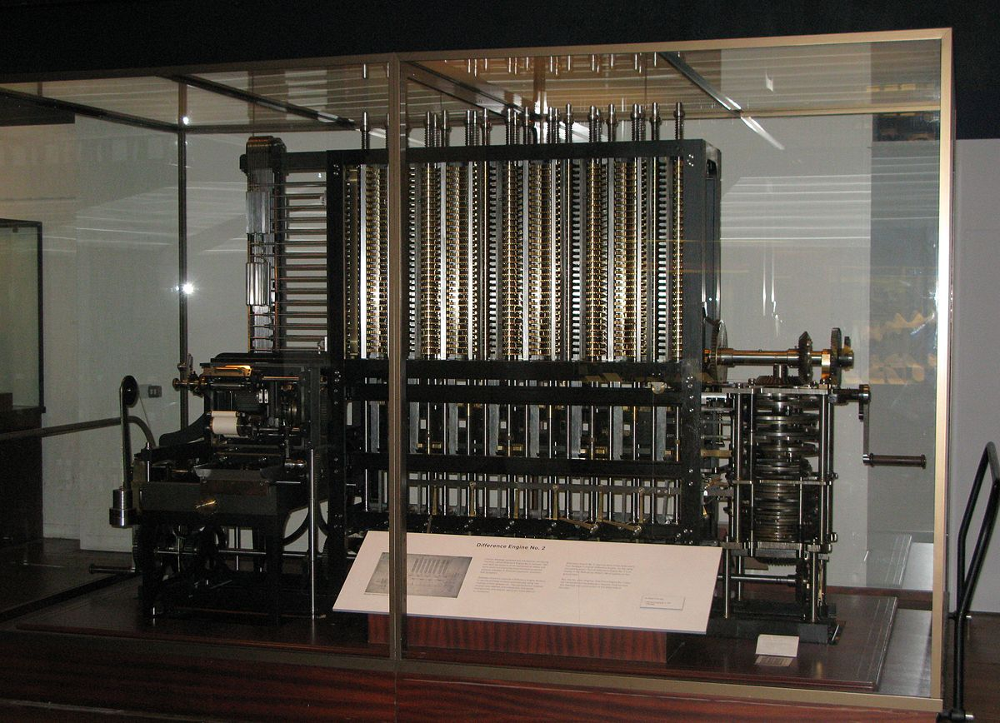
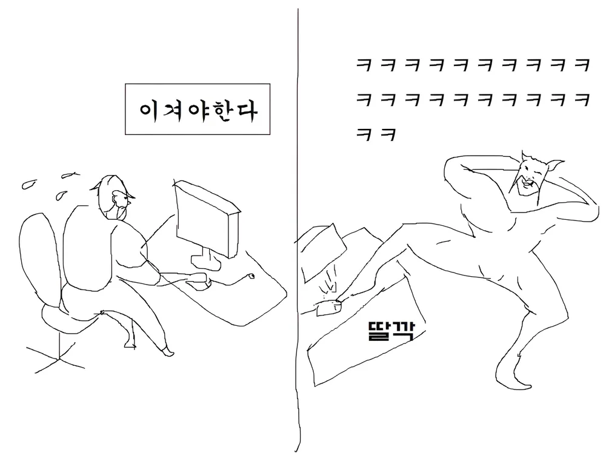
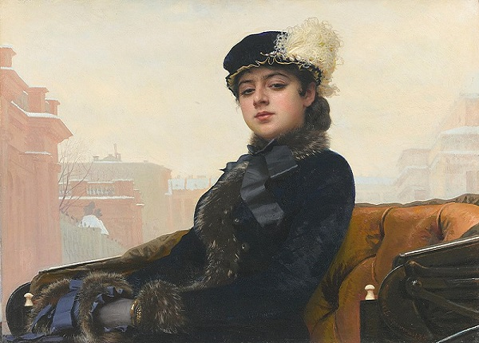
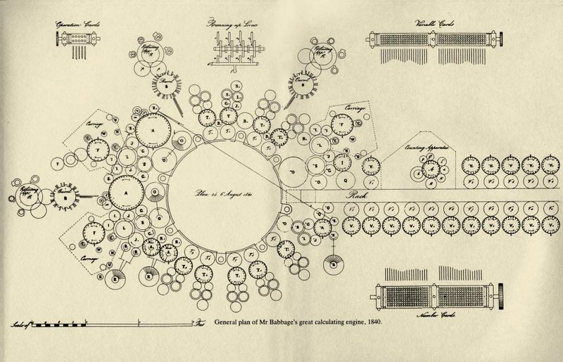
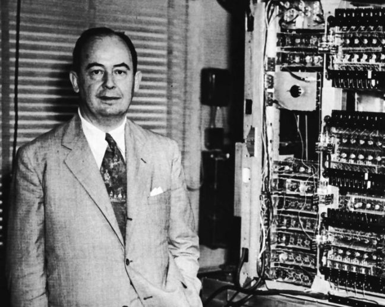
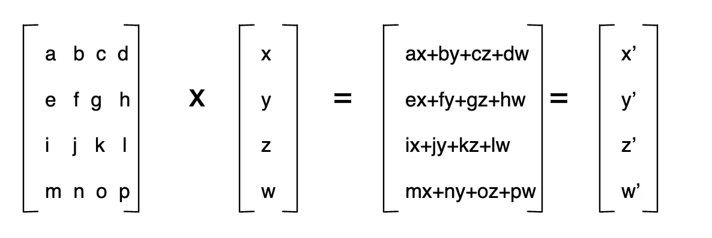
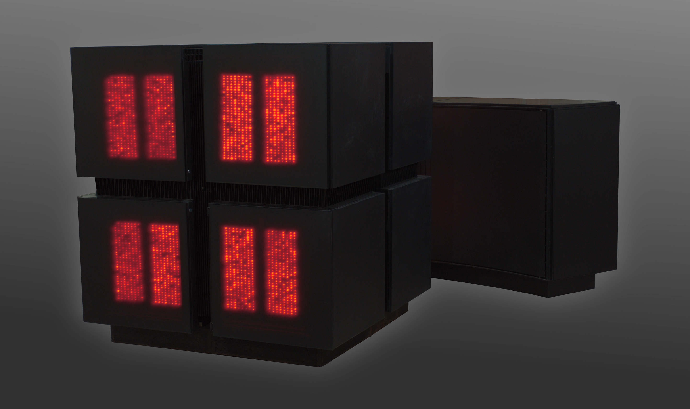
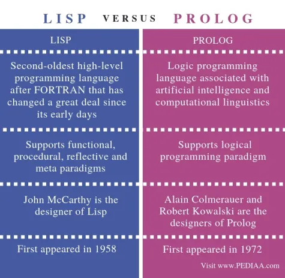
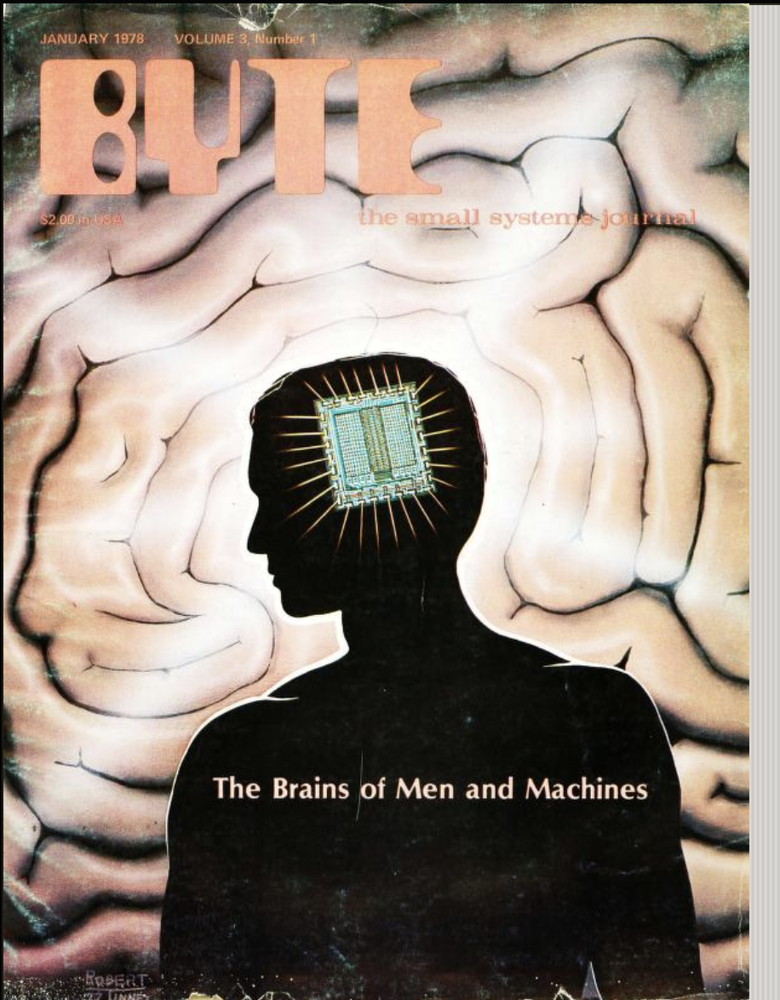

# The Hardware Lottery
: Sara Hooker — August, 2020

이 논문을 처음 알게 된 건 이 논문이 아닌 다른 논문을 보다가 해당 논문을 언급하는 것을 보았고, 해당 논문의 The Hardware Lottery (하드웨어 복권)이라는 아주 짧고 매혹적인 제목에 이끌렸었습니다. 단 한명이 썼다라는 것도 그렇고, 인용 수도 249회로 꽤나 많은 것도 흥미로웠죠.

이 논문은 기존의 재미라곤 없는 논문들과는 다르게 비문학처럼 되어 있는 사설 논문입니다. 그래서 이 논문에는 수식 같은 것과 어려운 학문적 내용도 없습니다. 또 재미있는건 2020년에 나온 논문이지만 이 논문에서 나오는 상황과 현재 상황과 매우 유사하게 흘러가서 덕분에 술술 읽혔고 재밌었으며 스스로도 많은 생각을 하게 만들었습니다.

그래서 혼자만 이 내용을 알기에는 좀 아까워서 이 논문을 소개해 드리고 싶었고, 딱히 AI에만 국한된 내용이 아니여서 더 좋을 것 같다고 생각이 들었습니다.

이 글은 대부분 논문에 나온 내용을 대부분 다루고 있습니다. [해당 링크](https://hardwarelottery.github.io/)에서 논문의 원본을 확인 할 수 있습니다. 원문은 영어로 되어 있을 뿐 어려운 내용은 크게 없고, 읽기 쉽게 작성되기도 하고 사람마다 해석하는게 다를 수 있으므로, 시간이 나신다면 원문을 직접 읽는 것을 적극 추천 드립니다.

## 목차

1. 서론
2. 하드웨어, 소프트웨어, 연구 아이디어의 독자적 발전과 그로 인한 문제
3. 하드웨어 복권
4. 잃어버린 30 ~ 50년
6. 앞으로 나아가야 할 길
7. 마치며

## 서론

하드웨어, 소프트웨어, 연구 아이디어는 서로 다른 목표와 이해관계를 가지고 발전해 왔고 협력의 필요성을 느끼는 시점도 제각각이었습니다.

각자의 목표가 다르다 보니 협력의 필요성이 시기에 따라 달라지고, 때로는 서로를 이해하지 못하거나 연구 방향이 엇갈리는 경우가 많았습니다. 하지만 이는 이상합니다. 현실은 **하드웨어와 소프트웨어가 연구 아이디어의 성공과 실패를 자주 결정해 왔기 때문이죠.**

이 논문에서는 **특정 연구 아이디어가 본질적으로 더 "우수"하기 때문**이 아니라, 단순히 현재 **사용 가능한 하드웨어와 소프트웨어에 적합하기 때문에 성공하는 현상**을 의미하는 **Hardware Lottery** (하드웨어 복권)이라는 현상을 소개합니다. 역사적으로 하드웨어 복권은 연구의 진보를 방해할 수 있습니다. 즉, 성공할 수 있는 아이디어가 실패한 것으로 간주되거나, 주목받는 데까지 오랜 시간이 걸릴 수 있는 것이죠. (간단한 예시로 딥 러닝의 개념은 **1963년 부터 시작했고, 2012년에서야 부상**했습니다.)

그렇다면 왜 이런 오랜 시간이 필요했을까요? 가장 큰 이유는 **하드웨어와 소프트웨어, 연구 아이디어가 서로 엇갈려 발전해 왔기 때문입니다.** 정말로 이게 문제라면, 애초부터 하드웨어, 소프트웨어, 연구 아이디어가 협력하며 발전하는 편이 더 좋지 않았을까요?

하지만 실제로 각 요소가 개별적으로 발전하게 된 이유가 있습니다. 이런 상황을 이해하려면 컴퓨팅의 발전 역사를 먼저 살펴볼 필요가 있습니다.

## 하드웨어, 소프트웨어, 연구 아이디어의 독자적 발전과 그로 인한 문제

과거의 컴퓨터는 **프로그램 그 자체가 기계**였습니다. 당연하게도 현재와 같은 범용 소프트웨어가 존재하지 못했고, 특정 목적에 맞춘 하드웨어가 주류였습니다.

1817년, 찰스 배비지가 다항 함수 계산을 위해 설계한 차분 기관(Difference Engine)은 다항식 계산에만 사용될 수 있었으며, 범용적인 컴퓨터의 기능은 전혀 없었습니다.

이후 무어의 법칙이 등장하면서 상황이 변했습니다. 고든 무어는 집적 회로의 트랜지스터 수가 2년마다 두 배로 늘어날 것이라고 예측했습니다. 실제로 트랜지스터 크기가 작아지면서 전력 소비와 발열이 줄어들어, 성능을 높이면서도 전력 소모가 증가하지 않는 "데나드 스케일링"도 함께 발생했고, 결과적으로 범용 컴퓨터의 성능이 기하급수적으로 향상되었습니다.

이로 인해 **특수 목적 하드웨어를 개발하는 것이 점점 비효율적으로 바뀌었습니다.** 몇 년 동안 열심히 그리고 비싸게 특수 하드웨어를 개발하더라도, *(딸깍)* 나온 최신 범용 하드웨어가 특수 하드웨어보다 더 빠르고 효율적으로 해당 작업을 수행하게 된 것입니다. 결국에는 모든 하드웨어 제조사들은 더 이상 새로운 특수 하드웨어 개발을 하지 않고 범용 하드웨어를 발전시켜나갔죠.

이 변화로 소프트웨어와 알고리즘 개발자들은 특정 하드웨어에 얽매이지 않고, 범용 컴퓨터에서 자유롭게 프로그램과 알고리즘을 개발하게 되었습니다. 개발자와 연구자는 이를 안 좋아할 이유가 없었죠, 개발 및 연구가 훨씬 편하기 때문이니까요. **하드웨어 연구자들은 성능 개선에 집중**하고, **소프트웨어와 알고리즘 개발자들은 주어진 하드웨어에서 최적의 성능과 연구**를 내는 데에만 초점을 맞추게 되었습니다.

이렇게 각자의 역할이 분리된 덕분에 개발이 효율적으로 진행된 면도 있을지 모릅니다.
그러나, 이로 인해 **특정 연구 아이디어가 현재의 하드웨어와 소프트웨어 환경에 따라 성패가 좌우**되는 이른바 **하드웨어 복권**이라는 부작용이 발생하고 말았습니다.

## 하드웨어 복권

안나 카레리나의 법칙을 아시나요? 톨스토이의 소설에서 유래된 이 법칙은 **어떤 요소라도 하나만 부족하면 성공이 아닌 실패로 이어질 수 있다**라는 법칙으로 알려져 있습니다.

역사적으로 컴퓨터 사이언스에서도 이 법칙이 적용되어 왔습니다. 아무리 소프트웨어와 알고리즘이 혁신적이어도, 이를 뒷받침할 하드웨어가 부족하면 성공할 수 없었습니다. 즉 **하드웨어 복권에 당첨되지 못해서 실패한 경우게 생기게 된 것**이죠.

하드웨어 복권의 태초의 사례로는 찰스 배비지가 1837년에 설계한 The Analytical Machine (분석 기계)가 있습니다.

이 기계는 이론적으로 모든 유형의 계산을 프로그래밍할 수 있는 혁신적인 기계였지만, 당시 기술적 한계로 인해 끝내 현실에서 제작되지 못했습니다. 부품이 지나치게 정밀하게 설계되어, 당시의 제조 기술로는 제작이 불가능했기 때문입니다. 마치 오늘날의 블루투스 샤워기를 개발하라는 것과 같은 난이도였을지도 모르죠.

결국, 분석 기계가 가진 저장된 프로그램, 수정 가능한 코드, 메모리, 조건 분기와 같은 개념은 한 세대가 지난 후에서야 적절한 하드웨어와 소프트웨어가 뒷받침되면서 재발견되었습니다. 이는 당시에는 단지 시기상조였던 아이디어가 **어느 정도 도구가 갖춰진 후에야 빛을 발하게 되었음**을 보여줍니다. (개인적으로 아쉬운 점은, 찰스 배비지의 기계가 후세대의 영감에 직접적인 영향을 주지 못했다는 사실입니다. 만약 이 혁신이 좀 더 일찍 알게 되었으면 어땠을까요?)

다음 소개해 드릴 사례는 하드웨어 복권 사례 중 가장 큰 사례라고 할 수 있겠는데, 그것은 바로 딥러닝입니다.

딥러닝은 흔히 역사가 짧은 것으로 많이 알고 계신 분도 있으실 겁니다. 제가 막 취업 했을 당시 5년전에 딥러닝이 막 떠오르는 느낌이였으니까요. 하지만 딥러닝은 결코 역사가 짧진 않습니다. 위에 잠깐 설명하다시피 **짧게는 30년, 길게는 50년도 넘은 개념이였으니까요.**

그러면 왜 오늘날에서야 딥러닝이 오늘날에서야 급부상을 했고, 과거에는 떠오르지 못했을까요? 잃어버린 30 ~ 50년을 탐구해봅시다.

## 잃어버린 30 ~ 50년

범용 컴퓨터 하면 역시 **폰 노이만 구조**가 가장 유명하지 않을까 생각합니다. 사실상 오늘날의 컴퓨터 구조는 거의 모두 폰 노이만 구조를 따르고 있죠. 이 폰 노이만 구조 때문에 소프트웨어라는 개념이 생겼고, 덕분에 하드웨어를 손보는게 아닌 소프트웨어를 손 보면서 프로그램을 개발할 수 있게 되었죠.

이 폰 노이만 구조가 장점만 있는 것은 아니였습니다. 가장 큰 단점이 바로 **폰 노이만 병목**이죠.

폰 노이만 구조는 프로그램과 데이터를 메모리에 저장하고, CPU가 이를 순차적으로 읽어 처리하는 방식입니다. 문제는 메모리와 CPU 간의 데이터 전송 속도 차이로 인해 연산이 지연된다는 점이죠. CPU가 데이터를 기다리느라 제 성능을 발휘하지 못하는 이 현상을 폰 노이만 병목이라고 합니다. 이 폰 노이만 병목은 결국 **커다란 메모리 병목 현상**을 야기합니다. (CPU의 L1, L2, L3 캐시가 폰 노이만 병목을 어느정도 해결해 주고 잇지만, 캐시의 용량이 무제한은 아니죠.)

왜 딥러닝을 이야기 하다가 뜬금없이 폰 노이만 병목에 대해서 얘기를 할까요? 눈치 채신 분도 계실지도 모르겠습니다만, 딥러닝의 아킬레스건은 바로 **메모리 병목**입니다.

쉽게 설명하면 **딥 러닝은 거대한 행렬 곱셈의 무수한 반복**입니다. 일반적으로 행렬은 매우 크고 많아서 행렬 연산을 하는데에 메모리 대역폭이 매우 부족하죠. 더군다나 연산 횟수도 많아서, CPU에서 이를 처리하면 메모리 대역폭도 빠르게 고갈되어 심각한 병목 현상이 생김과 동시에, CPU는 순차적으로 하나씩 연산하는 특성 때문에 속도가 매우 느려집니다.

즉 폰 노이만 구조를 따르는 CPU, 메모리 조합은 **정말로 완벽하게 딥러닝과 맞지 않았다**는 것입니다. (이 역시 괴거에 예상했었고, 제프리 힌턴이 1989년에 "Parallel Models of Associative Memory"라는 제목으로 에세이를 집필했죠. 이 에세이에서는 딥러닝을 위해 순차적인 구조가 아닌 병렬 구조가 필요하다고 주장합니다.)

과거에도 병렬 연산 장치를 만드는 시도를 아예 안한 것은 아닙니다. 과거 1985년에 Connection Machine 이라는 하드웨어가 새로 개발되었고, 범용 CPU를 앞서간 병렬 슈퍼 컴퓨터였습니다. 병렬 컴퓨터는 Connectiom Machine 뿐만 있던 게 아니였습니다. 더 과거인 1970년대에도 GPU라는 개념이 존재했었었죠.

이상하지 않나요? 분명 하드웨어도 준비되었고, 연구도 과거에서 부터 있었던 것 같은데요... 이제 딥러닝은 완벽하게 날아오를 준비가 되어있는 것 같은데 말이죠.

이 역시 **하드웨어 복권의 영향**을 피해가지 못했고, 추가로 새로 소개할 **소프트웨어 복권**이라는 장애물도 있었던 겁니다. "어라, 하드웨어는 준비되었던 게 아닌가요? 이게 왜 하드웨어 복권이 영향이 미친거죠?" 라고 할 수 있습니다.

과거 1990년대의 인공지능 연구는 Prolog와 LISP (괄호가 끔찍하게 많은 걸로 유명한 그 언어입니다.) 같은 논리적 프로그래밍 언어가 주류였습니다. AI 연구자들은 이러한 언어를 통해 인간의 사고 과정을 규칙과 조건문으로 흉내 내는 방식에 집중하고 있었죠. 그렇다면 왜 이런 방식이 주류가 되었을까요?

그 이유는 소프트웨어 개발자들이 범용 컴퓨팅의 급격한 발전에 따라, 병렬 컴퓨팅이 아닌 폰 노이만 구조에 최적화된 프로그래밍 방식에 초점을 맞췄기 때문입니다. 범용 컴퓨터는 점점 더 빠르고 강력해졌지만, 이는 **순차적 연산에 맞춘 프로그래밍을 더욱 강화하는 결과**를 낳았습니다.

결국 대부분의 AI 연구자들은 이런 환경에 맞는 논리적 프로그래밍 언어인 Prolog, LISP와 소프트웨어를 사용할 수밖에 없었고, 자연스럽게 병렬 연산에 맞지 않는 소프트웨어와 연구 생태계가 형성되었습니다.

즉, **과거의 하드웨어 복권으로 인해 AI 연구는 폰 노이만 구조에 의존한 범용 컴퓨팅에 맞춰 발전할 수밖에 없었던 것**입니다.

그럼 **소프트웨어 복권**은 또 뭘까요? Prolog와 LISP는 고수준 언어여서, 연구원과 개발자들이 다루기 비교적 쉬웠습니다. 그리고 연구자들이 현재의 딥러닝과 같은 연결주의 방식의 연구를 하려 해도 비교적 어려운 저수준 언어인 C++을 통해서 개발을 해야했었죠. 개발자 분들은 아시겠지만 병렬 프로그래밍이 얼마나 어려운지 말을 따로 안해도 얼마나 어려운지 다들 아실겁니다. 이런 척박한 소프트웨어 환경에서 드라마틱한 연구가 진척될 거라고는 아무래도 쉽게 생각이 들지 않습니다.

딥러닝을 위해 개발된 소프트웨어를 중심으로 보다 건강한 생태계가 형성되기 시작한 것은 2000년대 였으며, 그 유명한 PyTorch의 근간이 되는 2002년에 **TORCH**가 등장하고 나서였습니다. 이를 통해 연구원들은 쉽게 연결주의 방식의 연구를 할 수 있게 되었고, 2007년에는 NVIDIA GPU를 통해 쉽게 병렬 연산을 작성할 수 있는 **CUDA**가 등장했으며, 최종적으로 2012년에는 분류 문제를 딥러닝으로 GPU와 CUDA를 통해 빠르게 학습하여 기존의 정확도를 1%만 상승시켜도 우승하는 ImageNet 챌린지를 **무려 10% 이상 상승시켜 챌린지를 터트려버린 사건**이 발생했죠.

이렇게 해서 딥러닝이라는 아이디어의 성공은 30년 넘게 걸렸습니다. **위 사례로 특정 아이디어가 우수한 아이디어여도, 소프트웨어, 하드웨어가 준비가 되지 않으면 실패하거나 발견이 엄청 오래걸린다는 것을 알 수 있습니다.**

## 앞으로 나아가야 할 길

저자는 논문에서 이 문제를 해결하기 위한 여러 제시를 제안했습니다.

특히 상업적으로 당장 실현 가능성이 낮은 하드웨어에도 적극적인 투자가 필요하다고 강조합니다. 이를 통해 특정 하드웨어에 연구가 지나치게 매몰되어 발전이 지체되는 것을 방지할 수 있다는 것입니다.

또한, 소프트웨어 측면에서는 다양한 하드웨어에서 알고리즘 성능을 쉽게 비교할 수 있는 **벤치마킹 도구의 부족**을 지적합니다. 또 **특정 하드웨어에 최적화된 소프트웨어 커널들이 이식성을 떨어뜨려 연구 효율성을 저해하고 있다는 문제**도 제기합니다. (이건 NVIDIA가 개발한 Closed 소스 커널들이 생각나네요.)

아울러, 하드웨어가 점점 더 다양화되고 전문화됨에 따라 효율적인 코드를 작성하는 데 전문 기술이 필요하게 되었다고 말합니다. 이로 인해 **일부 하드웨어는 건강한 소프트웨어 생태계를 형성할 가능성**이 있는 반면, **다른 하드웨어들은 발전 속도가 더디고 정체될 위험에 처할 수 있다는 점도 경고**합니다. (이것도 NVIDIA와 그 외의 AI Chip 회사들이 떠오르는군요.)

이 해결책으로는 도메인 중심의 언어(DSL)가 개발되어야 한다고 저자는 주장합니다. 도메인 중심의 언어란 특정 도메인(예: 인공지능, 데이터 분석 등)에 최적화된 프로그래밍 언어로, **여러 하드웨어에서도 코드가 이식 가능하도록 설계된 언어를 의미합니다.**

예를 들어, 인공지능 개발에 특화된 언어가 있다면, 특정 하드웨어에 종속되지 않고 다양한 하드웨어에서도 동일한 코드를 실행할 수 있습니다. 이 언어는 각 하드웨어에 맞는 커널을 자동으로 선택하고, 하드웨어 환경에 따라 매개변수를 **자동 튜닝(Auto-tuning)**하여 최적의 성능을 발휘할 수 있게 만듭니다.

이를 통해 개발자는 구현 세부사항에 신경 쓰지 않고, 알고리즘 개발에 더욱 집중할 수 있게 됩니다. (이를 현재 실현시키려고 하는 것들 중에 유명한 것들이 OpenAI의 Triton과 LLVM 컴파일러가 있겠네요.)

그리고 소프트웨어 업계가 무어의 법칙 시대 동안 소프트웨어 효율성을 간과해 왔습니다. (소위 꿀을 빨았다고 할 수 있죠.) 하드웨어 성능이 꾸준히 향상될 것이라는 기대에 의존해 소프트웨어의 비효율성을 하드웨어가 보완해 줄 것이라 믿어왔었습니다. 이제는 **무어의 법칙과 데나드 스케일링이 적용되지 않는 시대**이며, 요즘은 더 심한 추세죠. 반도체 나노 공정도 슬슬 한계가 오고 있기 때문입니다. 이제 더 이상 트랜지스터를 줄이고 많이 넣기 힘든 상황이죠.

이는 다른 의미로 **최적화로 쉽게 얻을 수 있는 성과가 많다는 것을 의미**합니다. (이건 낮은 비용으로 좋은 성능을 낸 **DeepSeek**가 떠오르는군요.)

## 마치며

만약 과거에 Connection Machine의 프로그래밍이 조금 더 쉽게 개발 할 수 있었더라면? 그 회사가 계속해서 투자를 받을 수 있었다면? TORCH가 조금 더 빨리 나왔다면? NVIDIA가 조금 더 일찍 CUDA를 발표했더라면? 물론 이런 가정도 흥미롭지만, 조금 다른 가정을 지어보는 것은 어떨까요?

**얼마나 많은 획기적인 연구 아이디어가 복권에 당첨되지 못해서 빛을 발하지 못했을까요?** 어쩌면 지금까지 우리가 주목하지 못한 새로운 접근법이 존재할 수도 있지 않을까요?

우리의 뇌는 모든 뉴런을 동시에 쓰지 않고, 필요한 뉴런과 시냅스만 활성화해 학습합니다. 덕분에 에너지를 효율적으로 사용하며, **전기 면도기 수준의 전력**만으로도 복잡한 작업을 수행하죠. 이런 방식은 딥러닝과는 명백히 다르며, 앞으로 비연결주의나 분산형 학습 구조 같은 새로운 연구 방향이 열릴 가능성도 있습니다.

또한, 지금과는 전혀 다른 하드웨어 예를 상상해 볼 수도 있습니다. 아날로그 컴퓨팅, 광학 컴퓨팅, 또는 요즘 주식으로 사람들을 미치게 만드는 양자 컴퓨팅이 새로운 가능성을 열어줄지도 모릅니다.

저자는 이러한 예시들이 현재의 딥러닝이 앞으로 나아갈 길이 아니라는 것을 주장하는 게 아니라고 합니다. 되려 그것이 유일한 길이 아닐 수도 있다는 것을 시사하는 다른 지능 모델이 분명히 있다는 것입니다.

*다음 획기적인 진전은 하드웨어, 소프트웨어 및 알고리즘의 다른 조합으로 세상을 모델링하는 근본적으로 다른 방식을 요구할 가능성이 있습니다.*

**그리고 어쩌면 우리는 지금, 과거보다 거대한 하드웨어 복권의 한가운데에 있을지도 모릅니다.**
