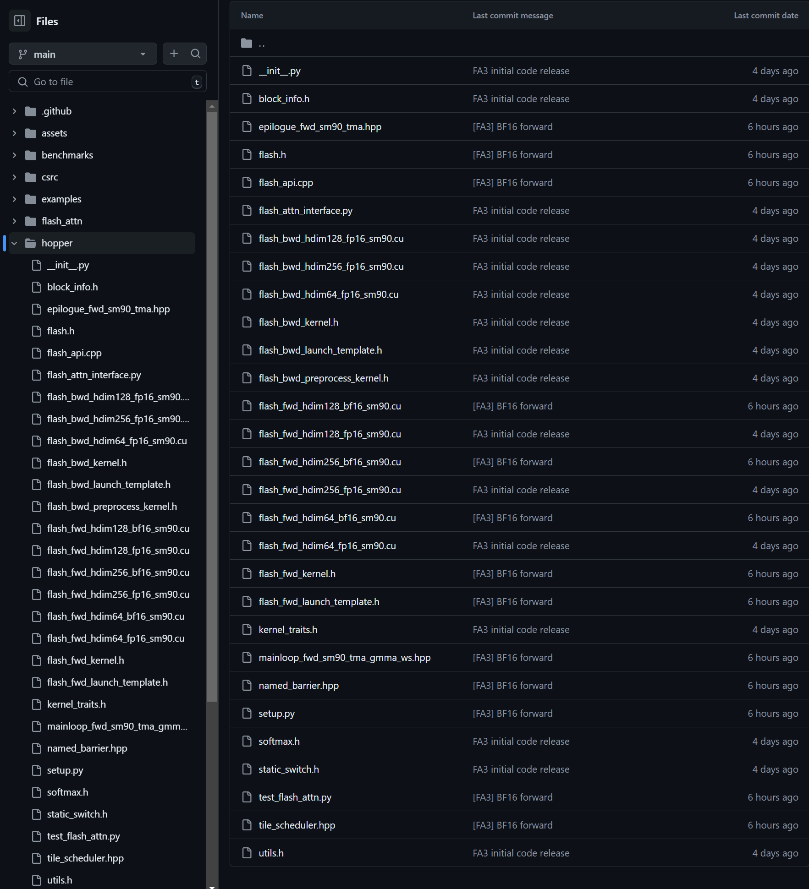
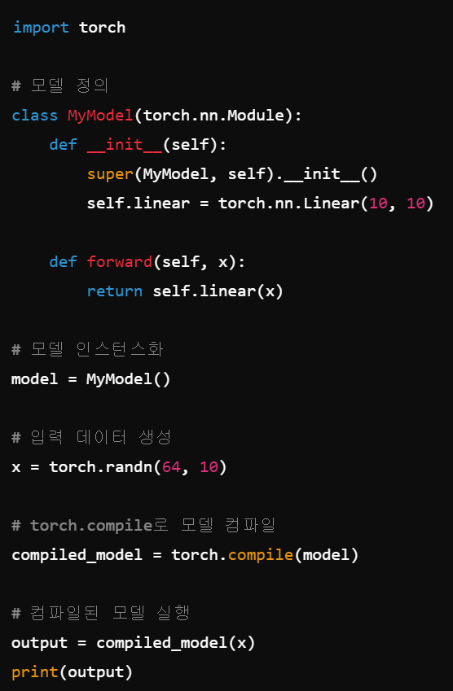
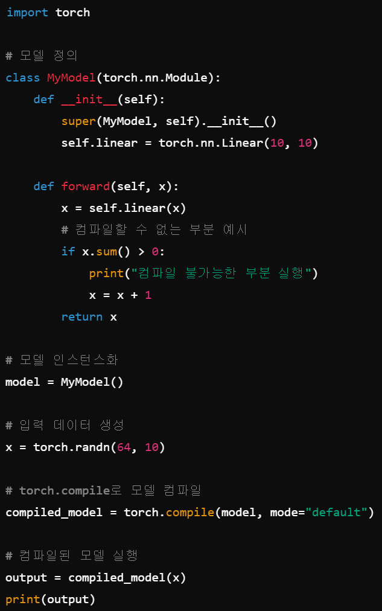

# CUDA야 게섯거라~ OpenAI Triton가 간다!

이전 아티클에서 모델이 점점 커지고 있음과 동시에, 학습도 점점 규모가 커지고 있다고 언급을 한 적이 있었죠. 이러한 흐름에 맞춰서 최적화가 열풍이 끊이지 않고 있습니다. 하지만 최적화는 추론 최적화가 대부분이며 특히 TensorRT, TensorRT-LLM이 추론에서 압도적인 성능을 보입니다. 그러면 학습 최적화는 어떻게 해야할까요?

## 이전에서의 학습 최적화

TensorRT 같은 추론 플랫폼으로 학습하는 건 불가능한가요? 아쉽게도 할 수 없습니다. TensorRT는 애초에 학습에 필요한 역전파(Backpropagation)를 지원하지 않습니다. 그러면 학습 최적화를 어떻게 하면 될까요? 여태까지는 학습을 최적화하기 위해서, CUDA 커널 즉 CUDA 함수를 새로 재작성을 하거나 torch.compile을 통해서 최적화 하기도 했습니다.

다만 여러 문제가 있는데 우선 CUDA를 비롯하여 cuDNN, CUTLASS 라이브러리와 함께 재작성하는 것이 실제로 최고 성능에 다다를 수 있는 최선의 방법이지만, 이것은 매우 매우 매우 난이도가 높은 과정이며, PyTorch나 TensorFlow에서 작성된 CUDA 커널을 뛰어넘는 걸 작성하는 것은 더더욱 어렵습니다. 그래서 일반적으로 많이 사용되는 알고리즘이 CUDA 커널로 최적화 되는 경우가 많습니다. 대표적으로 Transformer 기반의 모델이면 무조건 사용되는 **Attention**이 있겠네요. 다만 ...

위는 최근 공개된 [Flash Attention 3](https://pytorch.org/blog/flashattention-3/#fn:1)의 커널 코드이며, Flash Attention 3는 오직 H100, H800의 GPU에서만 작동이 되게 구현되어 있습니다. 이와 같이 CUDA를 이용한 최적화는 NVIDIA GPU 하드웨어와 소프트웨어를 **정말 매우 많이 깊이** 이해하고 있어야 뛰어난 효과를 볼 수 있습니다. 사실 이런 것을 설계하고 작성할 수 있는 수준이면 아마 연봉은 5억 정도는 기본으로 넘겠죠 ㅋㅋ

CUDA는 너무 어려운 반면, torch.compile은 아주 쉽습니다. torch.compile이라는 것을 이용하여 학습을 최적화를 하는 방법은 PyTorch를 작성하고 있는 석박사님들이 여러 최적화 기법을 많이 넣어놔서 CUDA와는 다르게 정말 손쉽게 최적화를 할 수 있지만, PyTorch 코드를 굉장히 많이 뜯어 고쳐야 하는 과정이 필요합니다.

왜냐하면 torch.compile을 파이썬 코드를 바이트 코드로 바꾸어서, 바이트 코드를 이용하여 컴파일 하기 때문입니다. 즉 파이썬 코드를 굉장히 깔끔하게 작성해야하고, 위처럼 분기 처리가 있는 위와 같은 모델의 경우 최적화가 잘 안될 가능성이 있습니다. 사실 위와 같은 코드는 약간만 고치면 되긴 하지만, 요즘 나오는 모델 코드는 훨씬 어렵게 작성되어 있는 경우가 많아서 이를 반영하기 힘들기도 합니다.

추가적으로 torch.compile이 컴파일 할 수 없는 부분은 인터프리터로 냅두는 것도 가능하지만, 오버헤드가 발생하여 성능 저하가 일어날 수 있습니다. 사실 torch.compile을 사용하는 것 자체는 쉽지만 torch.compile을 사용하기 위해 코드를 뜯어 고치는 것이 많으면 많을 수록 어려워지겠죠.

## 위를 통해서 배운 최적화에 필요한 요소

제가 추론 최적화 업무를 할 때 가장 중요하게 생각하는 것은 노력 대비 얼만큼 가치를 뽑아낼 수 있냐를 항상 중요시하게 생각합니다. 예를 들어서 모델 A가 비용이 달 2억이 나가고, 모델 B가 비용이 달 1억씩 나가는데, 모델 A를 최적화 하는데 한 달 이상이 걸리지만, 모델 B는 한 주에 끝날 만큼 쉬우면 당연히 모델 B 먼저 하고, 모델 A는 부분적으로 최적화를 진행하겠죠.

만약 제가 CUDA 커널을 작성해서 극적으로 최적화를 할 수 있겠지만, 그게 3개월 이상이 걸린다고 하면 어떨까요? 정말 높은 확률로 2개월 안에 어느 누군가가 더 좋은 퍼포먼스를 내는 커널을 만들고 Github에 올라올겁니다. 실제로 TensorRT C++로 Swin Transformer 기반의 모델을 재작성 하는데 1개월이 걸린 작업이 그 후 몇 일 만에 TensorRT가 공식적으로 Swin Transformer안에 있는 Layer를 지원하면서 성능 차이가 많이 났던 것을 보고 현타를 겪은 적도 있었습니다.

