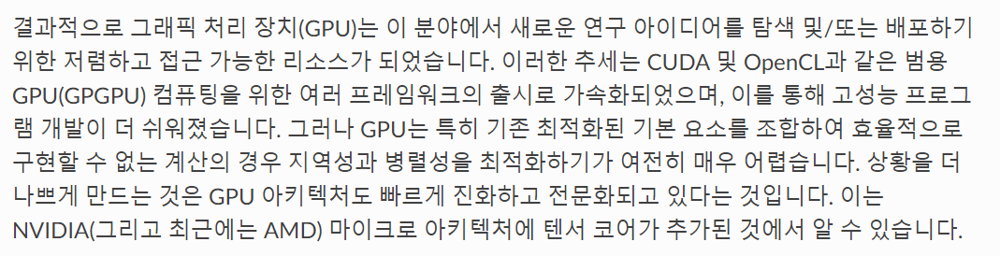
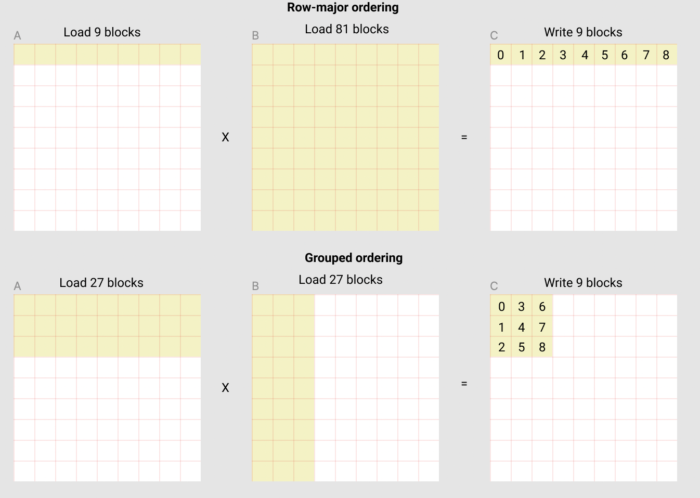

# CUDA야 게섯거라~ OpenAI Triton가 간다!

이전 아티클에서 모델이 점점 커지고 있음과 동시에, 학습도 점점 규모가 커지고 있다고 언급을 한 적이 있었죠. 이러한 흐름에 맞춰서 최적화가 열풍이 끊이지 않고 있습니다. 하지만 최적화는 추론 최적화가 대부분이며 특히 TensorRT, TensorRT-LLM이 추론에서 압도적인 성능을 보입니다. 그러면 학습 최적화는 어떻게 해야할까요?

## 이전에서의 학습 최적화

TensorRT 같은 추론 플랫폼으로 학습하는 건 불가능한가요? 아쉽게도 할 수 없습니다. TensorRT는 애초에 학습에 필요한 역전파(Backpropagation)를 지원하지 않습니다. 그러면 학습 최적화를 어떻게 하면 될까요? 여태까지는 학습을 최적화하기 위해서, CUDA 커널 즉 CUDA 함수를 새로 재작성을 하거나 torch.compile을 통해서 최적화 하기도 했습니다.

다만 여러 문제가 있는데 우선 CUDA를 비롯하여 cuDNN, CUTLASS 라이브러리와 함께 재작성하는 것이 실제로 최고 성능에 다다를 수 있는 최선의 방법이지만, 이것은 매우 매우 매우 난이도가 높은 과정이며, PyTorch나 TensorFlow에서 작성된 CUDA 커널을 뛰어넘는 걸 작성하는 것은 더더욱 어렵습니다. 그래서 일반적으로 많이 사용되는 알고리즘이 CUDA 커널로 최적화 되는 경우가 많습니다. 대표적으로 Transformer 기반의 모델이면 무조건 사용되는 **Attention**이 있겠네요. 다만 ...

위는 최근 공개된 [Flash Attention 3](https://pytorch.org/blog/flashattention-3/#fn:1)의 커널 코드이며, Flash Attention 3는 오직 H100, H800의 GPU에서만 작동이 되게 구현되어 있습니다. 이와 같이 CUDA를 이용한 최적화는 NVIDIA GPU 하드웨어와 소프트웨어를 **정말 매우 많이 깊이** 이해하고 있어야 뛰어난 효과를 볼 수 있습니다. 사실 이런 것을 설계하고 작성할 수 있는 수준이면 아마 연봉은 5억 정도는 기본으로 넘겠죠 ㅋㅋ

CUDA는 너무 어려운 반면, torch.compile은 이론적으로는 아주 쉽습니다. torch.compile이라는 것을 이용하여 학습을 최적화를 하는 방법은 PyTorch를 작성하고 있는 석박사님들이 여러 최적화 기법을 많이 넣어놔서 CUDA와는 다르게 정말 손쉽게 최적화를 할 수 있지만, PyTorch 코드를 굉장히 많이 뜯어 고쳐야 하는 과정이 필요합니다.

왜냐하면 torch.compile을 파이썬 코드를 바이트 코드로 바꾸어서, 바이트 코드를 이용하여 컴파일 하기 때문입니다. 즉 파이썬 코드를 굉장히 깔끔하게 작성해야하고, 위처럼 분기 처리가 있는 위와 같은 모델의 경우 최적화가 잘 안될 가능성이 있습니다. 사실 위와 같은 코드는 약간만 고치면 되긴 하지만, 요즘 나오는 모델 코드는 훨씬 어렵게 작성되어 있는 경우가 많아서 이를 반영하기 힘든 상황이 많습니다.

(추가적으로 torch.compile이 컴파일 할 수 없는 부분은 인터프리터로 냅두는 것도 가능하지만, 오버헤드가 발생하여 성능 저하가 일어날 수 있습니다. 사실 torch.compile을 사용하는 것 자체는 쉽지만 torch.compile을 사용하기 위해 코드를 뜯어 고치는 것이 많으면 많을 수록 어려워지겠죠.)

## 위를 통해서 배운 최적화에 필요한 요소

제가 추론 최적화 업무를 할 때 가장 중요하게 생각하는 것은 노력 대비 얼만큼 가치를 뽑아낼 수 있냐를 항상 중요시하게 생각합니다. 예를 들어서 모델 A가 비용이 달 2억이 나가고, 모델 B가 비용이 달 1억씩 나가는데, 모델 A를 최적화 하는데 한 달 이상이 걸리지만, 모델 B는 한 주에 끝날 만큼 쉬우면 모델 A가 비싸도 우선 모델 B 먼저 하고, 모델 A는 부분적으로 최적화를 진행하겠죠.

만약 제가 CUDA 커널을 작성해서 극적으로 최적화를 할 수 있겠지만, 그게 3개월 이상이 걸린다고 하면 어떨까요? 정말 높은 확률로 2개월 안에 어느 누군가가 더 좋은 퍼포먼스를 내는 커널을 만들고 Github에 올라올겁니다. 실제로 TensorRT C++로 Swin Transformer 기반의 모델을 재작성 하는데 1개월이 걸린 작업이 그 후 몇 일 만에 TensorRT가 공식적으로 Swin Transformer안에 있는 Layer를 지원하면서 성능 차이가 많이 났던 것을 보고 현타를 겪은 적도 있었습니다.

이렇게 최적화는 내 스스로 얼마나 해당 일을 할당하여 얼만큼 Value를 뽑아낼 수 있는지 늘 재고 프로젝트에 투입하는 게 좋은 것 같습니다. 아마 최적화 뿐만 아니라 모든 일들에 해당하는 말일 겁니다.

그래서 항상 시간 대비 효율을 중요시 하게 생각해야하고, CUDA 작성이나 torch.compile은 이와는 조금 멀리 떨어져 있을 지 모르겠습니다. 그러면 OpenAI Triton이라는 걸 써보면 어떨까요? OpenAI Triton은 이에 적합한 것일까요? 한번 확인해봅시다.

## 기존 CUDA의 단점

그 OpenAI에서 조차도 CUDA에 대해서 매우 어렵다고 주장하고 있습니다. 그 이유는 CUDA는 GPU에 맞게 성능을 개발자가 직접 튜닝해야하는 부분이 있는데, 새로운 GPU 나옴에 따라 매번 튜닝을 개발자기 직접해야한다는 단점이 있기 때문입니다. 심지어 Tensor Cores와 같은 독특한 아키텍처가 등장함에 따라 이러한 점도 반영해야 하는 것도 매우 어렵다고 합니다. CUDA가 처음 나왔을 때는 그래픽 API를 사용하는 것보다 훨씬 혁신 일정도로 쉬웠다고 하였지만, 위와 같은 이유 때문에 점점 어려워지고 있는 것이 현실입니다.

GPU 프로그래밍 개발자들이 위와 같은 이유 때문에 논리나 알고리즘을 개발하기 보다는 오히려 GPU 아키텍처에 최적화 되게끔 시간을 쏟는 것이 거의 99% 이상 시간을 할애하고 있는 것이 현실입니다. 당장 [TensorRT-LLM 페이지에 구현되어 있는 Flash attention v2 커널](https://github.com/NVIDIA/TensorRT-LLM/tree/main/cpp/tensorrt_llm/kernels/contextFusedMultiHeadAttention/cubin)만 해도 단 한개의 알고리즘인데도 불구하고 무수한 커널들이 개발되어 있는 것을 볼 수 있습니다. 정말 끔찍하죠.

또 부수적인 이유는 GPU의 CUDA는 오직 NVIDIA에만 종속되어 있어, 다른 GPU가 발전할 수 있는 환경이 저해되고 있는 것도 사실이죠.

OpenAI는 이러한 점들을 해결하고자 하였고, 그래서 나온 것이 OpenAI Triton 입니다.

## OpenAI Triton

OpenAI Triton는 일반적으로 가장 많이 할애를 하는 부분을 자동화하는 것을 목표로 하였습니다. 이를 통해 GPU 아키텍쳐를 고려하지 않고 오로지 연구원들이 로직에만 신경 써서 구현 할 수 있는 것이죠. 어떻게 자동적으로 찾는 것인가? 에 대한건 굳이 여기서는 다루지 않겠습니다. 궁금하시면 [해당 페이지](https://triton-lang.org/main/programming-guide/chapter-1/introduction.html)에서 참고하시면 될 것 같습니다.

핵심적인 것은 GPU 아키텍처를 고려해서 프로그래밍 하지 않아도 된다가 핵심이라고 보면 될 것 같습니다.

이를 통해 Triton 단 25줄로 행렬 곱 연산을 구현 할 수 있다고 합니다. 물론 CUDA도 행렬 곱 쯤은 굉장히 짧게 구현할 수 있는 것은 사실입니다. 다만 GPU 아키텍쳐를 고려해서 작성하면 굉장히 길어지죠. 단적인 예시로 [해당 CUDA 코드](https://github.com/openai/blocksparse/blob/master/src/matmul_op_gpu.cu)를 보면 무려 373줄에 육박하는 것을 볼 수 있죠.

물론 Triton도 훨씬 더 좋은 최적화를 위해서 연구원의 개입도 허용합니다. GPU에서 SRAM 기반의 L2 Cache를 사용하여 INPUT Matrix Block을 작게 가져가는 기술도 사용할 수 있습니다. 위에서는 90 blocks을 가져가서 L2 Cache를 활용 못해 오버헤드가 발생되는 것을, 아래처럼 계산하여 54 Blocks을 가져가고 나서 L2 Cache를 사용할 수 있어 A100과 같은 하드웨어에서의 성능향상이 일어났다고 합니다. 이에 대한 자세한 내용은 [해당 페이지](https://triton-lang.org/main/getting-started/tutorials/03-matrix-multiplication.html)와 [논문](https://www.eecs.harvard.edu/~htk/publication/2019-mapl-tillet-kung-cox.pdf)에서 확인 할 수 있습니다.

## Triton이 요즘 어떻게 사용되고 있나?

사실 Triton이 처음 나왔을 때는 그렇게 많은 오픈소스에 활용되는 것은 아니였습니다. 애초에 검증이 덜 되기도 한 것을 쓰고, 자동적으로 최적화를 해준다고 했지만, 이에 대한 버그나 성능 감소도 있었던 편입니다. 하지만 Triton이 시간이 지남에 따라 버전이 업데이트가 되고, OpenAI 측에서 많은 구현을 Triton으로 구현한 것에 대한 예제 코드가 나옴에 따라서 오픈소스에 많이 채용되고 있습니다.

대표적으로 Unsloth 프로젝트가 있습니다. 요즘 LLM 학습 도구 중에서 매우 빨라서 요즘 굉장히 핫한 오픈소스 프로젝트입니다. 해당 리파지토리에 보면 놀랍게도 CUDA kernel이 하나도 없습니다! 스크린샷만 봐도 Languages에 100% Python으로 되어 있는 것을 볼 수 있습니다. 그리고 모든 재구현된 커널은 Triton을 통해서 구현되었다고 합니다. 또한 backward에 해당하는 부분도 모두 triton으로 구현하였죠. 나머지 원래 매우 빠른 구현 같은 경우는 (예를 들어, [scaled_dot_product_attention](https://pytorch.org/docs/stable/generated/torch.nn.functional.scaled_dot_product_attention.html)) 적극적으로 사용되고 있는 것을 확인 할 수 있었습니다.

또 Transformer를 대체하는 Mamba 모델에서도 핵심적인 알고리즘인 Selective Scan 알고리즘과 LayerNorm을 CUDA Kernel에서 Triton으로 재구현하여 훨씬 짧고 동등한 성능을 구현한 바가 있죠.

이렇게 많은 프로젝트들이 학습할 때 필요한 알고리즘들을 Triton으로 구현을 많이 하고 있습니다. Triton으로 알고리즘을 빠르게 검증함과 동시에 빠르게 학습할 수 있는 것이죠. CUDA를 사용하려면 많은 시간을 할애해야 하는데, 이 할애하는 시간을 알고리즘으로 하지 않기 때문에 CUDA를 쉽게 사용할 수 없었던 겁니다.

그렇다고 Torch로 구현한다고 하면 빠르게 구현 할 수 있으나, 전반적으로 느리다는 단점이 있는데, 이러한 단점들을 해결해 준 것이죠.

## 결론

OpenAI Triton이 어떠한 이유로 나왔고, CUDA가 이전에 어떤 문제를 가지고 있는지, 이 문제를 어떻게 해결을 했는지, 또 어떻게 발전해가고 있는지에 대해 알아보았습니다.

Triton은 많은 장점들을 가지고 있고 포텐셜이 강력하지만, 아직 발전해야할 것들이 많이 남아있다고 생각합니다. 옛날보다는 많이 나아졌지만 아직까지도 Triton이 많이 구현이 되있지 않다는 점과 더불어, 커뮤니티 활성화가 아직은 크지 않은 것 같습니다.

그래도 요즘 많은 오픈소스 프로젝트에서 채택이 아주 빠르게 많이 되고 있으므로 이러한 점들은 더더욱 좋아질 것이라 생각합니다.

사실 GPU 프로그래밍 자체가 워낙 어려워서 OpenAI Triton도 러닝 커브가 꽤 어려운 편에 속합니다. 하지만 보다 쉽게 사용할 수 있다는 것은 앞으로의 GPU 프로그래밍 발전에 대해서 긍정적인 신호탄이라고 생각합니다.
