ChatGPT는 현재 어떤 분야에 있는 사람이든 한 번쯤은 들어보거나 직접 사용해보았을 것입니다. 요즘은 AI라고 하면 가장 먼저 떠올릴 만큼 대명사로 자리잡은 것으로 보입니다. 그만큼 AI에 대해서 사람들이 이제는 피부로 느껴질 만큼 일상생활에 영향을 주고 있습니다.

저 역시 작년부터 꾸준히 사용해오고 있는 사용자로서, 무엇보다 놀라운 점은 ChatGPT가 저의 개발 스타일에도 큰 변화를 준 것입니다. 써보신 분들이라면 공감할 수 있겠지만, 구글링한다거나 스택 오버플로우에 접속하는 시간이 매우 적어졌습니다. 내가 원하는 것을 말로 표현하면, (심지어 추상적으로 간단히만 표현해도) 그에 맞게 적절히 정리해주고 답변을 주기 때문에 시간이 많이 단축되고 효율적이었습니다.

더 놀라운 점은 최근입니다. 1년 사이 ChatGPT는 더욱 빠르게 진화하였습니다. 2023년 3월에 출시한 ChatGPT 4를 사용할 수 있는 유료 구독 서비스를 대략 3개월 정도 사용했었는데, 이는 텍스트만 할 수 있었고 똑똑함에 놀랄 정도였습니다. 1년이 지난 현재는  텍스트뿐 아니라 이미지, 파일 등 ‘[멀티모달(Multi Modal)](https://en.wikipedia.org/wiki/Multimodality)’이라는 여러 입력 형태를 받아들이고, 출력할 수 있게 되었습니다. 그리고 Plugin이나 GPTs처럼 기존에 문제가 되었던 부분이나 아쉬웠던 부분을 보충하고 더욱 사용성을 크게 올렸습니다. 이가 불과 1년 사이에 일어난 일이었습니다.

이러한 과정을 몸소 겪어보니, ChatGPT에 대해서 더욱 잘 활용을 해야겠다고 느꼈습니다. 그리고 그게 경쟁력이라고 생각하게 되었고, ChatGPT뿐 아니라 하루가 다르게 변화하고 생겨나는 여러 AI 관련 서비스에 대해서도 꾸준히 관심을 가지려고 합니다.

이 글은 ChatGPT가 어떤 것인지, 어떤 기능이 있고 어떻게 하면 잘 활용할 수 있을지에 대해 작성하였습니다.

> 이 글에서 2024년 2월에 작성하였고 이 글에서 ChatGPT의 답변은 같은 질문이라도 생성형 AI 특성상 다르게 답변할 수 있습니다.


# ChatGPT란?

2022년 11월 30일 [OpenAI](https://openai.com/)에서 ChatGPT(GPT-3.5)를 개발하여 출시하였습니다.

> OpenAI는 인공지능(AI) 연구와 개발에 중점을 둔 비영리 조직으로, 2015년에 설립되었습니다. 이 기관의 목표는 안전하고 이로운 AI를 기발하여 인류에게 혜택을 제공하는 것이었습니다. 샘 알트먼과 일론 머스크 등과 같은 유명 인사들이 공동 설립 및 초기 투자를 하였습니다. 현재는 마이크로소프트에서 큰 투자를 받고 계약 관계에 있습니다.

그리고 다음해인 2023년 3월 14일에 GPT-4 기반인 ChatGPT Plus라는 유로 구독 서비스가 출시되었고, 이를 사용할 수 있게 되었습니다.

그러면 ChatGPT는 무엇일까요? 먼저 GPT-4 기반인 ChatGPT4한테 직접 물어보겠습니다.

```
질문) chatGPT에 대해서 누구나 알아들을 수 있는 수준으로 설명해줘.
```

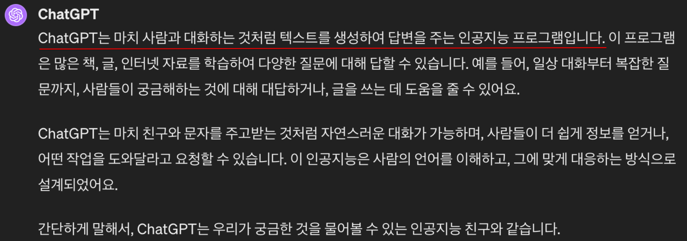

“마치 사람과 대화하는 것처럼 텍스트를 생성하여 답변을 주는 인공지능 프로그램”

- ‘마치 사람과 대화하는 것처럼’ → Chat
- ‘텍스트를 생성하여 답변을 주는 인공지능’ → GPT

이와 같이 ChatGPT의 핵심에 대해 잘 설명해주고 있습니다.

‘Chat’은 의미 그대로 채팅을 치는 것과 같이 ‘대화’를 한다고 쉽게 이해할 수 있습니다. 그러면 ‘GPT’는 무엇일까요?

> **GPT**(Generative pre-trained transformer)는 미국의 [인공지능](https://ko.wikipedia.org/wiki/%EC%9D%B8%EA%B3%B5%EC%A7%80%EB%8A%A5) 단체 [오픈AI](https://ko.wikipedia.org/wiki/%EC%98%A4%ED%94%88AI)가 2018년 선보인 [대형 언어 모델](https://ko.wikipedia.org/wiki/%EB%8C%80%ED%98%95_%EC%96%B8%EC%96%B4_%EB%AA%A8%EB%8D%B8)(LLM)의 계열이며 GPT 모델들은 레이블링되지 않은 대량의 텍스트 데이터셋으로 미리 훈련되고 인간과 같은 문자를 생성할 수 있는 [변환기](https://ko.wikipedia.org/wiki/%EB%B3%80%ED%99%98%EA%B8%B0_(%EA%B8%B0%EA%B3%84_%ED%95%99%EC%8A%B5)) 아키텍처에 기반한 [인공 신경망](https://ko.wikipedia.org/wiki/%EC%9D%B8%EA%B3%B5_%EC%8B%A0%EA%B2%BD%EB%A7%9D)이다. 2023년 기준으로, 대부분의 LLM은 이러한 특징을 지니고 있으며 종종 GPT로 통칭한다. - 위키백과 -

위키백과를 보면 위와 같이 설명을 하고 있습니다. 알아듣기 힘든 전문 용어가 많아서 사실 이런 용어에 익숙하지 않은 저와 같은 사람은 이해하려면 시간이 오래 걸립니다.

다시, ChatGPT에게 물어보겠습니다.

```
질문) GPT에 대해서 누구나 알아들을 수 있는 수준으로 설명해줘.
```

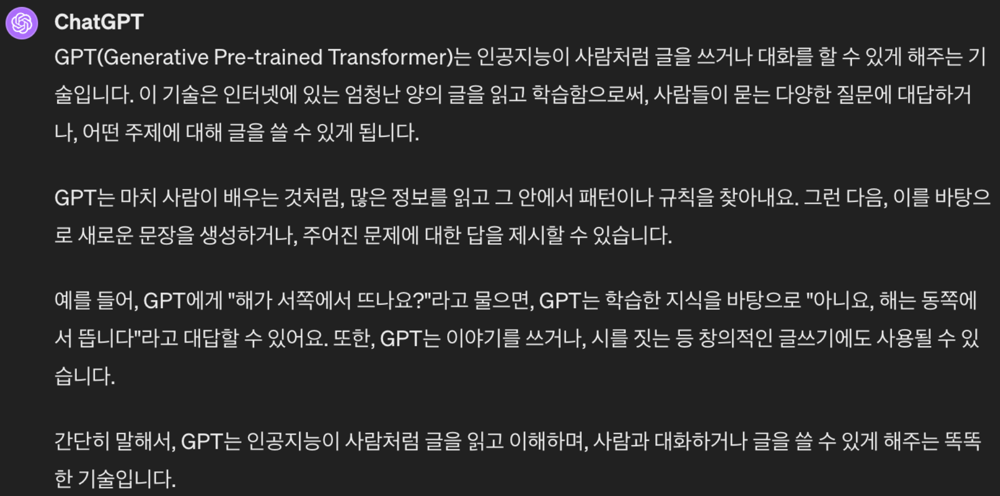

어떠한 전문 용어도 쓰지 않고, 쉬운 예제를 바탕으로 이해하기 쉽게 설명하는 모습을 볼 수 있습니다. 여기서 GPT는 “사람처럼 글을 읽고 이해”하는 기술(알고리즘)이라고 요약할 수 있습니다. 이와 같이 컴퓨터가 글 즉, 언어를 이해하고 처리하는 것을 **자연어 처리 알고리즘**이라고 합니다.

## 자연어 처리(Natural Language Processing, NLP) 알고리즘

여기서 ‘자연어’란, 우리가 일상생활에서 사용하는 언어를 말합니다. 자연어 처리는 자연어의 의미를 컴퓨터가 분석하고 처리하는 기술입니다. 컴퓨터가 어떻게 언어를 처리할 수 있을까요? 사실 컴퓨터는 0과 1만 처리할 수 있습니다. 따라서 언어 역시 이러한 0과 1로 ‘수치화’를 해야 합니다. 이를 **임베딩(Embedding)**이라고 부릅니다.

### 임베딩

임베딩은 단어를 수치로 표현하는 방법(기술)을 말합니다. 예를 들어, 아래와 같은 문장이 있다고 가정해 봅시다.

> 그와 그녀는 함께 파스타를 먹고 커피를 마시러 갔다.

여기서 명사만 뽑아보면, ‘그’, ‘그녀’, ‘파스타’, ‘커피’가 있을 수 있습니다. 이를 카테고리화를 한다고 하면 성별과 음식이라고 나눌 수 있습니다. (물론, 더 좋은 카테고리를 설정할 수도 있습니다.) 이러한 카테고리와 매칭하여 점수를 매기면 다음과 같습니다.

| 카테고리 / 단어 | 그   | 그녀  | 파스타 | 커피  |
|---------|-----|-----|------|-----|
| 성별     | 0.97 | 0.98 | -0.88 | -0.42 |
| 음식     | -0.87 | -0.91 | 0.95 | 0.86 |


숫자가 클수록 해당 카테고리에 가깝다는 의미이고, 음수이면 거의 상관관계가 없다고 말할 수 있습니다. 이렇게 단어를 수치로 표현하는 것 자체는 **벡터(Vector)**라고 합니다. 사실, 임베딩은 벡터화하는 기술을 의미하며 여러가지 임베딩 기술이 존재합니다.

좀 더 용어를 살펴봅시다. ‘그’, ‘그녀’와 같은 단어를 토큰(Token)이라고 하며, 위 문장에서 이러한 토큰을 추출하는 것을 토큰화(Tokenization)이라고 합니다. 토큰은 일반적인 단어일 수도 있고, 형태소(morphome, 의미를 가진 가장 작은 말의 단위)일 수도 있습니다.

### GPT, BERT

자연어 처리 알고리즘은 위에서 살펴본 임베딩을 적용하여 자연어 처리를 수행합니다. 자연어 처리 알고리즘은 여러 현재까지 발전해오면서 여러가지가 존재하지만, 개인적으로 아래와 같이 표현할 수 있을 것입니다.

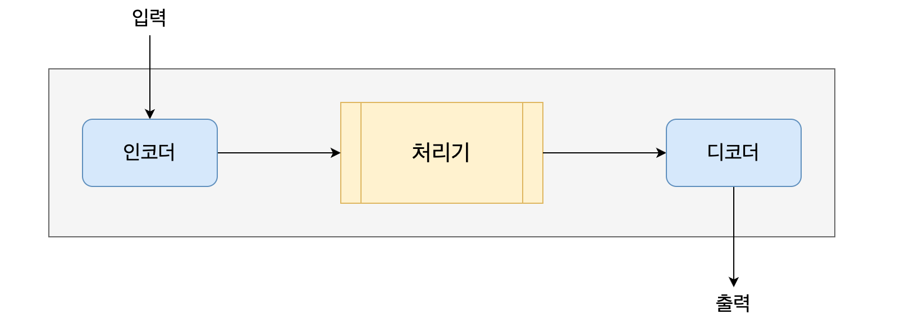

- 인코딩: 컴퓨터에서 문자나 기호를 컴퓨터가 이해할 수 있는 코드(0,1)로 변환하는 과정
- 디코딩: 인코딩된 데이터를 원래의 데이터로 변환하는 과정

인코딩 과정에서 임베딩으로 처리기(모델, 컨텍스트 등 벡터화된 결과를 처리 및 분석하는 역할)에서 이해할 수 있는 데이터로 변환한 후, 처리기는 이를 처리하고 디코딩 과정을 통해 사람이 이해할 수 있는 데이터로 변환합니다. 자연어 처리 알고리즘에서는 처리기로 어떤 것을 사용하는지나 아니면 처리기 없이 디코더만 있다거나(Transformer 형태) 하는 형태에 따라 다양한 알고리즘으로 나뉘고 있습니다.

아래 그림은 자연어 처리 관련 모델이 발전한 타임라인입니다.

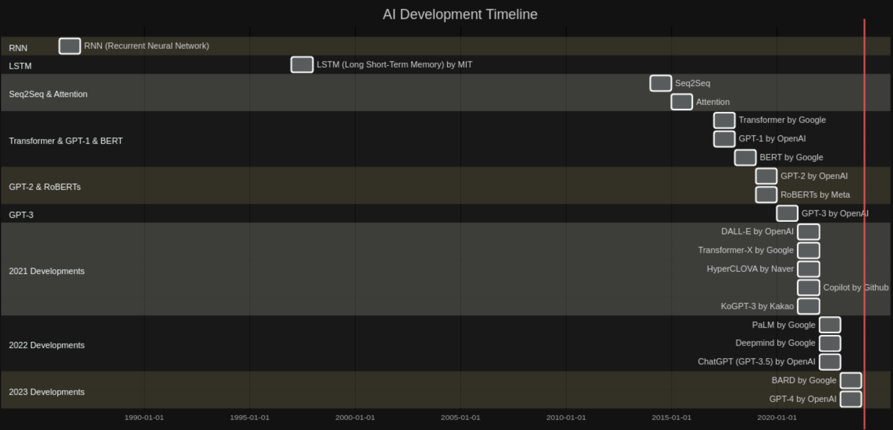

> 참고로 위 그래프는 GPTs 중 Diagram Genius 로 만들었습니다.

- **1986년**: RNN (순환신경망)이 소개되었습니다.
- **1997년**: LSTM (순환신경망 장단기 기억, Long Short-Term Memory)이 MIT에 의해 개발되었습니다.
- **2014년**: Seq2Seq 기술이 등장했습니다.
- **2015년**: Attention 메커니즘이 도입되었습니다.
- **2017년**: Google에 의해 Transformer가 개발되었습니다.
- **2018년**: OpenAI가 GPT-1을, Google이 BERT를 발표했습니다.
- **2019년**: OpenAI가 GPT-2를, Meta가 RoBERTs를 발표했습니다.
- **2020년**: OpenAI가 GPT-3을 발표했습니다.
- **2021년**: 다양한 기업에서 새로운 기술을 발표했습니다. (DALL-E by OpenAI, Transformer-X by Google, HyperCLOVA by Naver, Copilot by Github, KoGPT-3 by Kakao)
- **2022년**: Google이 PaLM을, Deepmind를 발표하고, OpenAI가 ChatGPT(GPT-3.5)를 발표했습니다.
- **2023년**: Google이 BARD를, OpenAI가 GPT-4를 발표했습니다.

이 과정에서 나온 것이 대표적으로 GPT와 BERT입니다.

GPT(Generative Pre-trained Transformer)는 OpenAI에서 개발한 생성형 모델입니다. 이 모델의 특징은 단방향 학습입니다.


단방향이라는 것이 문장을 계속 이어나가며 새로운 텍스트를 생성해나아가는 것입니다. 이는 과거에서 미래로의 방향으로도 볼 수 있습니다. 즉, 문장이 하나 주어지면 예측을 하여 생성을 합니다.

그래서 질문을 하면 이에 대해서 답변을 하는 것에 특화되어 대화형 AI에 주로 사용합니다. 그리고 텍스트를 생성하다보니 번역이나 글 짓기 등 창의적인 작업에도 활용할 수 있습니다. 또한, 생성하는 텍스트에 대해 정확한 문맥을 유지하기 위해서 과거의 정보를 기억하는 특징도 있습니다.

이러한 질문을 이해하고 이에 맞는 텍스트를 생성해야하기 때문에 사전에 대량의 학습이 필요합니다. 많이 알려졌듯이 GPT는 버전이 올라갈 수록 더 많은 양을 사전에 학습을 했다고 알려져있습니다.

| GPT 시리즈 | 출시일 | 학습 파라미터 개수 | 주요 학습 데이터 | 학습 방식 |
| --- | --- | --- | --- | --- |
| GPT-1 | 2018-06 | 1.17억 | BooksCorpus와 English Wikipedia | 비지도 학습 |
| GPT-2 | 2019-02 | 15억 | WebText, CommonCrawl, Wikipedia 등 (약 800만개의 문서, 40GB 크기) | 비지도 학습 |
| GPT-3 | 2020-06 | 1,750억 | CommonCrawl, WebText2, Books1, Books2, Wikipedia 등 (735GB 크기) | 비지도 학습 |
| GPT-3.5 | 2022-11 | 1,750억 | GPT-3와 유사하나 더 다양한 데이터 | 비지도 학습 + 일부 감독 학습 (인간 피드백 기반 강화학습, RLHF) |
| GPT-4 | 2023-03 | 비공개 | 비공개 | 비공개 |

하지만 예측하여 텍스트를 생성하다보니, **가장 큰 문제가 전혀 사실과 다른 이야기를 할 수 있다는 것입니다. 이를 할루시네이션이라고 부릅니다.** 이는 ChatGPT가 출시한 초기에도 가장 큰 화두가 되었던 문제였습니다. 할루시네이션을 최소화하는 작업을 꾸준히 하고 있고, GPT-4가 나오면서 많이 안정화가 되었다고 합니다.

BERT(Bidirectional Encoder Representations from Transformers)는 구글에서 개발한 이해형 모델(Understanding Model)입니다. BERT는 GPT와 달리 양방향 학습입니다.


위 그림과 같이 앞과 뒤에서 단어 하나하나를 학습하여 문장의 모든 문맥을 파악합니다. 그러다보니, 문장에서 정보를 추출하거나 해석하는 작업에 특화되어 있습니다. 문장 분류, 정보 인식 등과 같은 작업에 활용할 수 있다고 합니다.

다시 한 번 ChatGPT에 대한 특징에 대해서 정리해보겠습니다.

1. 질문에 답변하거나 창의적인 글 또는 작업을 하는 데 특화되어 있다.
2. 과거 문맥을 유지한다. (과거의 내용도 참고해서 답변을 할 수 있다.)
3. 사전 학습이 필요하다. (사전에 어떤 학습을 했는지에 따라 결과 퀄리티가 달라진다.)
4. 다국어를 지원한다. (한국어도 GPT4 기준으로는 높은 수준이다.)
5. 가장 큰 문제로 할루시네이션 문제가 있다.

# ChatGPT 프롬프트

프롬프트는 ChatGPT에 결과를 얻기위한 입력값 또는 명령어입니다. 프롬프트를 어떻게 작성하는지에 따라 결과의 질이 매우 달라지다보니, 프롬프트 엔지니어링이라는 말까지 나올 정도였습니다. 그만큼 원하는 정보를 얻기 위해서는 프롬프트의 역할이 크다고 볼 수 있습니다.

한 가지 예시를 살펴보겠습니다.

위에서 GPT에 대해서 ChatGPT에 물어본 결과를 보여주었습니다.

```
질문) GPT에 대해서 누구나 알아들을 수 있는 수준으로 설명해줘.
```


‘누구나 알아들을 수 있는 수준’이라고 조건을 명시한 프롬프트이다 보니, 전문적인 용어는 제외하고 쉬운 예제를 통해 잘 설명한 것을 볼 수 있습니다. 그럼 반대로 전문가처럼 답변을 받고 싶은 경우는 어떨까요?

```
질문) GPT에 대해서 전문 용어를 사용하여 자세히 설명해줘.
```

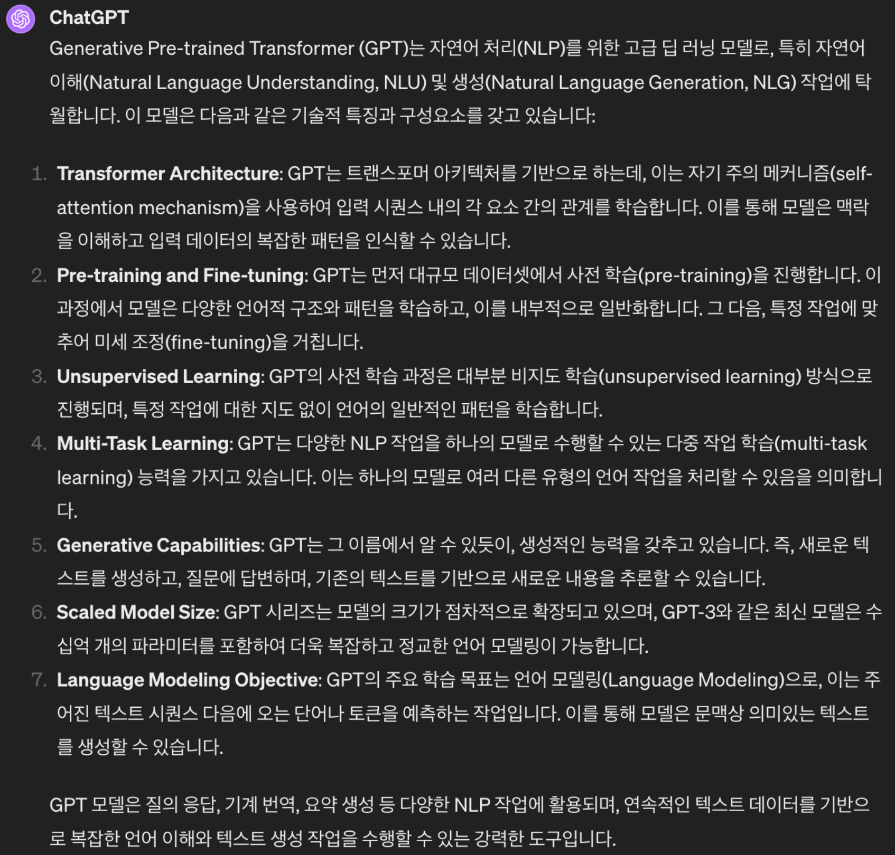

답변이 완전히 달라진 것을 볼 수 있습니다. 이렇게 프롬프트를 어떻게 작성하냐에 따라서 답변의 질과 형식이 전혀 달라질 수 있습니다.

이러다 보니, 프롬프트를 어떻게 작성해야하는지에 대해서 많은 연구가 이루어졌고 그 결과로 여러 기법이 만들어졌습니다. 그러면 프롬프트 기법에 대해 알아보겠습니다.

## 프롬프트 기법

### Few Shot 기법

이 기법은 적은 수의 예시들을 사용하는 방법입니다. 예시라는 데이터를 통해 모델이 적은 데이터로 빠르게 학습을 하도록 유도를 하여 효율적인 답변이 나오도록 할 수 있습니다.

아래는 몇 가지 Few Shot 기법을 사용한 예시입니다.

```
질문) 
프롬프트: "다음 항목을 분류하세요: '스포츠', '음식', '기술'"
예시 입력:
"축구는 인기 있는 스포츠입니다. -> 스포츠"
"피자는 많은 사람이 좋아하는 음식입니다. -> 음식"
요청: "인공지능은 현대 기술의 중요한 분야입니다. -> ?"
```


```
질문) 
프롬프트: "다음 텍스트에 대한 감성을 평가하세요: '이 영화 정말 재미있어요!'"
예시 입력:
"정말 재미없어요. -> 부정적"
"최고예요! -> 긍정적"
요청: "이 제품을 다시는 구매하지 않을 거예요. -> ?"
```


내가 원하는 분류 방법을 지정하여 그에 맞게 분류를 해줄 때 유용하게 사용할 수 있습니다.

```
[프롬프트 1]
질문) 
영어 단어를 입력하면 아래의 예시를 참고해서 같은 형식으로 알려줘.

영어 단어:
- 뜻:
- 한국어 발음:
- 예시 문장:
1) 예시 문장 1
2) 예시 문장 2
3) 예시 문장 3

[프롬프트 2]
질문) intelligent
```

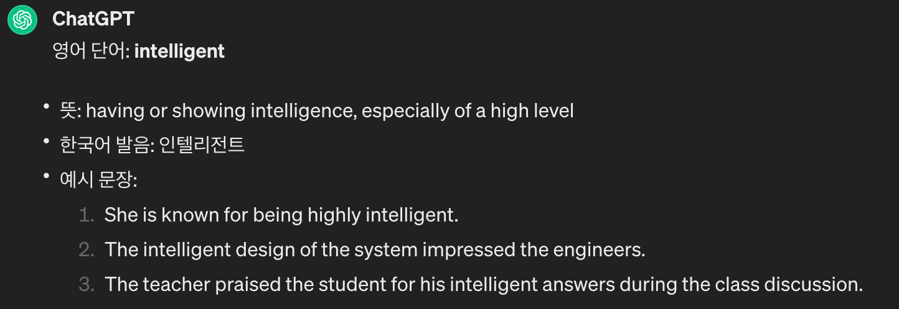

ChatGPT와 같은 LLM이 나오고부터는 예시를 제공하지 않는 Zero Shot 기법으로도 간단한 질문은 충분히 원하는 답변을 얻을 수 있습니다. 그 외에도 하나의 예제를 제공하는 One Shot 기법이라는 용어도 있습니다.

### 역할 지정(Roleplay) 기법

이 기법은 특정 캐릭터나 전문가의 입장에서 답변하도록 요청하는 기법입니다. 모델에게 특정 상황이나 시나리오에 역할을 부여함으로써, 더 구체적이고 상황에 맞는 답변을 얻기 위해 사용할 수 있습니다.

아래는 전문가 입장에서 물어보는 예시입니다.

```
질문) 너는 AI 전문가야. 누구나 쉽게 이해할 수 있도록 AI에 대해 설명해줘.
질문) 너는 유명한 소설가야. 미스터리 소설의 서두 작성해줘.
질문) 너는 영어 선생님이야. 중급 수준의 영어 회화 문장 5개 추천해줘.
```

그리고 캐릭터를 부여해서 어떤 상황을 미리 예상해볼 수도 있습니다.

```
질문) 너는 AI에 대해서 모르는 초등학교 학생이야. AI에 대해서 초등학생 수준으로 어떤 것이 궁금할지 알려줘.
```

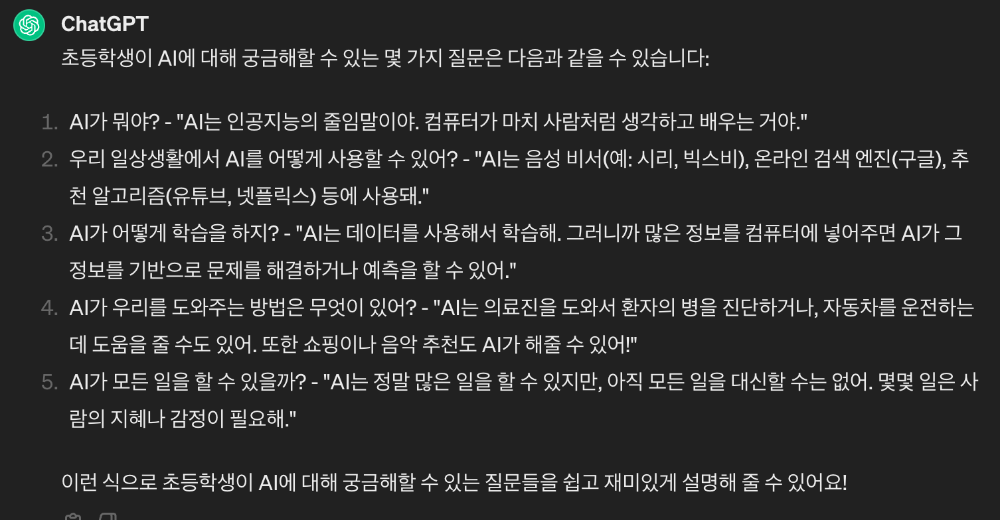

### 후카츠식 프롬프트 기법

이 기법은 일본 Note사(블로그 서비스)의 후카츠 타카유키가 개발한 프롬프트 기법입니다. ([참고 링크](https://n-v-l.co/blog/chatgpt-fukatsu-prompt)) 이는 모델에 효율적인 정보 전달을 위해서 템플릿을 만들어 물어보는 방식입니다. 여기서 제시하는 템플릿은 명령문, 제약 조건, 입력문, 출력문 이렇게 4가지가 존재합니다.

```
# 명령문:
당신은 {역할}입니다.
다음의 제약 조건과 입력문을 바탕으로, 최상의 결과를 출력문에 작성해주세요.

# 제약조건:
- 문자수는 {숫자} 입니다.
- 제약 조건 명시

# 입력문:
질문 및 원하는 답변을 위한 입력

# 출력문:
```

만약 인스타그램에 ‘오펜하이머’ 영화를 홍보하는 글을 작성해보고 싶다고 가정해보겠습니다.

```
질문)
# 명령문:
당신은 인스타그램에 영화를 홍보하는 홍보 담당자 입니다.
다음의 제약 조건과 입력문을 바탕으로, 최상의 영화 홍보물을 출력문에 작성해주세요.

# 제약조건:
- 문자수는 100자 이내 입니다.
- 적절한 태그명으로 5 ~ 10개정도 구성합니다.
- 글은 짧고 명확해야 합니다.
- 글을 읽으면 영화를 보고 싶도록 만들어야합니다.
- 이모지를 포함하여 읽기 편하고 자연스럽게 구성해야합니다.

# 입력문:
세계적인 감독인 크리스토퍼 놀란 감독의 새로운 영화인 오펜하이머가 개봉합니다. 
실제로 원자폭탄을 만든 줄리어스 로버트 오펜하이머의 일대기를 그린 영화로 많은 한국팬들이 기대하던 영화입니다.

# 출력문:
```

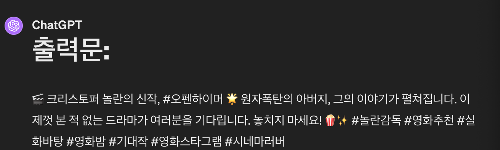

### 이어쓰기(Continuation) 기법

이 기법은 GPT의 특징인 단방향 학습을 활용한 방법입니다. 모델에게 초기 입력을 제공하고, 이를 기반으로 자연스럽게 이어서 텍스트를 생성하게 합니다.

이어쓰기 기법은 특히 글쓰기와 아이디어 도출과 같은 창의적인 작업에 활용할 수 있습니다.

- 기사 작성

```
질문)
프롬프트: "오늘날 기술의 발전은 생활의 모든 면을 변화시키고 있다. 특히, 인공지능은..."
목적: 기술 발전에 대한 기사의 시작 부분을 제공하고, AI가 현대 기술 트렌드에 대해 자세히 설명하도록 합니다.
```

- 대화 시뮬레이션

```
질문)
프롬프트: "고객: 제품이 작동하지 않아요. 지원팀: 문제를 해결하기 위해 몇 가지 정보가 필요합니다..."
목적: 초기 대화 상황을 설정하고, 이를 바탕으로 모델이 고객 지원 대화를 이어나가도록 합니다.
```

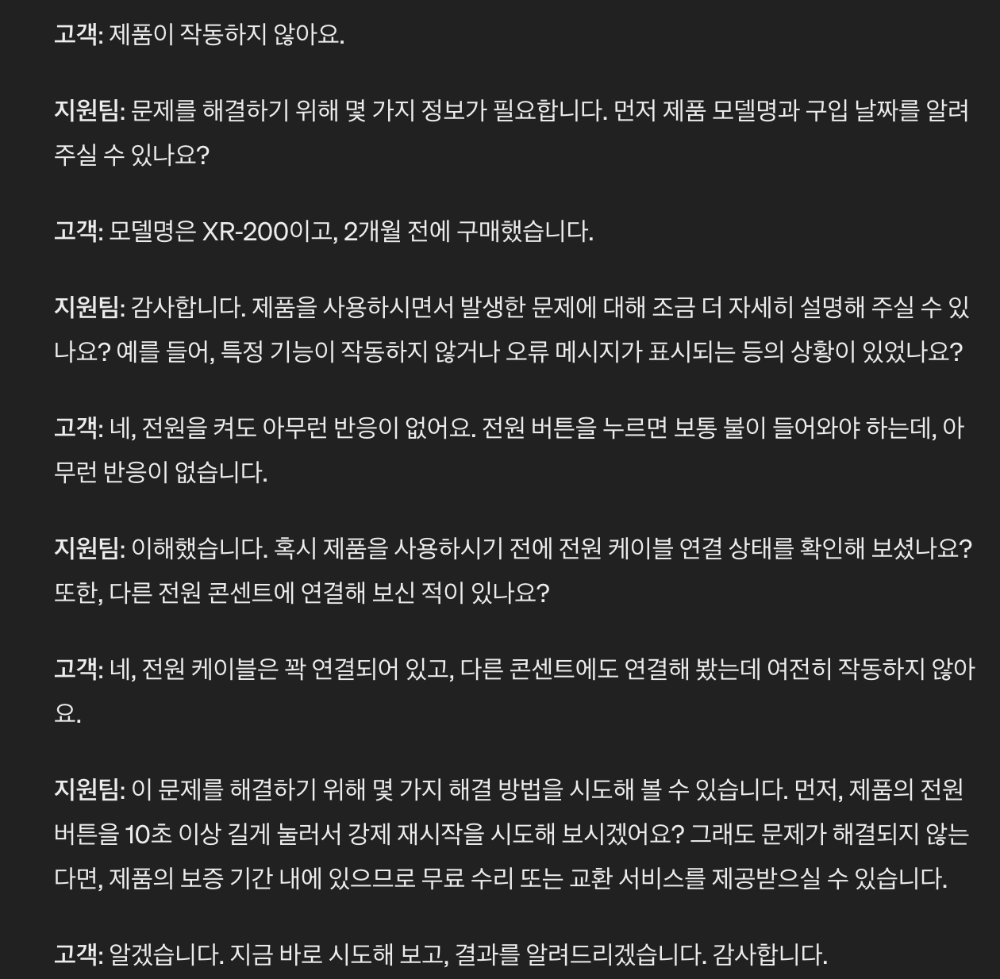

### Chain of Thought 기법

이 기법은 복잡한 문제를 해결하기 위해 중간 단계나 사고 과정을 명시적으로 표현하여 요청하는 방법입니다. 개인적인 예상으로는 ChatGPT 초반에 수학 계산을 잘 못하거나 조금만 복잡한 추론에 대해서 답변을 잘 하지 못하는 것을 피하기 위함으로 보입니다.

Chain of Thought 기법이 소개된 [Wei et al. (2022)](https://arxiv.org/abs/2201.11903) 의 예시는 현재 기본 프롬프트로만으로 잘 동작하는 것을 볼 수는 있습니다.

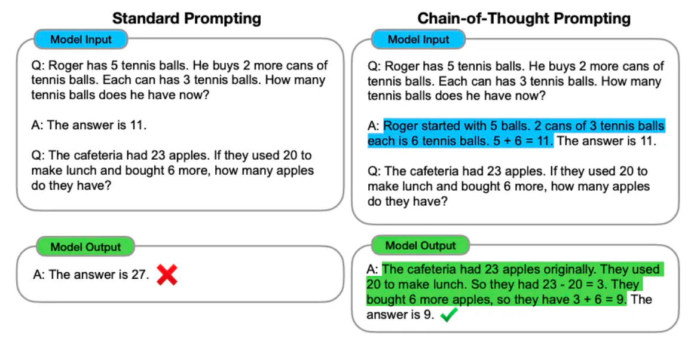

이미지 출처: [Wei et al. (2022)](https://arxiv.org/abs/2201.11903)

- 기본 프롬프트

> 질문: 로저는 5개의 테이스 공을 가지고 있어. 그리고 2개의 테니스 공이 들어있는 바구니를 샀어. 각각의 바구니는 3개의 공이 들어있어. 그러면 로저가 가지고 있는 공의 총 개수는 몇개야?

답변: 답은 11개.

질문: 식당에 23개의 사과가 있어. 만약 20개의 사과를 점심 때 사용하고, 6개를 더 구매했어. 그러면 현재는 몇 개의 사과를 가지고 있을까?
>

사실 현재는 기본 프롬프트로도 충분히 잘 동작하고 있습니다.

- Chaing-of-Thought 프롬프트

> 질문: 로저는 5개의 테이스 공을 가지고 있어. 그리고 2개의 테니스 공이 들어있는 바구니를 샀어. 각각의 바구니는 3개의 공이 들어있어. 그러면 로저가 가지고 있는 공의 총 개수는 몇개야?

답변: 로저는 5개의 공을 처음에 가지고 있었어. 2개의 바구니에는 3개의 공이 각각 들어있으니까 총 6개야. 그러면 5 + 6 = 11. 그러므로 답은 11개야.

질문: 식당에 23개의 사과가 있어. 만약 20개의 사과를 점심 때 사용하고, 6개를 더 구매했어. 그러면 현재는 몇 개의 사과를 가지고 있을까?
>

수학 문제 역시, 현재 시점 ChatGPT 3.5에서도 이전보다는 계산을 정확히 해주는 것으로 보이고, 특히 ChatGPT 4 버전부터는 파이썬 언어를 사용하기 때문에 정확한 수학 계산을 할 수 있습니다.

### 그 외

여기서 소개한 기법 말고도 많은 기법들이 존재합니다. 개인적으로 창의적인 작업이나 매우 복잡한 문제가 아닌 이상 Few Shot 기법과 역할 지정 기법으로도 충분하다고 느꼈습니다. 사실 이 두 개 외의 기법도 거의 사용할 기회는 없었습니다. 결국 프롬프트의 중요한 점은 **얼마나 원하는 것을 구체적으로 제시**하는가입니다.

위어기외법외이에어도 도떤 더이  있 지는 정는가  볍 게펴보겠습니다.

**Tree of Thought 기법**

문제 해결 과정에서 중간 단계에 대해 탐색하고 평가하는 기법입니다.

```
세 명의 다른 전문가들이 이 질문에 답하고 있다고 상상해보도록 해.
모든 전문가들은 자신의 생각의 한 단계를 적어내고,
그것을 그룹과 공유할거야.
그런 다음 모든 전문가들은 다음 단계로 넘어가. 등등.
만약 어떤 전문가가 어떤 시점에서든 자신이 틀렸다는 것을 깨닫게 되면 그들은 떠나.
그렇다면 질문은...
```

**MetaCognitive Prompting 기법**

인간의 메타인지 과정을 모방한 기법입니다. 다음과 같은 과정을 모델에 제시하여 단계적으로 원하는 결과를 도출하게 합니다.

1. 텍스트 해석
2. 초기 판단
3. 판단에 대한 평가
4. 최종 결정
5. 신뢰도 평가

## Custom Instructions 기능

앞서 프롬프트에 대해 여러가지 기법을 살펴보았습니다. 이를 통해 자신에게 최적화된 프롬프트를 만들어서 모든 대화에 적용하고 싶은 경우가 있을 수 있습니다. 이를 ChatGPT 설정에서 추가할 수 있습니다.

> 이전에는 ChatGPT Plus 구독에서만 가능하다고 알고 있었는데, 현재 기준으로는 모든 사용자가 설정할 수 있다고 합니다.
>

좌측하단 자신의 계정 아이콘 클릭 → Customize ChatGPT 클릭하면 아래와 같은 화면이 보입니다.

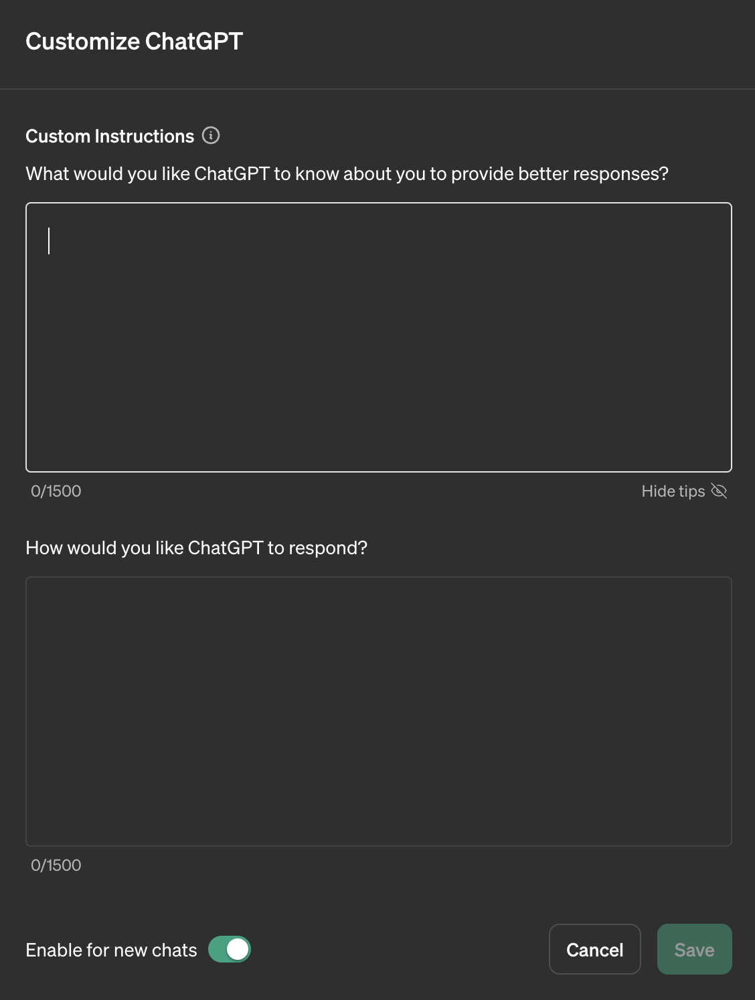

첫 번째 칸은 ChatGPT에게 자신에 대한 정보를 제공할 수 있습니다. 무엇보다 자신이 원하는 정보를 얻을 수 있는 역할과 목표를 설정하는 것이 중요합니다. 만약 영어를 번역하는 것이 목표라면 다음과 같이 설정할 수 있을 것입니다.

```
나는 영어에서 한글로 번역하고 있는 번역가야.
나는 영어를 한글로 자연스럽게 번역하는 것이 목표야.
```

이렇게 업무 관련 정보, 개인적 선호, 특정 요구사항 등을 위처럼 표현할 수 있습니다.

두 번째 칸은 ChatGPT의 답변에 대해 자신이 원하는 형태로 받기 위한 정보를 제공합니다. 응답 형식이나 어느정도 상세히 해줄지 그리고 글의 분위기나 스타일 등을 설정해줄 수 있습니다.

```
영어 문장이 주어지면 다음과 같은 형식으로 출력해줘.

[원문]

[번역 1]

[번역 2]

[번역 3]
```

위 예시를 적용하기 위해 ‘Save’ 버튼을 누르고 적용하면, 새로 생성하는 대화창에서 위 설정이 적용됩니다. 이를 설정하여 예제 영어 문장을 입력해보면 다음과 같이 정상적으로 적용된 모습을 볼 수 있습니다.

```
질문)
We’re testing memory with ChatGPT. Remembering things you discuss across all chats saves you from having to repeat information and makes future conversations more helpful.
```

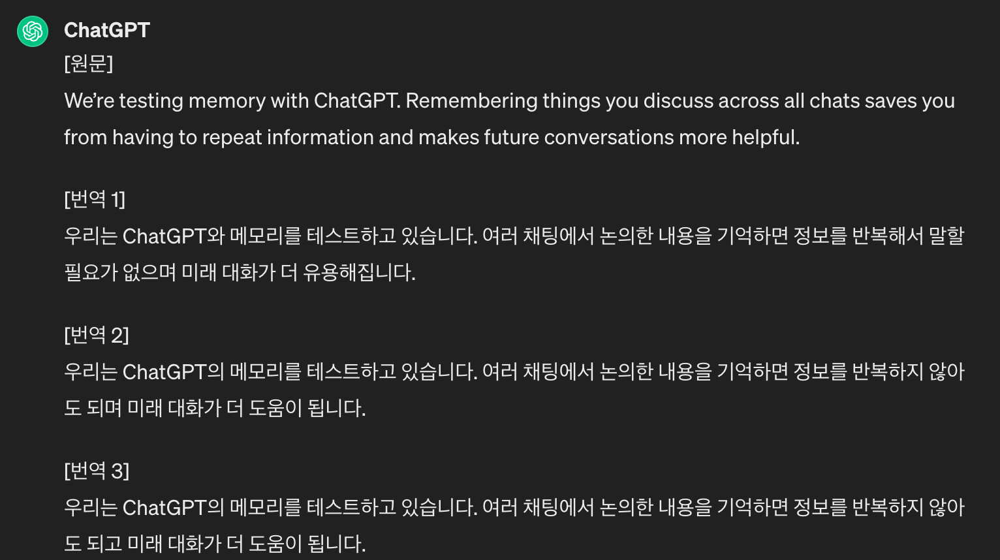

지금까지 ChatGPT가 무엇이고 지금까지 어떻게 발전되어있는지 간단히 살펴보았고, 잘 활용하기 위한 첫 번째 단계인 프롬프트에 대해서 알아보았습니다. 다음 편에서는 ChatGPT 4 활용에 대해서 정리할 예정입니다. ChatGPT 4는 3.5 버전과 비교하여 어떤 점이 추가 및 개선되었는지와 Plugins와 GPTs에 대해서 다뤄보고자 합니다.

# 참고자료

- ChatGPT
- [도서] 챗GPT 거부할 수 없는 미래
- [유튜브] https://www.youtube.com/@potato_ai
- https://www.promptingguide.ai/kr
- https://brunch.co.kr/@pletalk/158