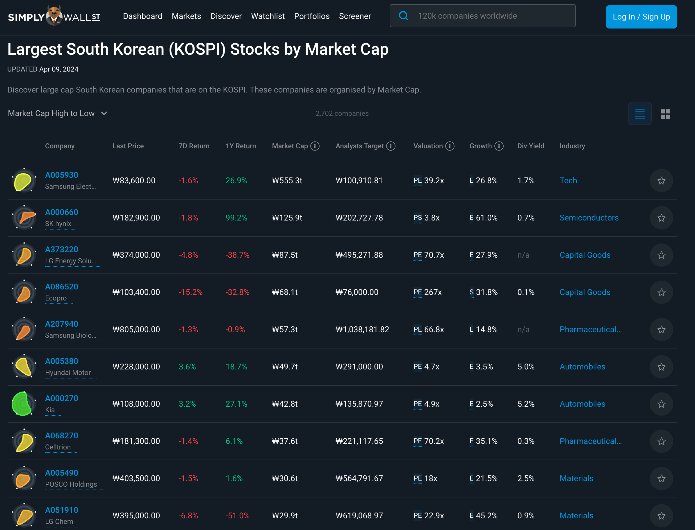

1편에서는 GPT 모델과 ChatGPT에 대해서 전반적으로 살펴보고, 이를 효율적으로 사용하기 위해 필요한 프롬프트 기법에 대해서 다루었습니다. 
ChatGPT 4가 나오면서 답변의 퀄리티도 많이 상승하였고, 흥미롭고 편리한 기능들이 추가되었습니다.

> ChatGPT 4를 사용하기 위해서는 ChatGPT Plus 구독이 필수적으로 필요합니다. (월 20$)

이번 2편에서는 ChatGPT 3.5와 비교하여 4 버전에서는 어떤 점이 달라졌는지와 추가된 기능, 그리고 이를 활용하는 방법에 대해서 알아보겠습니다. 
마지막에는 ChatGPT 5 소식과 ChatGPT 외의 다른 LLM 서비스는 어떤 것이 있는지 간단히 살펴볼 예정입니다.


# 1. GPT-3.5 VS GPT-4
ChatGPT 4는 GPT-4 모델을 기반으로 동작하고 있습니다. 
반면, ChatGPT 3.5는 GPT-3.5 모델을 사용하고 있죠. 
그러면 먼저 GPT-3.5와 GPT-4 사이에 어떤 차이가 있는지부터 살펴보겠습니다.


## 1.1 사전 학습 크기
ChatGPT 3.5는 GPT-3 모델에서 확장한 버전(GPT-3.5)입니다. 
약 1,750억 개의 파라미터로, 4,990억 개의 단어를 학습하였다고 알려져있습니다. 
그리고 데이터는 2021년 이전의 데이터를 기준으로 하였습니다.

반면에 ChatGPT 4는 GPT-4 모델을 기반으로 하고 있으며 정확히 밝혀지지는 않았지만, 
2,200억 개의 파라미터를 갖는 모델을 8개로 구성한 혼합 모델로 학습되었다고 합니다. 
그리고 2022년 이전 데이터로 GPT-3.5보다 조금 더 최근의 데이터를 기준으로 학습하였습니다.

GPT-4 버전은 GPT-3.5보다 더 큰 모델을 기반으로 학습하여 더 창의적이고 더 복잡한 작업에 훨씬 큰 힘을 발휘합니다.


## 1.2 다국어 처리 능력


출처: https://openai.com/research/gpt-4

GPT-4은 한국어 처리 능력도 많이 개선되었습니다. 
위 그림은 OpenAI에서 GPT-4에 대해 연구한 자료로, GPT-4에서 한국어는 GPT-3.5의 영어보다도 더 점수가 높은 것을 볼 수 있습니다.

- 영어
  - GPT-3.5: 70.1
  - GPT-4: 85.5
- GPT-4 한국어: 77.0

GPT-4 부터는 영어가 아닌 **한국어로도 충분한 퀄리티의 답변**을 받을 수 있습니다.


## 1.3 토큰 제한 개수
토큰 제한 개수는 모델이 처리할 수 있는 텍스트의 양을 의미합니다. 
많은 개수의 토큰을 처리할 수 있다면, 내가 한 번에 물어보고 싶은 텍스트 양도 그만큼 늘어납니다.

ChatGPT 3.5과 ChatGPT 4에 대한 토큰 제한 개수에 대해서 여러 방면으로 찾아보았지만, OpenAI에서 공식적으로 언급한 곳은 찾을 수 없었습니다. 
대신 기반 모델의 토큰 개수에 대해서 공식 문서에 정리가 되어있고, 이 모델의 토큰 제한을 따른다는 언급은 있었습니다.

https://platform.openai.com/docs/models/continuous-model-upgrades

위 OpenAI 공식 문서에서 정리해둔 GPT 모델별 토큰 개수를 참고할 수 있습니다.

- GPT-3.5: 4,096 tokens
- GPT-4: 8,192 tokens


## 1.4 멀티모달(Mutimodal) 등 다양한 기능 추가

GPT-4 부터 멀티모달이 가능하게 되었습니다.

> 멀티모달은 Multi Modality의 줄임말입니다. 여기서 모달리티는 보통 어떤 형태로 나타나는 현상이나 그것을 받아들이는 방식을 말합니다. 
> 예를 들어, 텍스트는 언어적인 정보를 담은 모달리티이고, 이미지는 시각적인 정보를 담은 모달리티로 볼 수 있습니다. 
> 멀티 모달리티는 이러한 여러 모달리티를 뜻합니다.

현재 AI에서 말하는 멀티 모달리티는 시각, 청각을 비롯한 여러 채널을 통해서 정보를 주고받을 수 있다는 것을 뜻합니다. 
이러한 다양한 모달리티가 가능한 AI를 멀티 모달 AI라고 부릅니다.

GPT-4는 이미지와 음성을 처리할 수 있게 되면서 멀티모달 AI로 불리게 되었습니다.
따라서, 이미지 또는 음성을 입력으로 받을 수 있고 이를 분석하여 답변에 활용할 수 있습니다.


# 2. ChatGPT 4 새로운 기능
앞서 GPT-4에 대해서 어떤 점이 변경되었는지 살펴보았습니다.
여기서는 ChatGPT 4에서 GPT-4를 모델로 하면서 어떤 기능이 추가되었는지 살펴보겠습니다.
멀티모달이 가능해지면서 추가된 기능도 있지만, 여전히 한계점이 존재합니다.
이러한 한계점을 해결하기 위해서도 여러 기능이 추가되었습니다.


## 2.1 이미지 분석
GPT-4부터 이미지를 분석할 수 있습니다. 
이미지를 입력으로 제공하여 이에 대해서 물어보면 답변을 받을 수 있습니다. 
예제를 살펴보겠습니다.


위 이미지는 올해 4월에 개봉한 ‘쿵푸팬더 4’ 영화 포스터입니다. 이에 대해 설명해달라고 해보았습니다.


이 이미지에 어떤 물체가 있는지 설명해주고 영화 포스터인지도 파악하였습니다. 
그리고 액션과 모험일거라는 영화 내용도 어떠할지 예측하고 있는 모습을 볼 수 있었습니다.


## 2.2 DALL-E 3 모델 사용 (이미지 생성)
ChatGPT 4는 이미지 분석뿐 아니라 이미지를 생성할 수 있습니다. 
GPT는 이미지를 생성할 수 있는 모델은 아니다보니, ChatGPT 4는 그 대신 DALL-E 3 모델을 사용합니다. 
이 역시 OpenAI에서 개발한 모델로, 입력된 텍스트를 이해하여 그에 맞는 이미지를 생성하는데 최적화된 모델입니다.

이미지 분석에서 살펴보았던 ‘쿵푸팬더 4’ 영화 예제를 다시 사용해보겠습니다.


위는 네이버 기준 영화를 소개한 내용입니다. 이를 바탕으로 영화 포스터를 만들어달라고 해보겠습니다.


주인공인 ‘포’는 정말 실제와 유사하게 그려주었습니다. 
영화 제목도 있고, 영화 제작자는 뭔가 ‘디즈니’스러운 로고도 표시되어있습니다. 
그리고 실제로 영화관에 붙여져있는 포스터처럼 액자 형식으로 디테일하게 표현한 것도 볼 수 있었습니다.


## 2.3 Browsing (브라우징)
브라우징은 인터넷 실시간 검색을 통해 최신 데이터에 바로 접근하여 답변을 줄 수 있습니다. 
ChatGPT 3.5/4는 각각 GPT-3.5, GPT-4 모델을 기반으로 하고 있는데, 이 모델들은 2021년과 2022년 정도의 데이터까지만 학습이 되어있습니다.

> 2023년 11월 기준 OpenAI 공식 블로그를 보면 ChatGPT 4는 2023년 4월까지 학습이 되어있다고 설명하고 있습니다.
> 
> 
> 
> https://openai.com/blog/introducing-gpts

ChatGPT 4가 2023년 4월까지 학습하였다고 해도, 현재 2024년에 발생한 데이터에 대해서는 알 수 없습니다. 
이를 해결하기 위해서 브라우징 기능을 제공하고 있습니다.

다음과 같이 최신 데이터를 3.5 버전과 4 버전에 각각 물어보겠습니다.

```text
질문: 2024년 1월 기준 대한민국 코스피 시가총액 TOP 10 알려줘.
```

먼저, 3.5 버전입니다.


3.5 버전은 자신이 학습하지 못한 최신 데이터에는 접근이 불가능하다고 말합니다.

반면, 4 버전은 어떨까요?


위처럼 브라우징 기능을 통해 실시간으로 인터넷 검색을 하여 원하는 최신 정보를 가져올 수 있습니다. 참고한 링크도 같이 첨부해준 것을 볼 수 있습니다.

https://simplywall.st/stocks/kr/market-cap-large 이 링크를 참조하였고 들어가보면 사용한 데이터를 정확히 가져온 것을 확인할 수 있습니다.




## 2.4 ADA (Advanced Data Analytics)
ChatGPT 3.5의 큰 단점 중 하나는 정확한 수학 계산을 하지 못한다는 것이었습니다.
ChatGPT 4부터는 데이터 분석을 위해 **파이썬 언어를 사용**할 수 있습니다. 
그러다보니 자연스럽게 정확한 수학 계산이 가능해졌고, 그래프로 그리기 등 추가적인 데이터 분석이 가능해졌습니다.

> 이렇게 코드를 실행할 수 있는 환경을 코드 인터프리터(code interpreter) 라고 부르기도 합니다.

조금 복잡한 사칙연산을 시켜보겠습니다.

```text
질문: 34228 * 2433 - 54332 / 4312 = ?
```


답변에서 계산한 과정만 보면 정확해서 처음에는 맞는 답일 수도 있겠다고 생각했습니다. 
그럼 계산기로 실제로 계산을 해봅시다.

- 34228 * 2433 = 83,276,724
- 54332 / 4312 = 12.60018553
- 83,276,724 - 12.60018553 = 83276711.4

곱셈과 나눗셈을 덧셈과 뺄셈보다 먼저해야한다는 사칙연산 규칙은 정확했지만, 곱하기부터 계산을 이미 틀렸다는 것을 볼 수 있습니다.


반면, 4 버전은 계산을 정확히 하였습니다. 
직접 실행해보면 알겠지만, ADA가 필요한 경우 분석중이라는 아이콘을 보여주고, 이를 클릭하면 파이썬 코드를 작성하는 것을 볼 수 있습니다. 
그 결과를 답변에 활용하며, 실제로 어떤 코드를 사용하였는지 아래와 같이 마지막에 볼 수 있도록 하고 있습니다.


정확한 계산은 가능하다는 것을 살펴보았고, 다음은 데이터 분석 예제를 살펴보겠습니다.

참고로 ChatGPT 4는 입력으로 파일을 받을 수 있습니다. 
데이터 분석을 위해 엑셀 파일 하나를 입력해보겠습니다. 
아래는 서울시의 2023년 동안 인구 변화 나타낸 엑셀 파일입니다.

> 데이터는 https://www.data.go.kr/data/15078001/fileData.do 여기 링크에서 다운받을 수 있습니다.


전체 구를 기준으로 월별 막대 그래프를 그려달라고 해보겠습니다.


분석 중간에 에러가 발생하면 스스로 해결 후 계속 진행합니다. 그 결과, 요청한 막대 그래프를 그려준 것을 볼 수 있습니다.


# 3. GPTs
GPTs는 사용자가 필요한 특정 작업이나 지식에 맞춘 ChatGPT 버전을 직접 만들 수 있는 기능입니다.


자신이 만든 GPTs를 공유할 수도 있습니다. 
위처럼 페이지를 제공하여 작업별 추천하는 GPTs를 보여주고, 검색을 통해 자신에게 필요한 GPTs가 있는지 찾아보고 사용할 수 있습니다. 
여기에는 사용자가 직접 만든 것도 있지만, ChatGPT에서 공식적으로 만든 GPTs도 있습니다.


> OpenAI에서는 위 페이지를 GPT Store 라고 최근에 소개하였습니다. 
> (2024년 1월 기준, https://openai.com/blog/introducing-the-gpt-store)
> Store라는 이름을 붙힌 것처럼 사용자가 자신이 만든 GPTs로 수익화를 할 수 있도록 제공할 예정이라고 합니다.


## 3.1 Plugins (Deprecated)
Plugins는 GPTs 이전에 비슷한 역할을 했던 기능입니다. 
GPT 모델에서 할 수 없었던 기능을 대신해주거나 특정 작업에 특화된 기능을 할 수 있었습니다. 
예를 들어, 다이어그램을 그려준다거나 논문 찾기, 여행 계획 세워주기, 유튜브 또는 웹 페이지 요약 등 다양한 기능을 제공했었습니다.


하지만 Plugins는 공식적으로 GPTs로 대체되었고, 현재는 위 메뉴를 찾아볼 수 없습니다. 
그대신, 기존 Plugin들은 대부분 GPTs에도 거의 동일한 모습으로 존재합니다. 
그리고 이미 Plugin으로 했던 대화들은 더이상 진행하는 것은 불가능하지만 그 내용은 지워지지 않고 조회가 가능하다고 합니다.

> OpenAI 공식 블로그에서 https://help.openai.com/en/articles/8988022-winding-down-the-chatgpt-plugins-beta 
> 이 글을 보면 2024년 4월 9일 기준 Plugins는 서비스를 종료했다고 공식적으로 밝히고 있습니다.


## 3.2 GPTs 만들기
GPTs는 ChatGPT Plug를 구독한 회원이라면, 누구든지 만들 수 있습니다. 
그리고 공식 소개에도 언급되어있지만, 코딩을 전혀 알지 못해도 누구나 쉽게 만들 수 있다고 되어있습니다.

> 이 글에서는 GPTs 만드는 방법에 대해서 상세히 다루지는 않겠습니다. 
> 제가 아직 잘 모르는 것이 가장 크고, 글로 작성하기에는 일반화되지 않은 요소가 많다는 생각이 듭니다. 
> (기능이나 성능이 계속 변화하고 있기도 합니다.)


먼저, GPTs를 만들기 위해서는 GPT Store 시작 화면 오른쪽 상단에 ‘+ Create’ 버튼을 눌러줍니다.


첫 화면은 위와 같이 나옵니다.

- Create: 채팅을 통해 GPTs를 만들 수 있는 화면
- Configure: 정해진 설정을 작성하여 GPTs를 만들 수 있는 화면
- Preview: 중간중간 결과를 확인할 수 있는 화면

현재 저는 (실제로) Java, Spring Framework, IntelliJ IDEA를 주로 사용하는 개발자입니다. 
이에 대한 최신 정보를 알고 싶은데, 이를 위한 GPTs를 만들어보겠습니다.

```text
질문: 나는 Java, Spring Framework, IntelliJ IDEA를 주로 사용하고 있는 소프트웨어 개발자야.
Java, Spring Framework, IntelliJ IDEA에 대한 최신 소식을 알려주는 챗봇을 만들고 싶어.
챗봇의 답변은 항상 한글로 답변해주고, Custom Starter도 한글로 작성해서 추천해줘.
```


먼저, Create 화면으로 채팅으로 만들어본 모습입니다. 
자신이 원하는 것을 채팅으로 말하면, 이에 대해 추천해주고 그대로 진행할지 아니면 변경이 필요할지 대화 형식으로 진행할 수 있습니다.


오른쪽 화면을 보면, 중간중간 적용된 결과를 바로바로 채팅으로 확인을 해볼 수 있습니다.

Create 화면에서 진행을 하면, 어떤 것이 필요한지나 추천해줄 만한 것들을 알려주다보니 초반 설정하기에는 편리하다고 느껴졌습니다. 
그리고 이렇게 대화를 통해 적용된 설정은 ‘Configure’ 화면에도 그대로 적용이 됩니다.


대화를 통해 조건을 명시한 부분이 Instructions에 잘 들어간 것도 확인할 수 있습니다.

Create 화면에서 대화한 내용은 GPTs를 만들고 난 이후에는 대화 내역이 남아있지 않습니다. 
(물론, Configure 에 적용한 결과가 남아있어서 딱히 필요하다고 느껴지지는 않을 것 같습니다.)

Configure 화면에 대해서 조금 더 자세히 살펴보겠습니다. 
결국 GPTs의 동작은 Configure 에 정의된 설정을 따릅니다.


- 대표 이미지: 만들어질 GPTs에 보여질 이미지
- Name: GPTs 이름
- Description: 소개글
- Instructions: 규칙 또는 명령문 (프롬프트)
- Conversation starters: 시작 대화 (추천 대화)
- Knowledge: 사전 학습에 필요한 자료
- Capabilities: 추가 기능
    - Web Browsing: 웹 브라우징 기능
    - DALL-E Image Generation: 이미지 생성 기능
    - Code Interpreter: 파이썬 코드 사용 (ADA)
- Create new Action: 외부 API 사용과 같은 액션 기능 추가

### 대표이미지
GPTs를 만들기 위해서 필수로 이미지가 필요한 것으로 보입니다. 
이미지는 ‘Create’ 화면에서 대화로 원하는 이미지를 만들어달라고 할 수도 있고, 
‘Configure’ 화면에서 이미지 아이콘을 클릭해서 만들 수도 있습니다. 
이미지 아이콘을 클릭해서 만들 때는 설정한 값들을 보고 이에 적절한 이미지를 생성해줍니다.

### Instructions
GPTs에서 어떻게 답변을 할지 규칙과 형식 등을 설정해주는 공간입니다. 
프롬프트를 설정하는 것과 같습니다. 
GPTs가 나온 이후로 프롬프트를 공부하지 않아도 쉽게 필요한 상황에 적절한 답변을 가져올 수 있습니다. 
하지만 GPTs를 만들기 위해서는 프롬프트를 더 적극적으로 활용해야 합니다. 
그래도 한 번 설정해놓으면 계속해서 사용할 수 있으므로 훨씬 편하게 프롬프트를 사용할 수 있습니다.

### Conversation starters
자신이 만든 GPTs를 사용할 때 어떤 질문으로 시작하면 좋을 지 추천 목록을 작성하는 공간입니다.


설정한 목록들은 GPTs를 처음 실행할 때, 위와 같이 보여줍니다.

### Create new Action

외부 Action 기능을 설정하는 공간입니다. 주로 외부 API를 사용하고 싶을 때 설정할 수 있습니다.


중간에 ‘Get help from ActionsGPT’를 클릭하면, 어떻게 action을 설정할지 도움을 주는 ‘ActionGPT’ GPTs 화면으로 이동합니다. 
여기서 내가 사용할 API를 명시해서 대화를 통해 도움을 받을 수 있습니다.


> 이런 부분을 보면 OpenAI 자체에서도 GPTs를 적극 활용하는 모습을 볼 수 있었습니다.
>


위처럼 자신이 사용할 API 호출을 명시하면, Actions에 어떻게 설정해야할지 친절하게 설명을 해줍니다.


# 4. 정리
지금까지 ChatGPT 4에 대해서 알아보았습니다. 
ChatGPT 3.5에 비해 성능적으로도 발전하였고, 무엇보다 편의 기능이 많이 추가되었습니다. 
특히 GPTs가 추가됨에 따라 사용성이 크게 증가하였고, 수익성 모델로 이어질 것으로 보여서 이후에 어떻게 변화될지가 기대가 됩니다.

지금까지 이야기한 ChatGPT 4의 특징을 정리하면 다음과 같습니다.

- GPT-4 모델 기반 (더 큰 크기의 사전 학습, 다국어 처리, 멀티모달, ...)
- 2023년 4월까지 기반으로 데이터 학습
- 이미지 분석 및 생성(DALL-E 3모델) 가능
- 브라우징 기능
- ADA
- GPTs


# 5. 더 알아보기
## 5.1 ChatGPT 5
GPT-5 모델이 빠르면 올해 여름쯤에 출시할 수도 있다고 합니다.
GPT-5 모델이 나온 후로도 언제 ChatGPT 5가 나올지는 공식적으로 밝혀진 바가 전혀 없습니다.
현재 접할 수 있는 정보는 대부분 정확한 정보는 아닙니다.
샘 알트만의 인터뷰와 같은 정보를 바탕으로 GPT-5 또는 ChatGPT 5가 어떤 부분이 발전하고 추가될지 간단히 정리해보았습니다.

- 진화된 글쓰기 능력
    - 추론 기능 추가 - 사용자 대신 작업 가능
- 멀티모달 개선
    - 실시간 음성 기능 발전
    - 비디오도 포함될 수 있음.
- AGI (일반 지능)는 더 똑똑해질 예정
- 데이터 접근성 향상


## 5.2 그 외 LLM 서비스

### Gemini (제미나이)
- https://gemini.google.com/app
- 개발사: Google
- 기반 모델: LaMDA, PaLM 2, Gemini
- 출시일: 2023년 3월
- 특징
    - 유료버전 존재 (월 20$)
    - 실시간 데이터 접근 X
    - 유료버전은 현재 영어만 지원
    - 무료버전에서 이미지 생성 퀄리티가 좋은 편.

### Claude-3 (클로드 3)
- https://claude.ai/
- 개발사: Anthropic (OpenAI 출신 엔지니어들이 만든 인공지능 스타트업)
- 기반 모델: Haiku, Sonnet, Opus
- 출시일: 2024년 2월
- 특징
    - 유료버전 존재 (월 20$)
    - 실시간 데이터 접근 X
    - 한국어가 매우 자연스러움.
    - 분석 능력은 ChatGPT 4보다 상대적으로 떨어짐.

### Perplexity (퍼플랙시티)
- https://www.perplexity.ai/
- 개발사: Perplexity (OpenAI 출신 엔지니어들이 만든 인공지능 스타트업)
- 기반 모델: GPT-3.5, GPT-4, LlaMa Chat, 자체 LLM
- 출시일: 2023년 11월
- 특징
    - 유료버전 존재 (월 20$)
    - 실시간 데이터 접근 O
    - 검색 기능에 특화되어 있으며, 그 결과는 GPT 모델로 정리해서 보여준다.
    - 결과에 활용한 링크를 체계적으로 제공함.

### CLOVA X (클로바 X)
- https://clova-x.naver.com/welcome
- 개발사: 네이버
- 기반 모델: HyperCLOVA X
- 출시일: 2023년 8월
- 특징
    - 무료
    - 실시간 데이터 접근 X
    - 전체적으로 성능이 아쉬움.

> https://youtu.be/3y4QKcI9wMQ?si=fxJcFu136ivz1fPQ 영상을 참고하여 정리하면,
> 
> LLM 유료 서비스를 딱 한 개만 쓴다고 하면, ChatGPT 4
> 
> 컨텐츠 생성 기준으로 최적의 조합은 Perplexity -> ChatGPT 4 -> Claude-3
> 1. Perplexity, 정보 수집
> 2. ChatGPT 4, 수집된 정보 분석 및 정리
> 3. Claude-3, 자연스러운 한국어 표현

# 참고자료
- https://openai.com/research/gpt-4
- https://platform.openai.com/docs/overview
- https://www.androidauthority.com/what-is-chatgpt-token-3409924/
- https://news.aikoreacommunity.com/gpt-4turboyi-tokeunjehangwa-tokeun-sayongryang-hwaginhaneun-bangbeob/
- https://www.samsungsds.com/kr/insights/multi-modal-ai.html
- https://openai.com/blog/introducing-gpts
- https://youtu.be/3y4QKcI9wMQ?si=fxJcFu136ivz1fPQ