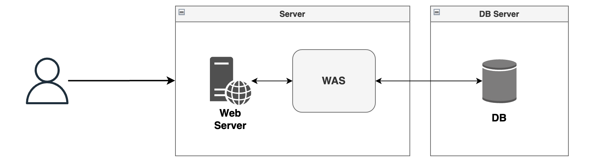
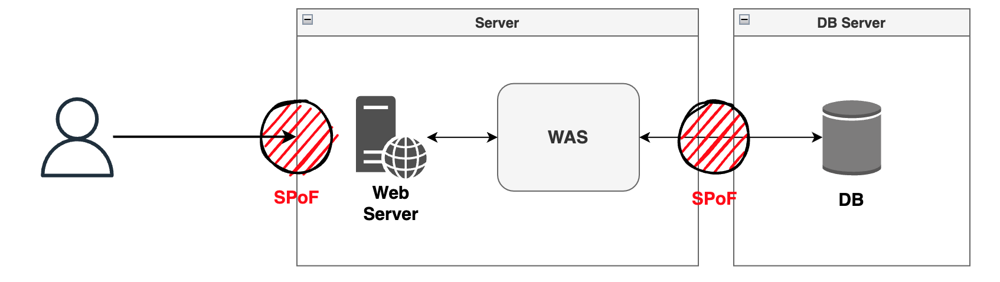
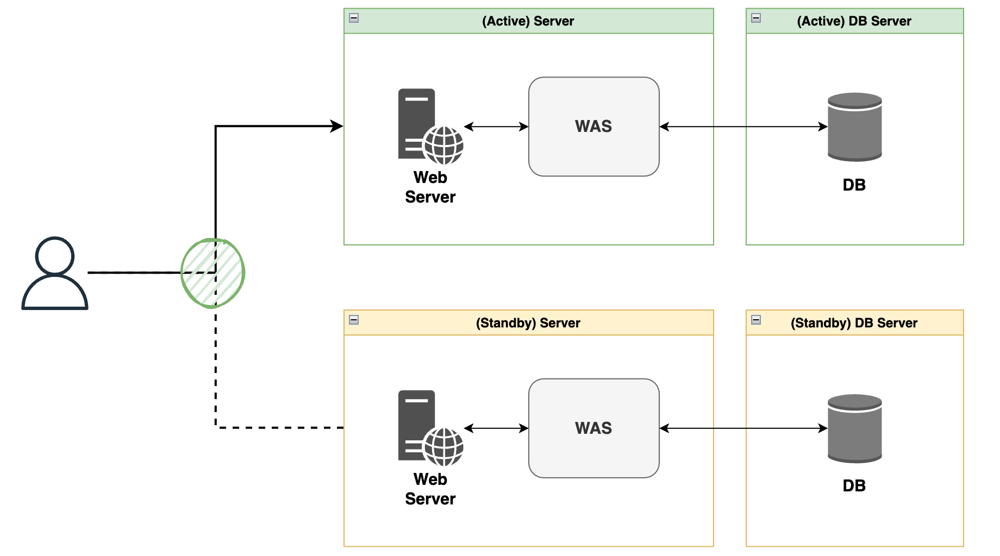
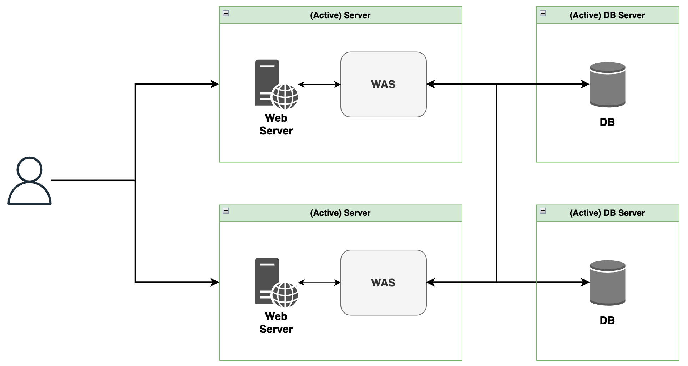
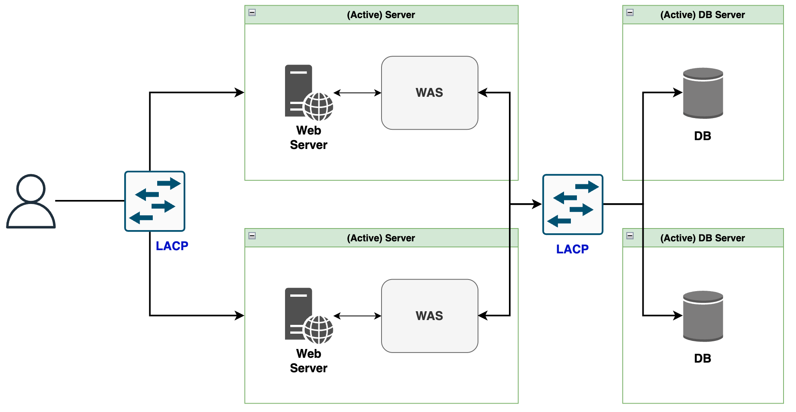
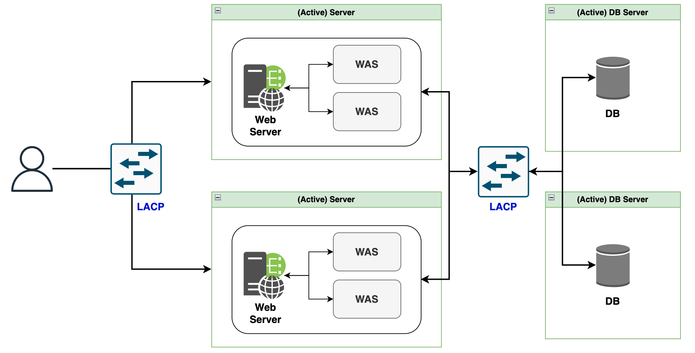
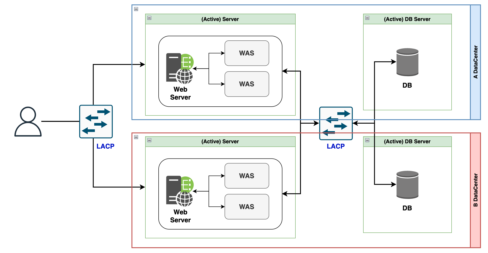
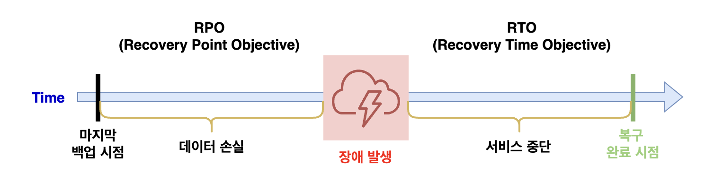

# 이중화 (Redundancy)
이중화는 시스템의 구성 요소를 2개(n개)로 중복시켜 한 구성 요소가 실패하더라도 
다른 구성 요소가 그 역할을 대신 할 수 있도록 하는 것을 말합니다.

그러면, 어떤 구성 요소를 중복해야 할까요? 바로 SPoF(Single Point of Failure)에 
해당하는 구성 요소입니다. SPoF는 시스템, 네트워크 또는 프로세스에서 단일 구성 요소가 
실패할 경우 전체 시스템의 기능이 중단되는 지점을 의미합니다. 
이렇게 하나의 구성 요소가 실패하여 전체 서비스를 중단시킬 수 있는 부분을 이중화해야 합니다.

이중화는 시스템의 고가용성(High Availability), 결함 감내(Fault Tolerance)를 
보장하여 서비스의 연속성을  유지하고, 장애 발생 시 신속하게 대응할 수 있는 장점을 갖고 있습니다. 
반면에 이를 구성하기 위해 비용이 크고 시스템이 복잡해진다는 단점이 있습니다.

### 용어 알아보기
#### 고가용성(High Availability)
시스템이나 서비스가 가능한 한 오랫동안 중단 없이 운영될 수 있는 능력.

#### 결함 감내(Fault Tolerance)
시스템이 일부 구성 요소의 장애에도 불구하고 정상적으로 동작할 수 있는 능력.

# 이중화 사례
한국에서는 너무도 유명해진 ‘카카오 데이터 센터 화재’ 사건이 있습니다. 
2022년 10월 15일 15시 19분에 카카오가 사용중인 SK C&C 판교 데이터센터에 화재가 발생합니다.
이로 인해서 카카오톡을 포함한 카카오 전반적인 서비스에 장애가 발생하여 서비스가 중단되었습니다. 
모든 서비스가 정상적으로 복구되기까지는 5일이 지난 10월 20일이었습니다.

카카오 서비스는 물론 이중화를 갖춘 시스템이었지만 완벽하지 않았습니다. 
일부 이중화된 구성 요소와 장애 대응을 위한 도구가 판교 데이터 센터에만 있었고, 
장애 모니터링과 자동화 프로세스가 미흡하였습니다. 
결국 일부 서비스에 한해서는 판교 데이터 센터 자체가 SPoF인 상황에 놓이게 되었고, 
여기서 장애가 발생하자 일부 서비스로 인해 전체 서비스가 중단되는 문제가 발생하였다고 볼 수 있습니다.

(카카오 서비스 장애 사건에 대해서는 https://www.kakaocorp.com/page/detail/9902 
여기서 자세히 살펴볼 수 있습니다.)

이처럼 이중화는 서버를 2개 이상으로 구성만 했다고 해서 서비스를 안정적으로 유지할 수는 없습니다. 
SPoF가 되는 부분을 모두 이중화를 해야하고, 데이터 센터조차도 이중화가 필요합니다. 
그리고 이를 관리하기 위한 모니터링 구축도 필요합니다. 
이중화는 비용이 매우 큰 작업이기 때문에 어쩔 수 없이 적절한 타협 지점을 찾아야할 지도 모릅니다.

# 서버 이중화 구조
일반적으로 서버를 이중화하는 구조는 크게 2가지로 나뉩니다.

1. Active-Standby
2. Active-Active

여기서 Active는 활성화가 되어있는 상태를 말합니다. 서버가 정상적으로 동작하고 있는 것입니다.

반면, Standby는 대기 상태로 말그대로 리소스는 차지하고 있지만 동작을 하고 있는 않은 상태입니다.

위는 우리가 웹 요청을 받는 서버 구조를 매우 간단히 표현한 그림입니다.

만약 위로만 서버를 구성한다면, 장애가 발생하면 서비스는 중단됩니다. 바로 SPOF 문제죠.

SPOF 문제를 해결하기 위해서 서버를 이중화해봅시다.

## Active-Standby(Passive)

같은 서버군을 물리적으로 분리하여 2개의 서버로 구성하였습니다. 
Active-Standby는 하나의 서버는 활성화 상태로 사용하고, 
하나는 장애 대비를 위해서 대기하는 서버입니다.

위 그림처럼 요청은 Active된 서버에서만 처리를 합니다. 
만약 장애가 발생하면 대기하는 서버가 있기 때문에 빠르게 전환하여 
서비스의 중단 시간을 최소화할 수 있습니다. 
하지만 결국 전환 시간이 필요하기 때문에 서비스가 중단되는 시간이 필요합니다.

정리하면, Active-Standby 구조의 장단점은 다음과 같습니다.

- 장점
    - 구조나 설정이 비교적 간단
- 단점
    - 대기 서버는 비활성 상태에서 리소스가 계속 낭비
    - 장애 발생 시 전환 시간이 필요

### 용어 알아보기
#### Failover (페일오버)
페일오버는 이중화된 시스템에서 하나의 구성 요소가 실패할 경우, 
자동으로 대체 구성 요소로 전환하는 프로세스를 말합니다.

Active-Standby 이중화 구조에서 페일오버라고 하면, 
Active 서버가 장애가 발생하여 Standby 서버가 대기 상태에서 활성화 상태로 
변하면서 전환하는 과정을 의미합니다.

#### Failback (페일백)
페일백은 시스템이 장애로 인해 대체 시스템(또는 보조 시스템)으로 전환된 후, 
원래의 주 시스템이 복구되었을 때 다시 원래 시스템으로 돌아가는 프로세스를 말합니다.

Active-Standby 이중화 구조에서 Active 서버가 장애가 발생하여 Standby 서버가 
이를 대체한 후에 장애가 복구되어 다시 Active 였던 주 서버로 되돌아가는 과정을 말합니다.

#### Switchover (스위치오버)
페일오버가 장애가 발생하였을 때 자동으로 두 시스템 간의 전환이 이루어졌다면, 
스위치오버는 자동이 아니라 수동으로 이 과정이 이루어지는 것을 말합니다. 
이는 주로 계획된 유지보수나 업그레이드 또는 테스트 상황에서 사용됩니다.

## Active-Active
앞서 살펴본 Active-Standby 구조에서 결국 장애 발생시 서비스가 중단이 된다는 
치명적인 단점이 있었고, 리소스 역시 낭비되고 있었습니다.

이를 해결하기 위해 Active-Active 구조를 활용할 수 있습니다.

Active-Active 구조는 2개의 서버가 모두 활성화되어 사용할 수 있는 구조입니다. 
따라서 사용자 요청을 2개 서버에서 모두 처리할 수 있어 리소스가 낭비되지 않고 요청 처리량도 늘어납니다.

중요한 점은 만약 2개의 서버 중 하나가 장애가 발생하더라도 나머지 하나가 
계속 활성화 상태로 처리할 수 있기 때문에 **장애로 인한 서비스 중단이 발생하지 않습니다.**

그럼 여기서 한 가지 궁금증이 생길 수 있습니다. 
'물리적인 서버가 두 개가 되면 요청이 어디로 갈지 어떻게 중재해줄 수 있을까?' 
단순히 서버가 2개가 생긴다고 해서 SPOF를 해결했다고 볼 수는 없습니다. 
요청이 들어왔을 때, 두 서버중에 어디로 가야할지 알아야 합니다.

서버는 물리적으로 분리가 되어있는 상태입니다. 
즉, 각각의 서버의 MAC 주소가 분리되어 있는 상황이죠. 
간단히 말하면 컴퓨터가 2대가 있는데 여기에 각각 서버가 구성되어 있는 환경입니다. 
만약 요청이 들어왔을 때 이 컴퓨터 2대 중에 어디로 가야할지 결정을 해야합니다.

이 때 LACP(Link Aggregation Control Protocol)를 구성합니다. 
LACP는 물리적인 네트워크 인터페이스를 묶어서 단일 논리적 링크를 구성하는 기술입니다. 
이는 IEEE 802.3ad 표준으로 정의되어 있으며, 
네트워크 스위치와 장비 간에 링크를 동적으로 결합하고 관리하는 프로토콜입니다.

LACP를 활용하여 2개의 물리 서버를 하나의 논리적인 장비로 묶어서 
여기서 요청을 받아 어느 물리 서버로 보내야 할지 결정을 합니다. 
일종의 로드밸런서와 같은 역할을 한다고 생각하면 이해하기 편할 것 같습니다.

지금까지는 하드웨어 관점에서 살펴보았습니다. 
소프트웨어 관점에서도 이중화가 필요합니다. 
서버 개발자 입장에서는 이 부분을 직접 설정하고 활용해야할 때가 대부분일 것입니다. 
특히, 클라우드와 쿠버네티스 환경이 대부분 자리잡은 상황에서 소프트웨어 이중화는 
더욱 쉽고 편리하게 구성이 가능하게 되었습니다.

- 장점
    - 장애가 발생하더라도 중단없이 서비스 제공 가능
    - 리소스를 효율적으로 사용 가능 (처리량 증가)
- 단점
    - 추가적인 구성이 필요하고 설정이 복잡해짐.

# 장애감지 모니터링
이중화에서 중요한 요소 중 하나는 장애가 발생했을 때, 이를 감지하는 것입니다. 
장애를 빨리 감지할수록 복구하는 비용이나 사용자의 불편함 등이 최소화되는 것은 당연합니다.

장애가 발생할 수 있는 지점은 크게 3가지 입니다.

1. 네트워크 장애
2. 서버 물리 장비 장애
3. 소프트웨어 (OS, 서버 애플리케이션 등) 장애

이와 같이 지점에서 발생하는 장애를 감지하기 위해서는 크게 두 가지를 할 수 있습니다.

1. Heartbeat 신호를 주기적으로 보내 정상 응답을 하는지 검사하기
2. 시스템 로그에서 실시간으로 오류 메시지나 비정상적인 패턴이 발생하는지 검사하기

위 두 가지를 검사하는 Agent를 장애가 발생할 수 있는 지점인 3 곳에 설치하여 
이상이 있을 시에 알림을 받을 수 있도록 해야합니다.

이처럼 문제가 발생했을 때 알아차리는 것도 중요하지만, 
문제가 발생할 수 있음을 짐작해서 미리 대비하는 것도 중요합니다. 
이를 위해서는 CPU 및 메모리 사용량, 네트워크 트래픽, 디스크 I/O 및 애플리케이션 응답 시간 등 
다양한 지표를 시각화하여 모니터링을 할 수 있어야 하고, 
특정 임계치가 넘어갔을 때 알림을 준다거나 자동으로 자원을 정리하거나 서버를 재시작하는 등의 
대응을 자동화해볼 수도 있습니다.

# 데이터 복제
이중화에서 2개 서버가 동일한 데이터에 항상 접근할 수 있어야 하는 데이터 무결성을 보장해야합니다. 
위에서 이중화 구조 그림에서도 살펴보았지만, 
데이터를 저장하고 있는 DB도 결국 서버이므로 이중화를 통해 고가용성을 보장해야합니다. 
이로인해서 같은 데이터가 여러 곳에 있을 수 있기 때문에 
**데이터의 일관성을 보장**하는 것이 중요합니다.

데이터 복제는 복제 중인 데이터가 시간이 지나면서 변경이 발생하기 때문에 
이에 대한 데이터 일관성을 보장하기에는 많은 노력이 요구되고 트레이드오프가 발생합니다.

# DR (Disaster Recover, 재해 복구)
이중화에서 더 나아가서 더 안전한 서버 환경을 구성하기 위해서는 DR을 구성할 수 있습니다. 
DR은 자연재해나 인간의 행동(또는 실수)로 인한 재해가 발생한 후 
IT 인프라에 대한 접근 및 기능을 복원할 수 있는 기능을 말합니다.

재해로 인해서 피해가 가장 크게 발생할 수 있는 곳이 물리 서버가 동작하고 있는 데이터 센터입니다. 
만약 자연재해나 인재로 인해 데이터 센터 자체가 장애 상황이 발생한다면 
이 데이터 센터 내에서 2개의 물리 장비를 사용하여 이중화를 하였다고 해도 무용지물입니다. 
그래서 데이터 센터 자체를 이중화하여 DR을 수행할 수 있습니다.

DR을 위한 데이터 센터를 'DR 센터'라고도 부릅니다. 
DR 센터는 백업을 위한 센터라고도 볼 수 있지만 
사실 단순히 데이터 센터를 하나 더 사용하는 형태로도 볼 수 있습니다. 
단, DR을 수행하기 위해서 두 데이터 센터는 물리적으로 떨어진 지역에 위치하고 있어야 합니다. 
두 데이터 센터가 너무 가까이 있다면 재해 역시 같이 영향을 받을 확률이 크기 때문에 
적당한 거리를 유지하는 것이 중요합니다. 
(그렇다고 거리가 너무 멀게 되면 두 데이터 센터간 통신 속도나 실제 이동거리 등 효율이 매우 떨어질 수도 있습니다.)

위는 이중화된 서버를 각각 두 개의 데이터 센터에 할당이 되어 있는 모습입니다. 
DR을 만족하는 이중화라면 위처럼 물리 서버 장비 역시 각각의 데이터 센터에 존재하게 해야합니다. 
만약 A 데이터센터에서 화재가 발생하여 먹통이 되더라도 B 데이터센터가 살아있기 때문에 서비스는 
빠르게 장애를 극복할 수 있을 것입니다.

이러한 재해 복구 시스템은 복구 시간 및 시점에 따라 크게 4가지 유형으로 구분됩니다.

먼저, 유형을 살펴보기 전에 2개 용어를 살펴보겠습니다.

- RTO (Recovery Time Objective, 복구 시간 목표): 재해 발생 시 시스템이나 서비스가 복구되기까지 최대 시간.

예를 들어, RTO가 4시간이면, 재해 발생 시 4시간 이내에 복구가 완료되는 것을 목표로 합니다. 
따라서 그 시간 동안에는 서비스가 중단이 될 수 있습니다.

- RPO (Recovery Point Objective, 복구): 재해 발생 시 데이터 손실이 발생하는 최대 시간. 즉, 마지막 백업 시점과 재해 발생 시점 간의 데이터 손실 범위.

예를들어, RPO가 4시간이면, 4시간 마다 백업을 합니다. 
따라서 마지막 백업 이후 3시간 만에 재해가 발생했다면 이 3시간 동안의 데이터는 손실됩니다.

RTO와 RPO에 따라 미러 사이트, 핫 사이트, 웜 사이트, 콜드 사이트 이렇게 4 가지 유형이 존재합니다. 
(이 단계의 상세사항은 2007년 한국정보통신기술에서 
제공한 [정보시스템 재해 복구 지침](https://cisp.or.kr/wp-content/uploads/2016/09/20160903_082806.pdf)을 참고하였습니다.)

- [1등급] 미러 사이트 (Mirror Site)
    - 동일한 수준의 데이터 센터를 DR 센터로 두고, 두 데이터 센터를 Active-Active 구조로 구축합니다.
    - 이 두 데이터 센터는 실시간 동기화가 이루어집니다.
    - RTO: 0 (이론상)
    - RPO: 0 (이론상)
    - 장점: 장애가 발생하더라도 서비스 중단과 데이터 손실이 없습니다. (데이터 최신성, 높은 안정성)
    - 단점: 초기 투자 및 유지보수 비용이 큽니다.
- [2등급] 핫 사이트 (Hot Site)
    - 동일한 수준의 데이터 센터를 DR 센터로 두고, 두 데이터 센터를 Active-Standby 구조로 구축합니다.
    - Active 중인 데이터 센터가 재해 발생 시 Standby에 있던 또 다른 데이터 센터를 Active로 전환하여 failover를 수행합니다.
    - RTO: 0
    - RPO: 수 시간 (보통 4시간)
- [3등급] 웜 사이트 (Warm Site)
    - 중요한 데이터만 부분적으로 DR 센터에 둡니다.
    - RTO: 수 일  ~ 수 주
    - RPO: 수 시간 ~ 1일
- [4등급] 콜드 사이트 (Cold Site)
    - 서비스에 필요한 최소한의 데이터만 DR 센터에 둡니다.
    - RTO: 수 주 ~ 수 개월
    - RPO: 수 일 ~ 수 주